!!!info "Related Wiki page"
    For the underlying concepts, see [Identity](../learn-identity.md).

Polkadot offers a naming system that enables users to add personal information to their Polkadot or Kusama accounts and request verification from appointed registrars.

Having an on-chain identity increases trustworthiness in any action related to Polkadot OpenGov (e.g., creating a referendum). Hence, platforms focused on Polkadot OpenGov like Polkassembly, offer services related to on-chain identity, like setting up one identity and judging it.

This article describes the process of setting an on-chain identity, requesting a judgment for it, and removing it.

### Creating a verified identity on Polkassembly

Setting an on-chain identity allows any Polkadot user to register some details fields such as the display and legal name, email, and X (formerly Twitter) handle. A registrar then attests these values and finally validates them on-chain.

!!! warning "ATTENTION"

    Besides the registrar fees, setting an on-chain identity requires a deposit base plus an additional deposit depending on the information provided.

    You will need approximately 0.21 DOT or 0.007 KSM for the refundable deposit, and 0.5 DOT or 0.04 KSM for the non-refundable registrar fee on the Polkadot People parachain and the Kusama People parachain, respectively.

    Deposits are refunded after the on-chain identity is removed.

Follow the steps below to learn how to initiate your on-chain identity using Polkassembly:

1\. Go to Polkassembly and click "Launch app" on the top-right corner.

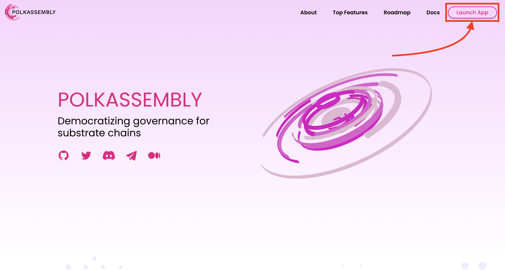

2\. Select the network on which you want to set your on-chain identity. The screenshots refer to Kusama, but the process should essentially be the same for any other network that Polkassembly supports.

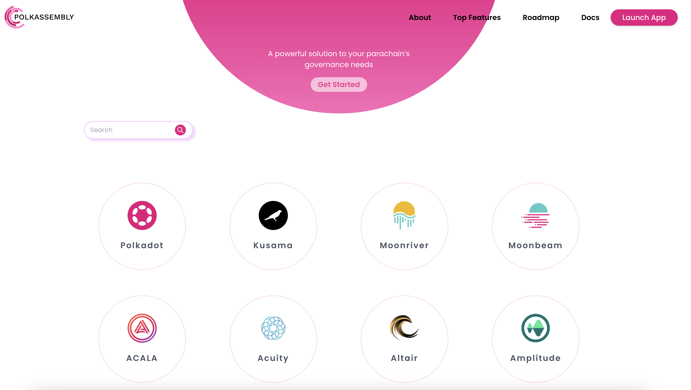

3\. To set up an on-chain identity from Polkassembly, you must log in to the site by connecting your wallet. Click "Login" in the top-right corner and follow the instructions to create a profile for your account.

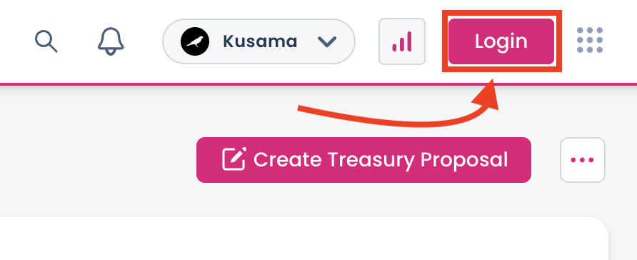4\. Once your profile is created, click on your profile name in the top-right corner and select "Set on-chain identity" from the menu.

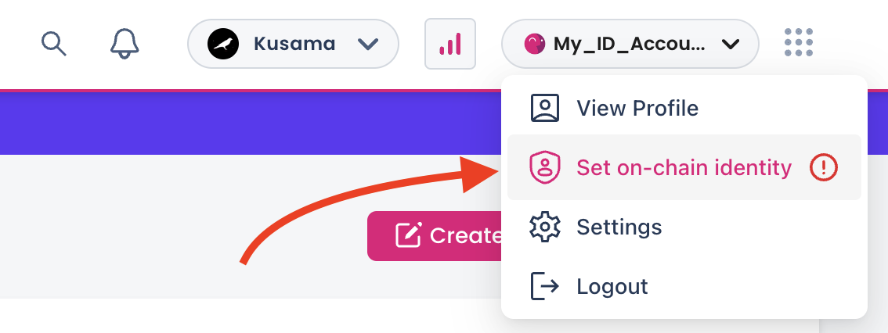

5\. From the panel displayed, select the account for which you would like to set the on-chain identity and click "Confirm."

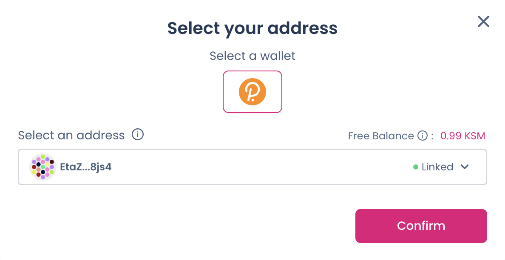

!!! danger "READ THIS FIRST!"

    The function of setting on-chain identities has been moved to the People system parachains. It means that you must have funds on the People parachain for the required deposit and registrar fees.

    Learn how to teleport funds from Polkadot or Kusama to any of its system parachain:
    [Polkadot Developer Interface: How to Teleport DOT or KSM](teleport-dot-ksm.md)

6\. The following panel summarizes some useful aspects of setting an on-chain identity and indicates the registrar fees, and the required deposits on the People parachain. Click "Let's Begin" to initiate the process.

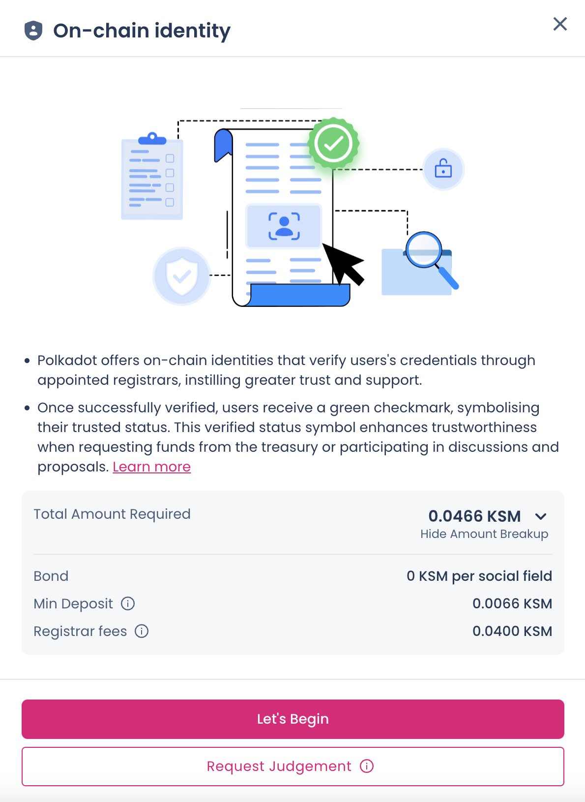

7\. On the next panel, you can set several fields related to your on-chain identification, such as the name that will be displayed next to your account, your full legal name, email, and X (Twitter) handle. Fill in at least the required fields, click "Set Identity," and sign the extrinsic from your account

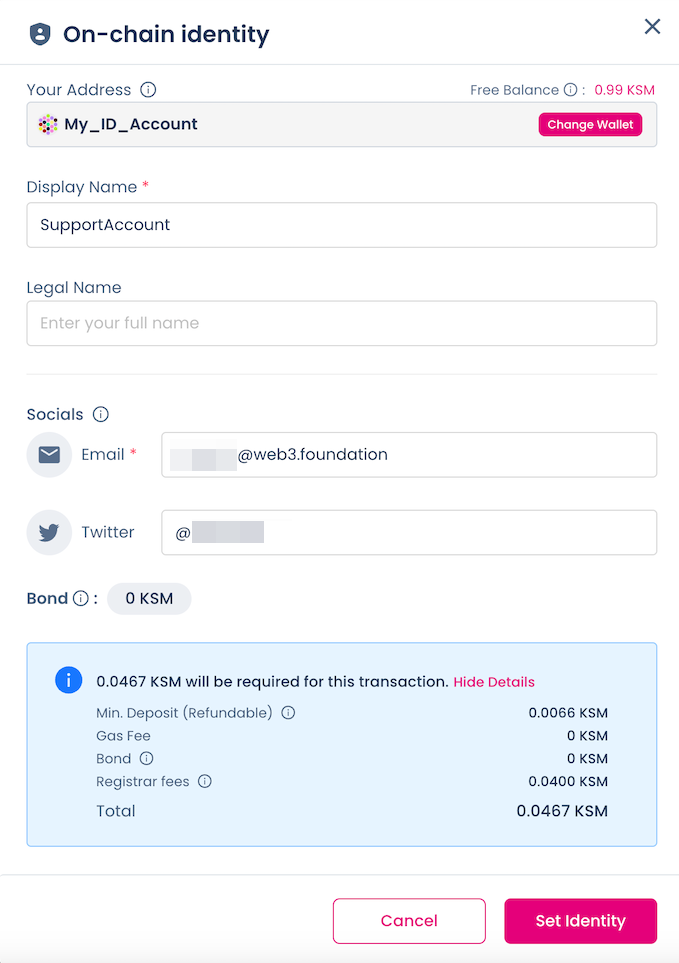

8\. Once you have signed the extrinsic and it has been broadcast to the network, you must initiate the verification process.

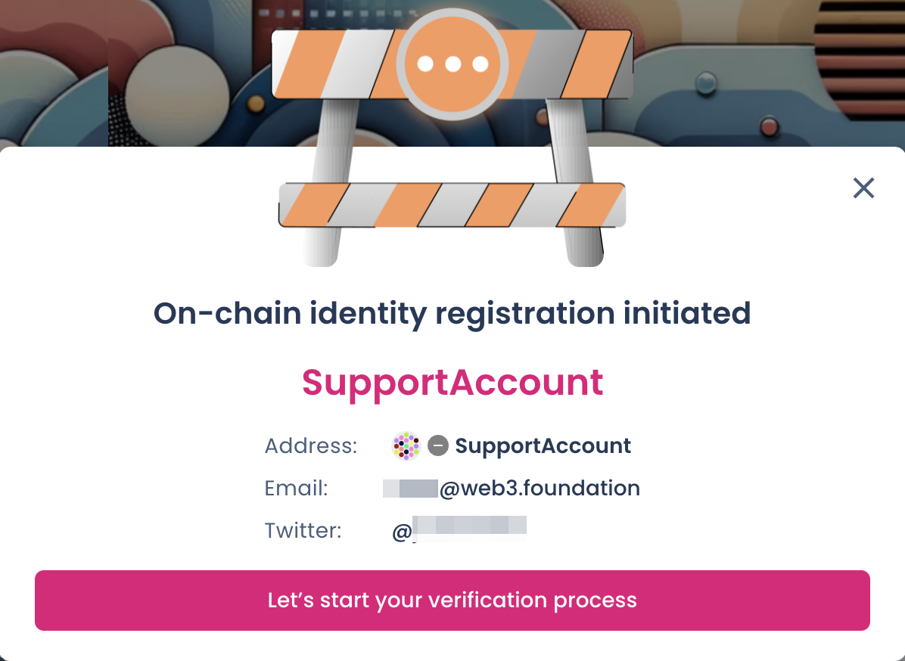

9\. To complete the verification process, click each of the "Verify" buttons and follow the instructions on the screen.

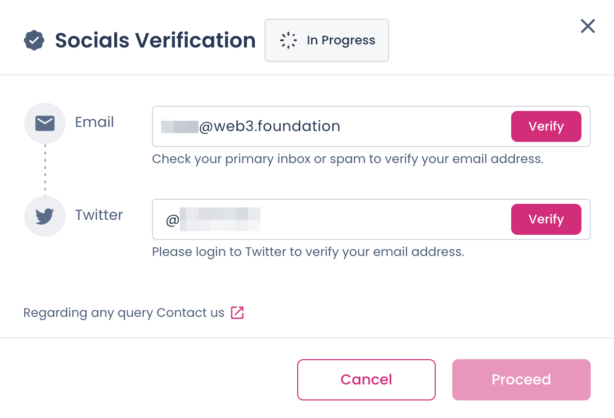

10\. Once all fields have been successfully verified, click "Proceed." You will then have to wait for Polkassembly to judge your on-chain identity. Be aware that it might take some time for your judgment request to be processed.

11\. After the Polkassembly registrar has verified your on-chain identity, congratulations! A green mark should appear next to your profile for everyone to see.

* * *

### Removing an identity on Polkassembly

Any account can clear or remove the on-chain identity associated with it. This process can be easily done in Polkassembly, similar to setting it. Follow the steps below to learn how.

1\. Login to Polkassembly with the account for which you want to clear its on-chain identity. If you're unsure how, follow the first three steps from the previous section.

2\. After logging in, click your profile name in the top-right corner and select "Remove identity" from the menu. Notice that "Remove identity" would only appear if the account already has an associated identity.

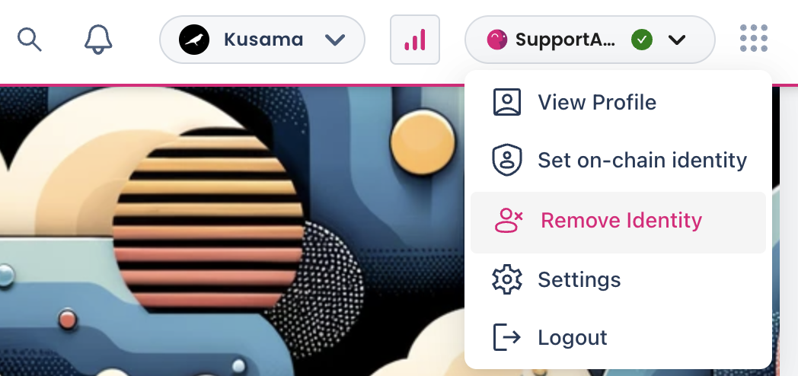

3\. The next panel will prompt you to confirm the account for which the identity will be cleared. Click "Confirm" and sign in with the same account. That's it! Your on-chain identity is cleared!

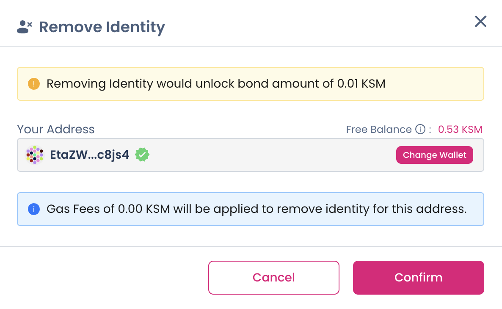

!!! warning "ATTENTION"

    After clearing your on-chain identity, the deposit should become unreserved and be added to your transferable balance.

    Note that if you cleared your identity, the funds will be held on the People parachain, so you will need to teleport them back to Polkadot or Kusama.

    [Polkadot Developer Interface: How to Teleport DOT or KSM](teleport-dot-ksm.md)

* * *
