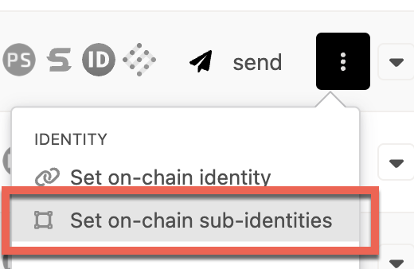
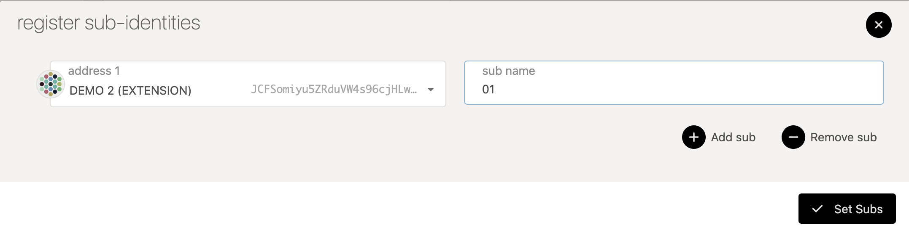

!!!info "Related concepts"
    For the underlying concepts, see [Identity](../learn-identity.md).

Once the identity of an account is set (visit [this article](set-clear-identity.md) to know how), the system allows users to create "sub accounts" under this primary account, each with its unique identity. This article guides you through setting sub-identities using Polkadot Developer Interface.

!!! warning "ATTENTION"

    Identities on **Kusama and Polkadot** have moved to the new **People** system parachains. To set an identity on Polkadot or Kusama networks, you need to perform the actions below on the Polkadot and Kusama People chains, respectively.

    Follow [this guide](switch-network-nodes.md) on how to switch networks, or you can follow this links:
    [Polkadot People](https://polkadot.js.org/apps/?rpc=wss%3A%2F%2Fpolkadot-people-rpc.polkadot.io#/explorer)
    [Kusama People](https://polkadot.js.org/apps/?rpc=wss%3A%2F%2Fkusama-people-rpc.polkadot.io#/accounts)

### What is a sub-identity for?

Users can also link accounts by setting "sub accounts," each with its own identity, under a primary account. The system reserves a bond for each sub account. An example of how you might use this would be a validation company running multiple validators. A single entity, "My Staking Company," could register multiple sub accounts that represent the Stash accounts of each of their validators (for example "My Staking Company/01," "My Staking Company/02," "My Staking Company/03," etc.).

!!! info

    An account can have a maximum of 100 sub-accounts. Note that a deposit of 0.20053 DOT (or 0.006684333309 KSM on Kusama People) is required for every sub-account.

* * *

### Steps to set a sub-identity

1\. Go to the [Accounts](https://polkadot.js.org/apps/?rpc=wss%3A%2F%2Fpolkadot-people-rpc.polkadot.io#/accounts) tab while connected to the People chain.

2\. Click on the three vertical dots corresponding to the account to which you already set the identity. You should see an option to "Set on-chain sub-identities." Click on it.

3\. In the pop-up window, select your account from the drop-down and enter some text to differentiate your sub-identity in the in "Sub name" field. Then, click on the "Set subs" button.

4\. Sign and submit the transaction from the parent account with the identity.

You should now see the sub-identity displayed on-chain.

* * *
