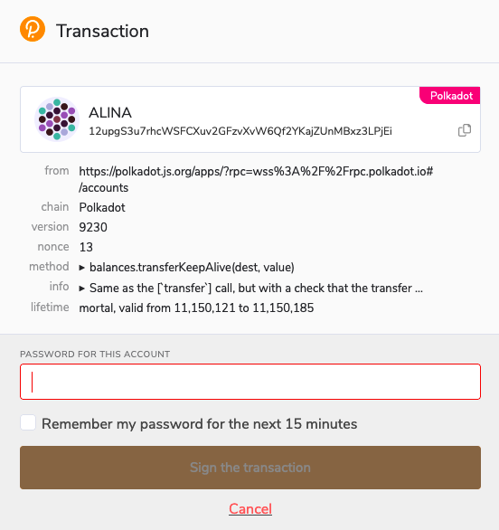
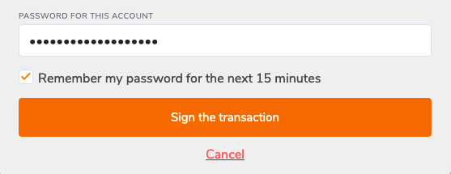
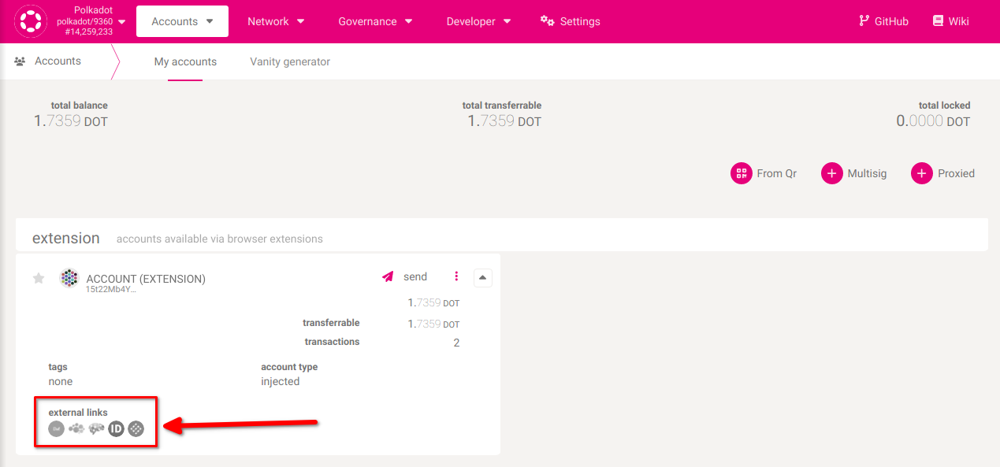
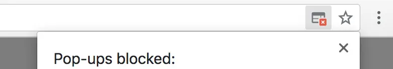

!!!info "Related concepts"
    For the underlying concepts, see [Transactions](../learn-transactions.md).

Signing a transaction is the final step of any transaction, like [sending funds out of your account](transfer-funds.md). A transaction won't be broadcast in the blockchain until you sign it. You sign a transaction with your private key for your account, proving that you own this account. The signing process, however, depends on what wallet or account manager you use.

* * *

### Signing a transaction in the Polkadot Developer Signer

When you create your accounts in the Polkadot Developer Signer, you need a UI to interact with your accounts and initiate transactions.

!!! warning "IMPORTANT"

    The Polkadot Developer Signer is an account manager meant for power users and developers. There are several user-friendly browser extensions that support a lot of features right from the extension. Discover them in [this article](where-to-store-dot.md).

1\. On the [Polkadot Developer Interface](https://polkadot.js.org/apps/#/), after you initiate a transaction and click "Sign and Submit," a new window will pop up:

2\. It is the Polkadot Developer Signer asking you to sign a transaction. Here you can check the transaction details once again:

[How can I verify what extrinsic I'm signing?](verify-extrinsic.md)

!!! info

    In the transaction details, **the amount is displayed in Planck**. One DOT contains 10,000,000,000 Planck. You can read more about it in this [article](../learn-DOT.md#the-planck-unit).

3\. To sign the transaction, enter your account password and click the "Sign the transaction" button:

4\. If you want to send other transactions soon, click the "Remember my password for the next 15 minutes" checkbox. It will allow you to skip entering your password for the next 15 minutes. You can make it 15 more minutes every time you send a transaction.

5\. You've signed the transaction. It will be included in the blockchain within a few seconds. You can now open any of the [block explorers](block-explorers.md) to view your transaction:

* * *

### Cannot sign a transaction?

Sometimes a transaction can't be signed. The sections below describe some of the causes and possible solutions.

#### **The new window doesn't appear**

If a new window doesn't pop up after you click "Sign and Submit," please check if your browser blocked it:

You can allow pop-ups after you click on the blocked window icon.

The Polkadot Developer Signer icon in the toolbar will have a red number on it if you have unsigned transactions waiting:

If you blocked the window, hid it, or accidentally closed it, click on the extension icon to open it and sign the transaction.

#### **My password is invalid**

This article lists a few things to try:

[My password is not working](password-not-working.md)

If you don't know your password but have your mnemonic phrase, you can [restore your account](restore-account-signer.md) and set a new password.

#### **My transaction failed**

Signing a transaction means that it will be included in the blockchain. However, it doesn't always mean it will be executed. You can check the result of your transaction on a block explorer. Sometimes a transaction can't be executed, and it fails:

Please check the article "[Why can't I Transfer Tokens?](why-cant-i-transfer-dot.md)" to help you understand why your transaction failed, fix the issue, and send the transaction again.

* * *
