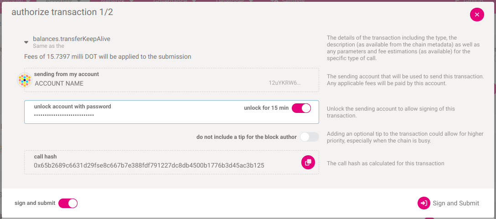
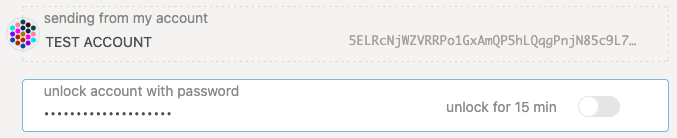
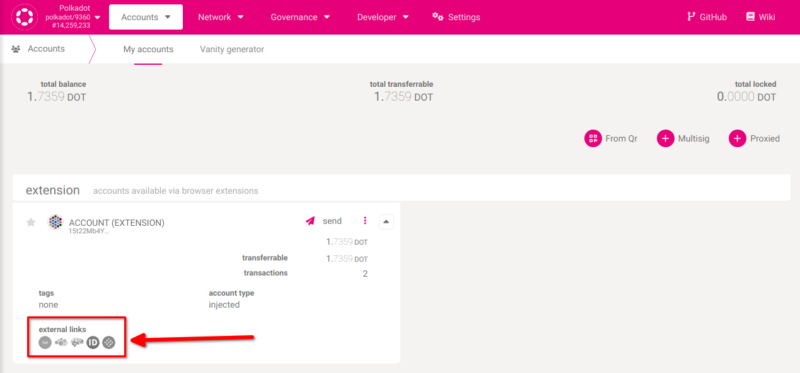
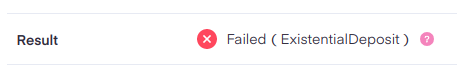
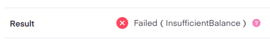

!!!info "Related concepts"
    For the underlying concepts, see [Transactions](../learn-transactions.md).

!!! warning "IMPORTANT"

    Polkadot Developer Interface is a web wallet meant for power users and developers. For everyday use, there are several user-friendly wallets that support a plethora of features and platforms. Discover them in [this article](where-to-store-dot.md).

Signing a transaction is the final step of any transaction, like [sending funds out of your account](transfer-funds.md). A transaction won't be broadcast in the blockchain until you sign it. You sign a transaction with your private key for your account, proving that you own this account. The signing process, however, depends on what wallet or account manager you use.

Signing a transaction on the Polkadot Developer Interface

1\. If your account was added directly on Polkadot Developer Interface, you can sign a transaction in the UI. This is what you see after clicking "Make Transfer":

2\. Here you can check the transaction details once again:

[How can I verify what extrinsic I'm signing?](verify-extrinsic.md)

!!! tip "GOOD TO KNOW"

    In the transaction details, **the amount is displayed in Planck**. One DOT contains 10,000,000,000 Planck. You can read more about it in this [article](verify-extrinsic.md).

3\. To sign the transaction, enter your account password in the "unlock account with password" field:

Then click the "Sign the transaction" button.

4\. If you want to send other transactions soon, you can click on the "unlock for 15 min" slider. It will allow you to skip entering your password for the next 15 minutes.

5\. You've signed the transaction. It will be included in the blockchain within a few seconds. You can now open any of the [block explorers](block-explorers.md) to view your transaction:

* * *

### Cannot sign a transaction?

Sometimes a transaction can't be signed. The sections below describe some of the causes and possible solutions.

#### **My password is invalid**

This article compiles a few things to try:

[My password is not working](password-not-working.md)

If you don't know your password but have your mnemonic phrase, you can [restore your account](restore-account-signer.md) and set a new password.

#### **My transaction failed**

Signing a transaction means that it will be included in the blockchain. However, it doesn't always mean it will be executed. You can check the result of your transaction on a block explorer. Sometimes a transaction can't be executed, and it fails:

Please check the article "[Why can't I Transfer Tokens?](why-cant-i-transfer-dot.md)" to help you understand why your transaction failed, fix the issue, and send the transaction again.

* * *
