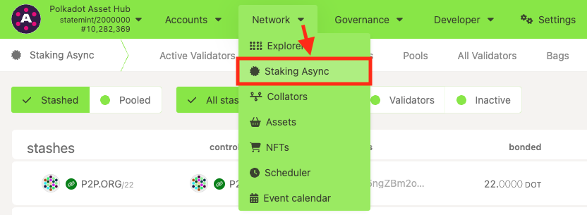
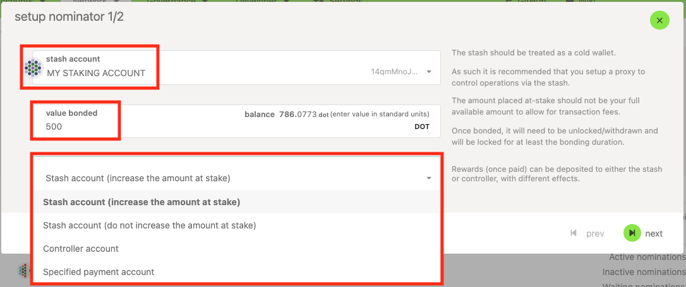

!!!info "Related Wiki page"
    For the underlying concepts, see [Staking](../learn-staking.md).

_Discover the new Staking Dashboard that makes staking much easier, and check our [extensive article list](https://paritytech.github.io/polkadot-support/staking/staking-basics/staking-dashboard-overview) to help you get started._

* * *

!!! warning "IMPORTANT"

    Polkadot Developer Interface (Polkadot-JS UI) is a web wallet meant for power users and developers. For everyday use, there are several user-friendly wallets funded by the Polkadot Treasury that support a plethora of features and platforms. Discover them in [this article](https://paritytech.github.io/polkadot-support/trending/top-articles/where-to-store-dot-polkadot-wallet-options).

Nominators help secure the network by bonding their DOT and selecting validators they deem trustworthy to produce blocks. If you want to learn more about the benefits and risks of being a nominator, you can check [this article](https://paritytech.github.io/polkadot-support/staking/learn-more-about-staking/what-are-the-benefits-and-risks-of-staking-on-polkadot).

This article explains how to stake on Polkadot Developer Interface. If you're interested in other options, check the last section of this article:
How else can I stake

### What to know before starting

  * **Nominating currently requires a**  **minimum of 250 DOT staked funds on Polkadot(0.1 KSM on Kusama)**. Please ensure you are above that minimum, or you won't be able to nominate.

!!! warning "IMPORTANT"

    Not all nominators with over 250 DOT will get staking rewards. The minimum amount needed to **earn rewards** is **dynamic** and can be found on the [Targets](https://polkadot.js.org/apps/#/staking/targets) page on Polkadot Developer Interface. Please refer to [this referendum](https://polkadot.polkassembly.io/referendum/55) for details.

  * If you are staking **above the dynamic minimum**  amount and still **aren't receiving rewards** , it's possible that your account needs to be re-adjusted by calling an extrinsic. This is due to the new **bags-list** feature. You can find instructions on how to fix this [here](https://paritytech.github.io/polkadot-support/staking/learn-more-about-staking/i-have-more-than-the-minimum-bonded-but-im-not-getting-rewards).
  * If you don't have enough DOT to earn rewards, consider [joining a nomination pool](nomination-pools-guide.md) instead of staking solo.

* * *

### How to stake using the Polkadot-JS UI

!!! tip "GOOD TO KNOW"

    Controller accounts are being deprecated. As a result, for new stashes the controller is automatically set to the stash account.
    If you don't want to use your stash account often, you can create a staking proxy which can do all staking actions on its behalf. It has the same advantages as the controller, but even more flexibility.

    Check out the article on [creating a proxy account](create-proxy-account.md) for more information.

You can nominate validators (also known as "staking") on Polkadot Developer Interface using these steps:

1\. Create a Polkadot account if you don't have one yet:

[How to Create a Polkadot Account](create-polkadot-account.md)

2\. "Navigate to Network" > "Staking Async" > "[Accounts](https://polkadot.js.org/apps/#/staking/actions)" page on Polkadot Developer Interface:

3\. Click on the "+ Nominator" button on the top right.

4. Choose your Stash account from the drop-down menu.

5\. Select the amount you want to bond. Make sure you leave a small amount of DOT transferrable in both the stash and the staking proxy. You'll need some transferrable funds to pay transaction fees when changing your nominations, bonding more, or unbonding.

6\. Choose your reward destination. You can auto-compound your staking rewards increasing the amount at stake, or send them to the stash as a free balance, the controller (which will be the [stash account itself](https://paritytech.github.io/polkadot-support/staking/staking-basics/staking-dashboard-how-to-update-your-controller-account)), or any other account.

!!! danger "READ THIS FIRST!"

    Make sure that you have**at least 0.01 DOT** in the account that you are directing your staking rewards to. If you receive rewards of less than 0.01 DOT and they are sent to an empty account, you will **lose them**. This has to do with the [existential deposit](existential-deposit.md) on Polkadot.

7\. Click "Next". Now, you need to select your validators. Please ensure you've read the article on [choosing your validators](choose-validators.md). You can nominate up to 16 validators on Polkadot (and 24 on Kusama). Nominating more trustworthy validators increases your chance to earn rewards consistently.

8\. Once you're done, click "Bond & Nominate." Review the transaction and click "Sign and submit" to finish the process.

* * *

### How else can I stake

For most users, we recommend staking through the new [Staking Dashboard](https://staking.polkadot.cloud/#/overview). It's compatible with several browser extensions within the ecosystem, including the Polkadot browser extension, and is more user-friendly. To get started, check this article:

[Staking Dashboard: How to Stake Your DOT](stake-your-dot.md)

If you have a Ledger device, you can also stake using Ledger Live. You can follow the steps in this article to start staking:

[Ledger: How to Use Polkadot and Stake DOT with Ledger Live](https://paritytech.github.io/polkadot-support/ledger/using-ledger/ledger-how-to-use-polkadot-and-stake-dot-with-ledger-live)

* * *

That's it! You will begin earning rewards in the next era or the one after that if you nominated during the last epoch.

* * *
