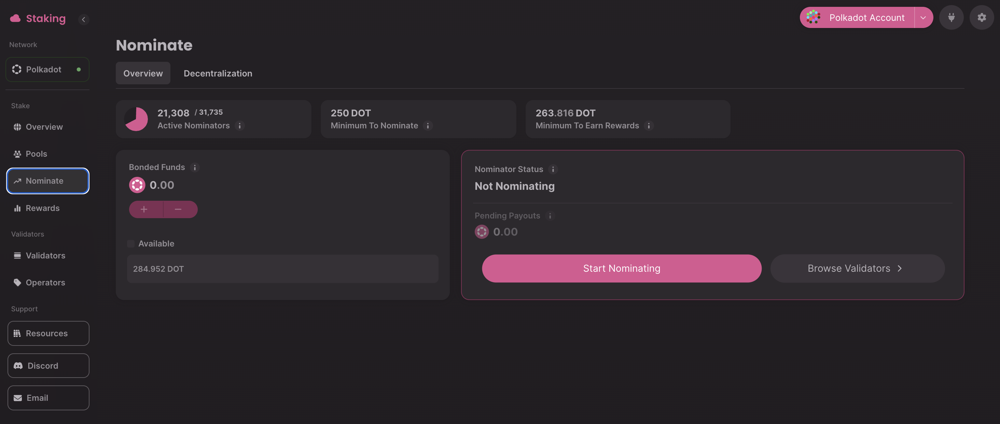
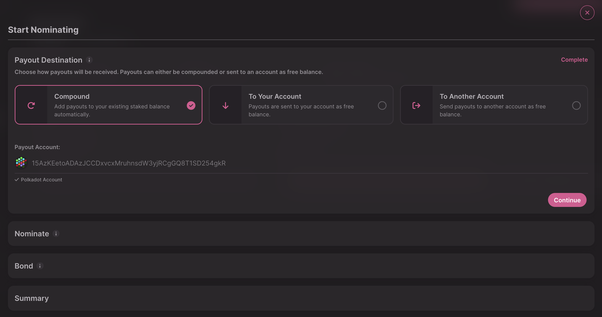
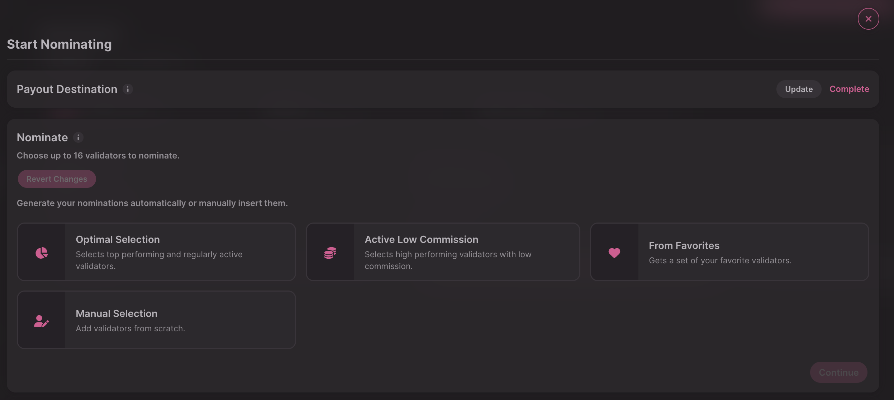
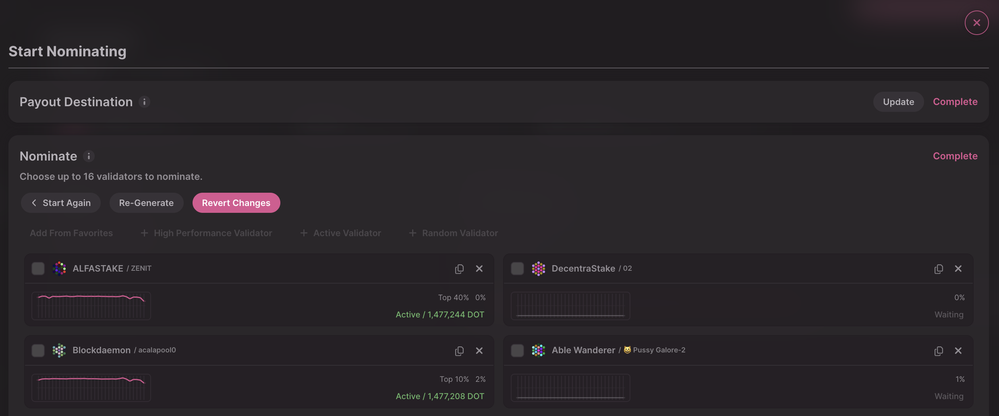
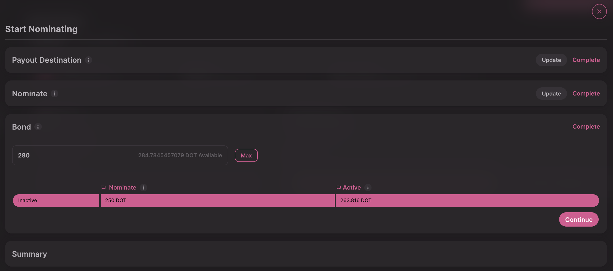
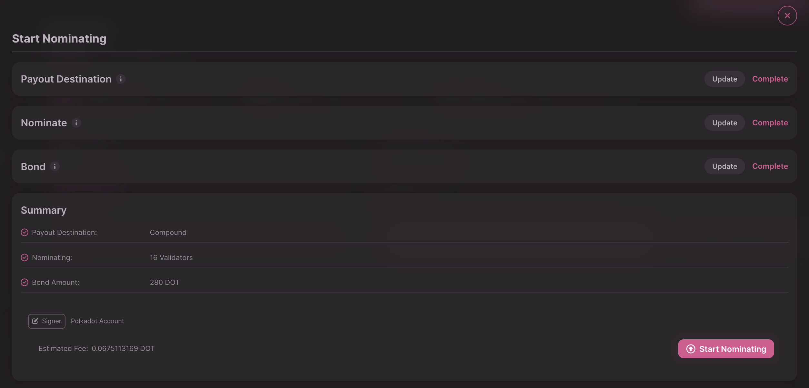
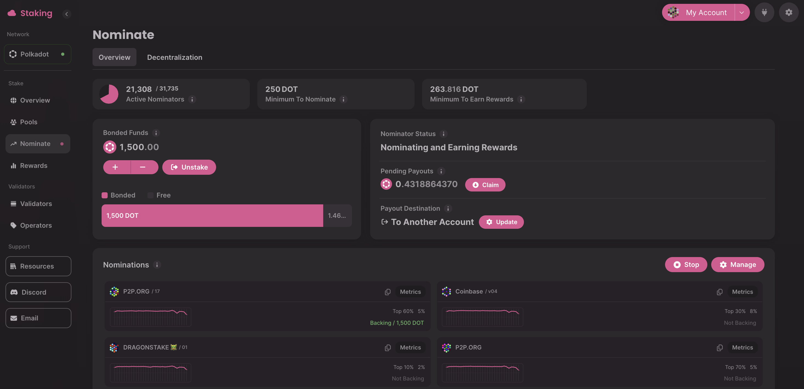

!!!info "Related concepts"
    For the underlying concepts, see [Staking](../learn-staking.md).

_Discover this new Staking Dashboard that makes staking much easier and check the extensive article list in the[Overview article](../../general/dashboards/staking-dashboard.md) to help you get started._

* * *

This article guides you on how to stake your DOT and nominate validators using the [Staking Dashboard](https://staking.polkadot.cloud/#/overview), all in a simple and intuitive way.

After [connecting the account](connect-account.md) you want to use as your stash, go to the "Nominate" tab on the left. It's empty for now, but that will soon change.

* * *

### How to Stake your DOT

1\. First, click on the "Start Nominating" button. This will take you through a series of steps to complete staking with your account.

!!! tip "GOOD TO KNOW"

    Each completed step will display "Complete" on right side. To proceed to the next step, click the "Continue" button. To edit a completed step, click the "Update" button next to it.

2\. Select your reward destination. That is, where your staking rewards will be sent. There are three options:

  * **Compound** : Rewards are added directly to your stash account and automatically bonded, increasing your stake over time.
  * **To Your Account** : Sends the rewards to your stash account as transferable balance (not compounding rewards).
  * **To Another Account** : This option will send the rewards to any account you indicate as a transferrable balance.

3\. In the next step, choose the validators you want to nominate. You can select up to 16 validators on both Polkadot and Kusama.

The staking dashboard gives you several ways to choose your validator. You can generate an "Optimal Selection," pick from "Active Low Commission" or "[From Favorites](../../general/dashboards/staking-dashboard.md)," or add them from scratch using the "Manual Selection" option:

If you're not happy with the suggested validators, click "Re-Generate" to create a new set or add more validators: "From Favorites," "High Performance Validator," "Active Validators," or "Random Validators." Click on the "X" button next to the one you want to replace:

If you want to select your nominations manually, check [this article](choose-validators.md) to learn how to choose your validators.

4\. Finally, it's time to enter the amount you want to bond. Avoid bonding the entire balance, as you'll need some transferable funds to cover future transaction fees.

At this stage, you'll also see some useful information to consider. The bar at the bottom shows whether the amount you've entered meets two important thresholds:

a. To nominate (the **Nominate** line)

b. To actively nominate and receive rewards (the **Active** line)

If your bond is below the first line, you won't be able to nominate at all, and the app will prevent you from proceeding. This minimum is currently set at 250 DOT on Polkadot.

If your bond is above the first line but below the second, you’ll be able to bond, but your account might not participate in the election process (that is you may not end up nominating any validators), and you’re unlikely to receive rewards.

If all three areas are filled out, like in the image above, you can stake and start receiving rewards.

!!! info

    If you want to learn more about these staking limits, please read [this article](../learn-staking.md).

5\. After entering the amount you want to bond and clicking Continue, you'll see a summary. Review it, and click 'Start Nominating' to stake your funds.

Sign the extrinsic to complete the process. Once it has been broadcast to the network, you'll be taken back to the "Nominate" tab, which will now display all the details of your stake:

That's it. Visit the Nominate tab regularly to check the status of your nominated validators.

* * *

If you are more of a visual learner, check this video guide:

[Staking on Polkadot: Nominating using the Staking Dashboard](https://www.youtube.com/watch?v=F59N3YKYCRs)

* * *
