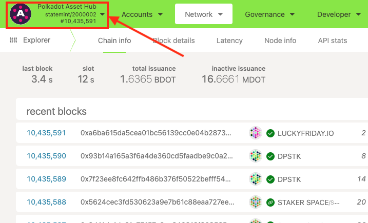
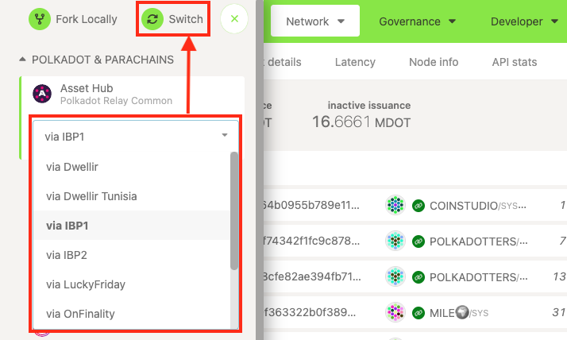
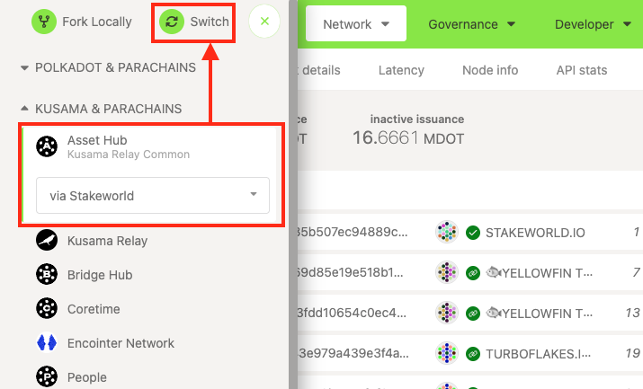

!!!info "Related Wiki page"
    For the underlying concepts, see [Polkadot-JS UI](../../general/polkadotjs-ui.md).

!!! warning "IMPORTANT"

    Polkadot Developer Interface is a web wallet meant for power users and developers. For everyday use, there are several user-friendly wallets funded by the Polkadot Treasury that support a plethora of features and platforms. Discover them in [this article](https://paritytech.github.io/polkadot-support/trending/top-articles/where-to-store-dot-polkadot-wallet-options).

_The Polkadot Developer Interface allows us to connect to multiple nodes which provide on-chain information and facilitate interaction with the network. While these nodes offer the same services, they may encounter occasional connection issues. In such cases, we can effortlessly switch to a different node with the same functionalities. This article will explain how to switch nodes and networks from the same menu._

* * *

### Switching Nodes

If you're experiencing connection issues or having trouble making a transaction on the [Polkadot Developer Interface](https://polkadot.js.org/apps/#/accounts), it can be useful to switch to another network node and try again.

1\. To do this, first click on the current network on the top left.

2\. Expand the drop down menu and you will see several nodes. Simply select a different node here.

3\. Click the "Switch" button on top.

* * *

### Switching Networks

You can also use the same panel to switch to a completely different network, e.g. from Polkadot to Kusama.

1. On the [Polkadot Developer Interface](https://polkadot.js.org/apps/#/accounts), click on the currently selected network on the top left. In the case below, we currently are on the Polkadot Asset Hub network.

2\. In the panel that opens, select the network you want to switch to. We're selecting Kusama Asset Hub. There are several nodes available and it doesn't matter which is selected. Only if you experience some connection issues, switch to another one.

3\. Click on the "Switch" button.

4\. You are now on the Kusama Asset Hub network and can access your KSM accounts here.

You can switch back to Polkadot or any other parachain in the same way.

* * *

Check out this educational tutorial for a more detailed description:

[Learn How to Switch RPC Nodes on the Polkadot Developer Interface](https://www.youtube.com/watch?v=thj4dIMB5A8)

* * *
