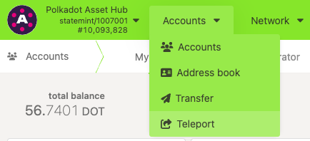
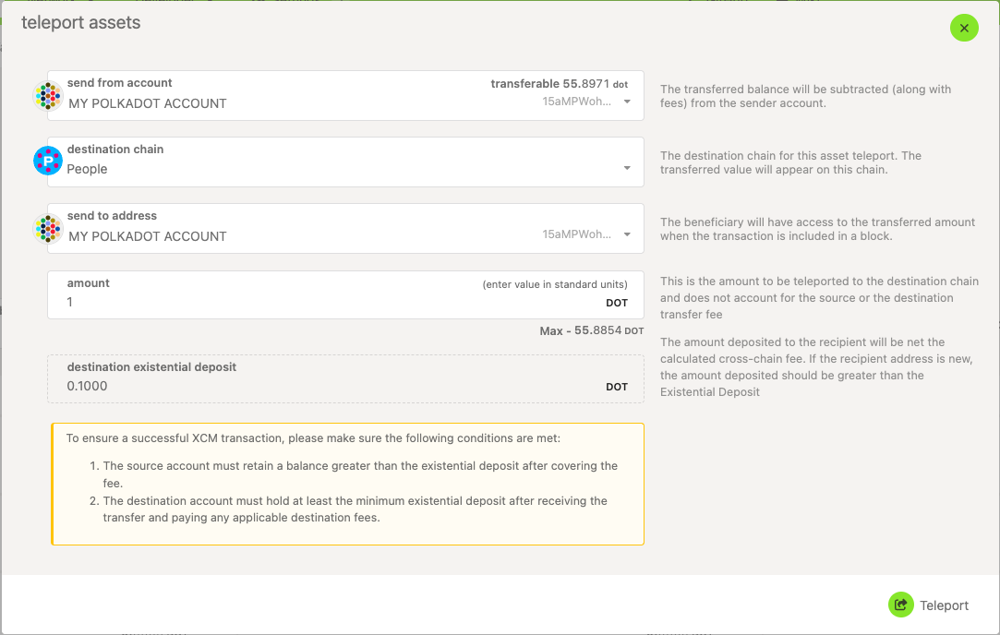

!!!info "Related concepts"
    For the underlying concepts, see [Teleport](../learn-teleport.md).

!!! warning "IMPORTANT"

    Polkadot Developer Interface is a web wallet meant for power users and developers. For everyday use, there are several user-friendly wallets that support a plethora of features and platforms. Discover them in [this article](where-to-store-dot.md).

There are a few reasons why you might want to teleport your DOT from Polkadot Asset Hub to other system chains, for example:

  * You want to set your on-chain identity on Polkadot People or Kusama People.
  * You want to access the coretime market.

!!! danger "READ THIS FIRST!"

    Teleporting is recommended only for users who clearly understand the process and its purpose.

    If you simply want to transfer assets within the same network, please refer to the article below:

    [Polkadot Developer Interface: How to Send / Transfer Funds Out of Your Account](transfer-funds.md)

### Transaction fees

There are two types of fees that are imposed when teleporting your DOT or KSM, and they are deducted differently.

#### Transaction fees on the source chain

Like with regular transfers, these fees are deducted from your transferable balance.

!!! warning "ATTENTION"

    Teleports don't have the "keep alive" safeguard like normal transfers. This means that you need to make sure that your balance after the application of fees is above the existential deposit, otherwise your account will be reaped (deactivated) and **any remaining balance will be lost.**

    If you want to teleport your entire balance, and reap your account, make sure to account for the source chain fees, when choosing the amount to teleport.

#### Transaction fees on the destination chain

Teleports come with an additional fee on the destination chain. This fee is deducted from the teleported amount of DOT or KSM. The remainder needs to be greater than the existential deposit of the destination chain. Otherwise, the entire balance you teleported will be lost.

!!! tip "GOOD TO KNOW"

    These are the existential deposits on the following chains:

    * **Polkadot Asset Hub** : 0.01 DOT
    * **Polkadot People** : 0.1 DOT
    * **Polkadot Bridge Hub** : 0.1 DOT
    * **Polkadot Coretime** : 0.1 DOT
    * **Polkadot Relay Chain** : 1 DOT

    * **Kusama Asset Hub:**  0.0000033333 KSM
    * **Kusama People:** 0.000033333333 KSM
    * **Kusama Bridge Hub:** 0.000033333333 KSM
    * **Kusama Coretime:** 0.000033333333 KSM
    * **Kusama Relay Chain:** 0.00033333333 KSM

* * *

###  How to teleport your assets between chains

!!! danger "READ THIS FIRST!"

    Do not attempt to **teleport funds directly to exchange** deposit addresses. Although the address format is the same, exchanges might not be able to detect teleports or deposits on every chain. Such deposits will be **irretrievable**.

1\. Make sure to [switch](switch-network-nodes.md) to the source chain.

2\. On top of the page, navigate to "[Accounts](https://polkadot.js.org/apps/?rpc=wss%3A%2F%2Frpc.polkadot.io#/accounts)" > "Teleport":

3\. This opens the "Teleport assets" interface:

Here, you can choose:

  * **Send from account** : choose your account with the source token.
  * **Destination chain** : choose the network to send the assets to.
  * **Send to address** : choose or paste the account receiving the funds on the destination chain.
  * **Amount** : enter the amount you wish to teleport. This amount doesn't include the transfer fee on the source chain, but the fee on the destination chain will be deducted from it.

4\. After reviewing transaction information and fees, click the "Teleport" button, then sign and submit your transaction.

* * *

If you are more of a visual type, this video tutorial guides you through the teleport process:

[Teleporting | Technical Explainers](https://youtu.be/3tE9ouub5Tg)

* * *
