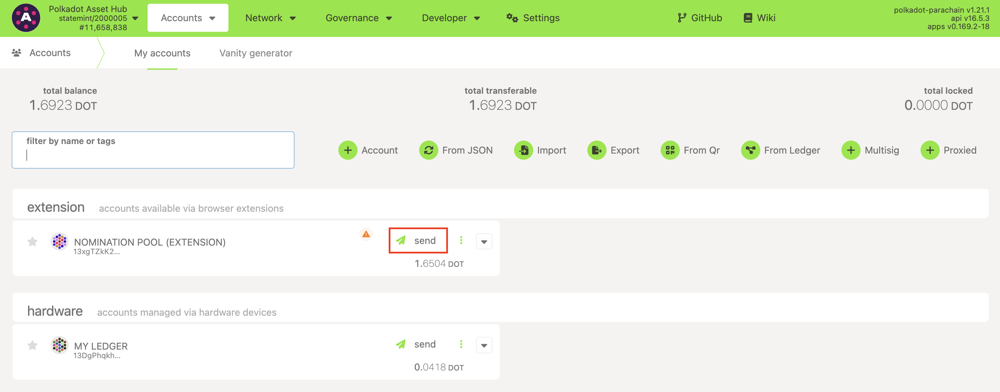
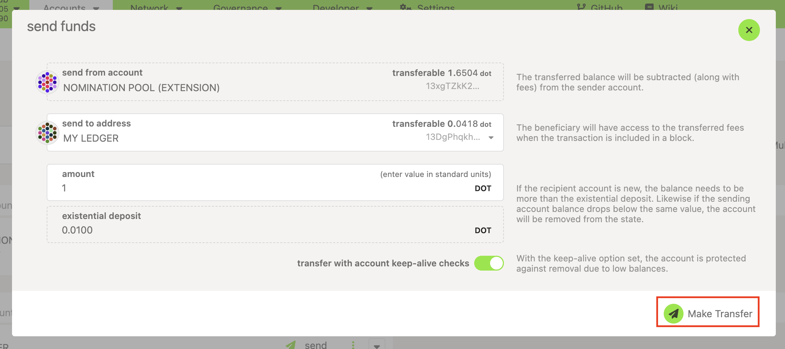
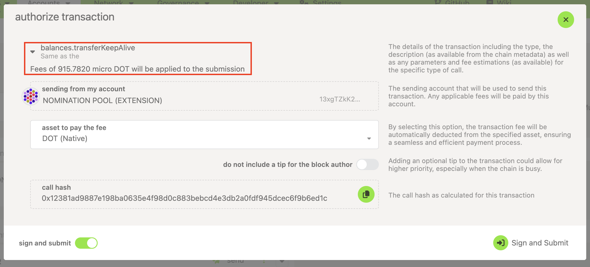

!!!info "Related concepts"
    For the underlying concepts, see [Transactions](../learn-transactions.md).

!!! warning "IMPORTANT"

    Polkadot Developer Interface (Polkadot-JS UI) is a web wallet meant for power users and developers. For everyday use, there are several user-friendly wallets funded by the Polkadot Treasury that support a plethora of features and platforms. Discover them in [this article](where-to-store-dot.md).

A transaction fee is deducted from your transferrable balance every time you make a transaction. It cannot be deducted from your bonded funds or the amount you send. Here is how you can see the fee before making a transaction.

* * *

1\. Click on the "Send" button next to the account you want to send funds from:

2\. On the next screen, enter the amount you want to send and click "Make Transfer":

****

3\. The transaction fee will be shown to you in[micro DOT](../learn-DOT.md):

4\. You can click "Sign and Submit" to make the transaction or click the X button to cancel it:

* * *

If you want to send all of your funds out, you would have to deduct the transaction costs from the total amount you want to send. Otherwise, your transfer will not go through, but the transaction fee will be taken anyway. [This guide](send-all-funds.md) will help you send your entire balance out using the Polkadot Developer Interface.

* * *

If you are more of a visual learner, check this video on the topic:

[Transfer your Funds using Ledger Nano, Parity Signer, Polkadot-JS UI & Browser Extension](https://www.youtube.com/watch?v=gbvrHzr4EDY)

* * *
