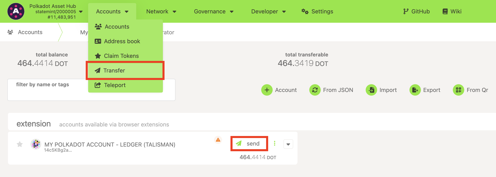
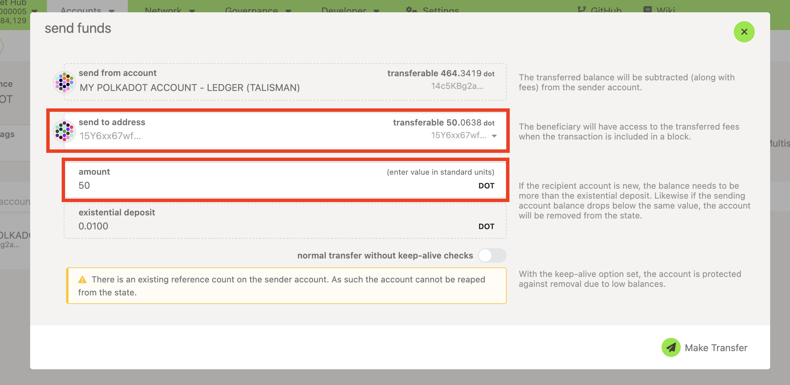
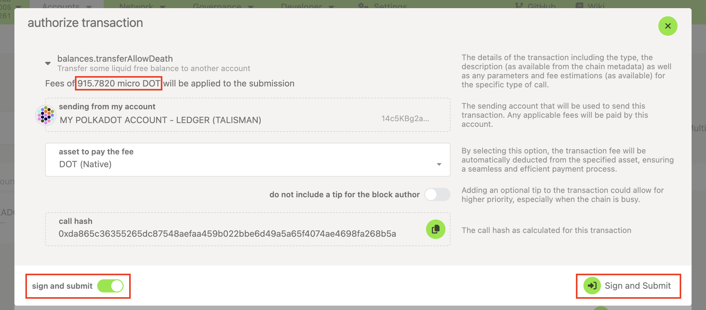
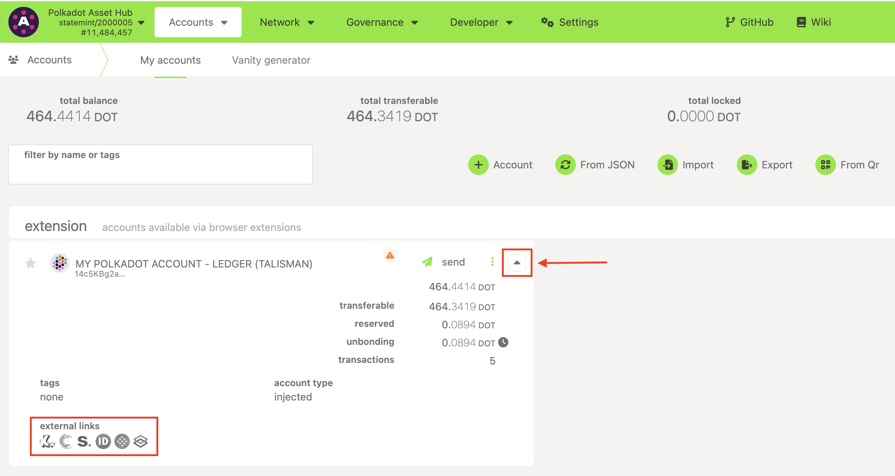

!!!info "Related Wiki page"
    For the underlying concepts, see [Transactions](../learn-transactions.md).

!!! warning "IMPORTANT"

    Polkadot Developer Interface is a web wallet meant for power users and developers. For everyday use, there are several user-friendly wallets funded by the Polkadot Treasury that support a plethora of features and platforms. Discover them in [this article](where-to-store-dot.md).

Whether your account is in the [Polkadot Developer Signer](signer-where-to-download.md) or created/added directly on the [Polkadot Developer Interface](https://polkadot.js.org/apps/#/accounts), you'll need to use the Polkadot Developer Interface to send funds or issue any extrinsic. The Polkadot Developer Signer is an account manager, not a wallet, so it requires a UI to interact with.

* * *

1\. To withdraw DOT from your account and send funds out, click on "Transfer" in the Accounts menu or click the "Send" button on the [Accounts](https://polkadot.js.org/apps/#/accounts) page next to the account you want to send from:

2\. Both options will take you to the following pop-up window, where you can enter the destination account and the amount you want to send. If you clicked the "Send" button to get here, the "Send from" account will already be set.

For the receiving account, you can either select an account from the drop-down menu, which lists all your accounts and all the accounts in your Address Book, or simply paste an address. The receiving account doesn't have to be in your Address Book:

3\. Once you have entered all the details, click on the "Make Transfer" button. It will take you to the pop-up window shown below, which will display your expected transaction fees in [milli DOT](https://paritytech.github.io/polkadot-support/getting-started/general-information/how-much-is-a-microdot-and-a-milidot-in-dot).

!!! warning "IMPORTANT"

    The transaction fees will be deducted from the leftover funds in your account. If you don't leave enough funds in your account for the fees, your transaction will fail due to "insufficient balance." If you want to send _ALL_ of your funds out, [learn how to do that here](send-all-funds.md).

!!! warning "IMPORTANT"

    You need to leave more than the [existential deposit](existential-deposit.md) of 0.01 DOT in your account if you want to keep it active. If you encounter the error 'NotExpendable', [click here](why-cant-i-transfer-dot.md) to learn what this means and how to troubleshoot this.

4\. Once you're ready to make your transaction, enter your password and click the "**Sign and Submit** " button:

5\. Signing a transaction is slightly different depending on how you created your account. Here are the guides for all wallets and account managers you can use on the Polkadot Developer Interface:

[How to sign a transaction in the Polkadot browser extension](sign-transaction-signer.md)

[How to sign a transaction directly on the Polkadot Developer Interface](sign-transaction.md)

[How to sign a transaction in Parity Signer](parity-signer-sign-transaction.md)

[How to sign a transaction on Ledger](ledger-sign-transaction.md)

6\. Congratulations, you have signed a transaction! It will be included in the blockchain within a few seconds. You can now open any of the [block explorers](block-explorers.md) to view your transaction:

* * *

If you are more of a visual learner, check the video below at mark 02:38:

[Transfer your Funds using Ledger Nano, Parity Signer, Polkadot-JS UI & Browser Extension](https://www.youtube.com/watch?v=gbvrHzr4EDY&t=158s)

* * *
