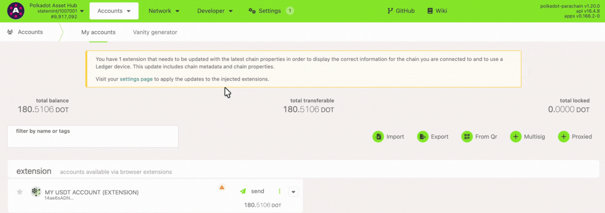

!!!info "Related concepts"
    For the underlying concepts, see [Asset Hub](../learn-assets.md).

!!! warning "IMPORTANT"

    Polkadot Developer Interface is a web wallet meant for **power users and developers**. For everyday use, there are several user-friendly wallets funded by the Polkadot Treasury that support a plethora of features and platforms. Discover them in [this article](where-to-store-dot.md).

Tether (USDT) is now available on Polkadot. You can check their [official announcements](https://tether.to/en/tether-tokens-usdt-live-on-polkadot/).

!!! warning "ATTENTION"

    Tether, the entity behind USDT, [announced the discontinuation of USDT on the Kusama network](https://tether.to/en/tether-makes-strategic-transition-to-meet-community-demands-and-foster-innovation).

USDT was made into a sufficient asset on Polkadot Asset Hub through [OpenGov Referendum 80](https://polkadot.subsquare.io/democracy/referenda/80), which means that the receiver account **doesn't** need to hold an [existential deposit](existential-deposit.md) in the native DOT token to receive USDT.

However, an account still needs to hold **at least the minimum USDT balance** , which is **0.01**  **USDT** **on** **Polkadot**.

!!! danger "READ THIS FIRST!"

    Anyone can create an asset on Asset Hub, with any name and symbol. Therefore it is important to make sure you are transferring the official asset, which you can determine by looking at the unique asset ID.

    For Tether, this ID is **1984**.

    For more information on how to verify the legitimacy of an asset you can read [this article](what-is-asset-hub.md).

* * *

### How to transfer USDT

1\. Go to [Polkadot Asset Hub](https://polkadot.js.org/apps/?rpc=wss%3A%2F%2Fstatemint.api.onfinality.io%2Fpublic-ws#/accounts).

2\. Next, navigate to the "Network" > "Assets" page and click on the "[Balances](https://polkadot.js.org/apps/?rpc=wss%3A%2F%2Fstatemint.api.onfinality.io%2Fpublic-ws#/assets/balances)" tab.

3\. Click the "Send" button. Then enter the receiver address and the amount to transfer.

4\. Sign and submit the transaction, and that's it.

* * *
