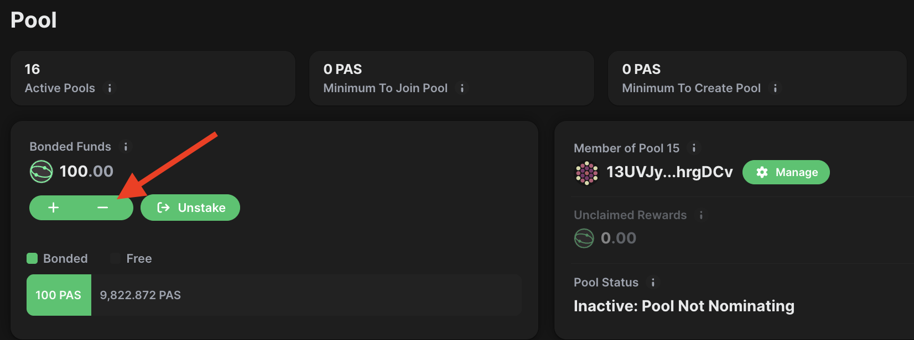
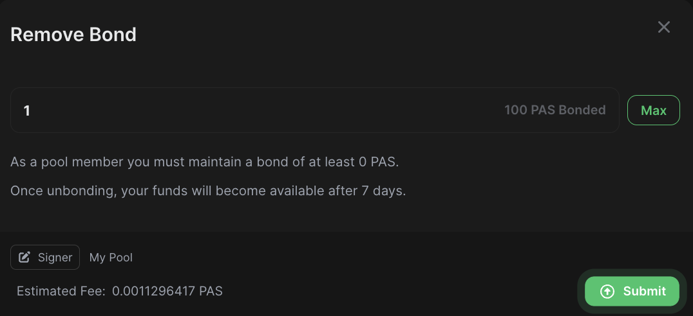
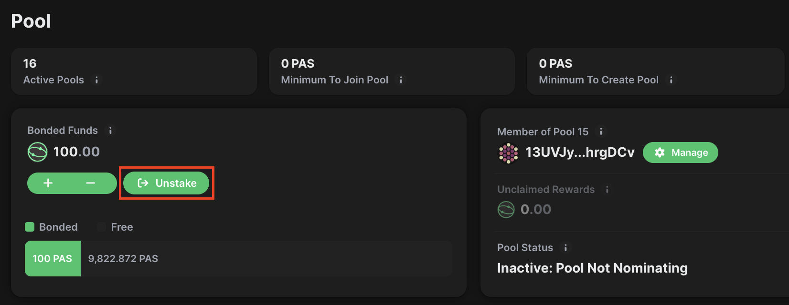
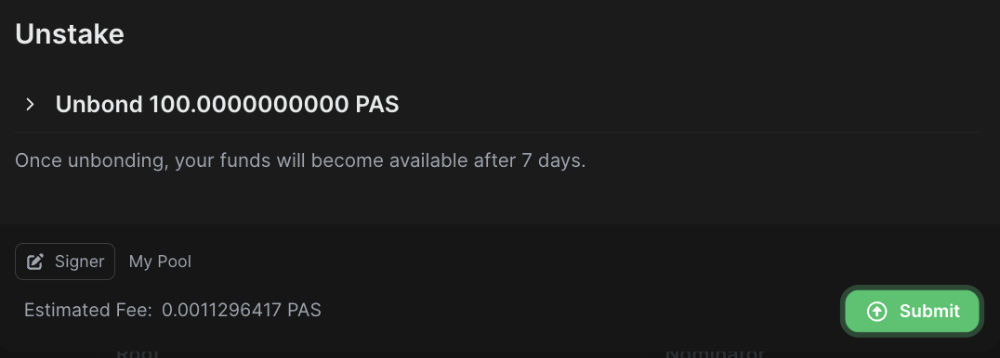
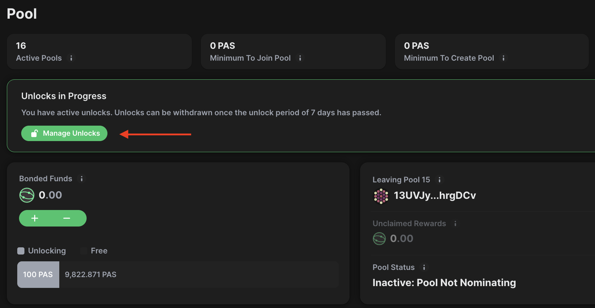
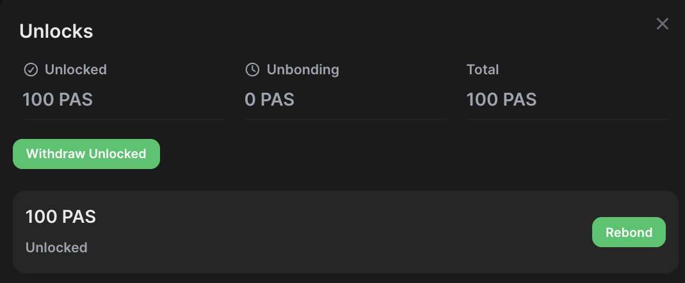

!!!info "Related Wiki page"
    For the underlying concepts, see [Nomination Pools](../learn-nomination-pools.md).

The  [Staking Dashboard ](https://staking.polkadot.cloud/#/overview)is a powerful tool in the Polkadot ecosystem that allows you to stake your DOT easily. If this is your first time using it, we recommend reading our [overview article](https://paritytech.github.io/polkadot-support/staking/staking-basics/staking-dashboard-overview) to learn how to navigate its tabs.

Members can either unbond part of their funds from a nomination pool or exit the pool completely.

In this example, we will be using Paseo, but the processes are the same for Polkadot and Kusama.

!!! warning

    You cannot rebond during the unbonding period with a nomination pool. If you change your mind, you must wait for the unbonding period to end before joining a nomination pool again.

!!! warning "IMPORTANT"

    The above actions will claim all earned rewards. See [this article](claim-pool-rewards.md) to learn how to manually claim rewards.

### Unbond

1\. If you intend to unbond a portion of your tokens from the pool, click the minus button:

2\. A Remove Bond pop-up will be displayed. Here, you can enter the amount of tokens you would like to unbond. You can click the "Max" button to unbond all except the minimum amount required to remain a member of the pool:

3\. Once you enter the amount, click "Submit" and sign the transaction to unbond.

The usual unbonding period applies when unbonding from a nomination pool, 28 days in Polkadot, 7 days in Kusama. After it ends, you can withdraw the tokens to make them transferable.

* * *

### Unstake

1\. If you intend to unbond all your funds, click the "Unstake" button next to the plus and minus icon. Unbonding and withdrawing in this way fully ends your relationship with the pool, allowing you to join a different one if desired:

2\. This option always unbonds the full amount you had in the pool. Click "Submit" and sign the transaction to unbond:

****

The usual unbonding period applies when exiting a nomination pool, 28 days in Polkadot, 7 days in Kusama. After it ends, you can withdraw the tokens to make them transferable.

* * *

### Withdraw Unbonded

1\. After unbonding your tokens, you will need to wait for the unbonding period, which serves as a cooldown period. The length of an era and the total duration of the unbonding period differ depending on which network you are using.

!!! tip "GOOD TO KNOW"

    It takes 7 days (28 eras) to unbond on Kusama, 28 days (28 eras) on Polkadot, and 12 hours (2 eras) on Westend.

Once this period is complete, you can select the "Manager Unlock" icon to redeem your tokens back to the transferable balance in your account:

2\. A pop-up box will confirm the amount available for withdrawal. Click the "Withdraw Unlocked" button to proceed:

* * *

If you are more of a visual learner, check the video guide below.

[Polkadot Made Easy: How to Unstake DOT from a Nomination Pool](https://www.youtube.com/watch?v=jTs2uevzd40&list=PLOyWqupZ-WGukgU1uPsUhfrSMF3E-7rOd)

* * *
