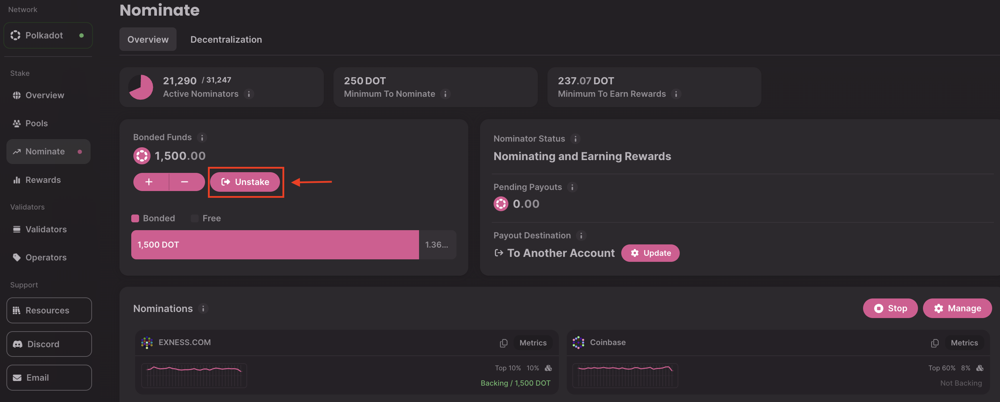
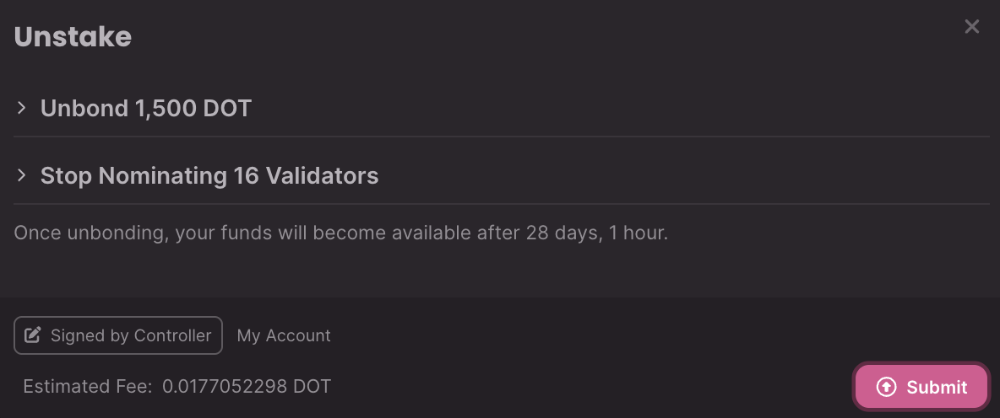
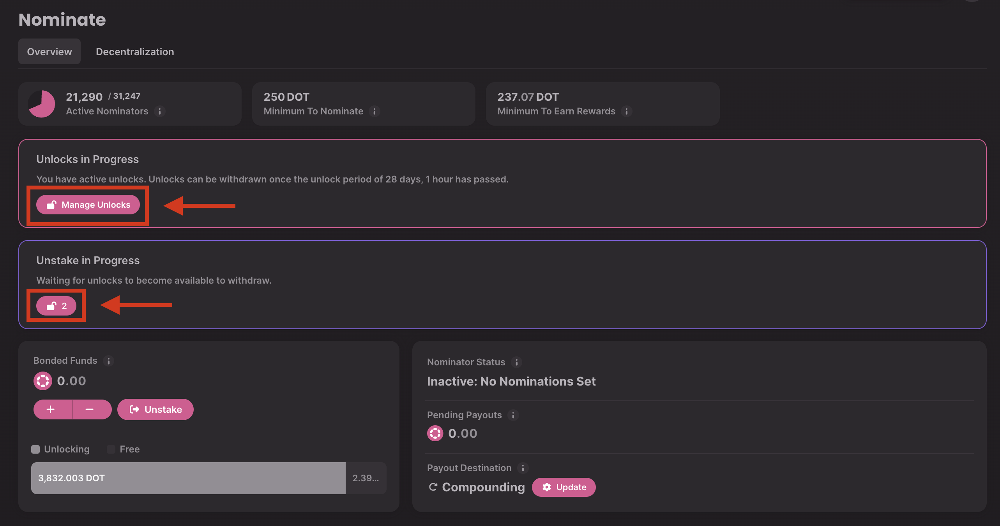
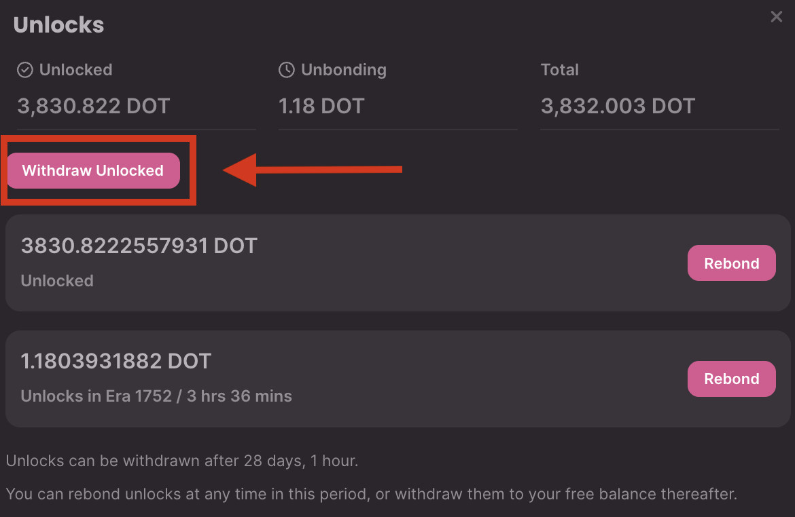
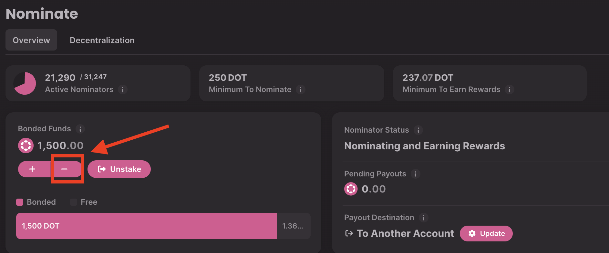
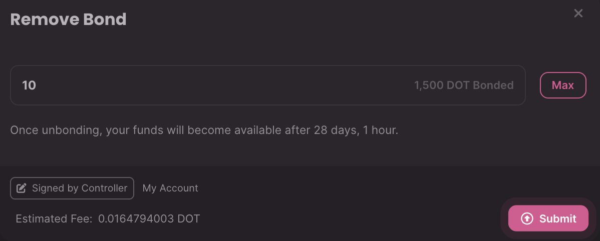

!!!info "Related Wiki page"
    For the underlying concepts, see [Staking](../learn-staking.md).

__

In this article, we explain how to unbond staked tokens using the[Staking Dashboard](https://staking.polkadot.cloud/#/overview). You can decide to stop being a nominator at any time by unbonding. You may need to [connect your extension account](connect-account.md) first.

!!! tip "GOOD TO KNOW"

    Please note that there is an unbonding period, currently 28 days on Polkadot and 7 days on Kusama.
    

In this example, we use Polkadot, but the process is the same for Kusama.

### How to stop nominating and unbond all your funds

1\. Navigate to your nominations on the ["Nominate"](https://staking.polkadot.cloud/#/nominate) tab, and click the "Unstake" button.

2\.  Click "Submit" and sign the batch call from your extension or wallet.

!!! info

    If you change your mind once the unbonding period has be initiated, you can rebond your funds following this guide: "[Staking Dashboard: How to Rebond Your Tokens](https://paritytech.github.io/polkadot-support/staking/staking-basics/staking-dashboard-how-to-rebond-your-tokens)"

3. After the unbonding period has concluded (28 days in Polkadot or 7 days in Kusama), click any of the unlocked padlocks icons to fully withdraw the unbonded tokens.

4\. Click "Withdraw Unlocked," submit, and sign the transaction to complete the process.

Congratulations, the tokens should then show up again in your _free_ balance!

* * *

### How to unbond part of your funds

The previous section described how to stop nominating and unbond _all_ your funds. However, you always have the option to unbond only some of them and keep nominating with the rest. Keep reading to learn how.

!!! tip "GOOD TO KNOW"

    Always ensure that your bonded funds remain over the minimum bond required for nomination (250 DOT on Polkadot, 0.1 KSM on Kusama) to avoid encountering the message "**A minimum bond of 250  DOT is required when actively nominating.**"

1\. Go to the "Nominate" tab and click on the minus ("-") icon below "Bonded Funds."

2\. Enter the amount of funds you'd like to unbond (keep in mind that the remaining balance needs to be over the minimum required to nominate) and click "Submit." Sign the transaction, and that's it, you unbonded only parts of your staking balance!

3. After the unbonding period has concluded (28 days in Polkadot or 7 days in Kusama), click any of the unlocked padlocks icons to withdraw the unbonded tokens.

4\. Click "Withdraw Unlocked," submit, and sign the transaction to complete the process.

Congratulations, the unbonded tokens should show up in your _free_ balance!

* * *

If you are more of a visual learner, check the guide below. It covers all things you can do after you start staking.

[Polkadot Made Easy: How to Unstake your DOT with the Staking Dashboard (Direct Nomination)](https://www.youtube.com/watch?v=zWGkbMMrrFM&list=PLOyWqupZ-WGuiPQ7WRvECJk2ZvZuvfwUK&index=17)

* * *
