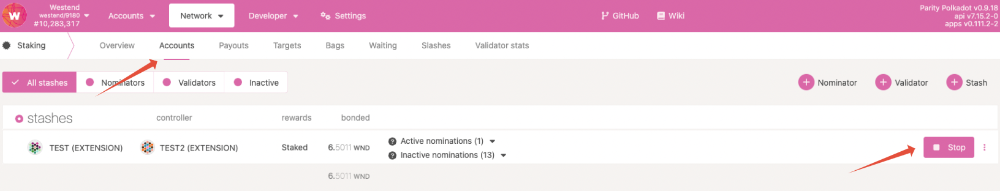
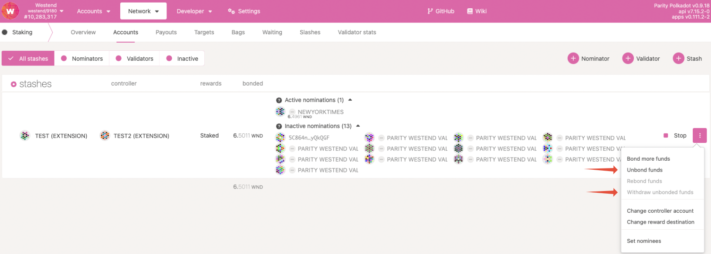
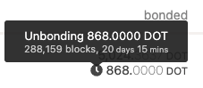
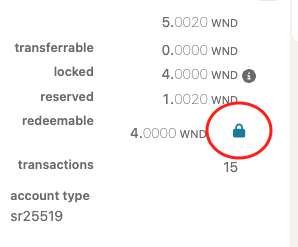

!!!info "Related concepts"
    For the underlying concepts, see [Staking](../learn-staking.md).

_Discover the new Staking Dashboard that makes staking much easier and check our[extensive article list](../../general/dashboards/staking-dashboard.md) to help you get started._

* * *

!!! warning "IMPORTANT"

    Polkadot Developer Interface (Polkadot-JS UI) is a web wallet meant for power users and developers. For everyday use, there are several user-friendly wallets funded by the Polkadot Treasury that support a plethora of features and platforms. Discover them in [this article](where-to-store-dot.md).

You can decide to unbond (unstake) and stop being a nominator at any time. However, please note that there is an **unbonding period** , which serves as a cooldown, during which you will not receive rewards. You will be able to make your tokens transferable after this time has passed. Currently, the unbonding period lasts 28 days on Polkadot and 7 days on Kusama.

!!! info

    If you are unbonding because you have less than the minimum amount needed for staking, please [check out these options](../learn-nomination-pools.md).

!!! warning "IMPORTANT"

    Please ensure that your stash or staking proxy account has enough _transferrable_ balance to pay for the transaction fees when unbonding. Otherwise, you will encounter the [InsufficientBalance](../../general/maintain-errors.md) error.

    Remember that the fee needs to be deducted without the stash or staking proxy account's balance dropping below the [existential deposit](existential-deposit.md). To fix the issue, you can transfer a small amount to your stash or staking proxy account.

!!! tip "GOOD TO KNOW"

    Controller accounts have been removed from staking. Staking actions are now signed by your stash account or, optionally, a [staking proxy](create-proxy-account.md) that can act on its behalf.

Unbonding your tokens can be done by navigating to the Network > Staking > [Accounts](https://polkadot.js.org/apps/#/staking/actions)page on Polkadot Developer Interface. The example below is on the Westend testnet, but the process will be the same on Polkadot.

### Step 1: Chilling

#### Unbond all your tokens

Navigate to the "Network" > "Staking Async" > "[Accounts](https://polkadot.js.org/apps/#/staking/actions)"page on Polkadot Developer Interface. If you want to unbond _all_ your funds, you need to chill your account first, i.e., stop nominating. Click on the Stop button to the right of your account:

!!! warning "IMPORTANT"

    If you don't click the Stop button first, you will be unable to unbound _all_ your funds and will receive an '**InsufficientBond** ' error.

#### Unbond only some tokens

If you want to unbond only part of your funds while keeping some bonded to continue nominating, you don't need to click the Stop button. Instead, proceed to Step 2. Just **make sure that your bonded funds are still above the minimum bond needed to nominate**. Otherwise, you'll receive the 'InsufficientBond' error mentioned above.

#### I don't see a Stop button

If you don't see the Stop button, it means you're not nominating any validators. The "active/inactive/waiting" column will also be missing. In that case, you can move to Step 2.

* * *

### Step 2: Unbonding

Once you've clicked the Stop button and chilled your account successfully, they will still be bonded. This means they stay ready to be used to nominate. To make them transferable again, you first need to unbond them. This process will take 28 days on Polkadot and 7 days on Kusama.

To do this, click the three dots next to the account you want to unbond tokens for, and select "**Unbond funds** ".

A small clock will appear next to your unbonding balance. Hovering over it with your cursor will show you how much time remains until the funds are unbonded.

!!! info

    If you change your mind once the unbonding period has been initiated, you can rebond your funds following this guide: "[Polkadot-JS UI: How to Rebond Tokens During the Unbonding Period](rebond-tokens.md)"

* * *

### Step 3: Withdrawing

Once the 28-day unbonding period has passed, your unbonded funds can be withdrawn and made transferable. To do this, you can either:

  * Click “**Withdraw Unbonded** ,” which will then be available in the same menu as above.
  * Or click on the blue padlock icon next to the "redeemable" balance. This is shown both under "Network" > "Staking" > "Accounts" and on the "Accounts" page under the detailed balance of the account

Your transferrable balance will subsequently increase by the number of tokens you've just fully unbonded.

* * *
