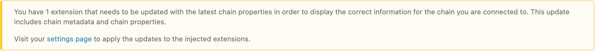
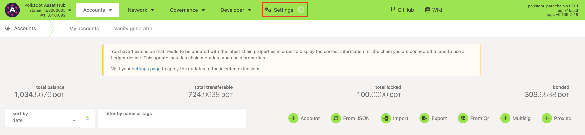
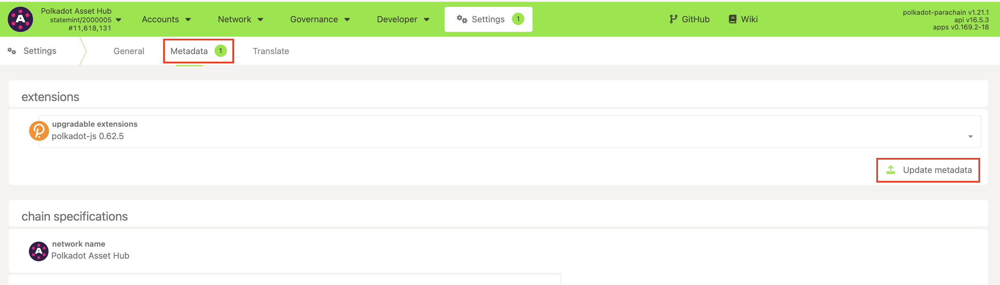
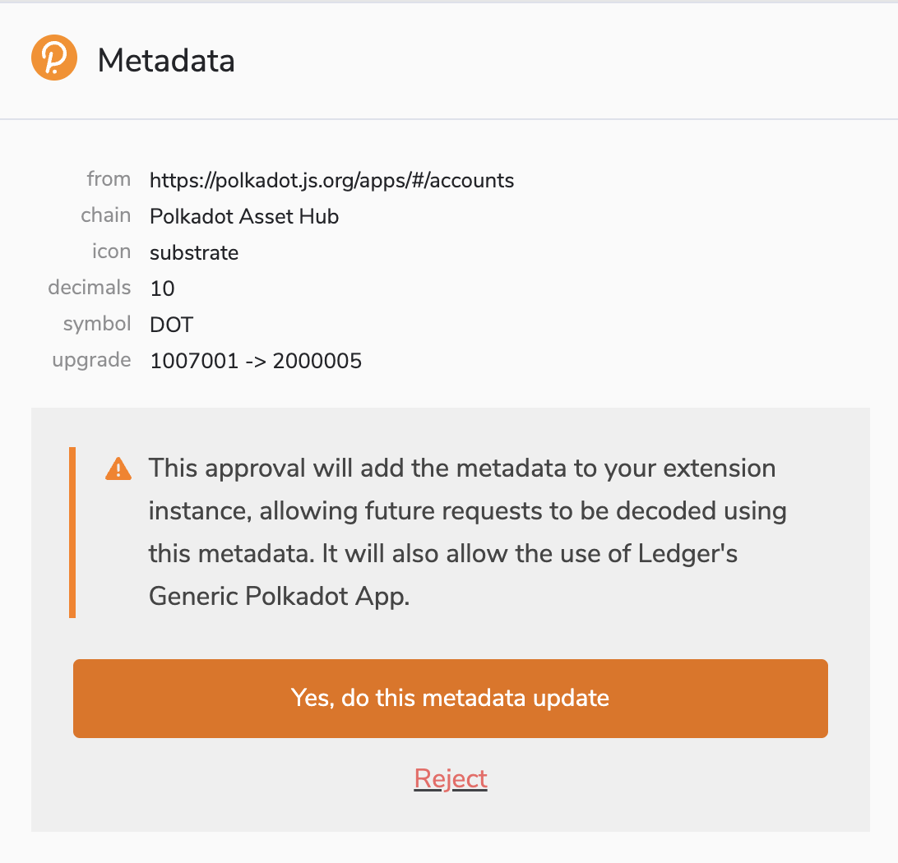

!!!info "Related concepts"
    For the underlying concepts, see [Metadata](../../general/metadata.md).

Every once in a while, when you visit [Polkadot Developer Interface](https://polkadot.js.org/apps/?rpc=wss%3A%2F%2Frpc.polkadot.io#/accounts) (Polkadot Developer Interface), you may see a counter next to Settings or this warning asking you to apply updates to your extension:

This means there was a runtime upgrade since you last used Polkadot Developer Interface, and your extension needs to catch up with the latest metadata. Metadata includes essential information that allows you to [verify what you are signing](verify-extrinsic.md), like descriptions for each extrinsic.

!!! warning "IMPORTANT"

    The Polkadot Developer Signer is an account manager meant for power users and developers. There are several user-friendly browser extensions that support a lot of features right from the extension. Discover them in [this article](where-to-store-dot.md).

This guide uses the Polkadot Developer Signer, but the same steps can be used for any other extension within the Polkadot ecosystem.

!!! danger "READ THIS FIRST!"

    Only allow metadata updates **from trusted sources** , like the Polkadot Developer Interface. **Do not sign** a transaction if you **cannot verify** what you're signing or you suspect you might be signing a different extrinsic than the one intended.

* * *

### How to update the Polkadot Developer Signer metadata on the Polkadot Developer Interface

1\. If one of your extensions needs to be updated, you'll see a counter next to [Settings](https://polkadot.js.org/apps/?rpc=wss%3A%2F%2Frpc.polkadot.io#/settings) and a warning on the [Accounts](https://polkadot.js.org/apps/?rpc=wss%3A%2F%2Frpc.polkadot.io#/accounts) page on the Polkadot Developer Interface:

2\. Please navigate to Settings and switch to the [Metadata](https://polkadot.js.org/apps/?rpc=wss%3A%2F%2Frpc.polkadot.io#/settings/metadata) tab, or simply click the link in the message :

Here, you'll see what extensions can be updated. Click the "Update metadata" button to apply updates.

3\. An extension window will pop up:

Here, you can see:

  * **From** : the source of the metadata. Remember only to accept updates from trusted sources.
  * **Chain** : each chain has its own metadata, so you must update it separately for each network you use.
  * **Decimals** and **Symbol** : this defines the divisibility of the native coin (how many [Planck](../learn-DOT.md#the-planck-unit) units make up one coin) and specifies the coin's ticker symbol.
  * **Upgrade** : the runtime version you used until now and the version you're about to use.

4\. Complete the process by clicking "Yes, do this metadata update."

* * *
