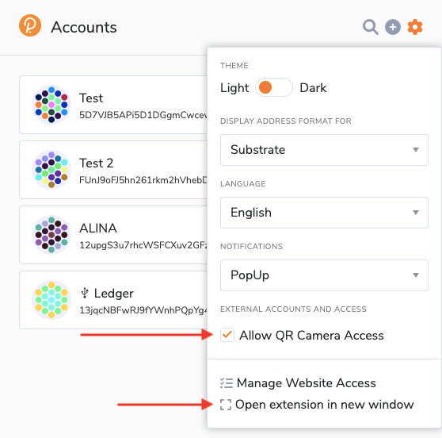
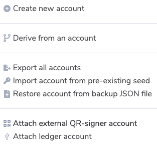
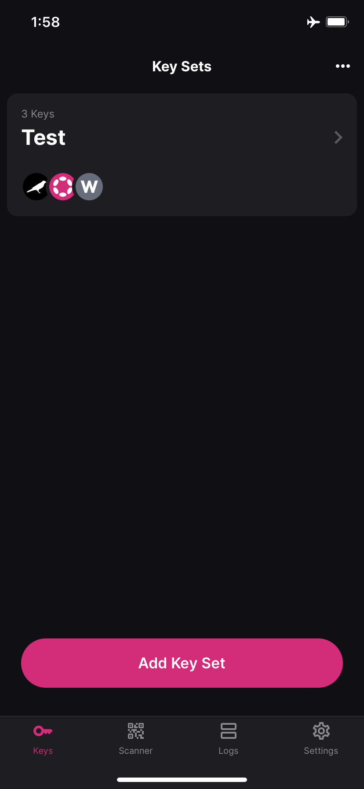
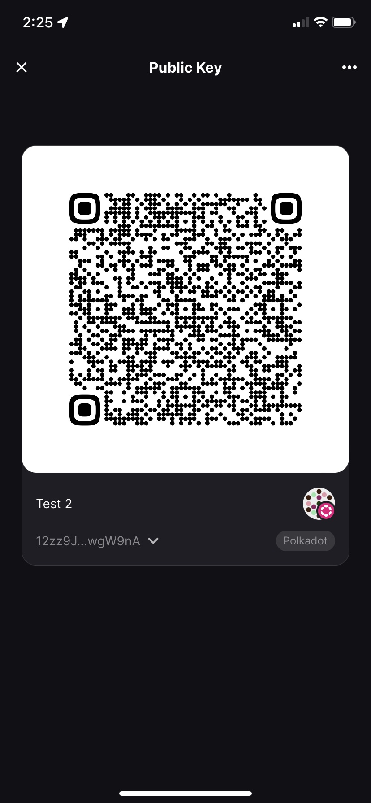
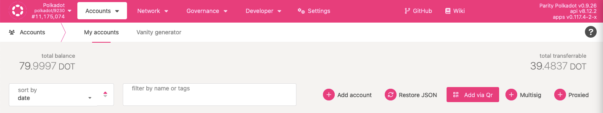

!!!info "Related concepts"
    For the underlying concepts, see [Polkadot Vault](../../general/polkadot-vault.md).

_Polkadot Vault is the new mobile app developed by Parity that replaces Parity Signer. It's redesigned with additional functionality and for a better and more streamlined user experience._

* * *

!!! warning "IMPORTANT"

    Polkadot Developer Interface is a web wallet meant for power users and developers. For everyday use, there are several user-friendly wallets funded by the Polkadot Treasury that support a plethora of features and platforms. Discover them in [this article](where-to-store-dot.md).

In this article, you will learn how to add your Polkadot Vault account to the Polkadot Developer Interface. Polkadot Vault is a cold-storage account manager app, you need a UI in order to interact with your accounts and issue transactions.

### How to add your account through the Polkadot Developer Signer

1\. [Create](vault-create-account.md) or [restore](vault-restore-account.md) an account in Polkadot Vault.

2\. Open the [Polkadot Developer Signer](signer-where-to-download.md) in your browser toolbar. Click on the gear icon to open the settings. Here, allow QR camera access, then choose "Open extension in new window."

3. The extension will open in a new window. You will see a camera icon in the URL bar: click on it and allow the extension to access your camera.

4\. You may need to reload the extension page. Then click on the plus icon and choose "Attach external QR-signer account."

5\. A camera will open on your browser. Now, open your Polkadot Vault app and select the account you want to add.

6\. On the next screen, select the chain on which you want to use that account. This will show up the account's address on that chain in QR code.

7\. Show the QR code to the camera. Your Polkadot Vault account is now added to the extension. You'll also see the account on the [Accounts](https://polkadot.js.org/apps/#/accounts) page on the Polkadot Developer Interface.

* * *

### How to add your account directly on the Polkadot Developer Interface

!!! warning "IMPORTANT"

    **Adding your Polkadot Vault account through the**  [**Polkadot Developer Signer**](signer-where-to-download.md) is highly recommended. It provides better security and convenience.

1\. [Create](vault-create-account.md) or [restore](vault-restore-account.md) an account in Polkadot Vault.

2\. To add your account directly on the Polkadot Developer Interface, go to the [Accounts](https://polkadot.js.org/apps/#/accounts) page and click "Add via Qr":

3\. Allow Polkadot Developer Interface to use your camera. If you don't see a pop-up request, click on a camera icon in the URL bar and allow the website to access your camera.

4\. A camera will open on your browser. Follow steps 5 & 6 in the previous section to get your account's QR code in Polkadot Vault.

5\. Show the QR code to the camera. Your Polkadot Vault account is now added to the Accounts page.

* * *
