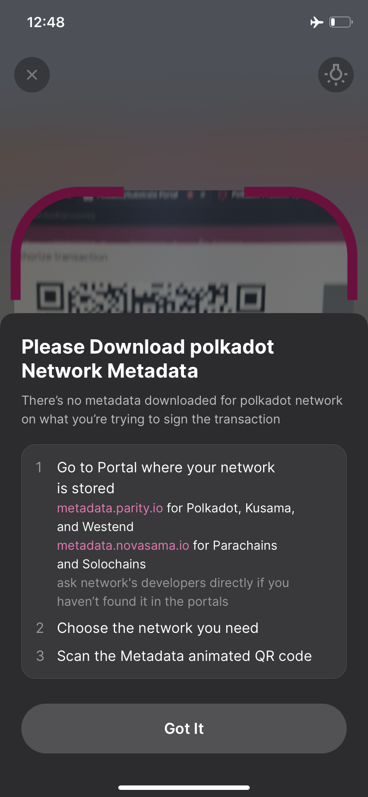
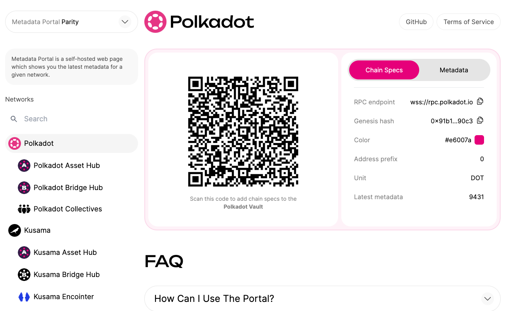
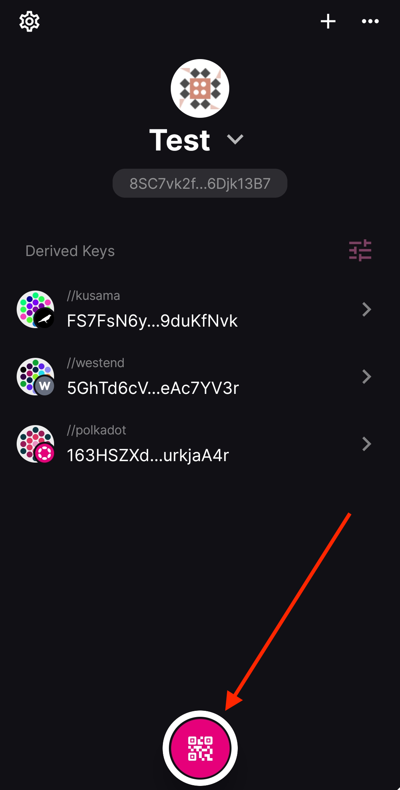
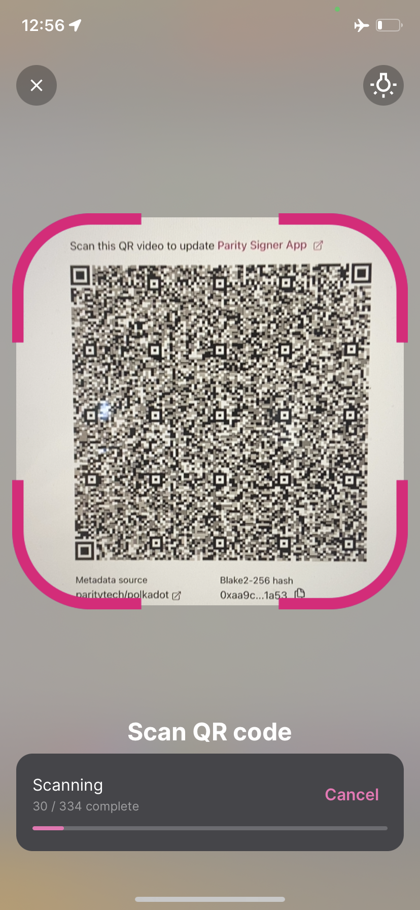
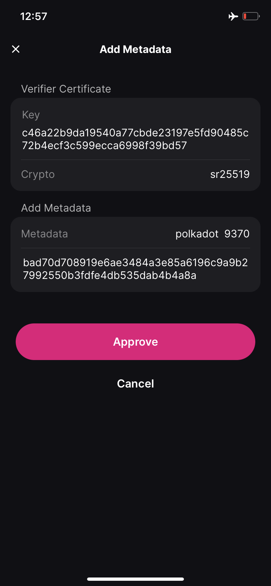
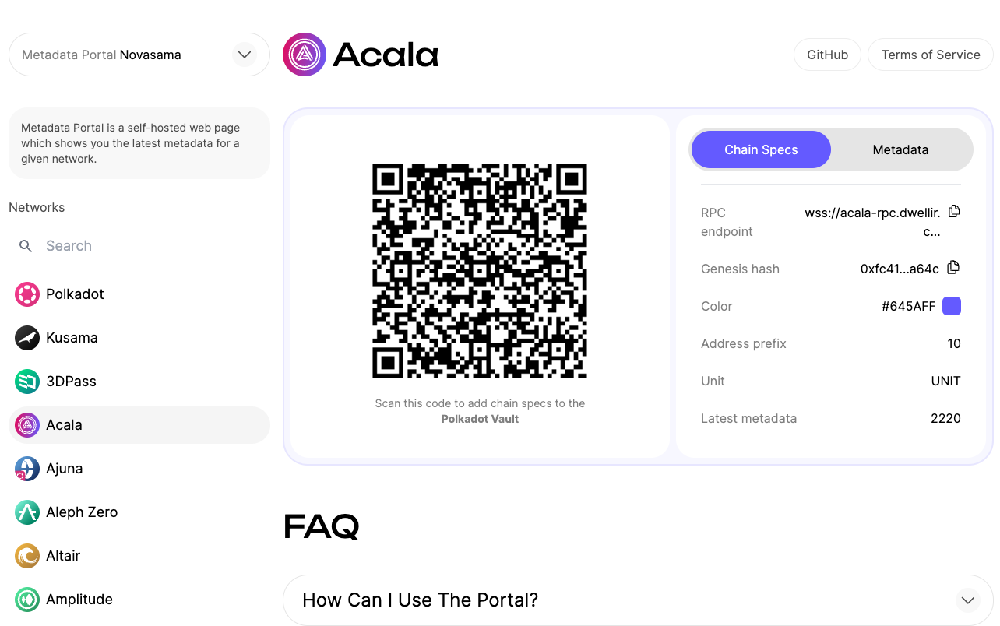
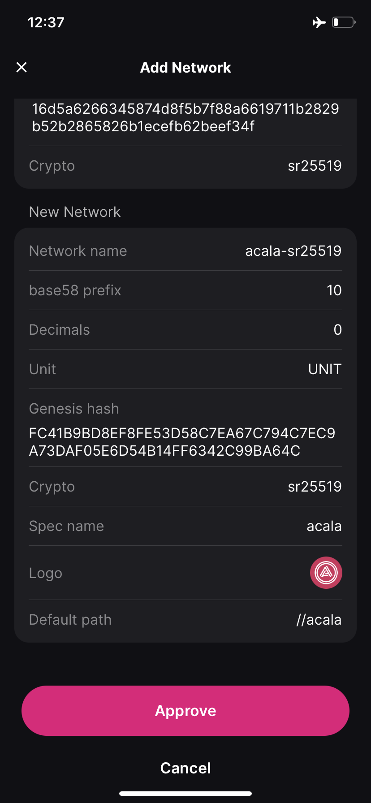
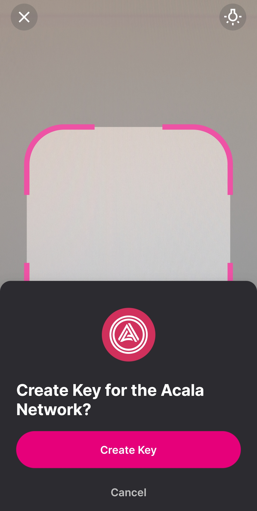
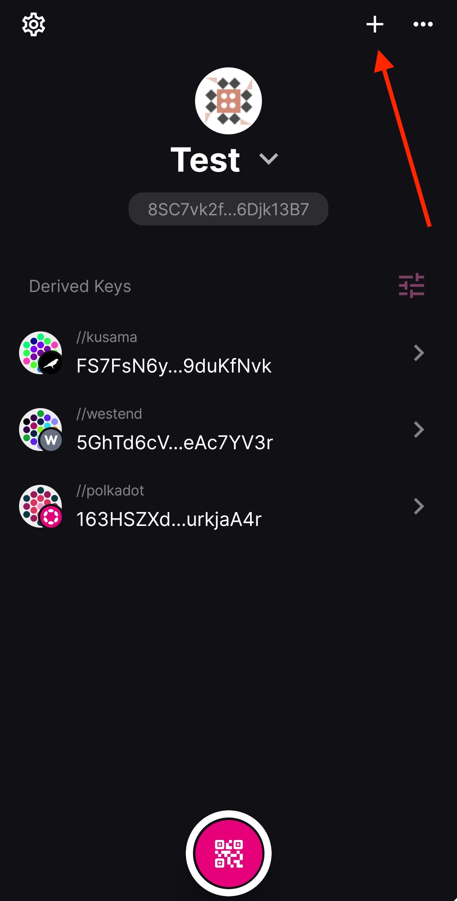
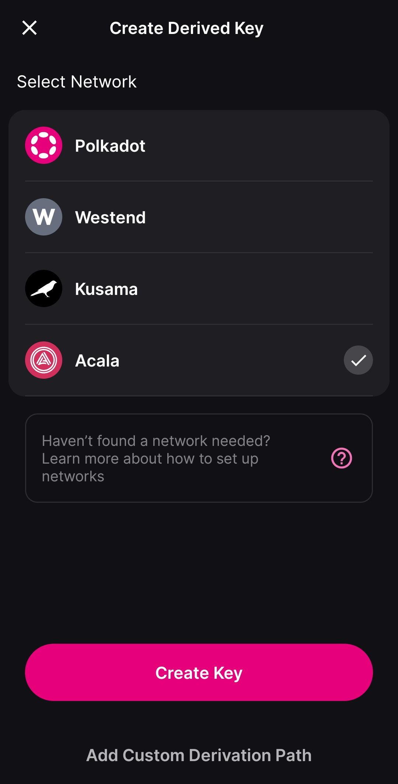

!!!info "Related concepts"
    For the underlying concepts, see [Polkadot Vault](../../general/polkadot-vault.md).

_Polkadot Vault is a mobile app that replaces Parity Signer, turning a spare phone into a cold-storage wallet for your Polkadot accounts._

* * *

In this article, you will learn how to add additional chains to Polkadot Vault and update their metadata.

!!! warning "IMPORTANT"

    In order for Polkadot Vault to decode and sign transactions it needs to have the metadata of the latest runtime version for the specific chain.

!!! danger "READ THIS FIRST!"

    Make sure that you **explicitly trust** the source of the chain spec and metadata. Adding metadata from an untrusted source could lead to **loss of funds.**

    The instructions in this article are provided with the assumption that you trust the source of the chain spec and metadata.

### Metadata updates

There are three situations when you need to update the metadata:

  * When you want to sign a transaction for the first time with one of the provided chains (Polkadot, Kusama, Westend)
  * When you add a new chain (see instructions in the next section)
  * When there is a new runtime version for the chain you are trying to use

If you see the following message when you try to sign a transaction, it means that Polkadot Vault doesn't have the metadata to decode and sign the transaction. In that case, you need to update the metadata.

* * *

### How to update the metadata

In this example, the metadata for Polkadot is updated, but the instructions are the same for any other chain you may have added, with the potential exception of the metadata source (see next section).

1\. Navigate to [Parity's metadata portal](https://metadata.parity.io/#/polkadot) and select Polkadot on the sidebar.

2\. Open the Polkadot Vault app on your phone and click on the "Scanner" tab.

3\. Scan the QR fountain. Keep your phone as still as possible until the progress bar fills.

4\. In the next screen, you can see the issuer's details and the version of the metadata you are about to add. Click on "Approve."

That's it. Now you can sign transactions with your Polkadot accounts. If you haven't added your account on Polkadot Developer Interface yet, check [this article](vault-add-account.md) for instructions.

* * *

### How to add a new chain

Polkadot Vault supports three chains out of the box: Polkadot, Kusama, and Westend. But you can add additional chains if you can scan a **trusted** spec QR code and metadata QR fountain.

Currently, there exists one metadata portal that supports a plethora of Substrate chains curated by [Nova wallet](https://novawallet.io). Alternatively, if you are a technically oriented user, you can [create your own QR codes and metadata portal](https://github.com/paritytech/metadata-portal).

The instructions below are based on Nova's metadata portal, but the same instructions apply to any other source.

1\. Navigate to [Nova's metadata portal](https://metadata.novasama.io/) and select the chain you want to add from the sidebar. In this example, Acala is added to Polkadot Vault.

2\. Navigate to the "Acala" tab.

3\. Open Polkadot Vault and click on the "Scanner" tab. This will open your phone's camera to scan the spec QR code.

4\. On the screen that opens up, you can see the details of the issuer and the chain you are about to add. Click "Approve," and the chain is added.

5\. After approving the addition of the new network, you'll be prompted to create a new key (account) for that network. It will be added to the main tab under the selected key set.

6\. Finally, navigate back to the "Metadata" tab on the metadata portal and update the metadata as described in the previous section.

* * *

### How to generate an account for a newly added chain

!!! warning "IMPORTANT"

    The instructions below concern any key sets (accounts) that you have created **before** adding the new chain. Any key sets you create **after** might have access to these chains if you included them.
    

1\. Navigate to the home screen and click on the plus (+) sign on the top right.

2\. On the next screen, select the network for which you want to create an account. In this example, Acala is selected.

3\. Then click "Create Key."

!!! warning "ATTENTION"

    In the latest version of Polkadot Vault (>6.2.0) the accounts for each network are derived from the mnemonic phrase using a **[custom derivation path](../learn-account-advanced.md#derivation-paths)** ("//polkadot" for Polkadot, "//kusama" for Kusama, etc.)

    If you are using an older version, you can click on "Add Custom Derivation Path" and use an empty path (remove the "//"). This will allow you to use the same account that you use on the existing chains on the newly added chain too.

4\. Enter your phone's PIN and you're now ready to [add your account](vault-add-account.md) for that chain on Polkadot Developer Interface and sign transactions with it.

* * *

Here is a video if you want a visual guide on how to update metadata in your Polkadot Vault (mark [04:56](https://www.youtube.com/watch?v=IG_RGLsb2g0&t=296s)) and how to add a new network (mark [06:31](https://www.youtube.com/watch?v=IG_RGLsb2g0&t=391s)).

[How to use Polkadot Vault | Technical Explainers](https://www.youtube.com/watch?v=IG_RGLsb2g0&t=296s)

* * *
