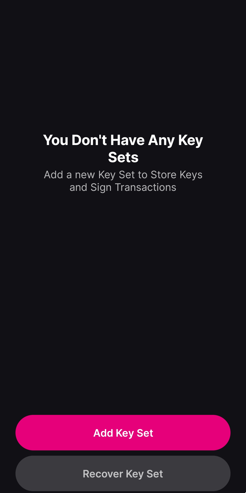
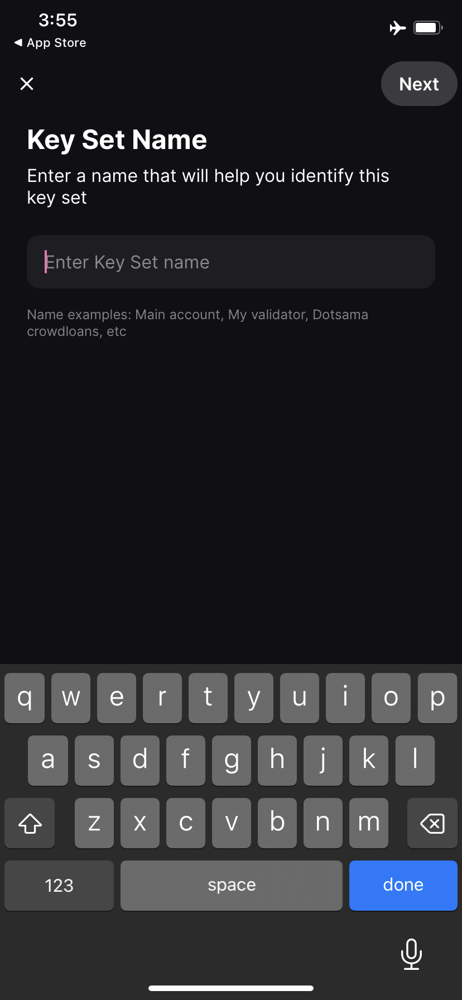
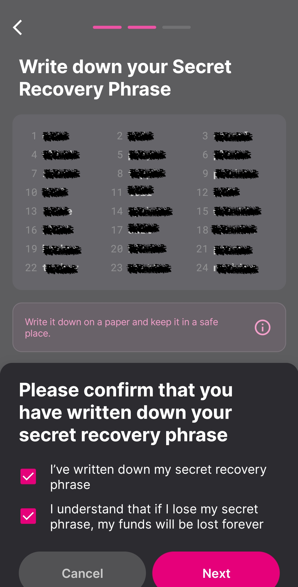
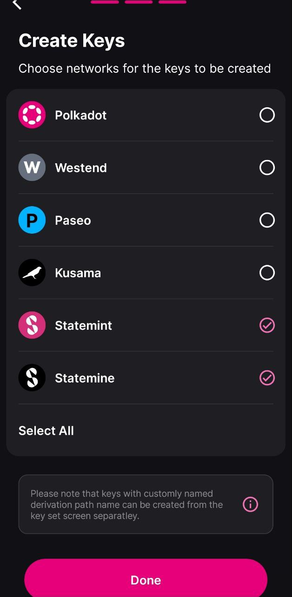
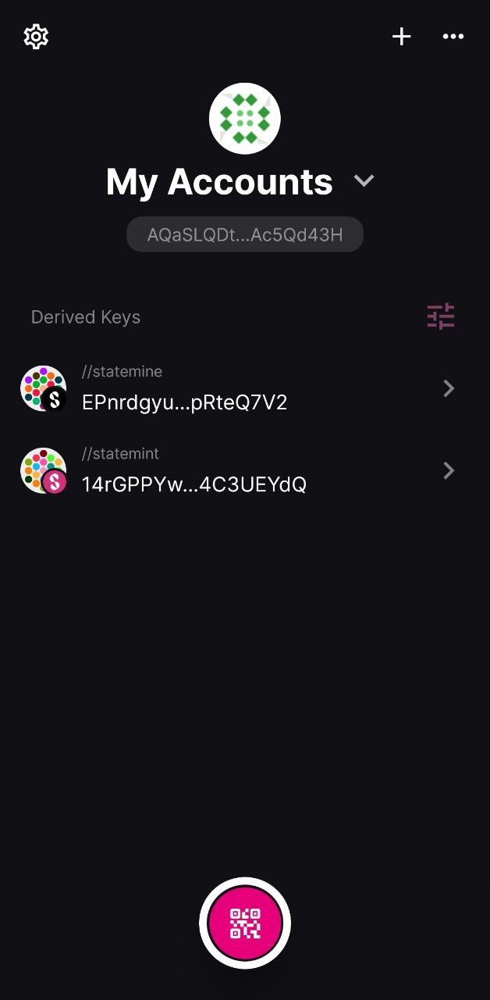
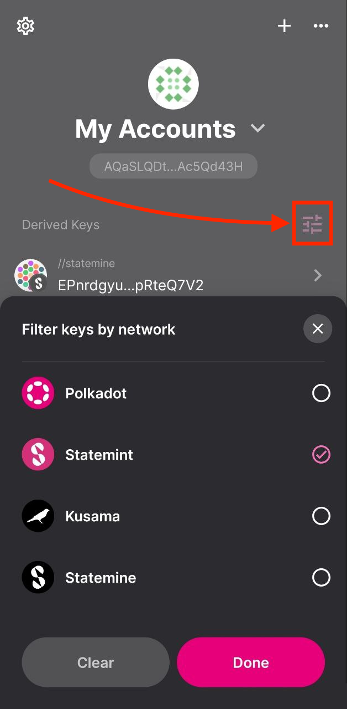

!!!info "Related concepts"
    For the underlying concepts, see [Polkadot Vault](../../general/polkadot-vault.md).

In this article, you will learn how to **create a new account** in Polkadot Vault. If you want to know how to restore an account **originally created in Polkadot Vault or Parity Signer** , please refer to [this article](vault-restore-account.md).

!!! danger "READ THIS FIRST!"

    It is recommended that you install the Polkadot Vault app on an old phone that you **do not connect to the internet** anymore. This way you keep your private keys offline, and your phone becomes a cold storage wallet.

### How to create a new account in Polkadot Vault

1. Download the Polkadot Vault app for your factory-reset phone [from the official site](https://signer.parity.io/) and install it on your phone.

2\. Read through the introductory screens and click "Continue," then agree to the Terms of Service and Privacy Policy.

3\. After that, you are prompted to enable Airplane mode, turn off WiFi, and disconnect any cables. Once you do these steps, click "Next."

Remember that **Polkadot Vault is meant to work as cold storage** , and that can only be achieved if your phone is air-gapped from the outside world.

4\. On the next screen, we are ready to create our first set of keys. Click the "Add Key Set" button and select "Add new Key Set."

5\. Next, enter a name for the key set.

!!! info

    This is basically the account's name. But because a Substrate account can be used on all networks, the mnemonic phrase will generate addresses for multiple networks, and you can add more networks and use your account on all of them.

6\. On the next screen, you are presented with your account's mnemonic phrase. As prompted by the app, **make sure to write it down on paper and keep it in a safe place.**  

You can also use "Banana Split" for more security. ["Banana Split"](https://bs.parity.io) is a self-hosted app that you can use to split your mnemonic phrase into pieces using [Shamir's Secret Sharing scheme](https://en.wikipedia.org/wiki/Shamir%27s_secret_sharing).

Once you write down the mnemonic phrase, click "Next." Tick the checkboxes confirming that you have written down the recovery phrase and understood the consequences of losing it, and click "Next."

!!! warning "ATTENTION"

    You **should not** take a screenshot of your mnemonic phrase! You should write the mnemonic phrase **only on paper** and store it somewhere **safe and secret!**

7\. The following screen will allow you to select the networks for which you want to create the account. For most Polkadot Vault versions, Polkadot, Kusama, and Westend networks are preselected.

!!! warning "IMPORTANT"

    If you are using a Polkadot Vault version older than v7.1, you should add Polkadot Asset Hub (Statemint) and Kusama Asset Hub (Statemine) to Polkadot Vault.

    Follow the article below to learn how to add Polkadot Asset Hub (Statemint) to your Polkadot Vault:

    [Polkadot Vault: How to Add a New Chain and Update the Metadata](vault-add-chain-metadata.md)

Click "Done" and that's it, your accounts are ready to use!

8\. After completing the process, you'll be transferred back to the home screen, where you can see your newly created accounts.

!!! warning "ATTENTION"

    In the most recent Polkadot Vault versions (>v6.2.0) the accounts for each network are derived from the mnemonic phrase using a **[custom derivation path](../learn-account-advanced.md#derivation-paths)** ("//statemint" for Polkadot Asset Hub, "//statemine" for Kusama Asset Hub, etc.). Notice the label over each account in the screenshot above.

    When restoring your account on another wallet, add this derivation path for each network.

9\. Click on it to view the address on each of the selected networks. Further clicking on each of the networks will present your account on that network in QR code, which you can use to add it to any wallet that supports this functionality.

10\. If you don't want to use the account on all networks, you can click on the settings icon on the right and select just the networks you want to use the account with.

* * *

### What can I do next?

You can add your Polkadot Vault account to the Polkadot Developer Signer to use it with every compatible wallet listed in the article below:

[Where to Store DOT: Polkadot Wallet Options](where-to-store-dot.md)

!!! warning "IMPORTANT"

    In older versions (<v7.1), it's important to update the metadata whenever there is a runtime upgrade, otherwise Polkadot Vault won't be able to decode and sign extrinsics. Polkadot Vault allows for air-gapped metadata updates. You can find instructions in [this article](vault-add-chain-metadata.md).

* * *

### If you are a user of Parity Signer

If you are already using Parity Signer, please read the following information first:

  * Parity Signer has been deprecated and has been replaced by Polkadot Vault.
  * Your phone won't automatically update the app from Parity Signer to Polkadot Vault.
  * You can keep using Parity Signer as it is; you don't need to update to Polkadot Vault if you don't want to.

!!! danger "READ THIS FIRST!"

    If you choose to upgrade to Polkadot Vault, you first need to uninstall Parity Signer and install Polkadot Vault from scratch. **This means that all data, including your accounts, will be deleted from your device!**

    After the upgrade you will need to [restore your accounts](vault-restore-account.md) from their mnemonic phrases, re-add any networks, and update their metadata.

* * *

### What are the benefits of Polkadot Vault compared to Parity Signer

Polkadot Vault comes with two main improvements compared to Parity Signer:

1\. A better design and user experience.

2\. No need to update the metadata after each runtime upgrade if used with compatible wallets.

3\. The ability to add networks from different sources. This means that in addition to Polkadot, Kusama, and Westend, which are provided out of the box and supported by [Parity's metadata portal](https://metadata.parity.io/#/polkadot), you can add more networks from [Nova's metadata portal](https://metadata.novasama.io/#/polkadot).

* * *

In the video below, you can follow how Filippo guides you through the process of how to create a new account. Go to the mark 09:09 to see it in action:

[How to use Polkadot Vault | Technical Explainers](https://www.youtube.com/watch?v=IG_RGLsb2g0&t=549s)

* * *
