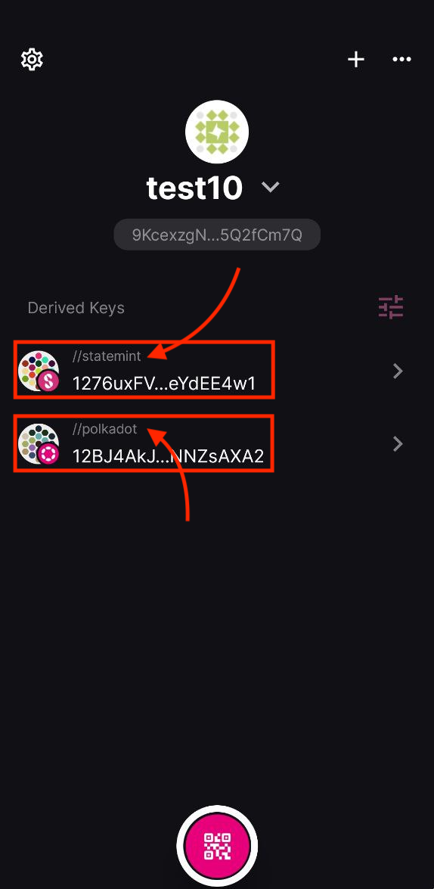
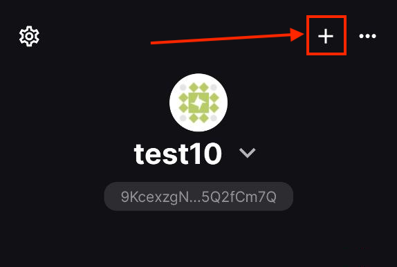
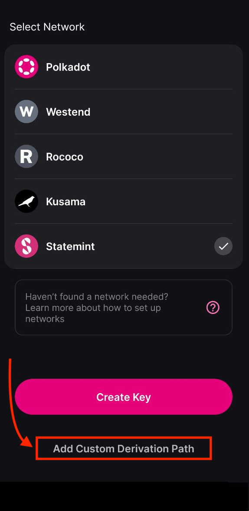
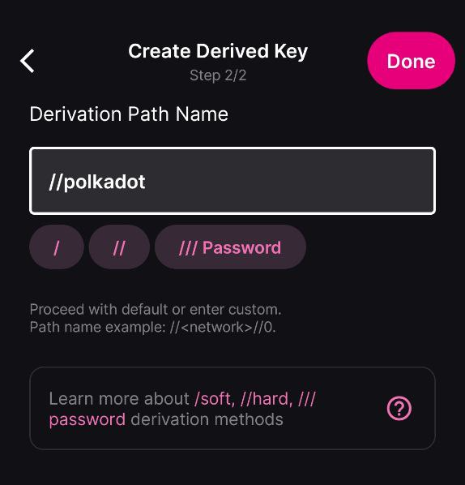
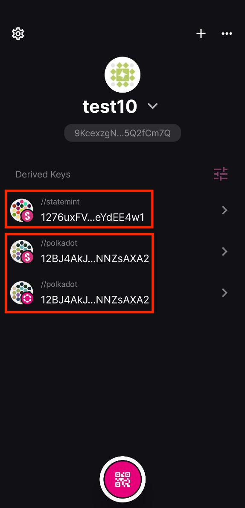

!!!info "Related concepts"
    For the underlying concepts, see [Polkadot Vault](../../general/polkadot-vault.md).

As part of an improvement on the scalability and future developments on Polkadot, some features that used to be handled by Polkadot Relay Chain were migrated to Polkadot Asset Hub. This migration introduced several benefits to the ecosystem, including a lower existential deposit and reduced transaction fees.

Polkadot Vault (in versions < 7.1) uses a derivation path that is unique to each network, and it results in different accounts for each one.

!!! warning "ATTENTION"

    For recent Polkadot Vault app versions (**> =7.1**) you can approve a transaction on any network from any Polkadot Vault account. No need to follow the steps below.

Find below a step-by-step guide on how to use the existing account on Polkadot Vault generated for the Polkadot Relay Chain on the Polkadot Asset Hub.

!!! warning "IMPORTANT"

    This articles focuses on Polkadot and Polkadot Asset Hub ("Statemint"), but the same instructions can be applied to Kusama and Kusama Asset Hub ("Statemine").

* * *

### Default derivation path for each network

The main goal of Polkadot Vault is security. That is why, even though it uses the same mnemonic phrase for multiple accounts, it applies a unique derivation path to accounts on different networks. For instance, when you create an account for Polkadot (Relay Chain), the derivation path defaults to //polkadot, while for Polkadot Asset Hub it is //statemint. This difference leads to distinct accounts, even if the same mnemonic is used.

To resolve this and use an account on Polkadot Asset Hub that was originally created for Polkadot Relay Chain, you simply need to customize the derivation path for the Asset Hub account based on your existing Relay Chain account. Follow the steps below to learn how:

!!! tip "GOOD TO KNOW"

    Different versions of the Polkadot Vault may look slightly different from the screenshots below, but the core principle remains the same: customize the derivation path for the new account.

### Customize the derivation path

1\. You must identify and note down the derivation path applied to the Polkadot Relay Chain you want to replicate for Polkadot Asset Hub. Each account's derivation path is displayed above its public address (//derivationPath).

Accounts in the same keyset on different networks (notice the different network logo in the screenshot above) share the same mnemonic but have distinct derivation paths (e.g., //statemint and //polkadot) by default, resulting in separate accounts and public addresses.

2\. Now, create a new keyset by tapping the "+" sign.

3\. Select the desired network (e.g., "Statemint") and tap the option at the bottom to modify the derivation path.

4\. Enter the one you noted down in the first step (e.g., //polkadot).

5\. After confirming you have written down the custom derivation path, you should see the new account in your keyset.

Even if they operate on different networks (notice the logo), they will be the same account as long as they are derived from the same mnemonic phrase and use the same derivation path.

And that's it! You can now use the same account in Polkadot Vault across different networks.

!!! warning "ATTENTION"

    If you want to replicate multiple accounts, you should add //1, //2, //3, … to the custom derivation path to recreate each subsequent account (e.g., //polkadot//1).
