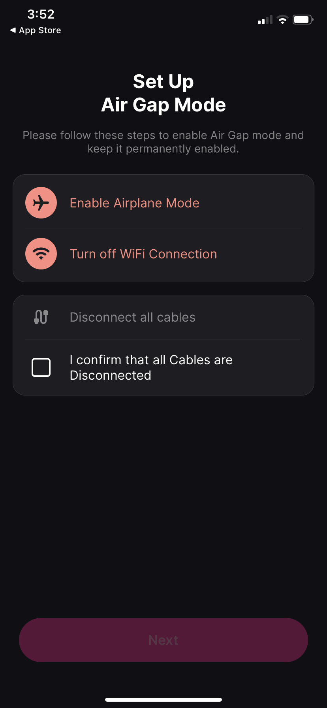
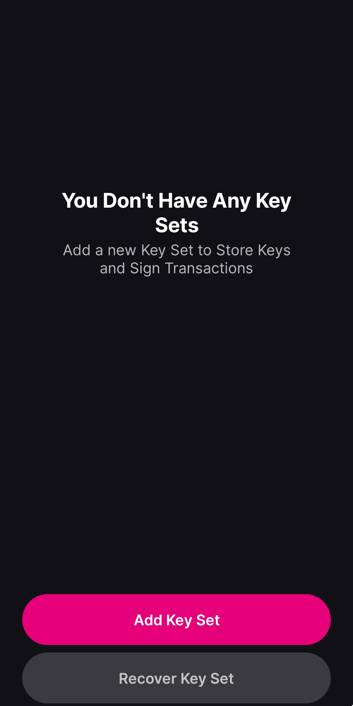
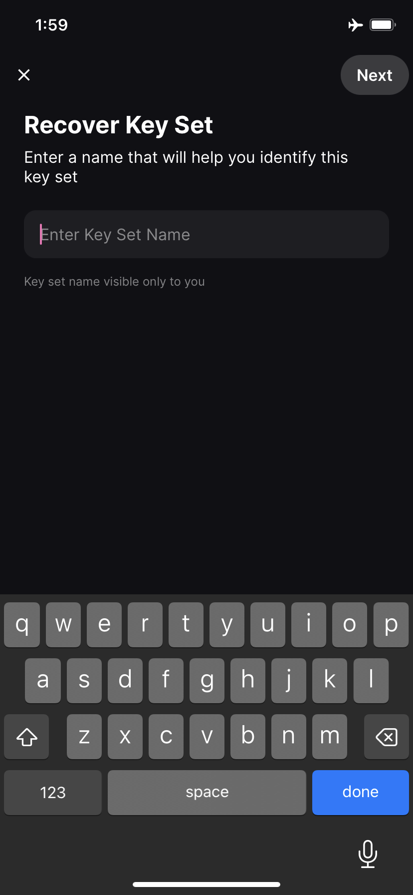
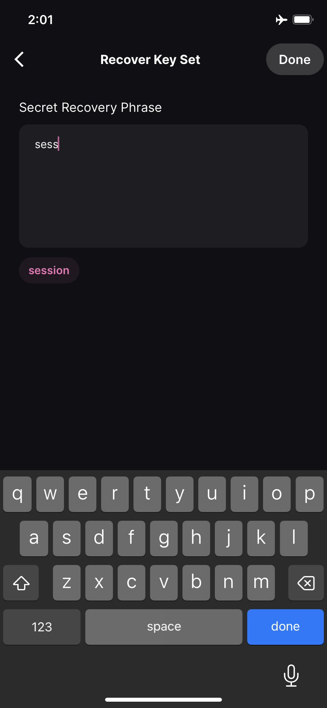
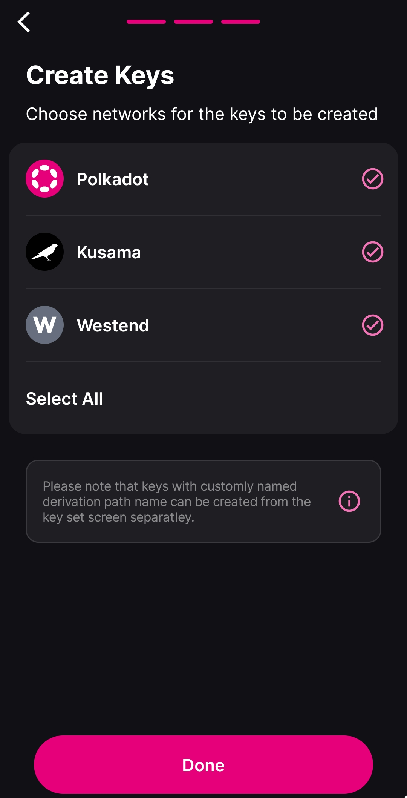
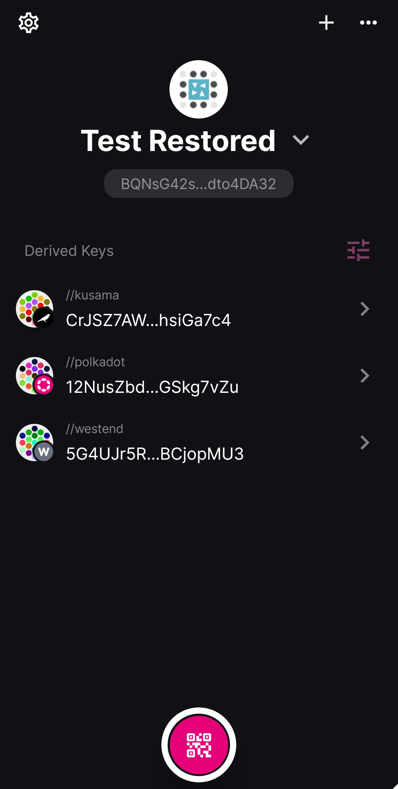
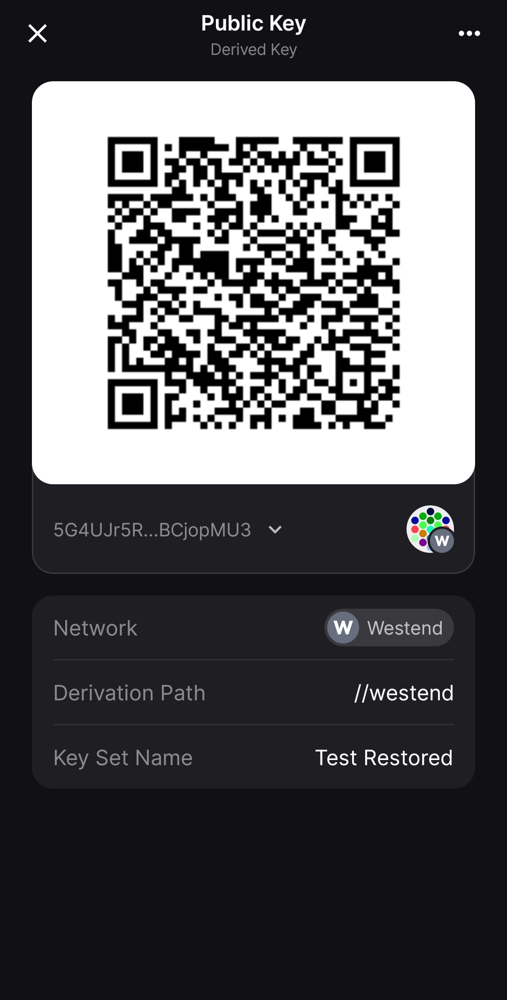
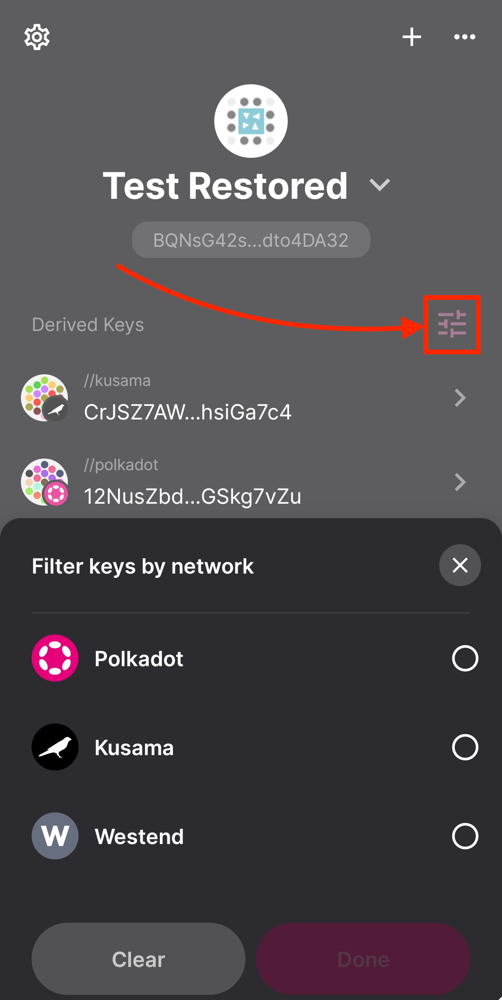

!!!info "Related concepts"
    For the underlying concepts, see [Polkadot Vault](../../general/polkadot-vault.md).

_Polkadot Vault is a mobile app that replaces Parity Signer, turning a spare phone into a cold-storage wallet for your Polkadot accounts._

* * *

In this article you will learn how to **restore an account** in Polkadot Vault that was **originally created in Polkadot Vault or Parity Signer**. If you want to know how to **create an account** in Polkadot Vault, please refer to [this article](vault-create-account.md).

!!! danger "READ THIS FIRST!"

    It is recommended that you install the Polkadot Vault app on an old phone that you **do not connect to the internet** anymore. This way you keep your private keys offline, and your phone becomes a cold storage wallet.

    From a security perspective, it is **not** recommended to restore an account that has been online, like an account created in the Polkadot Developer Signer, into an offline storage solution (which Polkadot Vault is meant to be).

!!! tip "GOOD TO KNOW"

    If you previously created an account in Polkadot Vault or Parity Signer, you will have received a mnemonic phrase and a derivation path that you should have saved in a safe place offline. Polkadot Vault allows you to restore your account from that mnemonic phrase and derivation path.

### How to restore your account in Polkadot Vault

1\. Download the Polkadot Vault app [from the official site](https://signer.parity.io/) and install it on your phone.

2\. If this is a new installation, read through the introductory screens and click "Continue," then agree to the Terms of Service and Privacy Policy.

3\. Again, if this is a new installation, you are then prompted to enable Airplane mode, turn off WiFi, and disconnect any cables. Once you do these steps, click "Next."

Remember that Polkadot Vault is meant to work as cold storage and that can only be achieved if your phone is air-gapped from the outside world.

4\. On the next screen, click the "Recover Key Set" button.

5\. Next enter a name for the key set.

!!! info

    This is basically the account's name. But because a Substrate account can be used on all networks, the mnemonic phrase will generate addresses on Polkadot, Kusama, and Westend, and you can add more networks and use your account on all of them.

6\. In the next screen, you enter the mnemonic phrase of the account you want to restore. As you start typing each word the app suggests possible words from the wordlist that match what you typed. You can click on the proper suggested word to fill it. This way, you can avoid spelling mistakes.

!!! warning "IMPORTANT"

    Remember that Polkadot Vault (and Parity Signer) provide a 24-word mnemonic phrase for accounts created in both apps. You will need to enter all 24 words in the **correct order** to successfully restore your account.

    If you have a 12-word mnemonic phrase, that account wasn't created by either app (although it might have been created by an older version of Parity Signer).

    Ledger accounts also have 24-word mnemonic phrases, but they aren't compatible with Polkadot Vault. Make sure you're **not trying to restore your Ledger account in Polkadot Vault.**

7\. The following screen will allow you to select the networks for which you want to create the account. By default Polkadot, Kusama, and Westend are preselected. Click "Done" and that's it, your accounts are ready to use.

8\. After completing the process, you'll be transferred to the account's page, where you can see the address on each supported network.

!!! warning "ATTENTION"

    In the latest version of Polkadot Vault (>6.2.0) the accounts for each network are derived from the mnemonic phrase using a **[custom derivation path](../learn-account-advanced.md#derivation-paths)** ("//polkadot" for Polkadot, "//kusama" for Kusama, etc.)

    If you're restoring an account that doesn't match your old one, use the same derivation path you used during its creation:

    * In the account's screen above, click the "+" icon.
    * Choose the network.
    * Select "Add Custom Derivation Path" at the bottom.
    * Leave empty the "Derivation Path Name" field.
    * Click "Done" and check if the right account has been restored.

9\. Further clicking on each of the networks will present your account on that network in QR code, which you can use to add it to the Polkadot Developer Signer, the Polkadot Developer Interface, or another app that supports this functionality. Detailed instructions can be found below.

10\. If you don't want to use the account on all networks, you can click on the settings icon on the right and select just the networks you want to use the account with.

10\. Clicking on the back arrow will take you to the home screen, where you can see all of your accounts.

!!! tip "GOOD TO KNOW"

    The PIN for the app is your phone's passcode.

* * *

### What can I do next?

You can add your Polkadot Vault account to the Polkadot Developer Signer to use it with [Polkadot Developer Interface](https://polkadot.js.org/apps/#/accounts), if it's not there already. The step-by-step guide can be found [here](vault-add-account.md).

!!! warning "IMPORTANT"

    It's important to update the metadata whenever there is a runtime upgrade, otherwise Polkadot Vault won't be able to decode and sign extrinsics. Polkadot Vault allows for air-gapped metadata updates. You can find instructions in [this article](vault-add-chain-metadata.md).

* * *

### If you are a user of Parity Signer

If you are already using Parity Signer, please read the following information first:

  * Parity Signer has been deprecated and has been replaced by Polkadot Vault.
  * Your phone won't automatically update the app from Parity Signer to Polkadot Vault.
  * You can keep using Parity Signer as it is; you don't need to update to Polkadot Vault if you don't want to.

!!! danger "READ THIS FIRST!"

    If you choose to upgrade to Polkadot Vault, you first need to uninstall Parity Signer and install Polkadot Vault from scratch. **This means that all data, including your accounts, will be deleted from your device.**

    After the upgrade you will need to restore your accounts from their mnemonic phrases (as described in this article), re-add any networks, and update their metadata.

* * *

### What are the benefits of Polkadot Vault compared to Parity Signer

Polkadot Vault comes with two main improvements compared to Parity Signer:

1\. A better design and user experience

2\. Faster reading of QR fountains for [metadata updates](vault-add-chain-metadata.md)

3\. The ability to add networks from different sources. This means that in addition to Polkadot, Kusama, and Westend, which are provided out of the box and supported by [Parity's metadata portal](https://metadata.parity.io/#/polkadot), you can add more networks from [Nova's metadata portal](https://metadata.novasama.io/#/polkadot), other sources that might be available in the future, or even metadata you [created yourself manually](https://github.com/paritytech/metadata-portal).

* * *

If you are a visual learner, you might be interested in checking the video below at mark [08:51](https://youtu.be/IG_RGLsb2g0?t=531) where Filippo will guide you on how to recover a mnemonic phrase on Polkadot Vault.

[How to use Polkadot Vault | Technical Explainers](https://www.youtube.com/watch?v=IG_RGLsb2g0&t=531s)

* * *
