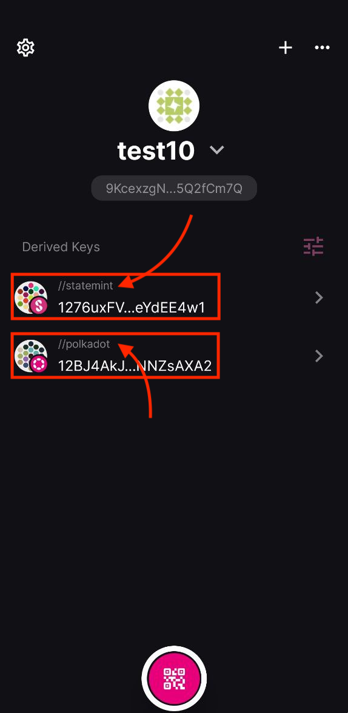
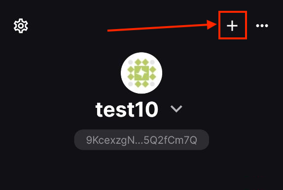
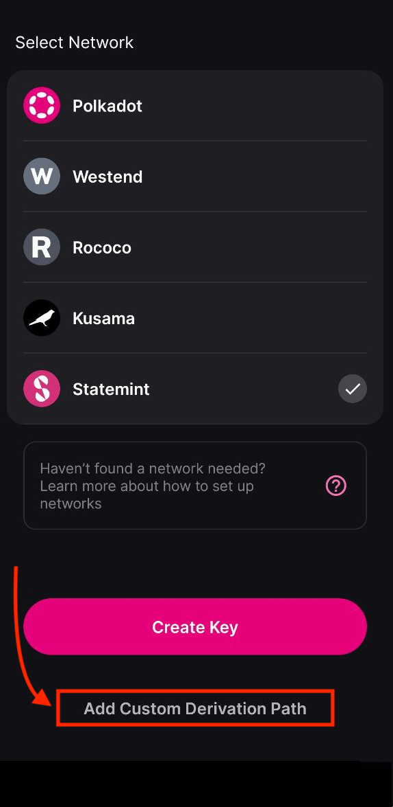
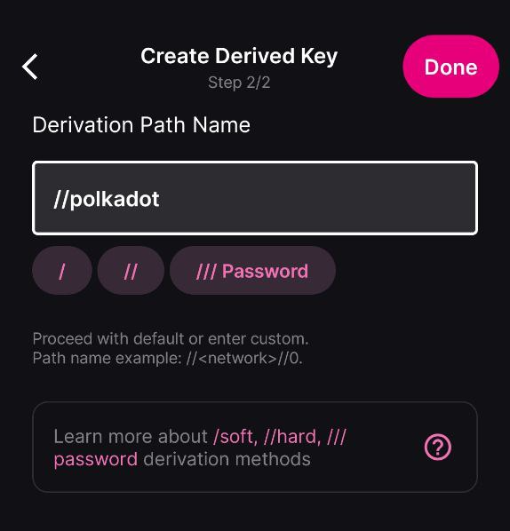
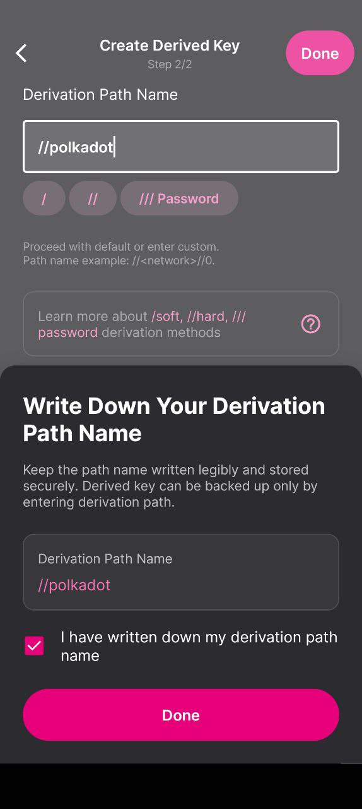
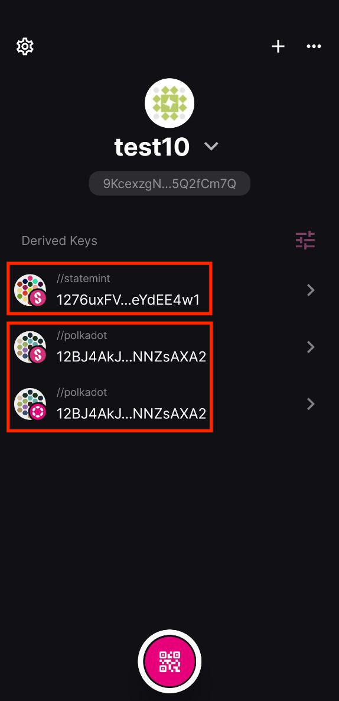

!!!info "Related concepts"
    For the underlying concepts, see [Polkadot Vault](../../general/polkadot-vault.md).

Any account created in a wallet can be used across multiple networks, so there’s no need to create separate accounts for each one. Most wallets in the Polkadot ecosystem allow a single account to connect to different networks seamlessly. However, Polkadot Vault (since version 6.2.0) introduces a unique derivation path for each network, creating separate accounts per network. This enhances security but limits interoperability, as each account will only function on the specific network it was created for.

!!! danger "READ THIS FIRST!"

    For recent Polkadot Vault app versions (**> =7.1**) you can approve a transaction on any network from any Polkadot Vault account. No need to follow the steps below.

This article explains how to use the same account on any available network using Polkadot Vault.

### Mnemonic phrase and derivation paths

Accounts in the Polkadot ecosystem are deterministically created based on two key components: the mnemonic phrase and the derivation path. A specific combination of them will always generate the same account. Learn more about portability and derivation paths in the sections below:

[Portability](../learn-account-advanced.md#portability) and [Derivation Paths](../learn-account-advanced.md#derivation-paths)

When creating an account, the wallet typically generates a mnemonic phrase that must be securely stored offline. However, a single mnemonic can be used to generate multiple accounts by adjusting the derivation path. While most wallets apply a default derivation path, some offer advanced settings that let users customize it.

Even though an account is deterministically generated, its public address can have different representations depending on the network. For example, the same account's public address starts with 1 in Polkadot while in Kusama, it starts with a capital letter. Converting formats between Polkadot-based chains is simple using tools like "[Subscan Transformer](https://polkadot.subscan.io/tools/format_transform)." Learn more about account formats in the article below:

[My Address Starts with “5” or a Capital Letter, Not “1” as It Should.](../learn-accounts.md)

* * *

### Account creation in Polkadot Vault

Polkadot Vault supports multiple accounts across different networks. However, since version 6.2.0, it defaults to using a [hard derivation path](../learn-account-advanced.md#soft-and-hard-derivation) (that is, "//") specific to each network. For example, a Polkadot account will have the path "//polkadot," while a Kusama account will have "//kusama." This means they are entirely separate accounts, not just different representations of the same one.

* * *

#### Derive the same account for other network

To use an account in Polkadot Vault on a different network than the one it was originally created for, you must replicate its original derivation path. Follow the steps below to learn how to do it on recent (+6.2.0) versions of Polkadot Vault.

!!! info

    In case you first need to create a new account or restore an existing one on Polkadot Vault, follow the artciles below for step-by-step guidance:

    [Polkadot Vault: How to Create an Account](vault-create-account.md)
    [Polkadot Vault: How to Restore Your Account](vault-restore-account.md)

1. In Polkadot Vault, each account’s derivation path is displayed next to it. Accounts in the same keyset on different networks (notice the network logo in the screenshot below) share the same mnemonic but have distinct derivation paths (for example, "//statemint" and "//polkadot") by default, resulting in separate accounts.

If you want to use the same account on a different network, note its derivation path and proceed to the following step.

2\. Next, create a new keyset by tapping the "+" sign.

3\. Select the desired network and tap the option to modify the derivation path.

4\.  Enter the one you saved in the first step (for example, "//polkadot")

!!! warning "IMPORTANT"

    Derivation paths are case-sensitive.

    For instance, "//polkadot" will generate a different account as "//**P** olkadot".

5\. Remember to write down the derivation path. Without it, you won't be able to restore your account, even with its mnemonic phrase.

6. Even if they operate on different networks, they will be the same account as long as they are derived from the same mnemonic phrase and use the same derivation path.

7 (Optional). You can now verify if the public address of the newly created account matches the network-specific format of the original account. Enter its public address in the Subscan's tool below to check it:

<https://polkadot.subscan.io/tools/format_transform>

And that's it! You can now use the same account (that is, the same mnemonic and derivation path) across different networks in Polkadot Vault.

* * *
