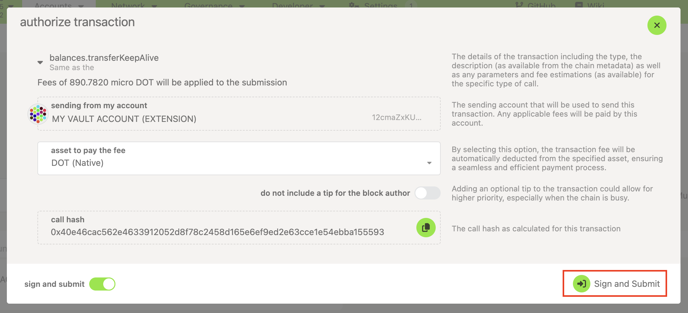
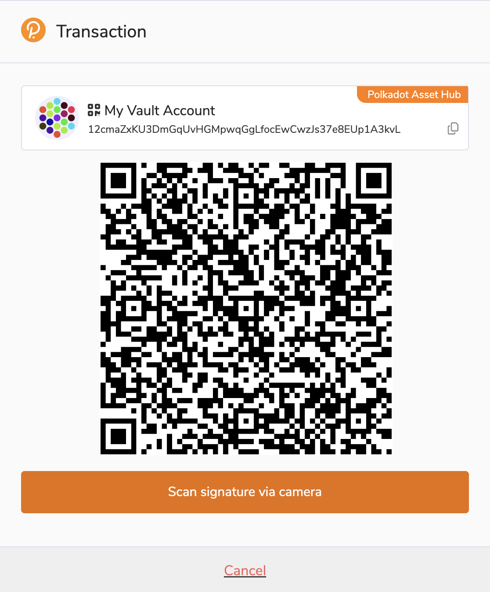
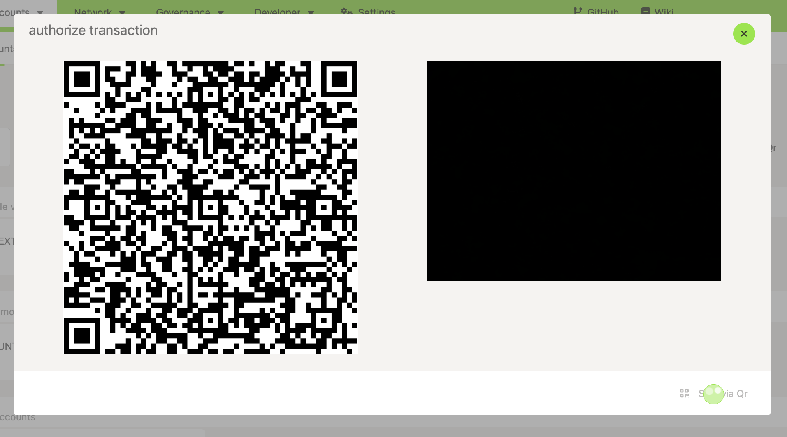
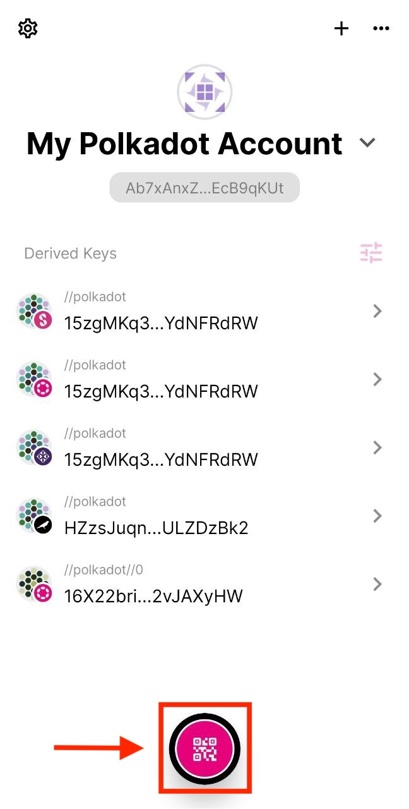
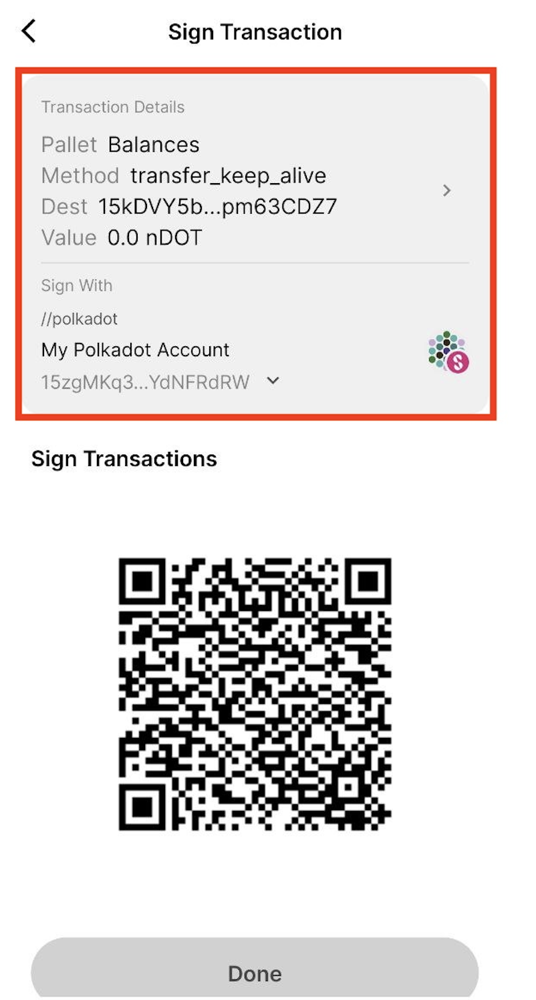
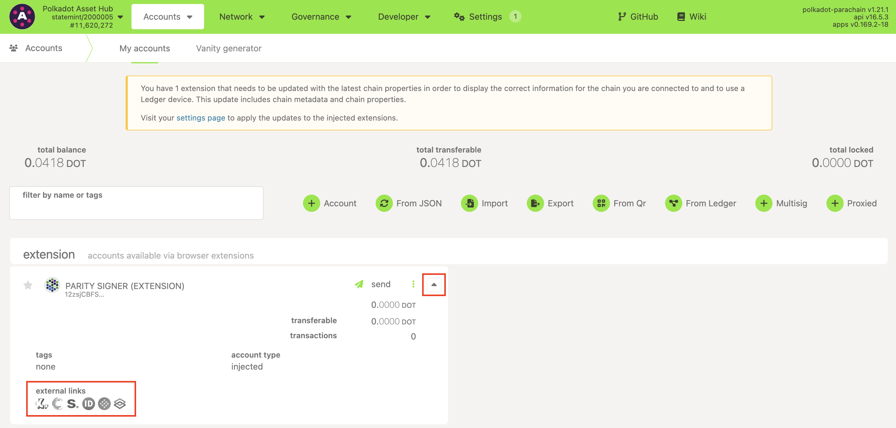
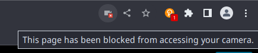
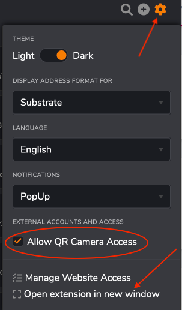
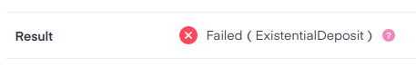
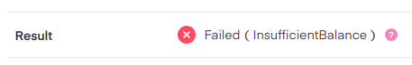

!!!info "Related Wiki page"
    For the underlying concepts, see [Polkadot Vault](../../general/polkadot-vault.md).

Signing is the final step in any transaction, such as [sending funds out of your account](transfer-funds.md). A transaction will not be broadcast to the blockchain until you sign it. You sign a transaction with your private key for your account, proving that you own this account. The signing process, however, depends on what wallet or account manager you use.

### Signing a transaction with Polkadot Vault on Polkadot Developer Interface

When you [create](vault-create-account.md) your accounts in Polkadot Vault, you need a UI to interact with your accounts and initiate transactions.

!!! warning "IMPORTANT"

    For most users, we strongly recommend adding Polkadot Vault accounts in the **[Polkadot Developer Signer](https://paritytech.github.io/polkadot-support/getting-started/basics/polkadot-developer-signer-where-to-download-it)**. Click here to see the instructions.

1. Initiate a transaction on the Polkadot Developer Interface and click "Sign via QR" or "Sign and Submit":

2\. If you have added your Polkadot Vault account through the Polkadot Developer Signer, a new window will pop up, and you will see a QR code. If you have added your Polkadot Vault account directly on the Polkadot Developer Interface, you will see a QR code on the left and a camera screen on the right.

3\. Open your Polkadot Vault app, click the Scanner tab, and scan the QR code you see on your computer.

4. Enter your phone's PIN to sign the transaction. Once you do that, you can see the transaction's information, the account that you signed with, and the QR of the signature. You can click on the transaction information to see all the details.

!!! danger "READ THIS FIRST!"

    Always check the information of the transaction you are about to broadcast to ensure it is the one you intended. Once a transaction is broadcasted, there's no way to take it back!

5\. Now, it's time to present the signed transaction to your computer. If you have added your Polkadot Vault account through the extension, click the "Sign signature via camera" button. Show the QR code to the camera on your computer.

6\. Congratulations, you have signed a transaction! It will be included in the blockchain within a few seconds. You can now open any of the [block explorers](block-explorers.md) to view your transaction:

* * *

### Cannot sign a transaction?

Sometimes it might happen that we cannot sign a transaction. Here are described some of the causes and possible solutions.

#### **The camera doesn't start**

If your camera doesn't start, please allow Polkadot Developer Interface or the extension to use your camera. A pop-up should appear asking for your permission. For the extension, please click on the gear icon and open the extension in a new window first.

If you denied access or accidentally closed the pop-up, click on the camera icon near your URL bar and allow camera access.

However, for the Polkadot Developer Signer to ask permission to use your camera, you first need to enable the option to allow camera access within the extension itself.

1\. Open the extension and click on the gear icon on the top right

2\. Check "Allow QR Camera Access". The first time you do this, you may need to click on "Open the extension in a new window" and do these steps from there.

#### **Cannot scan a QR code**

Please make sure that the whole QR code is visible to the camera. You may need to tilt your device a bit to avoid screen glare.

#### **My transaction failed**

Signing a transaction means that it will be included in the blockchain. However, it doesn't always mean it will be executed. You can check the result of your transaction on a block explorer. Sometimes a transaction cannot be executed, and it fails:

Please check the article "[Why can't I Transfer Tokens?](why-cant-i-transfer-dot.md)" to help you understand why your transaction failed, fix the issue, and send it again.

* * *

If you are a visual learner, here we have a video for you. On mark 14:04, you'll see how you can initiate a transaction and sign it from your Polkadot Vault. Enjoy!

[How to use Polkadot Vault | Technical Explainers](https://www.youtube.com/watch?v=IG_RGLsb2g0&t=844s)

* * *
