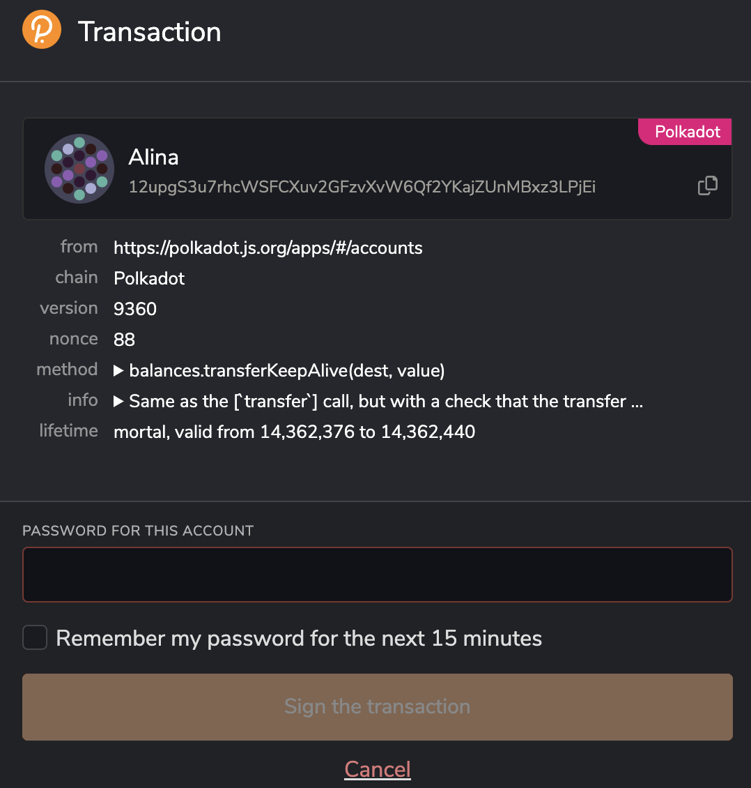
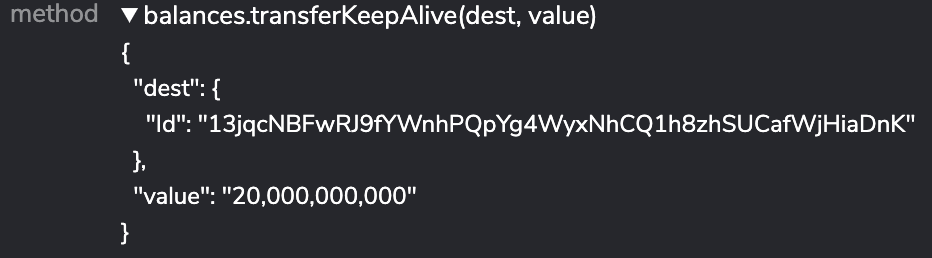
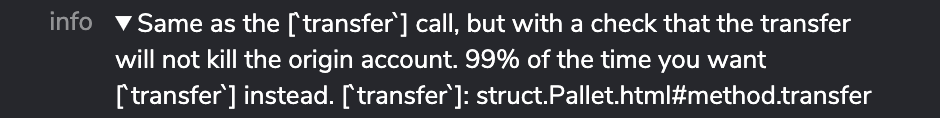
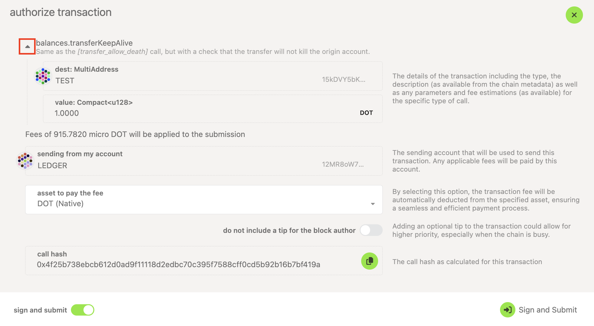
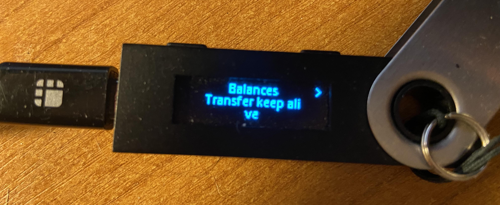
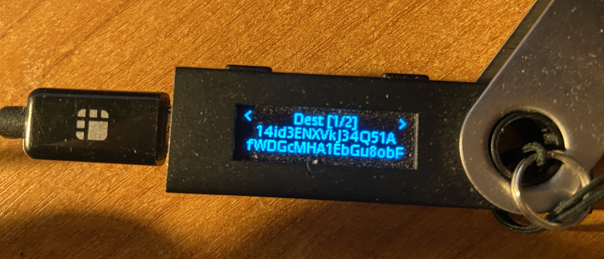
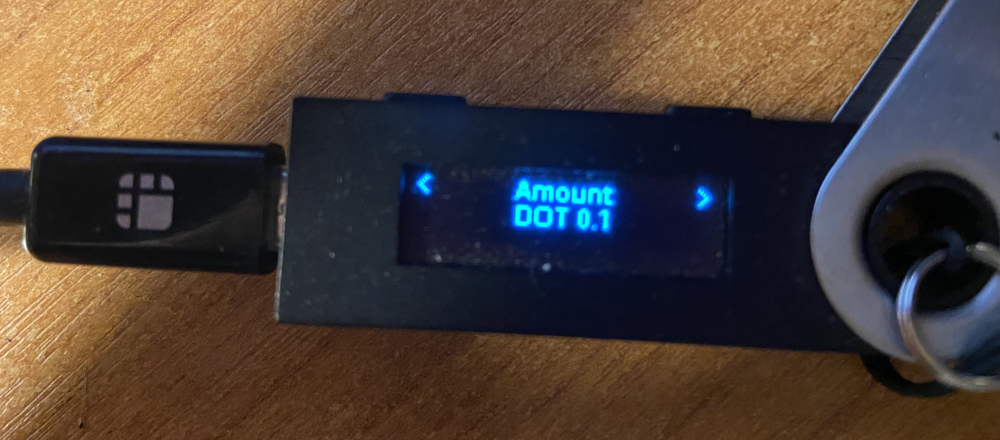
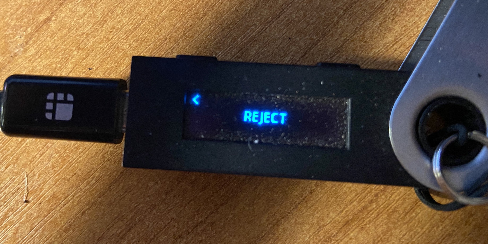

!!!info "Related Wiki page"
    For the underlying concepts, see [Transactions](../learn-transactions.md).

When sending an extrinsic, whether it is to transfer funds or take some other action, verifying the extrinsic's details is always good practice before signing it. Once an extrinsic has been broadcast and added to a block, it is irreversible and too late to correct potential mistakes.

### Verify an extrinsic in the Polkadot Developer Signer

The [Polkadot Developer Signer](signer-where-to-download.md) is your gateway to the Web 3.0 Polkadot ecosystem, as it can connect to many compatible apps and websites. Because of that, it is essential that you verify your extrinsics before signing them, especially when interacting with a new site or app.

When you are about to issue an extrinsic, a pop-up window will appear, asking you to sign the extrinsic with the selected account. In this window, you can see what you are signing. Let's review the window, following from top to down:

1\. **Account icon, name, and address** : the account you are using to issue the extrinsic. If you are making a transfer, this will be the sender.

2\. **From** : the site that requests approval.

3\. **Chain** : the network you are issuing the extrinsic on (Polkadot, Kusama, etc.)

4\. **Version**  and  **Nonce** do not need to be checked every time. The version of the network changes with a runtime upgrade. The nonce changes every time you issue a new extrinsic and will be reset if your account is deactivated.

5\. **Method** : the extrinsic you are about to sign. **It is very important!** Click on the arrow here to see the details and verify them:

In this example, it is a transfer with a "keep-alive" check. In the details, you can see the recipient address and the amount being sent in [Plancks](../learn-DOT.md#the-planck-unit).

6\. **Info** : a short description of the method you are about to use. Click on the arrow to see it:

7\. **Lifetime** : the block range during which the extrinsic is valid and can be included in the chain. In almost all cases, it should be "mortal"; otherwise, the extrinsic can be replayed.

If any details are incorrect, **do not sign the transaction** and click "**Cancel** " instead. You can enter your password and sign the transaction if all the details are correct.

* * *

### Verify an extrinsic in the Polkadot Developer Interface

If you are using the [Polkadot Developer Interface](https://polkadot.js.org/apps/#/accounts), you will see the confirmation window after you enter the extrinsic's details, where you confirm it is what you mean to sign. Click on the arrow next to the extrinsic you are about to sign to see the details:

1\. **Method** : the extrinsic you are about to sign. **It is very important!** Click on the arrow to see the details. You will see a short description of the method you are about to use. In this example, it is a transfer with a "keep-alive" check. In the details, you can see the recipient address, its icon, and the amount being sent in DOT. If the recipient account is in your [address book](accounts-vs-address-book.md) or on the Accounts page, you will also see the name you gave to the recipient account.

2\. **Fees** : the fee you will pay from your remaining transferrable balance for broadcasting this transaction. On Polkadot, it is nominated in [milliDOT](../learn-DOT.md#the-planck-unit).

3\. **Sending from my account** : the account you are using to issue the extrinsic. You can see the account icon, name, and address. If you are making a transfer, this will be the sender.

If any details are incorrect, **do not sign the transaction**  and click the **X button** in the top right corner. You can click "Sign and Submit" if all the details are correct.

* * *

### Verify an extrinsic using Ledger

If you are using a Ledger account, you will see the same details as above, depending on whether you have added your account in the [Polkadot Developer Signer](add-ledger-account-signer.md) or on the [Polkadot Developer Interface](add-ledger-account.md). The difference is that the extrinsic is signed on the Ledger, where you can verify (again) its details.

!!! danger "READ THIS FIRST!"

    If you connected to a phishing site, it might show one extrinsic on the screen, but actually is sending a different one to your Ledger device. The _true_ extrinsic details will be shown on your Ledger device regardless. **Always trust your Ledger device over what is shown on your computer!** The Ledger shows what you are signing!

When you click to sign on the Ledger, the extrinsic details will be shown on the device's screen. Click on the buttons on your device to scroll through them.

1\. First, the extrinsic to be signed is shown. It must match what you see on your computer. The first comes the pallet, then the specific extrinsic. In this example, it is "Balances" and "Transfer keep alive":

2\. In the next screen, you can see the extrinsic details. In this example, it's the destination account:

3\. Next comes the amount involved. In this example, it is the amount to be transferred:

4\. If all the details are correct, you get to approve the extrinsic in the next screen. If the details are not what you expected or what was shown on your computer's screen, **do not approve!** Instead, move to the **next screen** and **reject** the transaction:

* * *

If you are more of a visual type, check this video on the topic:

[How and Why to verify Extrinsics using Polkadot-JS UI, Browser Extension and Ledger Nano](https://www.youtube.com/watch?v=bxMs-9fBtFk)

* * *
