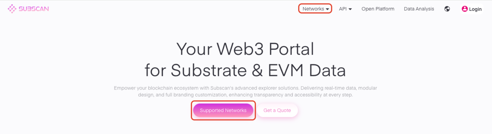
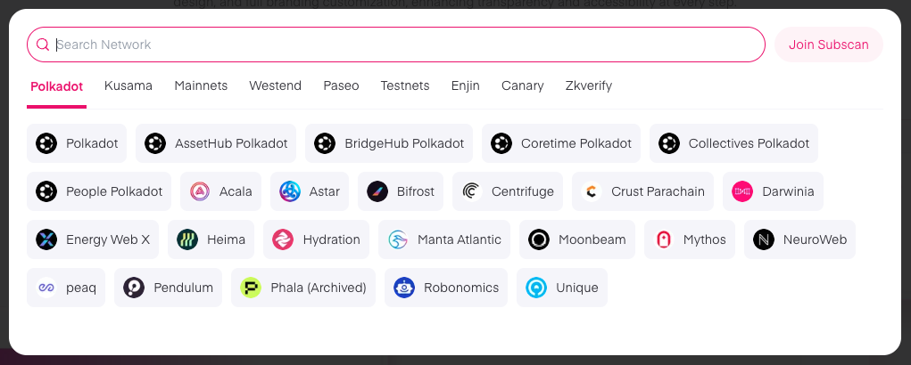
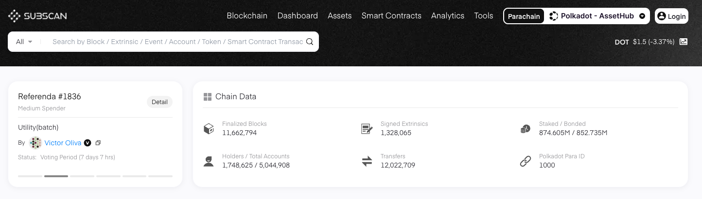
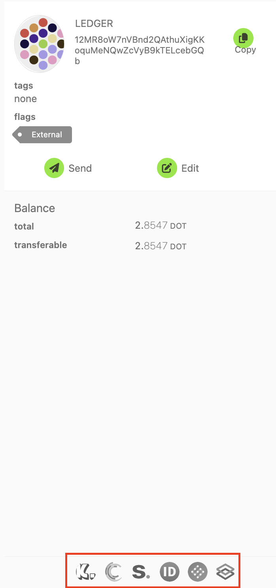
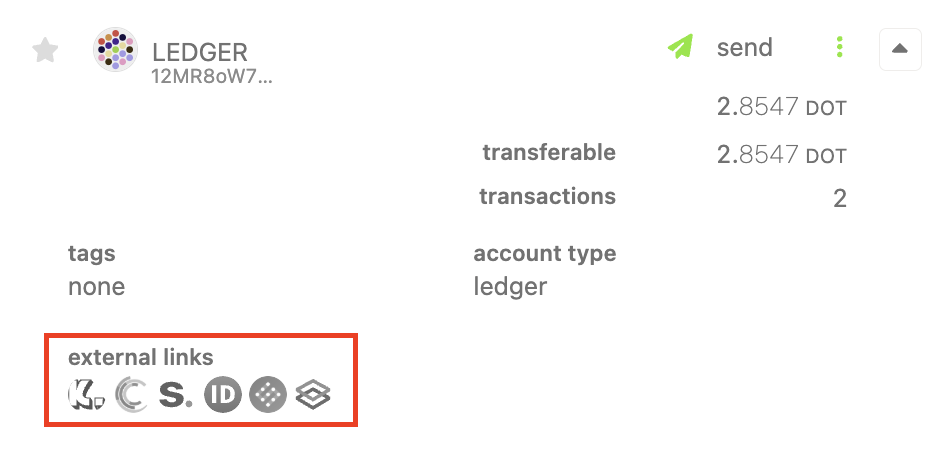
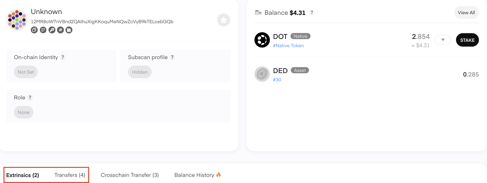

!!!info "Related concepts"
    For the underlying concepts, see [Transactions](../learn-transactions.md).

You can look up your Polkadot (or Kusama) transaction history on block explorers like [Subscan](https://www.subscan.io/). In this article, we will use these two explorers as an example, but there are [more block explorers](block-explorers.md) you can use.

#### **TABLE OF CONTENTS**

  * How to Find Your Account on Block Explorers
* Directly from Block Explorers
* Through Polkadot Developer Interface
  * How to See Your Account History
* On Subscan
* Exporting your transaction history

* * *

### How to Find Your Account on Block Explorers

#### **Directly from Block Explorers**

You can go to the block explorer you want to use directly and find your account there.

On [Subscan](https://www.subscan.io/), you can choose the network by clicking "Supported Networks" or using the "Networks" icon at the top of the screen:

Choose the network among all the available options where you want to review your account:

Once your account has been selected, paste on the search bar your public address:

**Through Polkadot Developer Interface**

You can see your account on a block explorer from your [Accounts](https://polkadot.js.org/apps/#/accounts) page on the Polkadot Developer Interface. There are several block explorers to choose from. You can see the buttons by clicking on your account's name:

Or by clicking the drop-down menu next to your account:

Clicking on any of the block explorer buttons will take you to your account's page on the chosen explorer, displaying the information from the correct network.

* * *

### How to See Your Account History

#### **On Subscan**

By default, the Extrinsics tab will be open, which includes any extrinsics signed from your account (including staking, voting, etc.). Switch to the Transfers tab if you'd like to see only your incoming and outgoing transfers:

#### **Exporting your transaction history**  

If you'd like to view your entire history in a spreadsheet, you can follow [these instructions](export-transaction-history.md) to export your transaction history into .csv format.

* * *
