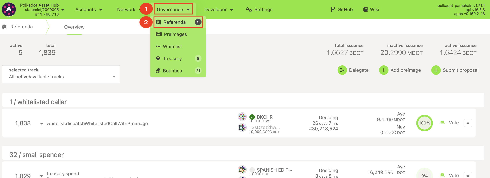
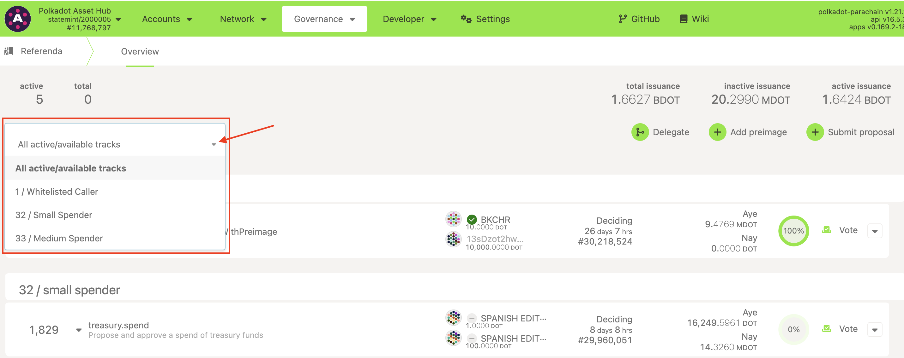
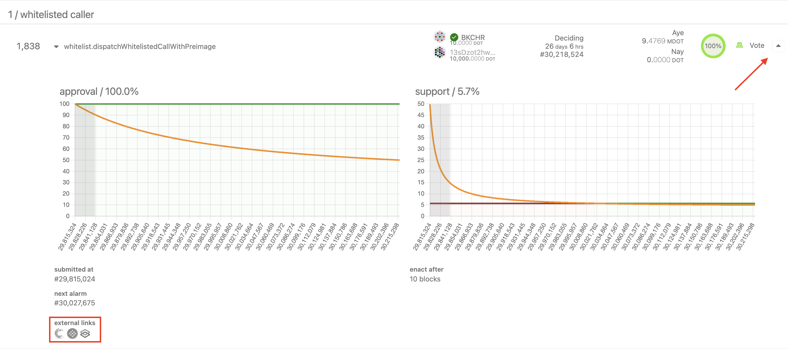
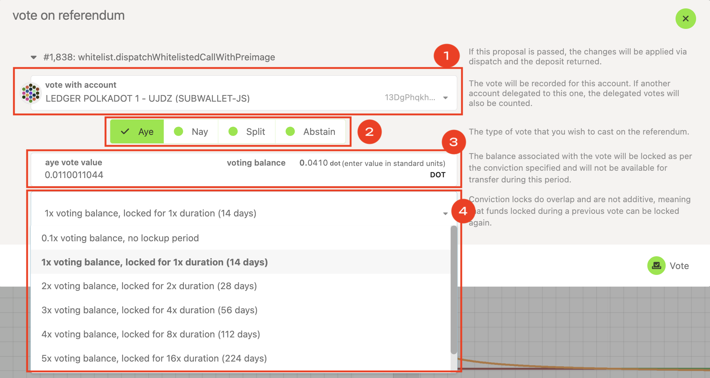

!!!info "Related concepts"
    For the underlying concepts, see [Polkadot OpenGov](../learn-polkadot-opengov.md).

Polkadot and Kusama allow community members to participate and influence decisions through a decentralized voting system. Polkadot governance is a crucial instrument for shaping the direction of the network and ensuring that decisions align with the community's values and goals. This article will explore how to vote in any proposed referendum using the new Polkadot OpenGov system.

!!! danger "READ THIS FIRST!"

    This article describes how to vote using Polkadot Developer Interface. Visit the article "[Polkadot OpenGov: How to Participate](opengov-participate.md)" to learn how to do it from [Subsquare](https://polkadot.subsquare.io/).

### **Tools for Polkadot OpenGov**

Built by the community, several tools allow you to participate in the governance of Polkadot and Kusama. Here is a list of some of them:

  * [Subsquare](https://www.subsquare.io/). It offers a place to discuss and add contextual information to the referenda. It allows commenting on each referendum, and also voting and delegating.
  * [Nova Wallet](https://novawallet.io/). Mobile wallet with extensive tools to facilitate voting and delegating from your own wallet.

* * *

### **Voting on Polkadot Developer Interface**

!!! warning "IMPORTANT"

    Polkadot Developer Interface is a web wallet meant for power users and developers. For everyday use, there are several user-friendly wallets that support a plethora of features and platforms. Discover them in [this article](where-to-store-dot.md).

If you have an account on Polkadot Developer Interface or it is connected to the UI (for example using the Polkadot Developer Signer), you can vote directly on the trusted Polkadot Developer Interface in a few simple steps:

1\. On the Polkadot Developer Interface, go to the ["Governance" > "Referenda"](https://polkadot.js.org/apps/#/referenda) tab.

2\. On this page, you will be presented with a filter for the tracks for which there are active referenda. For information about the different tracks, you can read [this article](../learn-polkadot-opengov.md#origins-and-tracks).

__

3\. For each referendum, information like the index of the referendum, proposer, who made the decision deposit, its status, votes weight in favor or against the referendum, and a voting button are shown. If you click on the rightmost down arrow, you can expand the current status for each ongoing referendum:

The "Approval" graph plots a horizontal line representing the current percentage of voting power (balance multiplied by conviction) voting in favor (ayes) of that referendum.

The "Support" graph represents the percentage of "ayes" plus abstentions out of the total possible number of votes (excluding conviction adjustments) that can be made within the system.

The orange line in both graphs indicates the minimum threshold for approval and support that a referendum must keep to be approved. Each track has different thresholds and conditions to meet. Read [this article](../learn-polkadot-opengov.md#approval-and-support) for further details about these and other parameters in OpenGov.

It's important to notice that each referendum should be accompanied by contextual information about it, but that information isn't stored on-chain, so Polkadot Developer Interface can't show it. You can click on the [Subsquare](https://www.subsquare.io/) icon on each referendum (bottom left corner) to discuss and read further about each referendum. This is the _de facto_ site built by the community where the proposers can share info about their proposals.

4\. By clicking on the "Vote" button, a new panel pops up with the following information:

  * The account you'll be voting from (1).
  * The direction of the vote (2):
* "Aye" in favor of the referendum.
* "Nay," against it.
* "Split," you can split your voting power into both options.
* "Abstain," your vote will count for the referendum support (total voting balance) but not for its approval (voting power ratio of "Ayes" or "Nays").
  * The voting balance (3). The amount of DOT (or KSM) you'll vote with. If you're voting from a delegate account, the delegated voting power won’t be visible here, but it will be taken into account for the referendum result.

  * The conviction you're voting with (4). It's a multiplier to your voting balance, so these two determine your "voting power." The greater the conviction, the greater your voting power and the longer the tokens will be locked for that referendum. Learn more about "conviction locking" in the article "[Voluntary Locking](../learn-polkadot-opengov.md#voluntary-locking-conviction-voting)."

!!! tip "GOOD TO KNOW"

    Locks applied to your assets overlap. It means that with the same locked balance you could vote on several referenda at the same time.

    Read the [article](../learn-account-balances.md) for further information of types of balances.

5\. After setting your vote, click on "Vote." Review the transaction details on the new panel and click "Sign and Submit." And that's it, you just voted on a referendum.

!!! info

    If you want to participate in Polkadot OpenGov but you either don't have time to review all the referenda or you think other people can be more knowledgeable than you about certain topics, you can delegate your voting power to trusted members.

    Learn how to do it in the article "[Polkadot OpenGov: How to Delegate your Voting Power](delegate-voting-power.md)."

* * *

### **Discussion channels**

The [Kusama Direction](https://matrix.to/#/#Kusama-Direction:parity.io) and [Polkadot Direction](https://matrix.to/#/#Polkadot-Direction:parity.io) channels on Matrix are dedicated to discussions and announcements related to governance. If you have an interest in participating in governance or staying up-to-date with the latest referenda, consider joining these channels and engaging in the discussions happening there.

* * *
