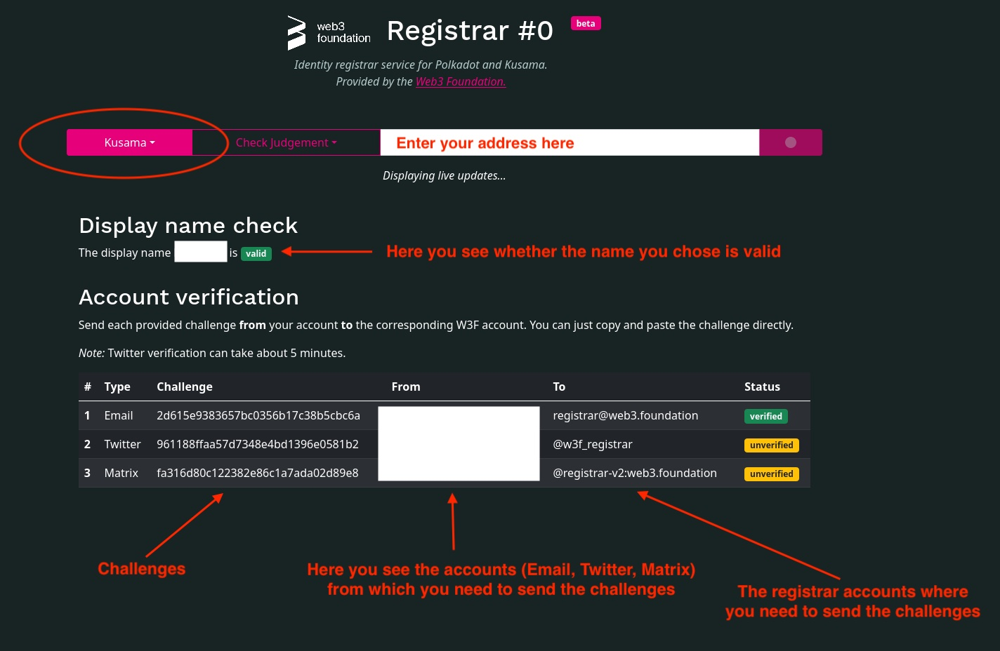
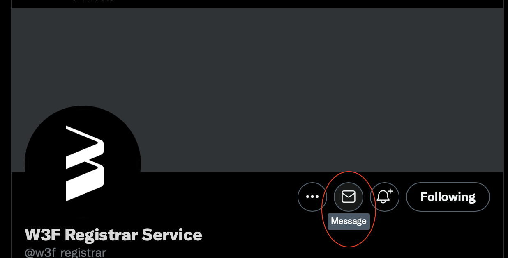
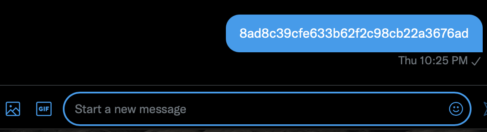
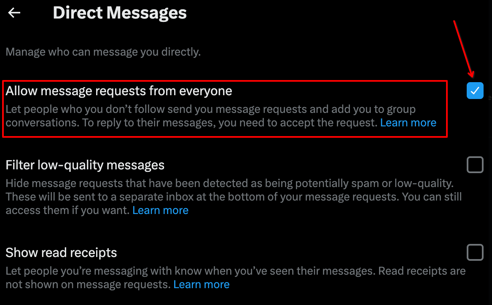
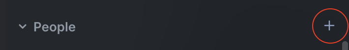
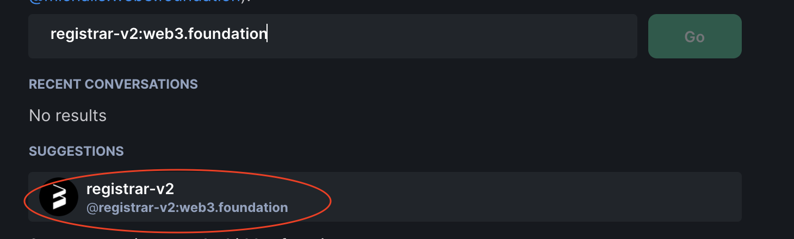
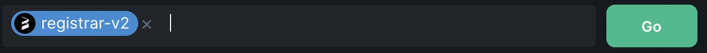

!!!info "Related Wiki page"
    For the underlying concepts, see [Identity](../learn-identity.md).

!!! danger "READ THIS FIRST!"

    Starting from April 1st, 2024, Web3 Foundation's Registrar (Registrar Index 0) **will no longer accept judgement requests**.

    This change won't affect identities already judged by the registrar before this date. For new identity judgments, please utilize the other registrars:

    [Polkadot Wiki: Registrars](../learn-identity.md#registrars)

If you [requested judgement](../learn-identity.md#judgements) for your on-chain identity through the Web3 Foundation Registrar you'll need to follow some automated steps to complete the judgement process.

!!! warning "IMPORTANT"

    The automated process supports only the _**e**_ _**mail** , **twitter**_ and _**riot (element)** **name**_ fields in the on-chain identity. If you filled out any other fields, you'll need to email **[registrar-support@web3.foundation](mailto:registrar-support@web3.foundation)** to complete the verification of these fields manually.

### How to complete the automated judgement process

1\. After you've requested judgement for your on-chain identity go to the [W3F Registrar page](https://registrar.web3.foundation).

2\. Select Polkadot or Kusama on the left, depending on whether you requested judgement for a Polkadot or Kusama account.

3\. Enter the address of the account you requested judgement for in the text field.

4\. The page will populate with the challenge and verification status for each field, like in the example below. The statuses update automatically, there's no need to refresh the page.

5\. As you complete each challenge the status will change from "unverified" to "verified". Once all challenges have been completed, _including any manual ones_, after a few minutes you'll see the green checkmark next to your on-chain identity.

* * *

#### **Email verification**

1\. Send **just** the challenge to **[registrar@web3.foundation](mailto:registrar@web3.foundation)**. There's no need to enter an email subject.

2\. You will receive a response with a new challenge.

3\. Copy **just** the challenge and paste it in the text field that will have replaced the registrar email.

#### **Twitter verification**

1\. Visit the [registrar's profile](https://twitter.com/w3f_registrar) on Twitter.

2\. Click on the envelope to send a direct message:

3\. Copy and paste the challenge into the direct message:

!!! warning "IMPORTANT"

    If you're having trouble sending a direct message to the registrar's Twitter profile, make sure to temporarily enable the setting that allows message requests from anyone. You can find this option in the screenshot below. Once you've reached the registrar, you can change it back.

    
    

!!! tip "GOOD TO KNOW"

    Twitter verification can take a few minutes

#### **Matrix (Element) verification**

1\. Open Element and click on the plus (+) icon next to "People":

2\. Search for **registrar-v2:web3.foundation** and click on the suggested result:

3\. Then click on "Go":

4\. This will open a private chat with the registrar bot. Copy and paste your challenge and hit Enter.

* * *
