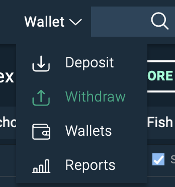
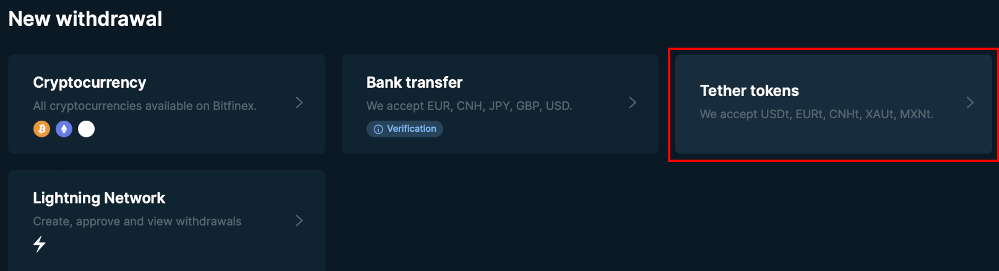
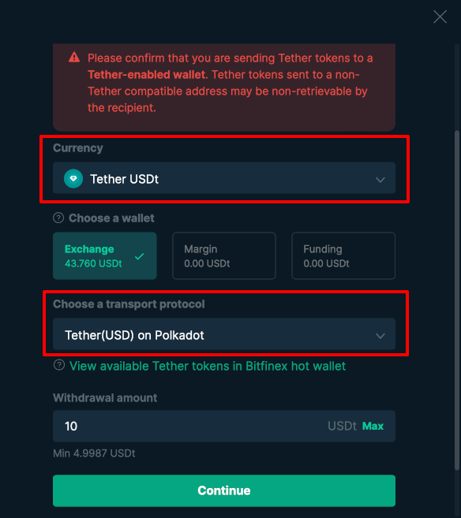
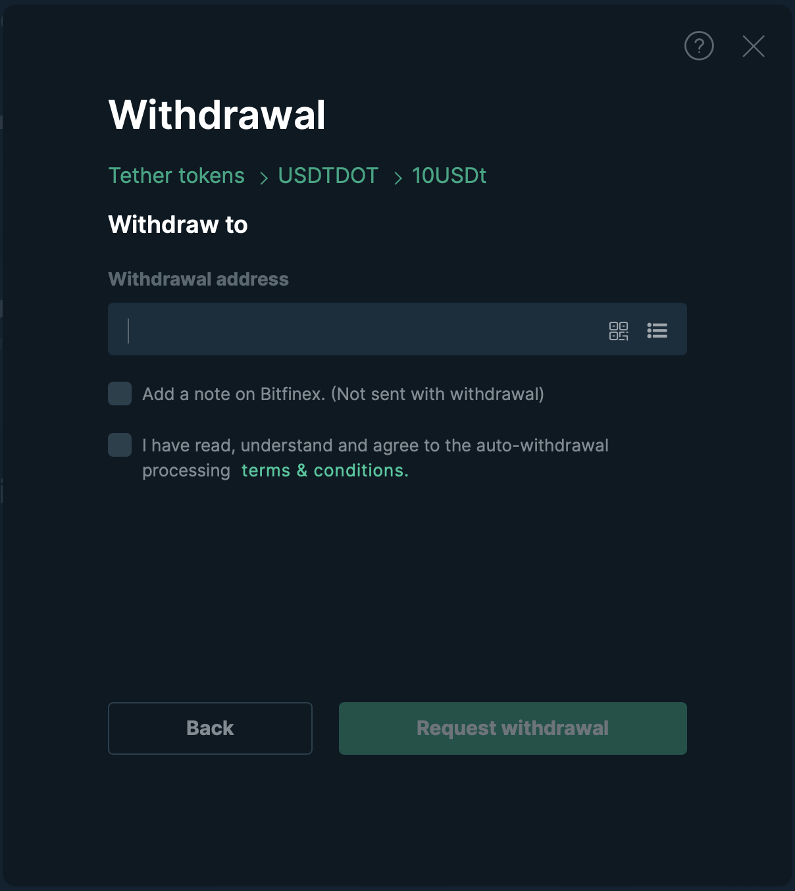
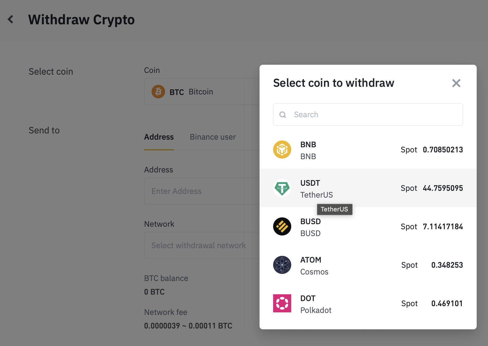
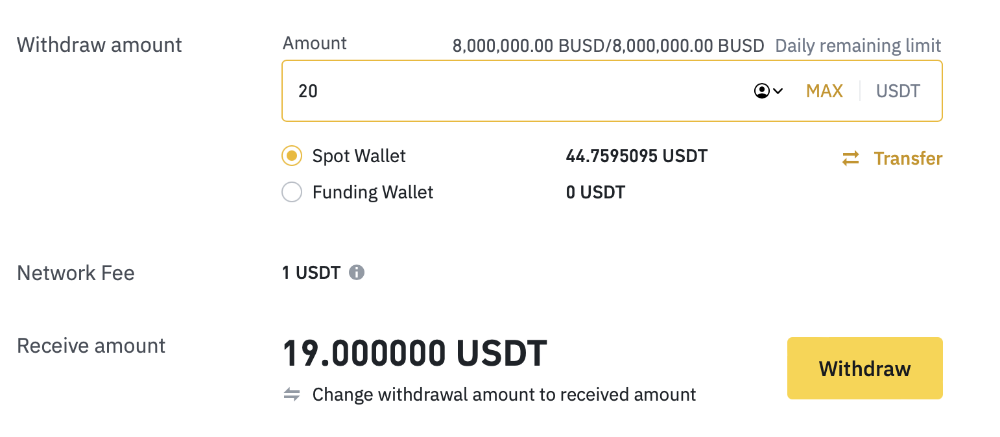

!!!info "Related Wiki page"
    For the underlying concepts, see [Asset Hub](../learn-assets.md).

In this article, you'll learn how to withdraw USDT from centralized exchanges to your account on Polkadot Asset Hub or Kusama Asset Hub. By using USDT on the Asset Hubs, you can take advantage of the extremely low fees needed to send assets on both networks.

!!! warning "ATTENTION"

    Tether, the entity behind USDT, [has announced the discontinuation of USDT on the Kusama network](https://tether.to/en/tether-makes-strategic-transition-to-meet-community-demands-and-foster-innovation) (though it'll still be available on Polkadot).

    It's recommended that you redeem your USDT from Kusama Asset Hub (formerly Statemine) by sending them to an exchange before the specified deadline mentioned in Tether's official announcement.

Bitfinex and Binance are provided as examples, but other exchanges might offer USDT on the Asset Hubs in the future, with similar processes to withdraw.

!!! tip "GOOD TO KNOW"

    The format of a Polkadot Asset Hub address is the same as a Polkadot address. This means that you can use your Polkadot address to send or receive funds on the Polkadot Asset Hub.

    The same applies to the Kusama Asset Hub. The address for the Kusama Asset Hub is the same as your Kusama address.

### How to withdraw USDT from Bitfinex

Bitfinex offers USDT withdrawals both on Kusama Asset Hub and on Polkadot Asset Hub.

1\. First, log in to your Bitfinex account.

2\. Click on "Wallet" on the top right and select "Withdraw":

3\. From the "New withdrawal" panel, select "Tether tokens":

4\. On the new screen that opens up:

  * Ensure that "Tether USDt" is selected as "Currency"
  * Select one of your wallets (Exchange, Margin, or Funding) where you have USDt balance
  * Choose either "Tether(USD) on Polkadot" or "Tether(USD) on Kusama" as the "Transport protocol," depending if your recipient address is a Polkadot Asset Hub or a Kusama Asset Hub, respectively.
  * Then, type the amount you wish to withdraw and click on "Continue":

5\. Copy your Polkadot Asset Hub (former Statemint) or Kusama Asset Hub (former Statemine) address from your wallet (remember that it's the same as your Polkadot and Kusama address, respectively) and paste it into the address field. **Double-check** that it's the correct account address:

6\. Acknowledge that you've read and understood the conditions, and then click the "Request Withdrawal" button.

7\. After you go through Bitfinex's security checks, your withdrawal will be processed in a few minutes, and you'll see your USDT in your Polkadot Asset Hub or Kusama Asset Hub account!

!!! tip "GOOD TO KNOW"

    Check the balance of your Asset Hub address from one of the suitable block explorers listed in our article "[What Block Explorers Can I Use for the Polkadot and Kusama Ecosystems?](block-explorers.md)"

* * *

### How to withdraw USDT from Binance

Currently, Binance only offers withdrawals on Polkadot Asset Hub (former Statemint).

1\. Login into your Binance account.

2\. From the top section, select "Withdraw Crypto."

3\. Select "USDT TetherUS" on the new screen as the coin to withdraw:

4\. Now, from the "Send to" section, select "Statemint (Polkadot)" from the withdrawal network drop-down menu. Note that the network's name might be updated in the future and appear as "Polkadot Asset Hub."

!!! danger "READ THIS FIRST!"

    Some wallets, such as Trust Wallet, Exodus, and "Crypto.com Onchain Wallet", do not support the Polkadot Asset Hub yet.

    Before sending any funds, please make sure the destination wallet is compatible with Polkadot Asset Hub to avoid potential issues.

5\. Copy your Polkadot Asset Hub (former Statemint) address from your wallet (remember it's the same as your Polkadot address) and paste it into the address field. **Double-check** that it's the correct account address.

!!! tip "GOOD TO KNOW"

    If you paste a valid Polkadot address in the address field, Binance will automatically select the correct network.

6\. Check that everything is correct and type the amount you want to withdraw from your desired Binance wallet:

7\. Click on "Withdraw" and that's it. Your withdrawal should be processed by Binance and your funds will reach your address in a few minutes!

* * *

In this article, you learned how to withdraw Tether (USDT) from an exchange account. If you want to send USDT tokens from your account on one of the Asset Hubs to another account, check out [this article](transfer-usdt.md).

* * *
