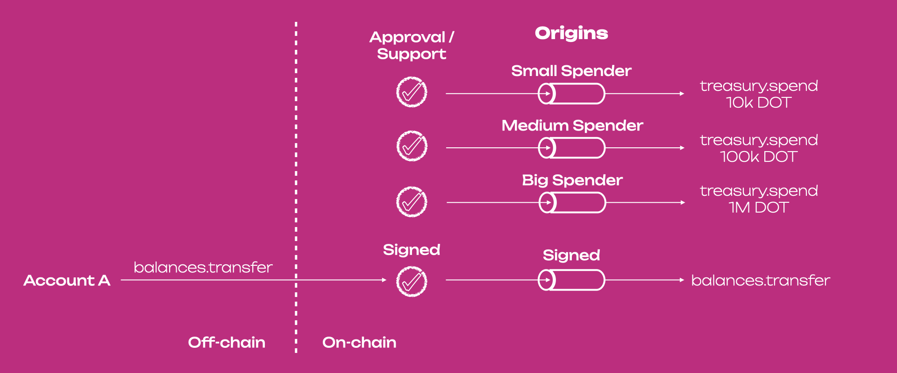

## Your Keys, Your Responsibility

Account abstraction addresses the challenges of managing cryptographic keys representing accounts on
blockchains. Accounts on blockchains represent entities, from an individual's identity to an
institution. In [Web3](../general/web3-and-polkadot.md), you digitally sign any transaction or, more
generally, any message using your private key. Data is recorded on a public ledger (usually
blockchain-based) whose multiple copies of it are stored in computers participating in a P2P
network.

While the account’s private keys grant users control and ownership, losing them results in losing
access to digital assets and fragmentation of your digital identity since you will need to create a
new account with a new set of keys. This poses a hurdle for both users and developers regarding
security and adoption.

## Definition of Account Abstraction

The concept of account _abstraction_ was first mentioned via Ethereum's
[EIP-4337](https://eips.ethereum.org/EIPS/eip-4337) focused on allowing users to flexibly program
more security and better user experiences into their accounts. The idea also aims to separate the
user experience from the private key, enabling a piece of code to dictate account behavior. This
allows for increased flexibility of accounts that originally were not engineered to be flexible and
decreased chances of key mismanagement.

Users are still responsible for their keys, but through account abstraction, they can take
precautions to ensure they do not end up losing their accounts.

Account abstraction introduces a layer of on-chain logic that controls an account, typically in the
form of a smart contract, that completely avoids the need for consensus-layer protocol changes.
Without a smart contract, abstracting accounts would require changes in the core architecture of the
protocol.

Polkadot's generic codebase makes the concept of an account natively flexible and abstract without
the direct need for smart contracts.

## Origin Abstraction in Polkadot

Adopting a generic design is crucial in scaling [Web3](../general/web3-and-polkadot.md)
technologies. Abstraction and generalization of protocols are essential to improving user experience
and security in blockchain adoption.

When users interact with a blockchain they call _dispatchable_ functions to do something. Because
those functions are called from the outside of the blockchain interface, in Polkadot's terms any
action that involves a dispatchable function is an [extrinsic](./learn-transactions.md). Extrinsics
are calls coming from the _outside_ of the blockchain interface that (if successfully executed)
invoke some changes in the _inside_ of the blockchain's state. An extrinsic is always directed to a
specific function within a particular [pallet](../general/glossary.md#pallet).

For example, the `balances.transferKeepAlive` extrinsic is directed to the `transferKeepAlive`
function within the `balances` pallet. If successful, the execution of that function will transfer
funds between two accounts, changing the balances of those accounts and thus the chain state (as
accounts hold some state within the blockchain).

In [Substrate](../general/glossary.md#substrate)'s FRAME, functions are not necessarily called by
accounts. Functions can be called by any origin, where origins are caller-personas associated with
privilege levels. For example, the Polkadot [OpenGov](./learn-polkadot-opengov.md) has different
origins with different privileges, such as allocating treasury funds, cancelling a referendum, etc.
Neither of those origins is subservient to the concept of an account or assume anything about state
or associated data. Custom origins can be created while designing your chain using the Substrate
(which is part of the [Polkadot SDK](https://github.com/paritytech/polkadot-sdk)).

The figure below shows Polkadot's origin abstraction. Accounts happen to be just one variant (or
corner case) of Substrate's FRAME possible origins, the `frame_system::RawOrigin::Signed`. OpenGov
origins function in a way that, if conditions (approval and support) are met and a proposal passes,
the appropriate
[origin is then associated with the scheduled call](https://github.com/paritytech/polkadot-sdk/blob/1835c091c42456e8df3ecbf0a94b7b88c395f623/substrate/frame/referenda/src/lib.rs#L884).
Those origins are caller-personas that do not have any entity behind them, and do not hold any state
on chain.

In Substrate, the concept of account is completely deprioritized. Substrate itself remains
indifferent to an account's balance and nonce. While FRAME can support their presence, it
fundamentally does not need to rely on them.

The [Cross-Consensus Messaging (XCM)](./learn-xcm.md) format can take advantage of origin
abstraction for cross-consensus communications by specifying the context for a particular message.
Origins in this case imply the authority under which a message is being sent (and thereby,
executed).

On a lower level, the XCM format also provides a much powerful origin abstraction that allows
calling personas that are so abstract to not necessarily have direct representation on the local
chain within its FRAME system origin.

### Protocol-level Account Abstraction

While the [Substrate FRAME system](https://docs.polkadot.com/develop/parachains/intro-polkadot-sdk/#frame) does not have
a single pallet (module) for complete account abstraction, it incorporates various pallets that
collectively achieve similar functionalities. Polkadot's native account abstraction functionalities
include:

- [Multi-signature accounts](./learn-account-multisig.md) to control an account using different ones
- [Proxy accounts](./learn-proxies.md) for role-based representation, and ownership representation
  through [pure proxies](./learn-proxies.md)
- [Derivative accounts](./learn-account-advanced.md#derivation-paths) for using the same _parent_
  private key on multiple _children_ accounts
- Account recovery mechanisms such as social recovery to help regain access to your key using
  trusted third-party accounts
- [Batching functionality](./learn-guides-transfers.md#batch-transfers-with-the-polkadot-js-ui) to
  submit multiple calls in one single transaction
- Payments with non-native tokens

All the above can be used together, meaning that, for example, you can create a multi-signature
account of pure proxies to keep the same multi-signature account when signatories change. A more
complex combination to build a hot wallet can be found in this
[blog post](https://www.parity.io/blog/building-a-hot-wallet-with-substrate-primitives/).

Additionally, developers have the flexibility to design their own rules for abstraction.

In the Substrate FRAME system, accounts are represented by Accounts IDs. Such unique identifiers can
be any 32-byte number and are not limited to just a public key (with a corresponding private key).
For example, multi-signature accounts do not have a private key, and their Account ID is built with
hashed information from signatories’ public keys and the multisig threshold.

### Smart-contract Level Account Abstraction

Account abstraction can be implemented in parachains also with traditional smart-contracts for
example using the [ink!](../build/build-smart-contracts.md#ink) smart contract language.

## Further Readings

- [Hackernoon Article](https://hackernoon.com/abstracting-away-account-abstraction-on-polkadot) by
  [Bader Youssef](../general/contributors.md#bader-youssef) - "Abstracting Away Account Abstraction
  on Polkadot"
- [Parity Blog Post](https://www.parity.io/blog/building-a-hot-wallet-with-substrate-primitives/) by
  Joe Petrowski - "Building a Hot Wallet with Substrate Primitives"
- [FRAME Origin - Polkadot-SDK Docs](https://paritytech.github.io/polkadot-sdk/master/polkadot_sdk_docs/reference_docs/frame_origin/index.html)
