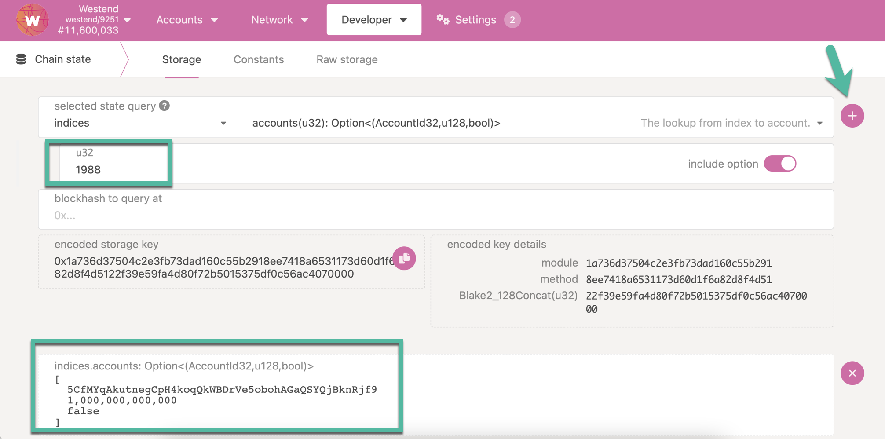

import RPC from "./../../components/RPC-Connection";

## Address Format

The address format used in Substrate-based chains is SS58. SS58 is a modification of Base-58-check
from Bitcoin with some minor changes. Notably, the format contains an _address type_ prefix that
identifies an address as belonging to a specific network.

For example:

- Polkadot addresses **always start with** the number **1**.
- Kusama addresses always start with a capital letter, such as **C D, F, G, H, J**.
- Generic Substrate addresses **always start with** the number **5**.

These prefixes, including how to validate addresses, are embedded in the Substrate SS58 format.
Never use regular expressions for address validation.

It's important to understand that different network formats are **merely other representations of
the same public key in a private-public keypair** generated by an address generation tool. As a
result, the addresses across Substrate-based chains are compatible as long as the format is
converted correctly.

As of Runtime 28, the default [address format](learn-accounts.md##address-format) is the
[`MultiAddress`](https://github.com/paritytech/substrate/blob/master/primitives/runtime/src/multiaddress.rs)
type.

This `enum` is a multi-format address wrapper for on-chain accounts and allows us to describe
Polkadot's default address format to represent many different address types. This includes **20
byte**, **32 byte**, and **arbitrary raw byte** variants. It also allows an enhancement to the
original [`indices`](learn-accounts.md#indices) lookup.

:::info

Many wallets allow you to convert between formats. Stand-alone tools exist as well; you can find
them in the [address conversion tools](#address-conversion-tools) section.

:::

## Derivation Paths

If you would like to create and manage several accounts on the network using the same seed, you can
use derivation paths. We can think of the derived accounts as child accounts of the root account
created using the original mnemonic seed phrase. Many
{{ polkadot: Polkadot :polkadot }}{{ kusama: Kusama :kusama }} key generation tools support hard and
soft derivation. For instance, if you intend to create an account to be used on the
{{ polkadot: Polkadot :polkadot }}{{ kusama: Kusama :kusama }} chain, you can derive a **hard key**
child account using **//** after the mnemonic phrase.

```
'caution juice atom organ advance problem want pledge someone senior holiday very//0'
```

and a **soft key** child account using **/** after the mnemonic phrase

```
'caution juice atom organ advance problem want pledge someone senior holiday very/0'
```

If you would like to create another account for using the Polkadot chain using the same seed, you
can change the number at the end of the string above. For example, `/1`, `/2`, and `/3` will create
different derived accounts.

You can use any letters or numbers in the derivation path as long as they make sense to you; they do
not have to follow any specific pattern. You may combine multiple derivations in your path, as well.
For instance, `//bill//account//1` and `//john/polkadot/initial` are both valid. To recreate a
derived account, you must know both the seed and the derivation path, so you should either use a
well-defined sequence (e.g. //0, //1, //2...) or be sure to write down any derivation paths you use.

:::info

It is not possible to generate a derived account without also knowing the derivation path.

:::

There is an additional type of derivation called password derivation. On Polkadot you can derive a
**password key** account using **///** after the mnemonic phrase

```
'caution juice atom organ advance problem want pledge someone senior holiday very///0'
```

In this type of derivation, if the mnemonic phrase would leak, accounts cannot be derived without
the initial password. In fact, for soft- and hard-derived accounts, if someone knows the mnemonic
phrase and the derivation path, they will have access to your account. For password-derived
accounts, the password is applied on the derivation path. You can know the mnemonic phrase and the
derivation path, but without the password it is not possible to access the account. In mathematical
terms, if we have a `written derivation path` and a `password`, we can calculate the
`real derivation path` as `f(written derivation path, password)`; where `f` is a function. We can
then calculate the `account key pair` using `f(seed, real derivation path)`. Note that unlike hard
and soft derivations that can be mixed, only a single password should be specified per derivation.

:::info

Password-derived account are as secure as the chosen password.

:::

### Soft vs. Hard Derivation

A soft derivation allows someone to potentially "go backwards" to figure out the initial account's
private key if they know the derived account's private key. It is also possible to determine that
different accounts generated from the same seed are linked to that seed. A hard derivation path does
not allow either of these - even if you know a derived private key, it's not feasible to figure out
the private key of the root address, and it's impossible to prove that the first account is linked
with the second. These derivation methods have their use cases, given that the private keys for all
the derived accounts are fully secure. Unless you have a specific need for a soft derivation, it is
recommended to generate the account using a hard derivation path.

See the [Subkey documentation](https://docs.substrate.io/reference/command-line-tools/subkey/) for
details and examples of derivation path formats. The Polkadot-JS Apps and Extension and Parity
Signer support custom derivation paths using the same syntax as Subkey.

Some wallets will automatically add derivation paths to the end of the generated mnemonic phrase.
This will generate separate seeds for separate paths, allowing separate signing keys with the same
mnemonic, e.g. `<mnemonic phrase>//polkadot` and `<mnemonic phrase>//kusama`. Although you may
correctly save the mnemonic phrase, using it in another wallet will not generate the same addresses
unless both wallets use the same derivation paths.

Polkadot and Kusama both have paths registered in the
[BIP44 registry](https://github.com/satoshilabs/slips/blob/master/slip-0044.md).

:::warning

You must have both the _parent_ private key and the derivation path to arrive at the key for an
address. Do not use custom derivation paths unless you are comfortable with your understanding of
this topic.

:::

## For the Curious: How Prefixes Work

The [SS58 document](<https://github.com/paritytech/substrate/wiki/External-Address-Format-(SS58)>)
states that:

- Polkadot has an address type of `00000000b`, so `0` is in decimal.
- Kusama (Polkadot Canary) has an address type of `00000010b`, so `2` is in decimal.
- Generic Substrate has `00101010b` as the address type, `42` is in decimal.

Because the `Base58-check` alphabet has no number 0, the lowest value is indeed 1. So `00000000b` is
1 in Base58-check. If we try to
[decode](https://www.better-converter.com/Encoders-Decoders/Base58Check-to-Hexadecimal-Decoder) a
Polkadot address like `1FRMM8PEiWXYax7rpS6X4XZX1aAAxSWx1CrKTyrVYhV24fg`, the result is
`000aff6865635ae11013a83835c019d44ec3f865145943f487ae82a8e7bed3a66b29d7`. The first byte is `00`,
which is indeed `00000000` in binary and `0` in decimal and thus matches the address type of
Polkadot.

Let's take a look at Substrate addresses. If we decode
`5CK8D1sKNwF473wbuBP6NuhQfPaWUetNsWUNAAzVwTfxqjfr`, we get
`2a0aff6865635ae11013a83835c019d44ec3f865145943f487ae82a8e7bed3a66b77e5`. The first byte is `2a`
which when
[converted from hex to decimal](https://www.rapidtables.com/convert/number/hex-to-decimal.html)
is 42. 42 is `00101010` in binary, just as the SS58 document states.

Finally, let's look at Kusama addresses. Decoding `CpjsLDC1JFyrhm3ftC9Gs4QoyrkHKhZKtK7YqGTRFtTafgp`
gives us `020aff6865635ae11013a83835c019d44ec3f865145943f487ae82a8e7bed3a66b0985` with the first
byte being `02`, just as specified. If we try a Kusama address that starts with a completely
different letter, like `J4iggBtsWsb61RemU2TDWDXTNHqHNfBSAkGvVZBtn1AJV1a`, we still get `02` as the
first byte: `02f2d606a67f58fa0b3ad2b556195a0ef905676efd4e3ec62f8fa1b8461355f1142509`. It seems
counterintuitive that some addresses always have the same prefix and others like Kusama can vary
wildly, but it's just a quirk of Base58-check encoding.

## Portability

The above information brings us to portability: the ability to use a mnemonic phrase or seed across
multiple wallets. Portability depends on several factors:

- Derivation path
- Mnemonic format
- Seed derivation
- Signature scheme

If you want to use the exact mnemonic across multiple wallets, make sure that they follow compatible
methods for generating keys and signing messages. If you cannot find understandable documentation,
reach out to the project maintainers.

|                         | Mnemonic Format | Derivation Path | Seed Derivation |      Signature Support      |
| :---------------------- | :-------------: | :-------------: | :-------------: | :-------------------------: |
| Polkadot{.js} Extension |    Standard     |  User-Defined   |      BIP32      |           sr25519           |
| Polkadot-JS Apps        |   Standard\*    |  User-Defined   |      BIP32      | sr25519, ed25519, secp256k  |
| Ledger                  |      BIP39      |  BIP44&dagger;  |  BIP32&Dagger;  |        ed25519&sect;        |
| Subkey                  |   Standard\*    |  User-Defined   |      BIP32      | sr25519, ed25519, secp256k1 |

\* Ed25519 keys have [limited compatibility](https://github.com/paritytech/substrate-bip39) with
BIP39.

&dagger; [BIP44 Registry](https://github.com/satoshilabs/slips/blob/master/slip-0044.md)

&Dagger; Ed25519 and BIP32 based on
[Khovratovich](https://github.com/LedgerHQ/orakolo/blob/master/papers/Ed25519_BIP%20Final.pdf)

&sect; Sr25519 planned

## Address Conversion Tools

You can use the tools below to convert any SS58 address for any network for use on different
networks

- [handy subscan tool](https://polkadot.subscan.io/tools/ss58_transform)
- [simple address converter](https://polkadot-address-convertor.netlify.app/)

### How to Verify a Public Key's Associated Address

You can verify your public key's associated address through a series of inspection steps, where the
key is a base-16 (hexadecimal) address.

#### Using Subkey to Retrieve Public Key from SS58 Address

This is to showcase that the **SS58 address is based on the public key (aka "Account ID")**

The Subkey Tool's The
[Inspecting Keys](https://docs.substrate.io/reference/command-line-tools/subkey/#inspecting-keys)
section explains how to use the `inspect` command to recalculate your key pair's public key and
address.

Start by inspecting your account's Polkadot address by running the inspect command against your
account's address:

```bash
$ subkey inspect 1a1LcBX6hGPKg5aQ6DXZpAHCCzWjckhea4sz3P1PvL3oc4F

Public Key URI `1a1LcBX6hGPKg5aQ6DXZpAHCCzWjckhea4sz3P1PvL3oc4F` is account:
  Network ID/version: polkadot
  Public key (hex):   0x192c3c7e5789b461fbf1c7f614ba5eed0b22efc507cda60a5e7fda8e046bcdce
  Account ID:         0x192c3c7e5789b461fbf1c7f614ba5eed0b22efc507cda60a5e7fda8e046bcdce
  SS58 Address:       1a1LcBX6hGPKg5aQ6DXZpAHCCzWjckhea4sz3P1PvL3oc4F
```

Take note of the hexadecimal string for "Public key (hex)". This is your account's public key.

Running the `inspect` command on your public key along with the `--public` parameter the SS58
address for the default network (substrate) is returned.

```bash
$ subkey inspect --public 0x192c3c7e5789b461fbf1c7f614ba5eed0b22efc507cda60a5e7fda8e046bcdce

Network ID/version: substrate
  Public key (hex):   0x192c3c7e5789b461fbf1c7f614ba5eed0b22efc507cda60a5e7fda8e046bcdce
  Account ID:         0x192c3c7e5789b461fbf1c7f614ba5eed0b22efc507cda60a5e7fda8e046bcdce
  Public key (SS58):  5CdiCGvTEuzut954STAXRfL8Lazs3KCZa5LPpkPeqqJXdTHp
  SS58 Address:       5CdiCGvTEuzut954STAXRfL8Lazs3KCZa5LPpkPeqqJXdTHp
```

Using the `--network` flag, you can define the network that you would like to inspect, where the
SS58 address will be based on that network. Now, running the `inspect` command with
`--network polkadot` return your original Polkadot address, thus verifying the public key.

```bash
$ subkey inspect --network polkadot 5CdiCGvTEuzut954STAXRfL8Lazs3KCZa5LPpkPeqqJXdTHp

Public Key URI `5CdiCGvTEuzut954STAXRfL8Lazs3KCZa5LPpkPeqqJXdTHp` is account:
  Network ID/version: polkadot
  Public key (hex):   0x192c3c7e5789b461fbf1c7f614ba5eed0b22efc507cda60a5e7fda8e046bcdce
  Account ID:         0x192c3c7e5789b461fbf1c7f614ba5eed0b22efc507cda60a5e7fda8e046bcdce
  Public key (SS58):  1a1LcBX6hGPKg5aQ6DXZpAHCCzWjckhea4sz3P1PvL3oc4F
  SS58 Address:       1a1LcBX6hGPKg5aQ6DXZpAHCCzWjckhea4sz3P1PvL3oc4F
```

You will notice that the Subkey Tool recognizes the correct address network and returns the
associated public key. The public key is returned as a hexadecimal string (i.e. prefixed with
**"0x"**). **For both SS58 addresses, the same public key is returned.**

#### Address Verification

##### Consider the following example:


If you are comfortable enough to distinguish between each account parameter, you can prefix the
public-key string with **"0x"** on your own:

From:
`Pay DOTs to the Polkadot account:192c3c7e5789b461fbf1c7f614ba5eed0b22efc507cda60a5e7fda8e046bcdce`,
we prefix the address by "0x" ->
`0x192c3c7e5789b461fbf1c7f614ba5eed0b22efc507cda60a5e7fda8e046bcdce`.

Using the [handy subscan tool](https://polkadot.subscan.io/tools/ss58_transform), you can verify
both address associations to your public key. Copy your public key into the "Input Account or Public
Key" textbox and click "Transform" at the bottom. On the right-hand side, the addresses for Polkadot
and Substrate that are returned based on your public key should match the ones you inspected.


:::note

You may have to scroll down to the bottom of the menu to find the Substrate address based on the
menu listings. You will notice that many networks that also use the same Substrate address.

:::

You can verify your public key verification by recalling that Polkadot addresses start with a '1',
whereas Substrate addresses generally start with a '5' (Kusama addresses start with a capital
letter). See [Addresses](learn-accounts.md#address-format) for more details.

Furthermore, the [Utility Scripts](https://github.com/w3f/utility-scripts) can be referenced for how
the verification is performed:
[pubkeyToAddress.js](https://github.com/w3f/utility-scripts/blob/master/src/misc/pubkeyToAddress.js)
demonstrates how a single public key interprets a Polkadot, Substrate, or Kusama address.

## Indices

A Kusama or Polkadot address can have an index. An index is like a short and easy-to-remember
version of an address. Claiming an index requires a deposit that is released when the index is
cleared. Any index can be claimed as long as it is not taken by someone else.

But what if an account gets reaped as explained above? In that case, the index is emptied. In other
words, the slot frees up again, making it available for anyone to claim it. It is possible to
_freeze_ an index and permanently assign it to an address. This action consumes a deposit but makes
sure that the index can never be reclaimed unless released by the holding account.

:::note Lookup Account Index on-chain

When someone shares their account index, their actual account address on-chain can be looked up
through Polkadot-JS Apps UI > Developer > Chain state > Storage and selecting state query on indices
pallet for the account corresponding to the index.

:::

Here is an example snapshot that shows how to lookup the corresponding account address of the
account index 1988 on
[Westend network (Polkadot Test Network)](../maintain/maintain-networks.md#westend-test-network),
using Polkadot-JS Apps UI. The output shows the account address, its deposit amount and a boolean
flag which indicates whether this is claimed permanently.



To register an index, submit a `claim` extrinsic to the `indices` pallet, and follow up with a
`freeze` extrinsic. The easiest way to do this is via PolkadotJS UI through the _Developer ->
Extrinsics_ menu:


To find available indices to claim on Polkadot or Kusama,
[this helper tool may come in handy](https://www.shawntabrizi.com/substrate-js-utilities/indices/).

## Transferring Polkadot-JS Apps Accounts/Addresses From One Computer to Another

:::caution

This will overwrite any existing accounts with the same pubkey on your new computer. This generally
should not make a difference (since it can still access the same account), but might if you have
e.g. an account which was stored externally in the extension on the old computer but was created
directly in browser on the new one.

:::

This has been tested on Brave and Chrome, but not other browsers.

1. Go to Polkadot-JS Apps
2. Go to JavaScript console on the browser (Available in Developer Tools)
3. Type in the command:

```
JSON.stringify(localStorage)
```

4. Copy and paste the returned string to a text editor and save the file.
5. Check that the string you pasted both begins and ends with a tick mark ('). If not, add one to
   the beginning and end.
6. Save and send that file with the copied string to the new computer.
7. On new computer, go to Polkadot-JS Apps
8. Open the Javascript console on the browser (Available in Developer Tools)
9. Set a variable raw equal to the string from the text file

```
raw = ... copy-pasted json from original computer ...
```

10. Run the following code on the console:

```
accounts = JSON.parse(raw);
for (var key in accounts) {
    if (accounts.hasOwnProperty(key)) {
        val = JSON.stringify(accounts[key]).replace(/\\/g,'').slice(1,-1);
        console.log(key + " -> " + val);
        localStorage.setItem(key, val);
    }
}
```

11. Refresh Polkadot-JS App browser and check Accounts and Addresses pages. All of your accounts and
    addresses should now be available.
