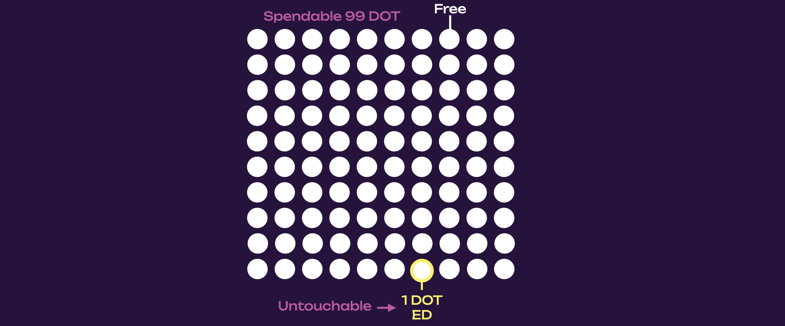
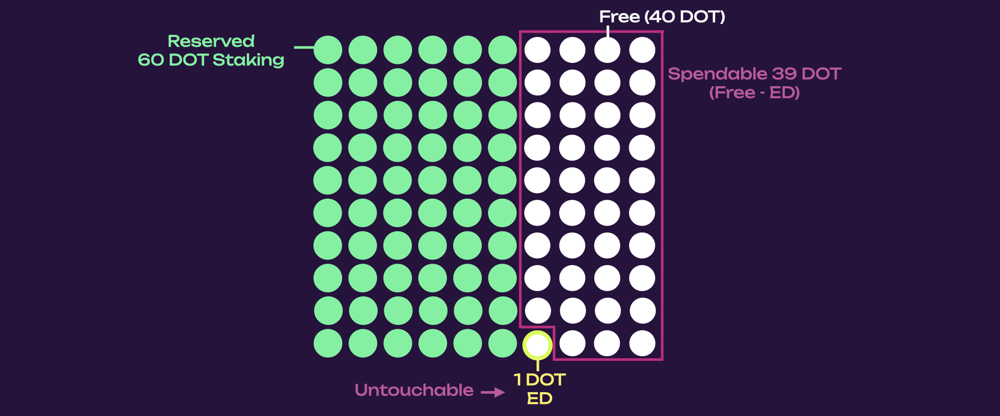
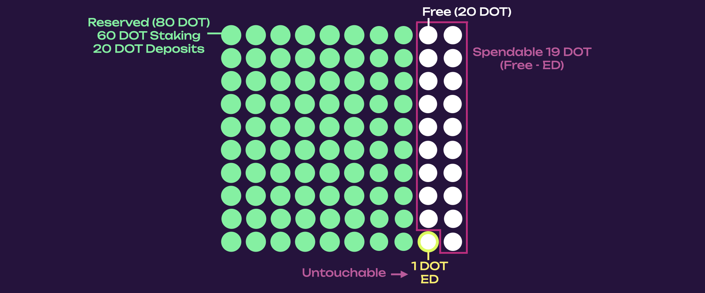
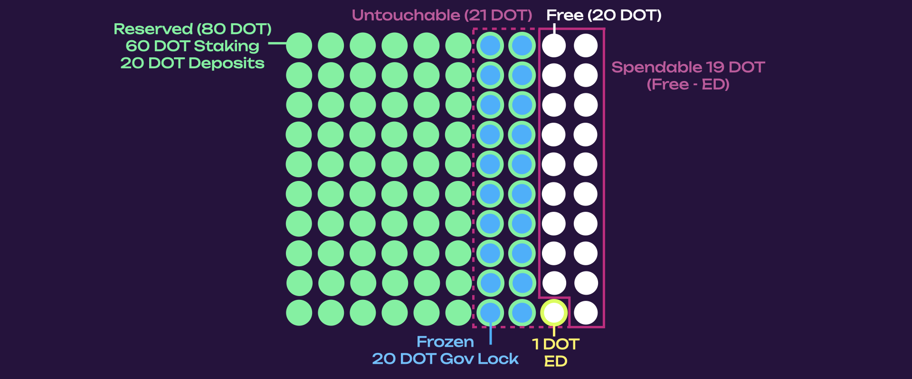
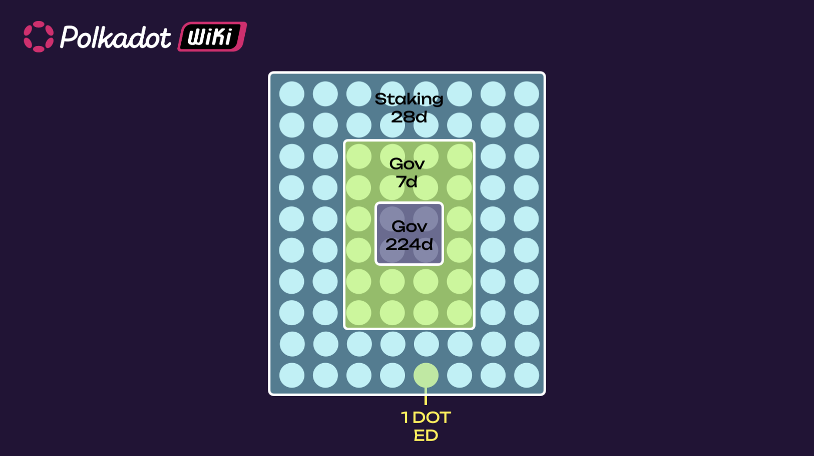
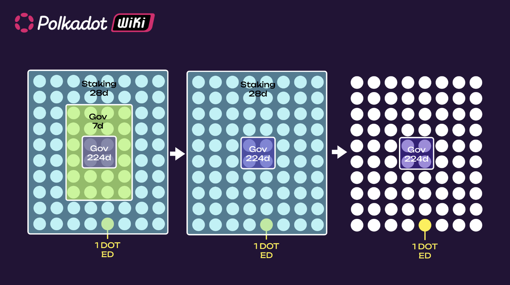

In the Polkadot ecosystem, there are different types of balances depending on the account activity.
Different balance types dictate whether your balance can be used for transfers, to pay fees, or must
remain frozen and unused due to an on-chain requirement.

!!!info "A more efficient distribution of account balance types"
    Soon, pallets on Polkadot SDK will be implementing the _fungible_ trait (see [the tracking issue](https://github.com/paritytech/polkadot-sdk/issues/226) for more info). This new logic will allow for more efficient use of your account balance. Specifically, the [fungible trait](https://paritytech.github.io/polkadot-sdk/master/frame_support/traits/tokens/fungible/index.html) will allow using the `free` balance for on-chain activity like setting proxies and identities.

There are 5 types of account balances:

- **Free** is the balance that can be used for on-chain activity like staking, participating in
  governance etc. but is not necessarily spendable (or transferrable)
- **Frozen** is the free balance locked for [staking](./learn-staking.md),
  [governance](./learn-polkadot-opengov.md), and [vesting](./learn-transactions.md#vested-transfers)
  (also called locked balance)
- **On hold** is used for [identities](./learn-identity.md), [proxies](./learn-proxies.md),
  [OpenGov preimages and deposits](./learn-guides-polkadot-opengov.md#claiming-opengov-deposits),
  and it is no longer free (also called reserved balance)
- **Spendable** is the free balance that can be spent
- **Untouchable** is the portion of the free balance that cannot be moved (i.e., not spendable) but
  can still be used for on-chain activity

The spendable balance is calculated as follows:

```
spendable = free - max(frozen - on_hold, ED)
```

where `free`, `frozen` and `on_hold` are defined above. The `ED` is the the
[existential deposit](./learn-accounts.md#existential-deposit-and-reaping).

**Wallet providers might show you the spendable, locked, and reserved balance.**

## Example of Account Balance Types

Below is an in-depth example of how an account balance composition changes depending on user actions
once
[the _fungible_ trait](https://paritytech.github.io/polkadot-sdk/master/frame_support/traits/tokens/fungible/index.html)
is used for account balances. Let’s take, for example, an account with 100 DOT.

```
Free: 100 DOT
Frozen: 0 DOT
On hold: 0 DOT
Spendable: 99 DOT
Untouchable: 1 DOT (ED)
```



In this case, the existential deposit of 1 DOT is untouchable (meaning you can’t touch it if the
account can’t or shouldn’t get reaped). If 80 DOT from the account is staked, we get the following
balance structure:

```
Free: 100 DOT
Frozen : 80 DOT
Onhold: 0 DOT
Spendable: 20 DOT
Untouchable: 80 DOT
```



The spendable balance would be 20 DOT (which would also include fees for future transactions from
this account).

Note how the account cannot be reaped from the state while it has a frozen balance, or in general
any [consumer and provider reference](./learn-guides-accounts.md#query-account-data-in-polkadot-js).
Those references determine if an account can be reaped, usually because other accounts depend on the
existence of such an account). For example, the existential deposit adds a provider reference simply
because the account exists, while a proxy account adds a consumer reference (the proxy existence
depends on the proxied account; the proxy is the consumer). **Because the existential deposit is
part of the untouchable balance, the user can use all the spendable balance (there is no need to
keep 1 DOT as spendable).**

!!!info
    The use of the _free_ balance as shown in the following figures will be possible once the _fungible_ trait is implemented for account balances.

If the account creates a proxy, it will use the `free` balance as shown below.

```
Free: 80 DOT
Frozen : 80 DOT
Onhold: 20 DOT
Spendable: 20 DOT
Untouchable: 60 DOT
```



**Note how, through the fungible trait, the system uses the `balance` that is frozen instead of the
`free` balance that is spendable (present configuration on-chain).** In other words, holds are
subtracted from free balance but overlap with the frozen balance. The free portion shrinks from 100
to 80 DOT, and the `on_hold` portion increases from 0 to 20 DOT. The creation of an identity will
grow the `on_hold` portion to 40 DOT, and shrink further the `free` from 80 to 60 DOT. Note how the
spendable balance stays the same in the process.

```
Free: 60 DOT
Frozen: 80 DOT
Onhold: 40 DOT
Spendable: 20 DOT
Untouchable: 40 DOT
```



This update using the fungible trait allows the use of the frozen balance for on-chain activity like
setting up proxies and identities. Note that
[holds are slashable](https://github.com/paritytech/substrate/pull/12951), and the pallet
[migrations](https://github.com/paritytech/polkadot-sdk/issues/226) need to take that into account.
This means that freezes should account for hold being slashed (for example, your stash account
balance getting reduced because your governance deposit for a proposal was slashed).

## Locks

Locks are abstractions over an account's free balance, preventing it from being spent. Several locks
can overlap on the same account balance instead of being stacked on top of one another. Locks are
automatically added onto accounts when the account participates in activities on-chain (staking,
voting, etc.), but these are not customizable.

Locks are accounted for within the `frozen` balance of the account. This is the balance that can be
`free` but not transferrable, and locked in [staking](./learn-staking.md),
[governance](./learn-polkadot-opengov.md) and [vesting](./learn-transactions.md#vested-transfers).

Locks overlap (in both amount and duration), and the general rule is that:

- If you have multiple locks of different amounts of tokens, the biggest lock decides the total
  amount of locked tokens
- If you have multiple locks of the same amount of tokens, the lock with the longest duration
  decides when those tokens can be unlocked

Let's take, for example, 80 DOT as a `frozen` balance. These 80 DOT are currently used in staking
and governance as follows:

- 80 DOT Staking (just unbonded) -> lock 28 days
- 24 DOT OpenGov 1x conviction (referendum just ended, winning side) -> lock 7 days
- 4 DOT OpenGov 6x conviction (referendum just ended, winning side) -> lock 224 days



The 1 DOT ED is the existential deposit. The locked amount is 80 DOT (not 108 DOT). But those 80 DOT
will be available for unlock at different times. You will first need to remove the governance lock
on the 24 DOT after 7 days, then remove the staking lock for the 80 DOT after 28 days, and finally,
after 224 days, you will be able to remove the second governance lock.



After 224 days, all 80 DOT (- ED) will be free and transferrable.

### Edge Case for Locks

The longest period and the largest amount are considered if you use different convictions while you
have ongoing locks.

Following the previous example, if you:

- undelegate a 1x conviction delegation of 24 DOT, you will get a 7-day lock on 24 DOT
- delegate 4 DOT with 6x conviction
- undelegate again before the 1x conviction lock is removed

You will get a 6x conviction for 24 DOT! See
[here](https://substrate.stackexchange.com/questions/5067/delegating-and-undelegating-during-the-lock-period-extends-it-for-the-initial-am)
for more information.

## Balance Types on Polkadot-JS

Below is an example that displays different balance types on the
[Polkadot-JS UI (wallet)](../general/polkadotjs-ui.md) of a Kusama account (note that the balance
types are the same for a Polkadot account).


- The **total** balance indicates the total number of tokens in the account. Note that this number
  does not necessarily correspond to the tokens you can transfer. In the example, the total number
  of tokens is 0.6274 KSM. The **transferrable** balance indicates the number of free tokens to be
  transferred. This is calculated by subtracting the number of _locked_ and _reserved_ tokens from
  the total number of tokens. Locked funds correspond to tokens used in staking, governance, and
  vested transfers (see below). In the example, the transferrable balance is 0.0106 KSM.
- The **vested** balance indicates tokens sent to the account and released with a specific time
  schedule. The account owns the tokens, but they are _locked_ and become available for transfer
  after a specific number of blocks. In the example, the vested balance is 0.25 KSM.
- The **bonded** balance indicates the number of tokens that are _locked_ for on-chain participation
  to staking. In the example, the bonded balance is 0.4 KSM.
- The **democracy** balance indicates the number of tokens that are _locked_ for on-chain
  participation in democracy (i.e., voting for referenda and council). In the example, the democracy
  balance is 0.4 KSM.
- The **redeemable** balance indicates the number of tokens ready to be unlocked to become
  transferrable again. Those tokens already went through the unbonding period. In this case, the
  redeemable balance is 0.1 KSM.
- The **locked** balance indicates the number of frozen tokens for on-chain participation to staking
  and democracy or for vested transfers. **Locks do not stack**, which means that if you have
  different locks, the total locked balance is not the addition of the individual locks. Instead,
  **the biggest lock decides the total locked balance**. In the example, the locked balance is 0.55
  KSM because the biggest lock is on democracy (0.55 KSM).
- The **reserved** balance indicates the number of frozen tokens for on-chain activity other than
  staking, governance, and vested transfers. Such activity can be setting an identity or a proxy.
  Reserved funds are held due to on-chain requirements and can usually be freed by taking some
  on-chain action. For example, the "Identity" pallet reserves funds while an on-chain identity is
  registered, but by clearing the identity, you can unreserve the funds and make them free again.
  The same applies to proxies. The idea is that those actions require some network memory usage that
  is not given for free. In the example, we created a governance proxy, and the reserved funds for
  this are 0.0668 KSM.
