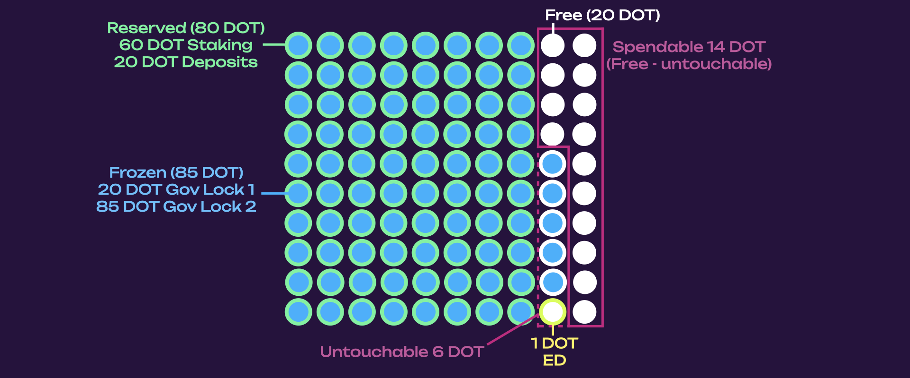

!!!info "Advanced Information"
    
    This section provides advanced details about account balances, targeting developers and power users. 

    In practice, wallets and browser extensions should abstract these mechanics and simply display the **Total**, **Spendable**, and **Unspendable** balances.

    The full rules around spendability depend on internal factors like frozen balances, reserved funds, and reference counters (providers and consumers). These nuances impact whether the existential deposit (ED) is considered "untouchable" and whether an account is at risk of being reaped (removed from state).

In the Polkadot ecosystem, different types of balances depend on the account activity.
Different balance types dictate whether your balance can be used for transfers, to pay fees, or must remain frozen and unused due to an on-chain requirement.

There are four types of account balances:

- **Free Balance** is a portion of an account's total balance that is not held (see below). It is the balance that can be used for any on-chain activity ([staking](./learn-staking.md), [governance](./learn-polkadot-opengov.md), and deposits) as long as the total balance (free + reserved) remains above the maximum of frozen balance and [existential deposit (ED)](./learn-accounts.md#existential-deposit-and-reaping).

- **Reserved Balance** (also called holds, or held balance) is the balance removed from free and does not overlay. It can be slashed, but only after all the free balance has been slashed. Reserved balance is used for:
    - native [staking](./learn-staking.md) on the relay chain or via nomination pools
    - deposits such as [governance](./learn-polkadot-opengov.md) decision and submission deposits, [identity](./learn-identity.md) deposits, and [proxy](./learn-proxies.md) and [multi-signature](./learn-account-multisig.md) accounts deposits. It cannot be used for transfers or paying fees.

- **Frozen Balance** (also called locks, or locked balance) is simply the minimum total balance the user needs to maintain (inclusive of reserves). Frozen balance is used for:
    - [vested transfers](./learn-transactions.md#vested-transfers)
    - governance votes (that can use the total balance, including non-staking holds like proxy deposits)

    Freezes overlay with themselves and with reserves, meaning that if staking reserves 60 DOT, voting for a governance proposal with 20 DOT will freeze 20 out of 60 reserved DOT. If a governance vote freezes 20 DOT and vesting freezes 120 DOT, the total frozen balance is 120 DOT (not 140 DOT).

    !!!info "In case of slashes, the frozen balance could exceed the total balance."

**Spendable Balance** is the portion of the free balance that can be transferred. It is also available for transaction fees and creating new reserves.

The spendable balance is calculated as follows:

```
spendable = free - max(frozen - reserved, ED)
```

Where `free`, `frozen`, and `reserved` are defined above. The `ED` is the
[existential deposit](./learn-accounts.md#existential-deposit-and-reaping).

### Consumer and Provider References

In Polkadot and Substrate-based chains, each account must maintain a minimum free balance called the Existential Deposit (ED) to remain alive. An account cannot be reaped from the state while it has a reserved balance, or in general,
any [consumer and provider reference](./learn-guides-accounts.md#query-account-data-in-polkadot-js).
Those references determine if an account can be reaped, usually because other pallets depend on the
existence of such an account. For example, the existential deposit adds a provider reference simply
because the account exists, while a proxy account adds a consumer reference (the proxy existence
depends on the proxied account; the proxy is the consumer). 

If an account’s free balance falls below this threshold and has no providers or consumers, it is reaped, meaning all its data is deleted to conserve state space. However, the ED rules are more nuanced than they may appear:

- Reserved balances do not count as spendable, but they do add a provider reference to the account.
- If an account has any provider references (e.g., via reserved balance or staking), it will not be reaped even if its free balance drops below the ED. In such cases, the ED is not untouchable: the free balance can be entirely spent, and the account will remain alive. In other words, the account is "dusted", which happens when its free balance drops below ED. Then the "dust" is deleted, but the account can still be alive, for example, because it has a provider reference.
- Conversely, if an account has consumers (such as active locks or dependencies) but only one or zero providers, then the ED must be preserved, or the account may be reaped once the last consumer or provider is removed.

## Example of Account Balance Types

Below is an in-depth example of how an account balance composition changes depending on user actions
**once [the _fungible_ trait](https://paritytech.github.io/polkadot-sdk/master/frame_support/traits/tokens/fungible/index.html) is implemented by all Substrate pallets**. Let’s take, for example, an account with 100 DOT.

```
Free: 100 DOT
Frozen (locked): 0 DOT
Reserved (held): 0 DOT
Spendable: 99 DOT
Untouchable: 1 DOT (ED)
```


The untouchable balance is part of the free balance that cannot be spent due to ED or freezes. In this case, the existential deposit of 1 DOT is untouchable (meaning you can’t touch it if the
account can’t or shouldn’t get reaped). The untouchable balance can also be defined as the frozen balance in excess of the reserved balance (see [here](https://github.com/paritytech/polkadot-sdk/issues/1833#issuecomment-1805764506) for a visual aid). 

If 60 DOT from the account is staked, we get the following balance structure:

```
Free: 40 DOT
Frozen (locked) : 0 DOT
Reserved (held): 60 DOT
Spendable: 39 DOT (Free - ED)
Untouchable: 1 DOT (ED)
```


The spendable balance would be 39 DOT (which would also include fees for future transactions from
this account). Because the existential deposit is
part of the untouchable balance, the user can use all the spendable balance (there is no need to
keep 1 DOT as spendable).


If the account creates a proxy, it will use the reserved balance as follows:

```
Free: 20 DOT
Frozen (locked) : 0 DOT
Reserved (held): 80 DOT
Spendable: 19 DOT (Free - ED)
Untouchable: 1 DOT (ED)
```


The reserved balance for the proxy deposit increases the total held balance to 80 DOT while the free balance decreases to 20 DOT.

If the account votes for a governance proposal with 20 DOT, the situation would be as follows:

```
Free: 20 DOT
Frozen (locked): 20 DOT
Reserved (held): 80 DOT
Spendable: 19 DOT (Free - ED)
Untouchable: 1 DOT (ED)
```


Note how, through the fungible trait, the system uses the reserved balance. Freezes are
imposed on the total balance, overlapping with the reserved balance and themselves (see below). The free and reserved portions remain 20 DOT and 80 DOT, respectively. We also have 20 DOT as a frozen balance because of the governance vote. The untouchable balance remains 1 DOT, defined as the frozen balance in excess of any reserves (in this case, frozen < reserved, so only the ED is untouchable).

If the account votes on another governance proposal with 85 DOT (assuming the previous proposal is still ongoing or that it ended on the winning side with a lock), the frozen balance will increase to 85 DOT and the untouchable balance to 6 DOT, using the already frozen 20 DOT plus an additional 60 DOT from the reserved balance and 5 DOT from the free balance, in excess of the reserved balance.


```
Free: 20 DOT
Frozen (locked): 85 DOT
Reserved (held): 80 DOT
Spendable: 15 DOT (Free - untouchable)
Untouchable: 5 DOT (frozen in excess of reserved, and ED overlays with frozen but not reserved)
```



This update uses the fungible trait to allow the use of the reserved balance for on-chain activity like voting in governance and vesting. Note that
[reserves are slashable](https://github.com/paritytech/substrate/pull/12951), and the pallet
[migrations](https://github.com/paritytech/polkadot-sdk/issues/226) need to take that into account.
This means that freezes should account for hold being slashed (for example, your stash account
balance getting reduced because your governance deposit for a proposal was slashed).

## Locks

Locks are abstractions over an account's free balance, preventing it from being spent. Several locks
can overlap on the same account balance instead of being stacked on top of one another. Locks are
automatically added to accounts when the account participates in activities on-chain (voting, etc.), but these are not customizable.

Locks are accounted for within the `frozen` balance of the account. This is the balance that can be
`free` but not transferrable, and locked in
[governance](./learn-polkadot-opengov.md) and [vesting](./learn-transactions.md#vested-transfers).

Locks overlap (in both amount and duration), and the general rule is that:

- If you have multiple locks of different amounts of tokens, the biggest lock decides the total
  amount of locked tokens
- If you have multiple locks of the same amount of tokens, the lock with the longest duration
  decides when those tokens can be unlocked

Let's take, for example, 80 DOT as a `frozen` balance. These 80 DOT are currently used in vesting
and governance as follows:

- 80 DOT vesting that become fully vested in 28 days
- 24 DOT OpenGov 1x conviction (referendum just ended, winning side) -> lock 7 days
- 4 DOT OpenGov 6x conviction (referendum just ended, winning side) -> lock 224 days


The 1 DOT ED is the existential deposit. The locked amount is 80 DOT (not 108 DOT). But those 80 DOT
will be available for unlock at different times. You will first need to remove the governance lock
on the 24 DOT after 7 days, then remove the vesting lock for the 80 DOT after 28 days, and finally,
after 224 days, you will be able to remove the second governance lock.


After 224 days, all 80 DOT (- ED) will be free and transferrable.

### Edge Case for Locks

The longest period and the largest amount are considered if you use different convictions while you
have ongoing locks.

Following the previous example, if you:

- Undelegate a 1x conviction delegation of 24 DOT, you will get a 7-day lock on 24 DOT
- Delegate 4 DOT with 6x conviction
- Undelegate again before the 1x conviction lock is removed

You will get a 6x conviction for 24 DOT! See
[here](https://substrate.stackexchange.com/questions/5067/delegating-and-undelegating-during-the-lock-period-extends-it-for-the-initial-am)
for more information.
