An address is the public part of a Polkadot account. The private part is the key used to access this
address. The public and private parts together make up a Polkadot account.

There are several ways to generate a Polkadot account:

- [Polkadot{.js} Browser Extension](#polkadotjs-browser-extension) **RECOMMENDED FOR MOST USERS**
- [Subkey](#subkey) **ADVANCED and MOST SECURE**
- [Polkadot-JS Apps](#polkadot-js-apps)
- [Parity Signer](#parity-signer)
- [Vanity Generator](#vanity-generator)
- [Ledger Hardware Wallet](../general/ledger.md)

:::note

If you prefer video instructions for creating an account using Polkadot JS, we have an easy to 
follow guide for beginners [on YouTube](https://www.youtube.com/watch?v=sy7lvAqyzkY)

:::

## DISCLAIMER: Key Security

The *only* ways to get access to your account are via your secret seed or your account's JSON file
in combination with a password. You must keep them both secure and private. If you share them with
anyone they will have full access to your account, including all of your funds. This information is
a target for hackers and others with bad intentions - see also
[How to Recognize Scams](../general/scams.md).

On this page, we recommend a variety of account generation methods that have various convenience and
security trade-offs. Please review this page carefully before making your account so that you
understand the risks of the account generation method you choose and how to properly mitigate them
in order to keep your funds safe.

### Storing your key safely

The seed is your **key** to the account. Knowing the seed allows you, or anyone else who knows the
seed, to re-generate and control this account.

It is imperative to store the seed somewhere safe, secret, and secure. If you lose access to your
account (i.e. you forget the password for your account's JSON file), you can re-create it by
entering the seed. This also means that somebody else can have control over your account if they
have access to your seed.

For maximum security, the seed should be written down on paper or another non-digital device and
stored in a safe place. You may also want to protect your seed from physical damage, as well (e.g.
by storing in a sealed plastic bag to prevent water damage, storing it in a fireproof safe, etching
it in metal, etc.) It is recommended that you store multiple copies of the seed in geographically
separate locations (e.g., one in your home safe and one in a safety deposit box at your bank).

:::caution You should not store your seed on any kind of computer that has or may have access to the internet in the future

:::

### Storing your account's JSON file

The JSON file is encrypted with a password, which means you can import it into any wallet which
supports JSON imports, but to then use it, you need the password. You don't have to be as careful
with your JSON file's storage as you would with your seed (i.e. it can be on a USB drive near you),
but remember that in this case, your account is only as secure as the password you used to encrypt
it. Do not use easy to guess or hard to remember passwords. It is good practice to use a
[mnemonic password of four to five words](https://xkcd.com/936/). These are nearly impossible for
computers to guess due to the number of combinations possible, but much easier for humans to
remember.

## Polkadot{.js} Browser Extension

The Polkadot{.js} Extension provides a reasonable balance of security and usability. It provides a
separate local mechanism to generate your address and interact with Polkadot.

This method involves installing the Polkadot{.js} plugin and using it as a “virtual vault," separate
from your browser, to store your private keys. It also allows the signing of transactions and similar
functionality.

It is still running on the same computer you use to connect to the internet with and thus is less
secure than using Parity Signer or other air-gapped approaches.

### Install the Browser Extension

The browser extension is available for both
[Google Chrome](https://chrome.google.com/webstore/detail/polkadot%7Bjs%7D-extension/mopnmbcafieddcagagdcbnhejhlodfdd?hl=en)
(and Chromium-based browsers like Brave) and
[FireFox](https://addons.mozilla.org/en-US/firefox/addon/polkadot-js-extension).

If you would like to know more or review the code of the plugin yourself, you can visit the
[GitHub source repository](https://github.com/polkadot-js/extension).

After installing the plugin, you should see the orange and white Polkadot{.js} logo in the menu bar
of your browser.

### Create Account

Open the Polkadot{.js} browser extension by clicking the logo on the top bar of your browser. You
will see a browser popup, not unlike the one below.

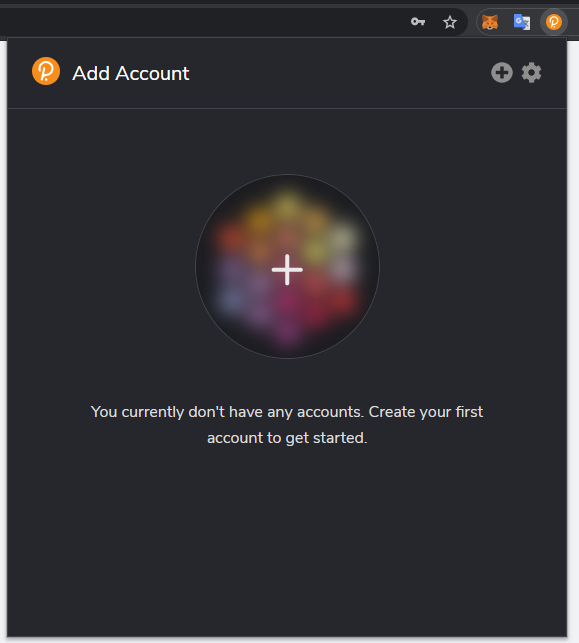

Click the big plus button or select "Create new account" from the small plus icon in the top right.
The Polkadot{.js} plugin will then use system randomness to make a new seed for you and display it
to you in the form of twelve words.

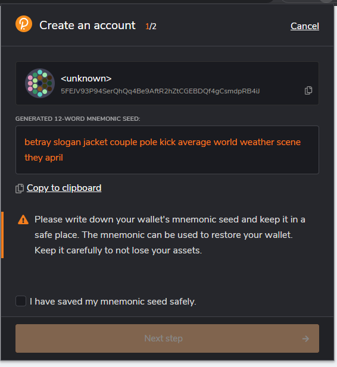

You should back up these words as [explained above](#storing-your-key-safely). It is imperative to
store the seed somewhere safe, secret, and secure. If you cannot access your account via
Polkadot{.js} for some reason, you can re-enter your seed through the "Add account menu" by
selecting "Import account from pre-existing seed".

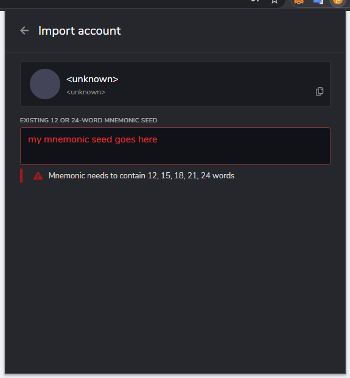

### Name Account

The account name is arbitrary and for your use only. It is not stored on the blockchain and will not
be visible to other users who look at your address via a block explorer. If you're juggling multiple
accounts, it helps to make this as descriptive and detailed as needed.

### Enter Password

The password will be used to encrypt this account's information. You will need to re-enter it when
using the account for any kind of outgoing transaction or when using it to cryptographically sign a
message.

Note that this password does NOT protect your seed phrase. If someone knows the twelve words in your
mnemonic seed, they still have control over your account even if they do not know the password.

### Reset Password

:::warning

Before following the instructions below make sure you have your mnemonic phrase stored in a safe place accessible to you.

:::

Let's say you created `ACCOUNT 1` protected by password `PSW 1`, and you also exported the JSON file `JSON 1`. To reset the passowrd of your polkadot `ACCOUNT 1` using the browser extension you must follow the following steps:

- On the browser extension go to `ACCOUNT 1` and click "Forget account". This action will delete the access to your account. Note that your tokens are still in your account on the polkadot blockchain network.
- On the browser extension click the "+" button in the topright corner and select the option "Import account from pre-existing seed". After entering the mnemonic phrase you can chose a new password `PSW 2`.

:::info JSON files do not allow to change account passwords

If you add the account to the extension using the option "Restore account from backup JSON file", this will allow you to restore access to your account using JSON file `JSON 1` protected by the password `PSW 1`, but not to set a new password. Thus, `PSW 1` will become the account password by default.

:::

:::info Cold wallets do not need passwords

For hardware wallets such as [Ledger](https://www.ledger.com/) you do not need to set a password for your account. Each time you need to access funds in your account you are required to sign using your Ledger device. Also, Ledger wallets are deterministic wallets, meaning that you can generate multiple accounts for for multiple blockchain networks without having different passwords to access such accounts.

:::

### Set Address for Polkadot Mainnet

Now we will ensure that the addresses are displayed as Polkadot mainnet addresses.

Click on "Options" at the top of the plugin window, and under "Display address format for" select
"Polkadot Relay Chain".

Your address' format is only visual - the data used to derive this representation of your address
are the same, so you can use the same address on multiple chains. However, for privacy reasons, we
recommend creating a new address for each chain you're using.

Our [Accounts page](learn-accounts.md#address-conversion-tools) also has a tool you can use to
convert your address between the different chain formats.

You can copy your address by clicking on the account's icon while the desired chain format is
active. E.g. selecting "Substrate" as the format will change your address to start with the number
5, and clicking the colorful icon of your account will copy it in that format. While in Polkadot
mode (starts with 1), that format will be copied, and so on.

## Subkey

Subkey is recommended for technically advanced users who are comfortable with the command line and
compiling Rust code. Subkey allows you to generate keys on any device that can compile the code.
Subkey may also be useful for automated account generation using an air-gapped device. It is not
recommended for general users.

For detailed build and usage instructions of subkey, please see
[here](https://github.com/paritytech/substrate/tree/master/bin/utils/subkey).

## Polkadot-JS Apps

:::caution

If you use this method to create your account and clear your cookies in your browser,
your account will be lost forever if you do not [back it up](learn-account-restore.md). Make sure
you store your seed phrase in a safe place, or download the account's JSON file if using the
Polkadot{.js} browser extension. Learn more about account backup and restoration
[here](learn-account-restore.md).

:::

Using the Polkadot-JS user interface without the plugin is **not recommended**. It is the least
secure way of generating an account. It should only be used if all of the other methods are not
feasible in your situation.

### Go to Polkadot-JS Apps

Navigate to [Polkadot-JS Apps](https://polkadot.js.org/apps) (or [dotapps.io](https://dotapps.io/)) 
and click on "Accounts" underneath the Accounts tab. It is located in the navigation bar at the top 
of your screen.

:::info Creating an Account on a different network

You will need to click on the network selection in the top left corner of the navigation menu. 
A pop-up sidebar will appear listing live, testing, and custom node to choose from. 

Do remember to hit the "Switch" button when you want to switch your network.

:::

### Start Account Generation

Click on the "Add Account" button. You should see a pop-up similar to the process encountered when
using the [Polkadot JS Extension method](#polkadotjs-browser-plugin) above. Follow the same
instructions and remember to [store your seed safely](#storing-your-key-safely)!

### Create and Back-Up Account

Click “Save” and your account will be created. It will also generate a
[backup JSON file](#storing-your-accounts-json-file) that you should safely store, ideally on a USB
off the computer you're using. You should not store it in cloud storage, email it to yourself, etc.

You can use this backup file to restore your account. This backup file is not readable unless it is
decrypted with the password.

### Reset password

To reset the password of an account created with Polkadot-JS you just need to go in the "Accounts" tab, click the icon with three vertical dots on your account and select "Change this account's password".

:::info

If you create an account first using Polkadot-JS, and then you add it to the browser extension, to change the passowrd of such account you need to follow the [guidelines for the browser extension](#reset-password).

:::

### Multi-signature Accounts

Multi-signature accounts are accounts created from several standard accounts (or even other
multi-sig accounts). For a full explanation, please see the
[Accounts Explainer section on multi-sigs](learn-accounts.md#multi-signature-accounts).

On the [Accounts](https://polkadot.js.org/apps/#/accounts) tab, click the `Multisig` button. Enter
the threshold and add signatories. The threshold must be less than or equal to the number of
signatories. The threshold indicates how many members must agree for an extrinsic
submission to be successful. Click `Create` when done.

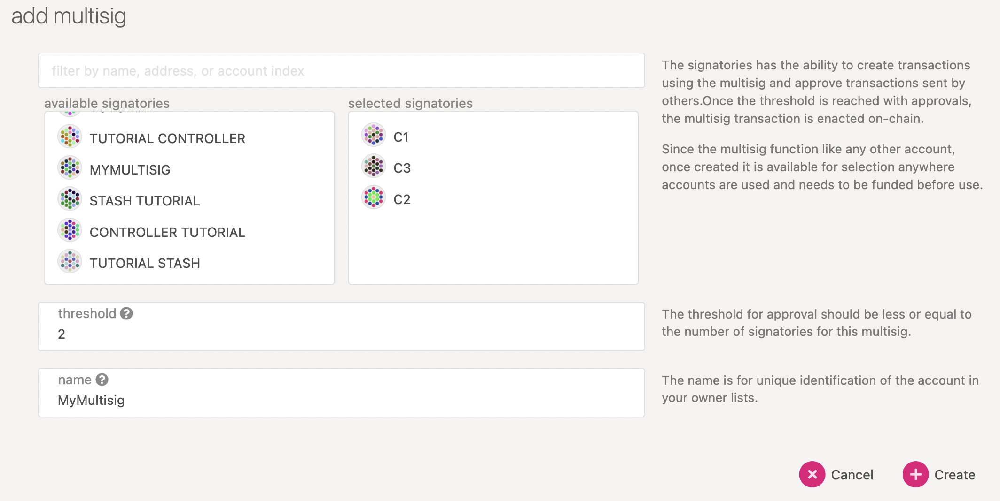

This merely calculates the multi-signature's address and adds it to your UI. The account does not
exist yet, and is subject to the same
[Existential Deposit and Reaping](learn-accounts.md#existential-deposit-and-reaping) rules as
regular accounts.

Suppose we funded it with some tokens, and now want to send from the multi-sig to another account.

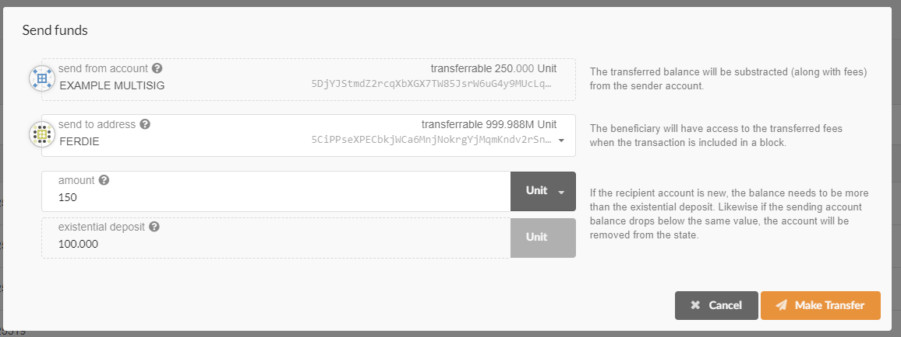

The next step is to sign the transaction from with enough accounts to meet the threshold; in the
above case, two out of three signatories must sign.

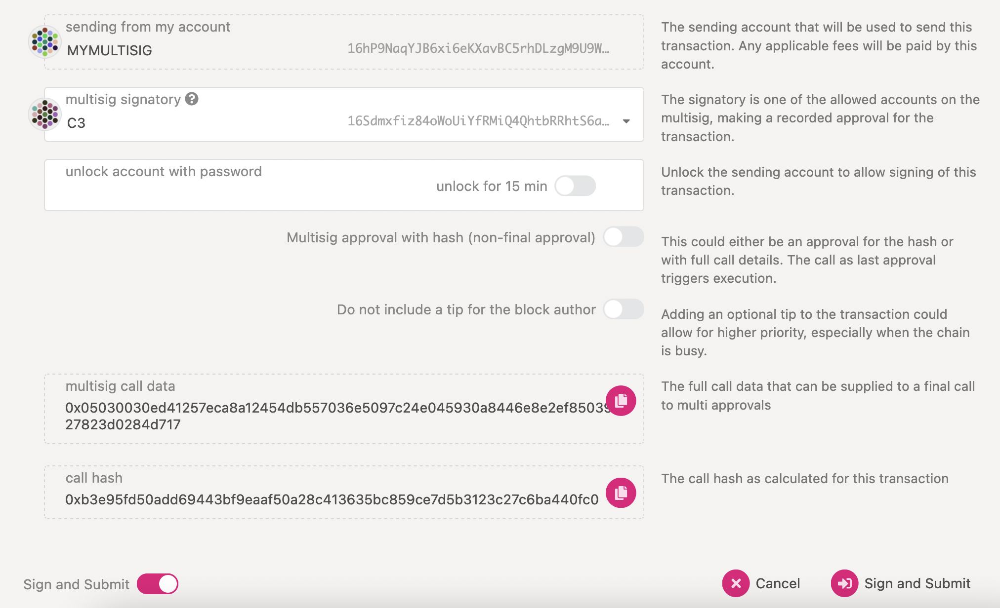

There is currently no indication of a pending transaction from a multi-sig in the UI. This means the
second signatory must **repeat the call in full** in order to sign it. In other words:

- if Alice initiates a transaction from the multi-sig to Ferdie for 150 tokens, there will be a
  pending transaction in the chain.
- if Bob initiates a transaction from the multi-sig to Ferdie for 250 tokens, there will be
  **another** pending transaction in the chain, and the first one will not complete.
- because the threshold is 2/3, Charlie can now finalize either or both of these by repeating the
  desired transaction.

Other calls work the same - if a multi-sig wants to become a Council member, the candidacy
request has to come from the multi-sig, but be signed (re-requested) from each signatory until the
threshold is reached.

Signatories should communicate off-chain to prevent many pending transactions and crossed
communication lines on-chain.

:::info 

The bigger the multisig, the more of a deposit an account needs to put down when initiating a
multi-sig call. This is to prevent chain storage spam with pending but never-resolved multi-sig
transactions. Once a call is resolved (canceled or executed) the deposit is returned to the
initiator. The deposit is not taken from the multi-sig's balance but from the initiator.

:::

For a more in-depth introduction into multi-signature accounts on Polkadot, please see
[the accounts page section on Multi-sigs](learn-accounts.md#multi-signature-accounts).

## Parity Signer

Parity Signer is a secure way of storing your DOT on an air-gapped device. It is highly recommended
that you turn off wifi, cellular network, Bluetooth, NFC, and any other communications methods after
installing it. The device needs to be offline and only you should be viewing the device screen. If
you have any communications methods turned on, you will see an "unshielded" icon in red in the
top-right corner that indicates your connection may not be secure.

### Create Account

Click "Create" to create an identity, or "recover" if you have previously backed up the recovery
phrase. You can have multiple identities on one device. Each identity can manage multiple addresses
on different networks.

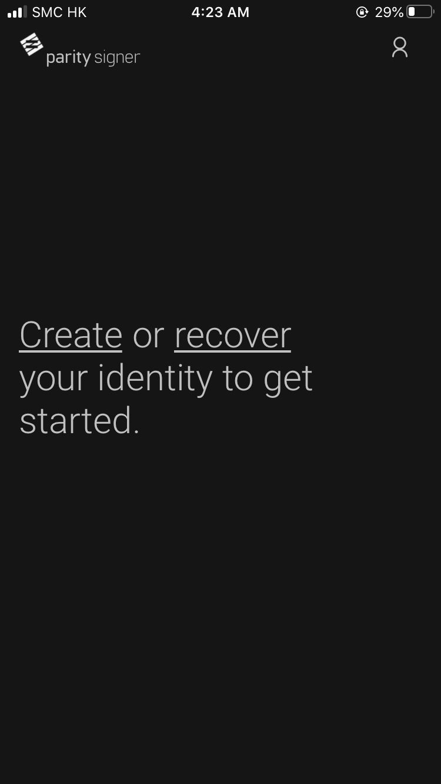

### Name Account

Input the name for your identity and then click "Create".

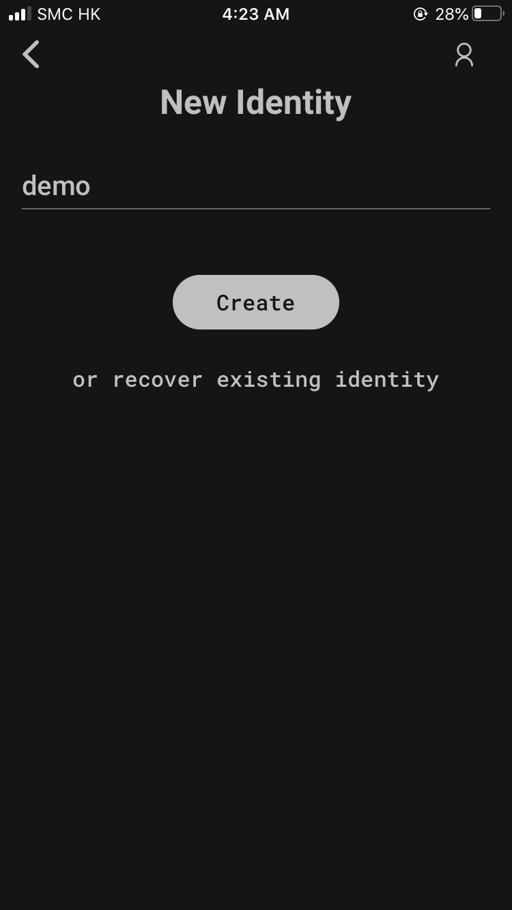

### Back Up Account

Parity Signer will then generate a recovery phrase for you and display it in the form of 12 or 24
words.

You should write down this recovery phrase on paper and
[store it somewhere safe](#storing-your-key-safely).

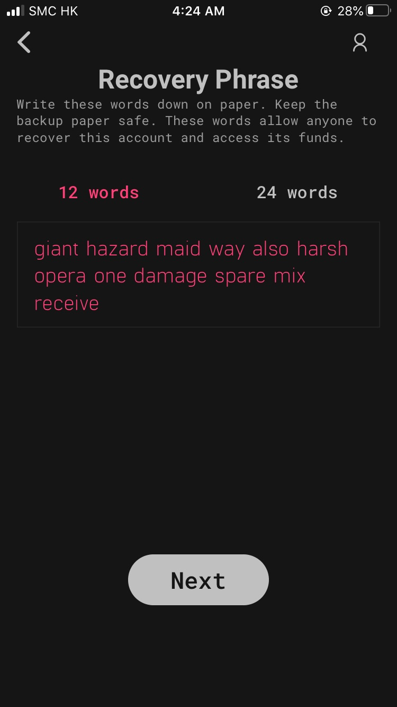

### Set PIN

After confirming that you have backed up your seed, a new textbox will appear in which you can set a
PIN. The PIN code should contain at least 6 digits. If the PIN codes do not match, it will not allow
you to create an account. The PIN code will be used when signing any transaction, or to protect
sensitive operations such as deleting an identity or revealing the recovery phrase.

Note that if someone knows the 12/24 words in your recovery phrase, they will still have control
over your account, even if they do not know the PIN.

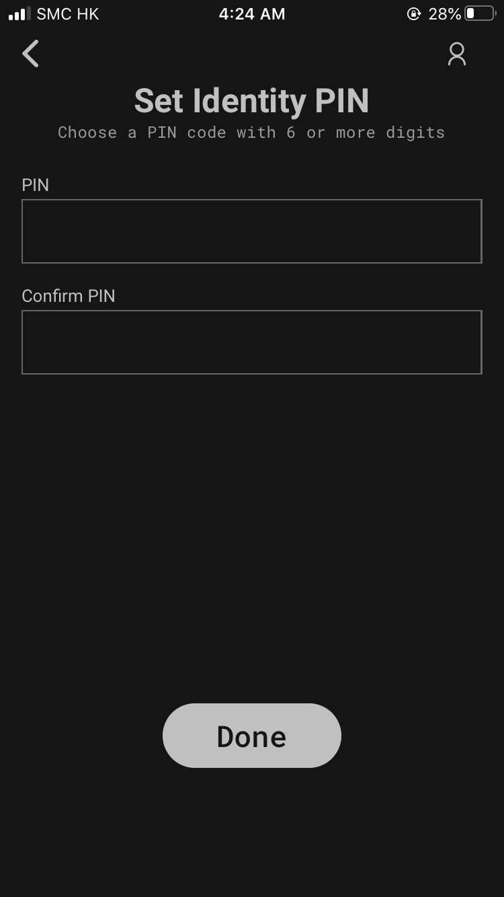

### Get Address

Choose which network you would like to create an address for by clicking the name of the network.
For example, if you select "Polkadot", a new Polkadot address will be created for you under this
identity.

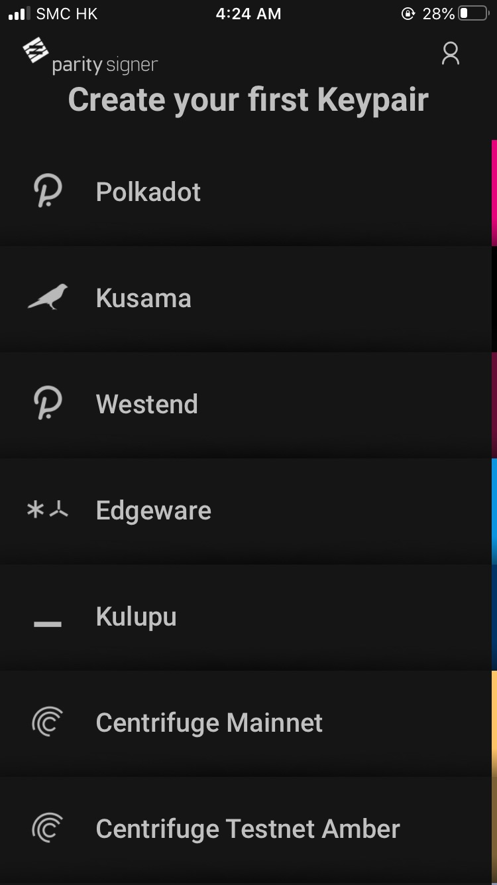

There is currently no way to copy your address from Parity signer in plain text in order to send it
via text or email. You must use the QR method.

### Your Address

The address will be shown as a QR code. You can import your address to the Polkadot-JS Apps by going
to the [Accounts](https://polkadot.js.org/apps/#/accounts) page on an Internet-connected computer
and click "Add via QR", and following the instructions to add the account. An account created this
way will always require you to sign messages with your Parity Signer device. It will do this only by
scanning and displaying QR codes, leaving even someone with total control of your internet-connected
computer has a very small and limited scope for interacting with the Parity Signer device, which can
continue to keep your key safe.

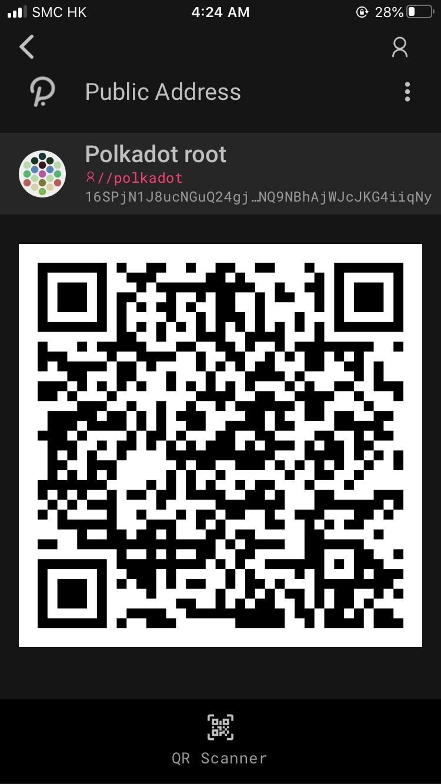

## Ledger Hardware Wallet

To use a Ledger hardware wallet to create your address and keep your tokens in cold storage, follow
the instructions on our [Ledger hardware wallet guide page](../general/ledger.md).

## Vanity Generator

The vanity generator is a tool on [Polkadot-JS UI](https://polkadot.js.org/apps/#/accounts/vanity)
that lets you generate addresses that contain a specific substring.

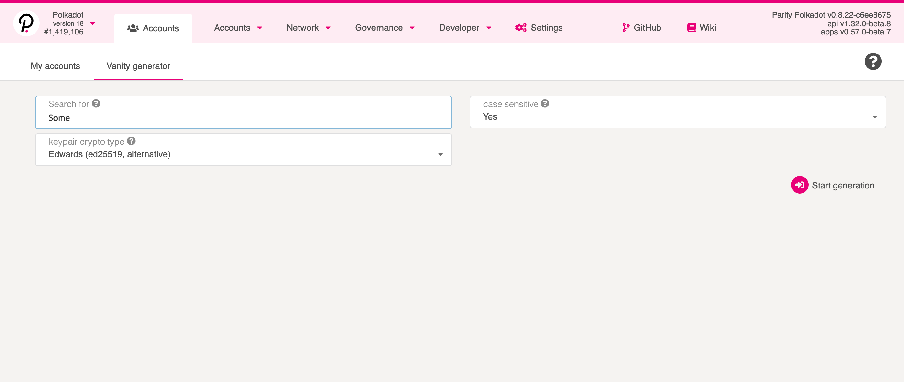

The vanity generator takes the following parameters:

- "Search for": The substring that you would like to include in your new address.
- "case sensitive": "Yes" if the search is case sensitive; "no" if not.
- "keypair crypto type": Specifies the type of account you'd like to generate; Schnorrkel is
  recommended in most cases for its security.

If you've filled out all details above and hit the "Start generation" button, a list of accounts
will start generating on your screen. Note that depending on the length of the substring and the
processing speed of your computer, it may take some time before any accounts appear.

The "Save" button will allow you to save the generated accounts - they are not saved if you do not
choose to do this. The next steps are identical to the
[steps above on creating an account on the UI](#polkadotjs), where a password and name need to be
filled in, and a backup file of your account will be downloaded.

Note that the [Subkey tool](#subkey) also has vanity generation built-in, and is orders of magnitude
faster than the web version. If you need to generate addresses with longer strings, or need plenty
of them, we recommend using Subkey instead.

