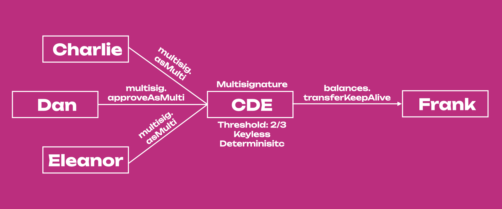

import RPC from "./../../components/RPC-Connection";

## Introduction to Multisig Accounts

It is possible to create multi-signature accounts (multisig) in Substrate-based chains. A multisig is composed of one or more addresses and a threshold. The threshold defines how many
signatories (participating addresses) need to agree on submitting an extrinsic for the call to be
successful.

For example, Alice, Bob, and Charlie set up a multisig with a threshold of 2. This means Alice and
Bob can execute any call even if Charlie disagrees with it. Likewise, Charlie and Bob can execute
any call without Alice. A threshold is typically a number smaller than the total number of members
but can also be equal to it, which means they all have to agree.

:::note Explainer on multisig accounts

Learn more about using multisig accounts with the [Polkadot-JS UI](https://polkadot.js.org/apps/#/accounts) from our
[technical explainer video](https://www.youtube.com/watch?v=-cPiKMslZqI).

:::


:::info

Check the "How to create a multisig account" section on
[this support page](https://support.polkadot.network/support/solutions/articles/65000181826-how-to-create-and-use-a-multisig-account).
We recommend trying out the tutorial on
[Westend network](../maintain/maintain-networks.md#westend-test-network) - Polkadot's testnet.

:::

Multi-signature accounts have several uses:

- securing your stash: use additional signatories as a 2FA mechanism to secure your funds. One
  signer can be on one computer, and another can be on another or in cold storage. This slows down
  your interactions with the chain but is orders of magnitude more secure.
- board decisions: legal entities such as businesses and foundations use multisigs to govern over
  the entity's treasury collectively.
- group participation in governance: a multisig account can do everything a regular account can. A
  multisig account could be a council member in Kusama's governance, where a set of community
  members could vote as one entity.

Multi-signature accounts **cannot be modified after being created**. Changing the set of members or
altering the threshold is not possible and instead requires the dissolution of the current multisig
and creation of a new one. As such, multisig account addresses are **deterministic**, i.e. you can
always calculate the address of a multisig by knowing the members and the threshold, without the
account existing yet. This means one can send tokens to an address that does not exist yet, and if
the entities designated as the recipients come together in a new multisig under a matching
threshold, they will immediately have access to these tokens.

### Making Transactions with a Multisig Account

There are three types of actions you can take with a multisig account:

- Executing a call `asMulti`. This is used to begin or end a multisig transaction.
- Approving a call `approveAsMulti`. This is used to approve an extrinsic and pass-on to the next signatory (see [example below](#example-using-multi-signature-accounts) for more information).
- Cancelling a call `cancelAsMulti`.

:::info

Check out [this page](https://polkadot.js.org/docs/substrate/extrinsics#multisig) for more information about the actions you can take with a multi-signature account.

:::

In scenarios where only a single approval is needed, a convenience method `as_multi_threshold_1`
should be used. This function takes only the other signatories and the raw call as arguments. Note that the Polkadot-JS UI does not have integration for this call because it is not possible to create multisig accounts with `threshold=1`. If you want to create a multisig with threshold 1, you can use [txwrapper-core](https://github.com/paritytech/txwrapper-core), which is developed and supported by Parity Technologies. There is a detailed [multisig example](https://github.com/paritytech/txwrapper-core/tree/main/packages/txwrapper-examples/multisig) that you can try out and change to see how it works.

However, in anything but the simple one approval case, you will likely need more than one of the
signatories to approve the call before finally executing it. When you create a new call or approve a
call as a multisig, you will need to place a small deposit. The deposit stays locked in the pallet
until the call is executed. The deposit is to establish an economic cost on the storage space that
the multisig call takes up on the chain and discourage users from creating dangling multisig
operations that never get executed. The deposit will be reserved in the caller's accounts, so
participants in multisig wallets should have spare funds available.

The deposit is dependent on the `threshold` parameter and is calculated as follows:

```
Deposit = depositBase + threshold * depositFactor
```

Where `depositBase` and `depositFactor` are chain constants (in {{ polkadot: DOT :polkadot }}{{ kusama: KSM :kusama }} units) set in the runtime code. Currently, the deposit base equals <RPC network="polkadot" path="query.multisig.depositBase" defaultValue={200880000000} filter="humanReadable"/> DOT and the deposit factor equals <RPC network="polkadot" path="query.multisig.depositFactor" defaultValue={320000000} filter="humanReadable"/> DOT.

### Example using Multisig Accounts

:::info Walk-through video tutorial

You can also see [this video tutorial](https://www.youtube.com/watch?v=-cPiKMslZqI) for more information about transacting with multisigs using the Accounts Tab, or [this other video](https://www.youtube.com/watch?v=T0vIuJcTJeQ) using the Extrinsic Tab in the [Polkadot-JS UI](https://polkadot.js.org/apps/#/accounts).

:::



Let's consider an example of a multisig on Polkadot with a threshold of 2 and 3 signers: Charlie,
Dan, and Eleanor. First, Charlie will create the call on-chain by calling the `multisig.asMulti` extrinsic with the raw
call, in this case, a balance transfer (`balances.transferKeepAlive` extrinsic) from multisig CDE to Frank's account. When doing this, Charlie will have to deposit `DepositBase + (2 * DepositFactor) = 20.152 DOT`
while he waits for either Dan or Eleanor also to approve the balance transfer call using the `multisig.approveAsMulti` or the `multisig.asMulti` extrinsics.

If Dan submits the `multisig.approveAsMulti` extrinsic, he approves Charlie's call but he passes on the final approval to Eleanor. So, although the multisig has threshold 2, in this case all 3/3 signatories need to participate in the transaction approval. Eleanor will need to submit a `multisig.asMulti` or `multisig.approveAsMulti` extrinsic to transfer funds from CDE to Frank.

Alternatively, Dan or Eleanor can just submit a `multisig.asMulti` extrinsic after Charlie to transfer the funds. In this case, 2/3 signatories will participate in the transaction approval. The accounts approving Charlie's call will not need to place the deposit, and Charlie will receive his
deposit back once the transfer is successful or canceled. To cancel the transaction, Dan or Eleanor can use the `multisig.cancelAsMulti` extrinsic.

Note that multisigs are **deterministic**, which means that multisig addresses are generated from the addresses of signers and the threshold of the multisig wallet. No matter the order of the signatories' accounts, the multisig will always have the same address because accounts' addresses are sorted in ascending order.

:::note Addresses that are provided to the multisig wallet are sorted

Public keys of signers' wallets are compared byte-for-byte and sorted ascending before
being used to generate the multisig address.

:::

This has some implications when using the Extrinsics tab on the [Polkadot-JS UI](https://polkadot.js.org/apps/#/accounts) to perform multisig transactions. If the order of the _other signatories_ is wrong, the transaction will fail. This does not happen if the multisig is executed directly from the Accounts tab (recommended). The Polkadot-JS UI supports multisig accounts, as documented on the [Account Generation page](learn-account-generation.md#multi-signature-accounts). You can see our video tutorials for more information about creating multisig accounts and transacting with them using both the [Accounts Tab](https://www.youtube.com/watch?v=-cPiKMslZqI) and the [Extrinsic Tab](https://www.youtube.com/watch?v=T0vIuJcTJeQ) in the Polkadot-JS UI.

## Decoding Multisig Call Data

:::info

Before signing a transaction, it is important to know the exact specifics of what is being signed. Check the ["How to use a multisig account"](https://support.polkadot.network/support/solutions/articles/65000181826-how-to-create-and-use-a-multisig-account) in the support docs on how to
decode the multisig call data

:::
