Depending on what software you are using to access your account, there are various ways to back up
and restore your account. It is a good idea to back your information up and keep it in a secure
place.. Note that in order to recover an account, you should create your account according to the
instructions [here](learn-account-generation.md). In general, however, as long as you know how you
created your account, and have the seed phrase ([mnemonic phrase](learn-accounts#portability)) or 
JSON file (and password) stored securely, you will be able to restore your account.

This page covers backing up and restoring accounts in Polkadot{.js} Browser Plugin, Polkadot-JS UI,
and Parity Signer. For other wallet applications, please see their specific documentation.

## Polkadot{.js} Browser Plugin

To back up an account using the Polkadot{.js} browser plugin, open the extension and select the
desired account to back up. Click on the three dots beside the address to open up the account
options menu.

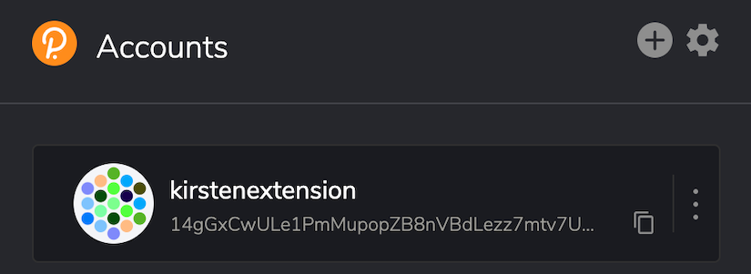

Click on the Export Account button, which will then ask you for the password for that specific
account. Once you enter the correct password, the browser will automatically download a `.json` file
that will hold all the account restoration details that will be used when you restore your account.
You should store this file securely. Note that you will need the password for this account to
restore it.

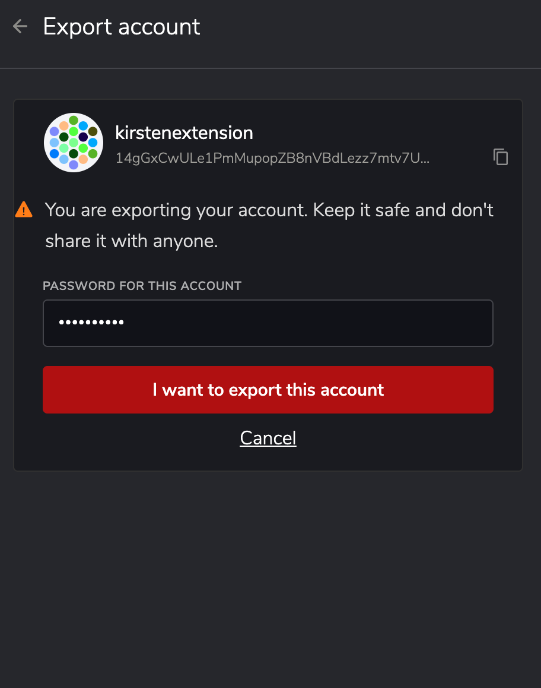

To restore the account from this JSON file, once again open the Polkadot{.js} browser plugin. Click
on the + button at the top. This will open up a menu with several choices - select "Restore account
from backup JSON file". The program then prompts you for the `.json` file which was download earlier
and the password for that account.

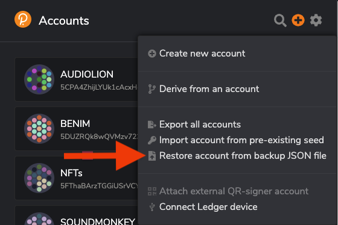

Once these are filled out, and the "Restore" button has been pressed, you'll be taken back to the
main page of the plugin. This account will now be listed with the rest of your accounts.

## Polkadot-JS

If you're using the main Polkadot-JS UI, restoring an account will feel similar to restoring an
account on Polkadot-JS browser plugin. Navigate to the
[Accounts page](https://polkadot.js.org/apps/#/accounts) of Polkadot-JS.

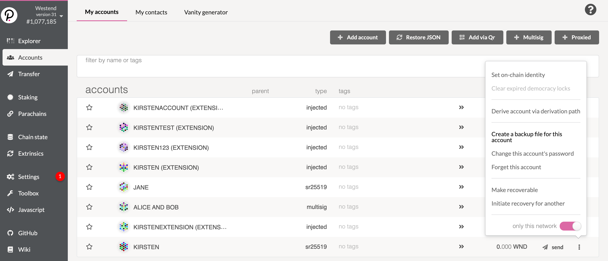

Click on the "Restore JSON" button, which will let you upload your `.json` file that you downloaded
and enter your password for that account. This `.json` file holds all relevant data about the
account to be used in account restoration. Note that you will need to enter your password here; the
file cannot be unencrypted without it.

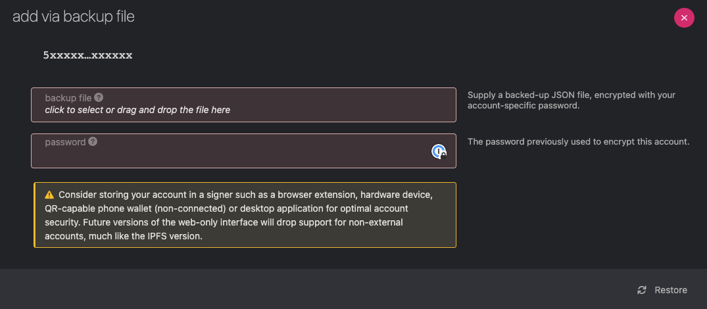

After you press the "Restore" button, you should see a green notification letting you know that your
account has been restored. It will now be included in your accounts list on this browser.


### Using an Existing Mnemonic Seed to Restore an Account with Polkadot.js Extension (Preferred)

Using the Polkadot JS [Extension](https://polkadot.js.org/extension/) is the preferred way of managing
your accounts. So when restoring accounts using an existing seed phrase the extension is the way to go.

Navigate to the polkadot.js extension and click the plus sign on the top right
Out of the options select "Import account from pre-existing seed"

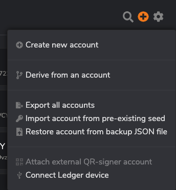

It will ask you to provide the seed phrase, copy it and paste it where is asks.

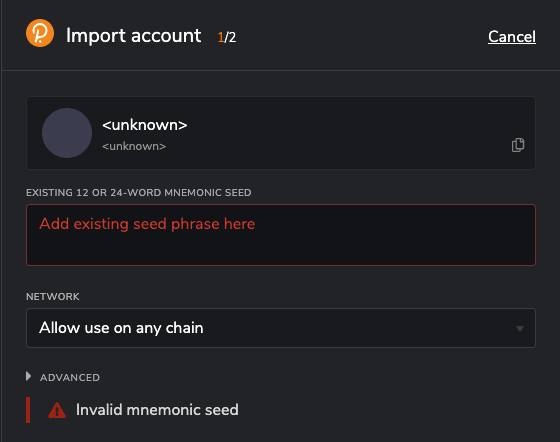

Once a valid seed phrase is provided it will ask you to rename the account and set a new password.
The name of the account doesn't have to match the old name, you can choose a new one if you please. 
Also the password should be saved carefully. Ideally in a password manager.

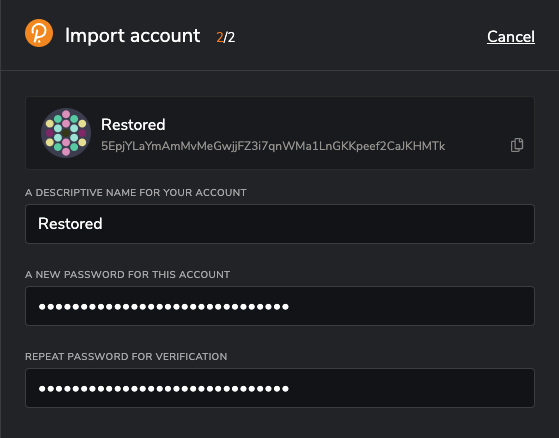

Once all the fields are filled out click "Add account with the supplied seed" button. And you should
now have access to your recovered account.

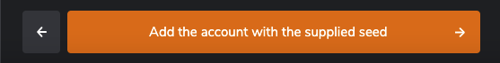

### Using an Existing Mnemonic Seed to Restore an Account with Polkadot.js UI

You can also always restore an account by using the mnemonic phrase (seed words).

To do this with Polkadot-JS, navigate to the
[Polkadot-JS Accounts Page](https://polkadot.js.org/apps/#/accounts). Click on the "Add Account"
button, and enter a name and password for the account. The name and the password of this added
account can be set to whatever you'd like, it does not need to be the same name and password as when
this account was initially created.

After this, delete the generated mnemonic phrase (seed words) and replace them with your _existing
seed words_. When you replace the generated mnemonic seed with your existing one, you are not
creating a new account, rather adding that account onto the Polkadot-JS UI. Any account using the
same seed words will have control over that account on-chain. This is why it is so important to keep
your seed words secret and safe.

Step 1
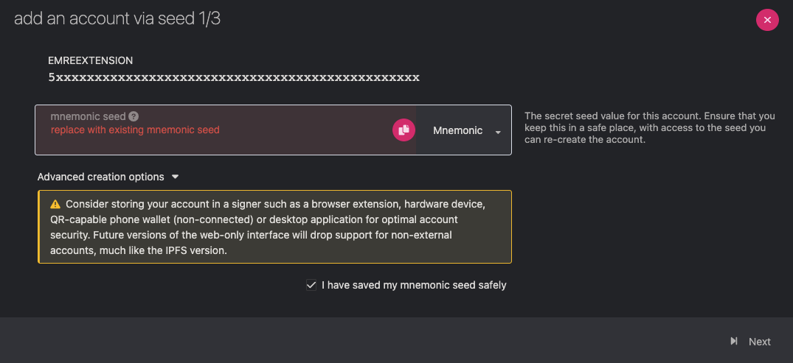

Step 2
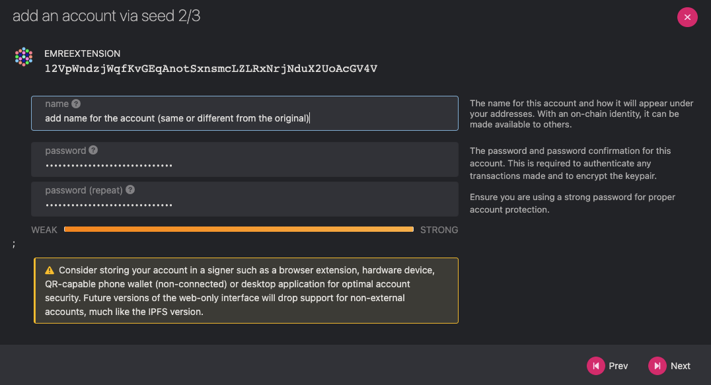

Step 3
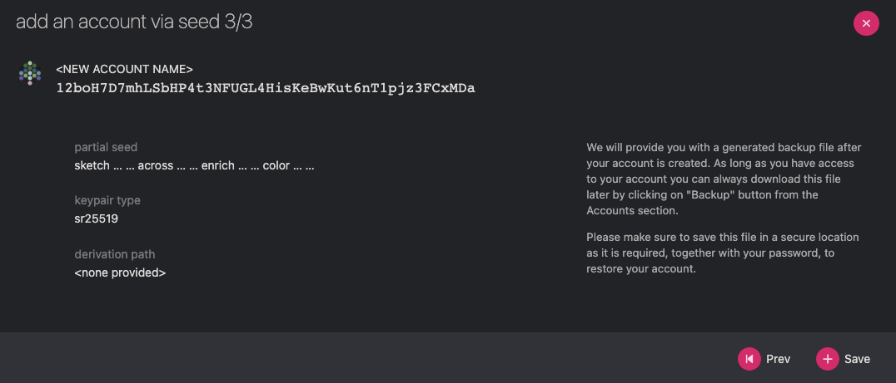

Finally, click the "Save" button, then click the "Create and backup account" button. This will
download the `.json` file which contains the data to be used in account restoration. You can use
this JSON file to restore this account in the future using the instructions above, or simply delete
the file and continue to use the mnemonic phrase to restore the account if necessary.

## Parity Signer

If you've created an account with Parity Signer, you can recover that account with your seed words.
If you generated the account with another wallet, there may be additional steps necessary, including
setting the derivation path: see
[this document](https://github.com/paritytech/parity-signer/blob/master/docs/tutorials/Recover-Account-Polkadotjs.md)
for details.

On Parity Signer, click on the top-right user icon on the screen. Proceed to "+ Add Identity". On
this screen, tap on the "recover existing identity" button.


Enter in the identity name and the mnemonic seed phrase from the account you'd like to restore.

Set an identity PIN that will be used to unlock this account when you need to.

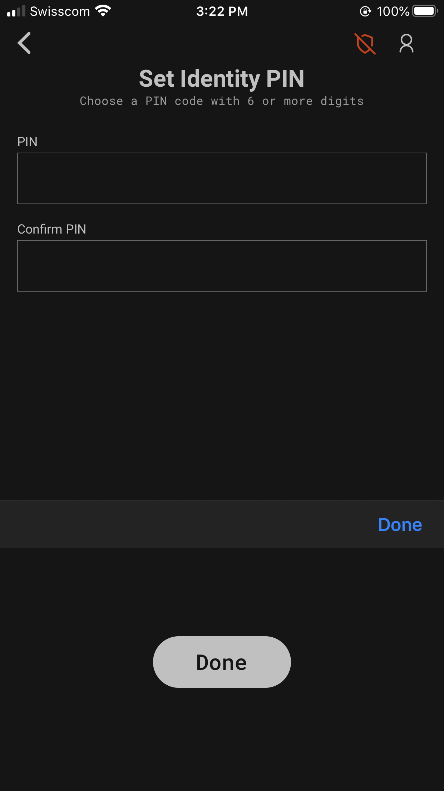

The identity has now been recovered and you can select a network to create the first account.

## Transferring Polkadot-JS Apps Accounts/Addresses From One Computer to Another

:::caution

This will overwrite any existing accounts with the same pubkey on your new computer. 
This generally should not make a difference (since it can still access the same account), but might 
if you have e.g. an account which was stored externally in the extension on the old computer but was 
created directly in browser on the new one.

:::

This has been tested on Brave and Chrome, but not other browsers.

1. Go to Polkadot-JS Apps
2. Go to JavaScript console on the browser (Available in Developer Tools)
3. Type in the command:

```
JSON.stringify(localStorage)
```

4. Copy and paste the returned string to a text editor and save the file.
5. Check that the string you pasted both begins and ends with a tick mark ('). If not, add one to the beginning and end.
6. Save and send that file with the copied string to the new computer.
7. On new computer, go to Polkadot-JS Apps
8. Open the Javascript console on the browser (Available in Developer Tools)
9. Set a variable raw equal to the string from the text file

```
raw = ... copy-pasted json from original computer ...
```

10. Run the following code on the console:

```
accounts = JSON.parse(raw);
for (var key in accounts) {
    if (accounts.hasOwnProperty(key)) {
        val = JSON.stringify(accounts[key]).replace(/\\/g,'').slice(1,-1);
        console.log(key + " -> " + val);
        localStorage.setItem(key, val);
    }
}
```

11. Refresh Polkadot-JS App browser and check Accounts and Addresses pages. All of your accounts and addresses should now be available.
