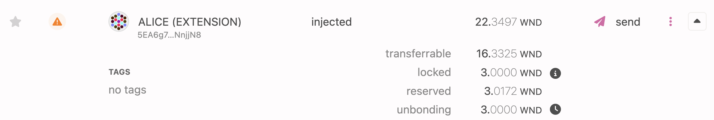

import RPC from "./../../components/RPC-Connection";

This document covers the basics of {{ polkadot: Polkadot :polkadot }}{{ kusama: Kusama :kusama }} accounts. See the [Advanced Account](./learn-account-advanced.md) page for more information about accounts such as [account derivation](./learn-account-advanced.md#derivation-paths) and [indices](./learn-account-advanced.md#indices). For a more in-depth explanation of the cryptography behind {{ polkadot: Polkadot :polkadot }}{{ kusama: Kusama :kusama }} accounts, please see
[the cryptography page](learn-cryptography.md).

## Account Address

An address is the public part of a {{ polkadot: Polkadot :polkadot }}{{ kusama: Kusama :kusama }} account. The private part is the key used to access this
address. The public and private parts together make up a {{ polkadot: Polkadot :polkadot }}{{ kusama: Kusama :kusama }} account. You can think of the
public address of your account like your mailbox and the private key like the key to open that
mailbox. Anybody can send mail to your mailbox, but only you can access them as only you have access
to its key. In the context of {{ polkadot: Polkadot :polkadot }}{{ kusama: Kusama :kusama }} accounts, anybody can send tokens to your public address but
only you can transact with them using your private key. That is why you should keep your private key
secret.

### Mnemonic and Address Generation

A valid account requires a private key that can sign on to one of the
[supported curves and signature schemes](../build/build-protocol-info.md#cryptography). Without a private key an account cannot sign anything. In {{ polkadot: Polkadot :polkadot }}{{ kusama: Kusama :kusama }} there are some exceptions of accounts that do not have private keys (i.e. key-less accounts). Such accounts are [multi-signature accounts](./learn-account-multisig.md) and [anonymous proxies](./learn-proxies.md/#anonymous-proxies) that are not discussed here and are meant for an advanced audience.

Most wallets generate a mnemonic phrase for users to back up their wallets and generate a private
key from the mnemonic. Not all wallets use the same algorithm to convert from mnemonic phrase to
private key, which affects the ability to use the same mnemonic phrase in multiple wallets. Wallets that use different measures will arrive at a different set of addresses from the exact mnemonic phrase.

:::danger Not all wallets use the same algorithm to convert from mnemonic phrase to private key

[Subkey](https://docs.substrate.io/reference/command-line-tools/subkey/) and Polkadot-JS based wallets use the BIP39 dictionary for mnemonic generation, but use the
entropy byte array to generate the private key, while full BIP39 wallets (like Ledger) use 2048
rounds of PBKDF2 on the mnemonic. The same mnemonic may generate different private keys on other
wallets due to the various cryptographic algorithms used. See [Substrate BIP39 Repo](https://github.com/paritytech/substrate-bip39) for more information.

:::

A typical mnemonic phrase generated by
[the Subkey tool](https://docs.substrate.io/reference/command-line-tools/subkey/) is shown below.

```
'caution juice atom organ advance problem want pledge someone senior holiday very'
```

Its corresponding _private/public keypair_ is also shown.

```
Secret seed (Private key): 0x056a6a4e203766ffbea3146967ef25e9daf677b14dc6f6ed8919b1983c9bebbc
Public key (SS58): 5F3sa2TJAWMqDhXG6jhV4N8ko9SxwGy8TpaNS1repo5EYjQX
```

Polkadot default address format is the `MultiAddress` type. This means that the same mnemonic phrase will generate public keys for different parachains. For more information see the [Address Format](./learn-account-advanced.md#address-format) section on the [Advanced Account](./learn-account-advanced.md) page.

### Obtaining and Managing an Address

:::info

To learn more about generating accounts on {{ polkadot: Polkadot :polkadot }}{{ kusama: Kusama :kusama }} visit the [Account Generation page](./learn-account-generation.md).

:::

## Account Balance Types



On {{ polkadot: Polkadot :polkadot }}{{ kusama: Kusama :kusama }}, different balance types indicate whether your balance can be used for
transfers, to pay fees, or must remain frozen and unused due to an on-chain requirement.

- The **total** balance indicates the total number of tokens in the account.
- The **reserved** balance indicates the number of tokens that are frozen for on-chain participation other than staking. Reserved funds are held due to on-chain requirements and can usually be freed by taking
some on-chain action. For example, the "Identity" pallet reserves funds while an on-chain identity
is registered, but by clearing the identity, you can unreserve the funds and make them free again. The same applies to proxies. The idea is that those actions require some network memory usage that is not given for free.
- The **bonded** balance indicates the number of tokens that are frozen for on-chain participation to staking.
- The **redeemable** balance indicates the number of tokens that are ready to be unlocked to become transferrable again. Those tokens already went through the unbonding period.
- The **locked** balance indicates the number of tokens that are frozen for on-chain participation such as staking for example. This is the sum of the _bonded_ and _redeemable_ tokens. Once the lock is removed from the _redeemable_ tokens, the number of _locked_ tokens will be the same as the one of _bonded_ tokens.
- The **transferrable** balance indicates the number of tokens that is free to be transferred. This is calculated by subtracting the number of _locked_ and _reserved_ tokens from the total number of tokens.

## Existential Deposit and Reaping

:::info

See [this technical explainer video](https://youtu.be/Wg0pH05CC9Y) or visit [this support page](https://support.polkadot.network/support/solutions/articles/65000168651-what-is-the-existential-deposit-) for more information about existential deposit.

:::

When you generate an account (address), you only generate a _key_ that lets you access it. The
account does not exist yet on-chain. For that, it needs the existential deposit of {{ polkadot: <RPC network="polkadot" path="query.balances.existentialDeposit" defaultValue={10000000000} filter="humanReadable"/> :polkadot }}{{ kusama: <RPC network="kusama" path="query.balances.existentialDeposit" defaultValue={33333333} filter="humanReadable"/> :kusama }}.

Having an account go below the existential deposit causes that account to be _reaped_. The account
will be wiped from the blockchain's state to conserve space, along with any funds in that address.
You do not lose access to the reaped address - as long as you have your private key or recovery
phrase, you can still use the address - but it needs a top-up of another existential deposit to be
able to interact with the chain.

Transaction fees cannot cause an account to be reaped. Since fees are deducted from the account
before any other transaction logic, accounts with balances _equal to_ the existential deposit cannot
construct a valid transaction. Additional funds will need to be added to cover the transaction fees.

Here's another way to think about existential deposits. Ever notice those `Thumbs.db` files on
Windows or `.DS_Store` files on Mac? Those are junk; they serve no specific purpose other than
making previews a bit faster. If a folder is empty saved for such a file, you can remove the folder
to clear the junk off your hard drive. That does not mean you lose access to this folder forever -
you can always recreate it. You have the _key_, after all - you're the computer's owner. It just
means you want to keep your computer clean until you maybe end up needing this folder again and then
recreate it. Your address is like this folder - it gets removed from the chain when nothing is in it
but gets put back when it has the existential deposit.

## Account Identity

The [Identities pallet](https://github.com/paritytech/substrate/tree/master/frame/identity) built
into Polkadot allows users to attach on-chain metadata to their accounts. Independent registrars can
verify this metadata to provide trustworthiness. To learn more about how to set or release an
identity, how to define sub-accounts, or how to become a registrar, please read
[this guide](learn-identity.md).

## Proxy Accounts

Polkadot comes with a generalized proxy account system that allows users to keep keys in cold
storage while proxies act on their behalf with restricted (or unrestricted) functionality. See the
[proxies](learn-proxies.md) page for more information.

## Multi-signature Accounts

Multi-signature accounts are accounts created from several standard accounts (or even other
multi-sig accounts). For a full explanation, please see the
[Multi-signature accounts page](./learn-account-multisig.md).

## Resources

- [Understanding Accounts and Keys in Polkadot](https://www.crowdcast.io/e/polkadot-keys) - An
  explanation of what the different kinds of accounts and keys are used for in Polkadot, with Bill
  Laboon and Chinmay Patel of BlockX Labs.
