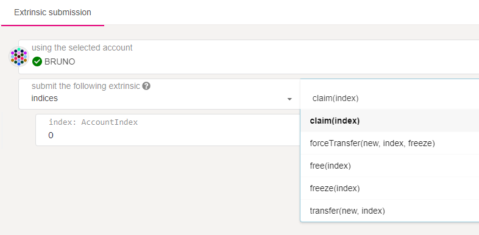
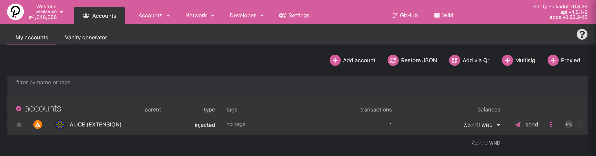
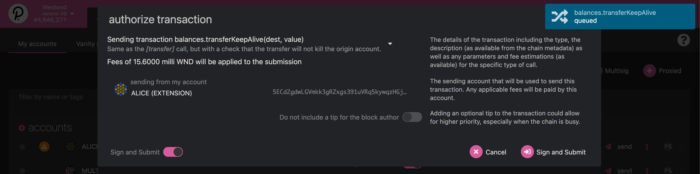
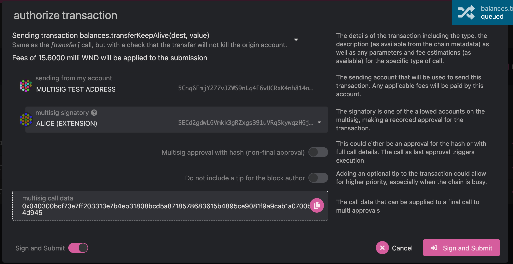
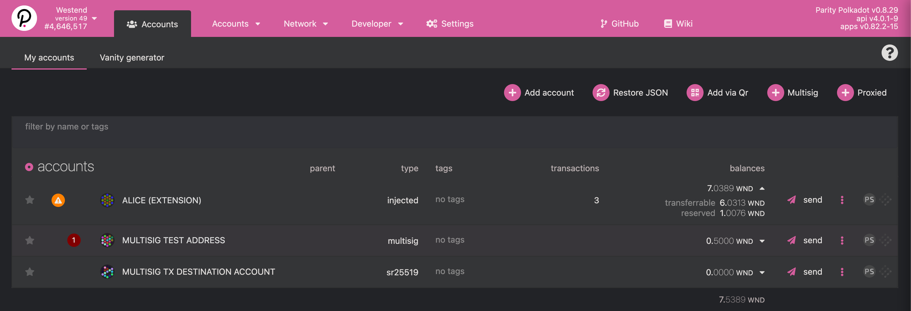
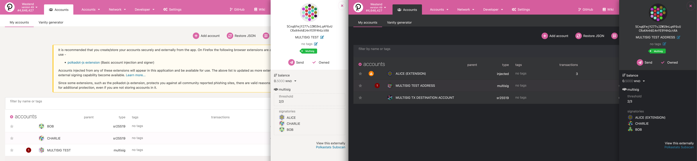
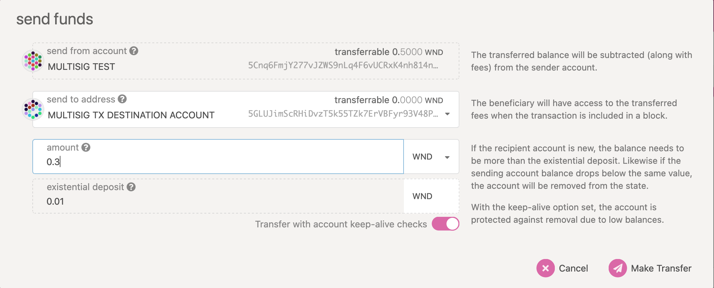
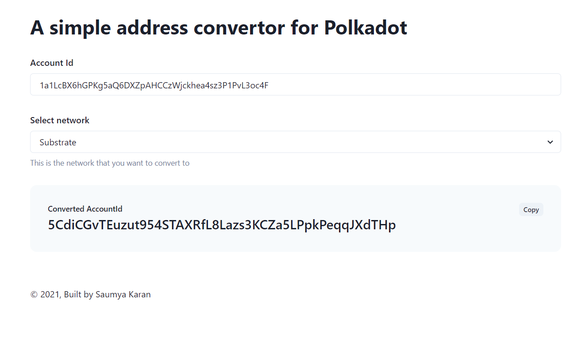
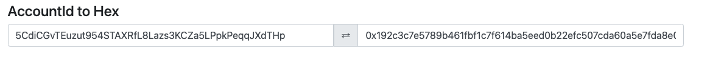

This document covers the basics of Polkadot and Kusama account addresses and how they exist
on-chain. For a more in-depth explanation of the cryptography behind them, please see
[the cryptography page](learn-cryptography.md).

## Address Format

The address format used in Substrate-based chains is SS58. SS58 is a modification of Base-58-check
from Bitcoin with some minor changes. Notably, the format contains an _address type_ prefix that
identifies an address as belonging to a specific network.

For example:

- Polkadot addresses **always start with** the number **1**.
- Kusama addresses always start with a capital letter, such as **C D, F, G, H, J**.
- Generic Substrate addresses **always start with** the number **5**.

These prefixes, including how to validate addresses, are embedded in the 
Substrate SS58 format. Never use regular
expressions for address validation.

It's important to understand that different network formats are **merely other representations of
the same public key in a private-public keypair** generated by an address generation tool. As a
result, the addresses across Substrate-based chains are compatible as long as the format is
converted correctly.

As of Runtime 28, the default [address format](learn-accounts.md##address-format) is the
[`MultiAddress`](https://github.com/paritytech/substrate/blob/master/primitives/runtime/src/multiaddress.rs)
type.

This `enum` is a multi-format address wrapper for on-chain accounts and allows us to describe
Polkadot's default address format to represent many different address types. This includes **20
byte**, **32 byte**, and **arbitrary raw byte** variants. It also allows an enhancement to the
original [`indices`](learn-accounts.md##indices) lookup.

:::info

Many wallets allow you to convert between formats. Stand-alone tools exist as well; you can find
them in the [address conversion tools](#address-conversion-tools) section.

:::

## Address Generation, Derivation, and Portability

A valid account requires a private key that can sign on to one of the
[supported curves and signature schemes](../build/build-protocol-info.md#cryptography).

Most wallets take many steps from a mnemonic phrase to an account key, which affects the ability to
use the same mnemonic phrase in multiple wallets. Wallets that use different measures will arrive at
a different set of addresses from the exact mnemonic phrase.

### Seed Generation

Most wallets generate a mnemonic phrase for users to back up their wallets and generate a private
key from the mnemonic. Not all wallets use the same algorithm to convert from mnemonic phrase to
private key.

A typical mnemonic phrase generated by [the Subkey tool](https://docs.substrate.io/reference/command-line-tools/subkey/)
is shown below.

```
'caution juice atom organ advance problem want pledge someone senior holiday very'
```

Its corresponding _private/public keypair_ is also shown.

```
Secret seed (Private key): 0x056a6a4e203766ffbea3146967ef25e9daf677b14dc6f6ed8919b1983c9bebbc
Public key (SS58): 5F3sa2TJAWMqDhXG6jhV4N8ko9SxwGy8TpaNS1repo5EYjQX
```

Subkey and Polkadot-JS based wallets use the BIP39 dictionary for mnemonic generation, but use the
entropy byte array to generate the private key, while full BIP39 wallets (like Ledger) use 2048
rounds of PBKDF2 on the mnemonic. The same mnemonic may generate different private keys on other
wallets due to the various cryptographic algorithms used.

See [Substrate BIP39 Repo](https://github.com/paritytech/substrate-bip39) for more information.

### Derivation Paths

If you would like to create and manage several accounts on the network using the same seed, you can
use derivation paths. We can think of the derived accounts as child accounts of the root account
created using the original mnemonic seed phrase. Many Polkadot key generation tools support hard and
soft derivation. For instance, if you intend to create an account to be used on the Polkadot chain,
you can derive a **hard key** child account using **//** after the mnemonic phrase.

```
'caution juice atom organ advance problem want pledge someone senior holiday very//0'
```

and a **soft key** child account using **/** after the mnemonic phrase

```
'caution juice atom organ advance problem want pledge someone senior holiday very/0'
```

If you would like to create another account for using the Polkadot chain using the same seed, you
can change the number at the end of the string above. For example, `/1`, `/2`, and `/3` will create
different derived accounts.

You can use any letters or numbers in the derivation path as long as they make sense to you; they do
not have to follow any specific pattern. You may combine multiple derivations in your path, as well.
For instance, `//bill//account//1` and `//john/polkadot/initial` are both valid. To recreate a
derived account, you must know both the seed and the derivation path, so you should either use a
well-defined sequence (e.g. //0, //1, //2...) or be sure to write down any derivation paths you use.


:::info 

It is not possible to generate a derived account without also knowing the derivation path.

:::

### Soft vs. Hard Derivation

A soft derivation allows someone to potentially "go backwards" to figure out the initial account's
private key if they know the derived account's private key. It is also possible to determine that
different accounts generated from the same seed are linked to that seed. A hard derivation path does
not allow either of these - even if you know a derived private key, it's not feasible to figure out
the private key of the root address, and it's impossible to prove that the first account is linked
with the second. These derivation methods have their use cases, given that the private keys for all
the derived accounts are fully secure. Unless you have a specific need for a soft derivation, it is
recommended to generate the account using a hard derivation path.

See the [Subkey documentation](https://docs.substrate.io/reference/command-line-tools/subkey/) for details and examples
of derivation path formats. The Polkadot-JS Apps and Extension and Parity Signer support custom
derivation paths using the same syntax as Subkey.

Some wallets will automatically add derivation paths to the end of the generated mnemonic phrase.
This will generate separate seeds for separate paths, allowing separate signing keys with the same
mnemonic, e.g. `<mnemonic phrase>//polkadot` and `<mnemonic phrase>//kusama`. Although you may
correctly save the mnemonic phrase, using it in another wallet will not generate the same addresses
unless both wallets use the same derivation paths.

Polkadot and Kusama both have paths registered in the
[BIP44 registry](https://github.com/satoshilabs/slips/blob/master/slip-0044.md).

:::warning

You must have both the _parent_ private key and the derivation path to arrive at the
key for an address. Do not use custom derivation paths unless you are comfortable with your
understanding of this topic.

:::

### Portability

The above information brings us to portability: the ability to use a mnemonic phrase or seed across
multiple wallets. Portability depends on several factors:

- Derivation path
- Mnemonic format
- Seed derivation
- Signature scheme

If you want to use the exact mnemonic across multiple wallets, make sure that they follow compatible
methods for generating keys and signing messages. If you cannot find understandable documentation,
reach out to the project maintainers.

|                         | Mnemonic Format | Derivation Path | Seed Derivation |      Signature Support      |
| :---------------------- | :-------------: | :-------------: | :-------------: | :-------------------------: |
| Polkadot{.js} Extension |    Standard     |  User-Defined   |      BIP32      |           sr25519           |
| Polkadot-JS Apps        |   Standard\*    |  User-Defined   |      BIP32      | sr25519, ed25519, secp256k  |
| Ledger                  |      BIP39      |  BIP44&dagger;  |  BIP32&Dagger;  |        ed25519&sect;        |
| Subkey                  |   Standard\*    |  User-Defined   |      BIP32      | sr25519, ed25519, secp256k1 |

\* Ed25519 keys have [limited compatibility](https://github.com/paritytech/substrate-bip39) with
BIP39.

&dagger; [BIP44 Registry](https://github.com/satoshilabs/slips/blob/master/slip-0044.md)

&Dagger; Ed25519 and BIP32 based on
[Khovratovich](https://github.com/LedgerHQ/orakolo/blob/master/papers/Ed25519_BIP%20Final.pdf)

&sect; Sr25519 planned

### For the Curious: How Prefixes Work

The [SS58 document](<https://github.com/paritytech/substrate/wiki/External-Address-Format-(SS58)>)
states that:

- Polkadot has an address type of `00000000b`, so `0` is in decimal.
- Kusama (Polkadot Canary) has an address type of `00000010b`, so `2` is in decimal.
- Generic Substrate has `00101010b` as the address type, `42` is in decimal.

Because the `Base58-check` alphabet has no number 0, the lowest value is indeed 1. So `00000000b` is
1 in Base58-check. If we try to
[decode](https://www.better-converter.com/Encoders-Decoders/Base58Check-to-Hexadecimal-Decoder) a
Polkadot address like `1FRMM8PEiWXYax7rpS6X4XZX1aAAxSWx1CrKTyrVYhV24fg`, the result is
`000aff6865635ae11013a83835c019d44ec3f865145943f487ae82a8e7bed3a66b29d7`. The first byte is `00`,
which is indeed `00000000` in binary and `0` in decimal and thus matches the address type of
Polkadot.

Let's take a look at Substrate addresses. If we decode
`5CK8D1sKNwF473wbuBP6NuhQfPaWUetNsWUNAAzVwTfxqjfr`, we get
`2a0aff6865635ae11013a83835c019d44ec3f865145943f487ae82a8e7bed3a66b77e5`. The first byte is `2a`
which when
[converted from hex to decimal](https://www.rapidtables.com/convert/number/hex-to-decimal.html)
is 42. 42 is `00101010` in binary, just as the SS58 document states.

Finally, let's look at Kusama addresses. Decoding `CpjsLDC1JFyrhm3ftC9Gs4QoyrkHKhZKtK7YqGTRFtTafgp`
gives us `020aff6865635ae11013a83835c019d44ec3f865145943f487ae82a8e7bed3a66b0985` with the first
byte being `02`, just as specified. If we try a Kusama address that starts with a completely
different letter, like `J4iggBtsWsb61RemU2TDWDXTNHqHNfBSAkGvVZBtn1AJV1a`, we still get `02` as the
first byte: `02f2d606a67f58fa0b3ad2b556195a0ef905676efd4e3ec62f8fa1b8461355f1142509`. It seems
counterintuitive that some addresses always have the same prefix and others like Kusama can vary
wildly, but it's just a quirk of Base58-check encoding.

## Obtaining and Managing an Address

The **most user-friendly** way to create a Polkadot or Kusama address is through the
[Polkadot-JS UI](https://polkadot.js.org/apps/#/accounts). Remember to back up the seed phrase used
to generate your account - the accounts are stored only in your browser, so purging the cache will
wipe your accounts as well. You would then have to recreate them using the seed phrase given to you
by the UI - this will also restore all your previously held balances.

A **more convenient and recommended** method of keeping the accounts stored on your computer is
using the [Polkadot{.js} extension](https://github.com/polkadot-js/extension). This extension
remembers your accounts and allows you to clear your browser cache without fear. Still, don't forget
to back up your seed phrase - if you lose access to this computer or the extension somehow crashes
beyond repair, the phrase will come in handy.

Please note that as this keeps your accounts in the browser, it is not safe to keep significant
holdings. By definition, a browser is a "hot wallet" and susceptible to a wide range of attacks, so
keep your funds in cold storage when dealing with non-trivial amounts. For improved security, you
can securely stash away the seed phrase for your accounts and remove all traces of the accounts from
your computer after creating them.

Besides the extension and the default UI, Polkadot and Kusama addresses can also be created with the
[Subkey tool](https://github.com/paritytech/substrate/tree/master/bin/utils/subkey). Subkey is
intended for users comfortable with using the command line and can seem intimidating but is quite
approachable. Follow the instructions in the
[Subkey documentation](https://docs.substrate.io/reference/command-line-tools/subkey/). When used properly, Subkey is
the **most secure** available method of creating an account.

There is also the very secure [Parity Signer](https://www.parity.io/signer/). This keeps your keys
on an air-gapped mobile phone. However, it does require obtaining an old Android or iOS-compatible
phone that you are comfortable using only for Parity Signer.

Hardware wallet integration is possible with Ledger. A full guide is available
[here](../general/ledger.md).

Alternatively, you might find other wallets on the [Wallet](../build/build-wallets.md) page, but
bear in mind that some of these are **unaudited** and are not officially affiliated with Web3
Foundation or the Polkadot project unless otherwise stated.

## Balance Types

On Polkadot, **four different balance types** indicate whether your balance can be used for
transfers, to pay fees, or must remain frozen and unused due to an on-chain requirement.

The `AccountData` struct defines the balance types in Substrate. The four types of balances include
`free`, `reserved`, `misc_frozen` (`miscFrozen` in camel-case), and `fee_frozen` (`feeFrozen` in
camel-case).

In general, the **usable** balance of the account is the amount that is `free` minus any funds that
are considered frozen (either `misc_frozen` or `fee_frozen`) and depend on the reason for which the
funds are to be used. If the funds are to be used for transfers, then the usable amount is the
_free_ amount minus any `misc_frozen` funds. However, if the funds are to be used to pay transaction
fees, the usable amount would be the _free_ funds minus `fee_frozen`.

The **total** balance of the account is considered to be the sum of `free` and `reserved` funds in
the account. Reserved funds are held due to on-chain requirements and can usually be freed by taking
some on-chain action. For example, the "Identity" pallet reserves funds while an on-chain identity
is registered, but by clearing the identity, you can unreserve the funds and make them free again.

## Existential Deposit and Reaping

When you generate an account (address), you only generate a _key_ that lets you access it. The
account does not exist yet on-chain. For that, it needs the existential deposit: 0.0000333333 KSM
(on Kusama) or 1 DOT (on Polkadot mainnet).

Having an account go below the existential deposit causes that account to be _reaped_. The account
will be wiped from the blockchain's state to conserve space, along with any funds in that address.
You do not lose access to the reaped address - as long as you have your private key or recovery
phrase, you can still use the address - but it needs a top-up of another existential deposit to be
able to interact with the chain.

Transaction fees cannot cause an account to be reaped. Since fees are deducted from the account
before any other transaction logic, accounts with balances _equal to_ the existential deposit cannot
construct a valid transaction. Additional funds will need to be added to cover the transaction fees.

Here's another way to think about existential deposits. Ever notice those `Thumbs.db` files on
Windows or `.DS_Store` files on Mac? Those are junk; they serve no specific purpose other than
making previews a bit faster. If a folder is empty saved for such a file, you can remove the folder
to clear the junk off your hard drive. That does not mean you lose access to this folder forever -
you can always recreate it. You have the _key_, after all - you're the computer's owner. It just
means you want to keep your computer clean until you maybe end up needing this folder again and then
recreate it. Your address is like this folder - it gets removed from the chain when nothing is in it
but gets put back when it has the existential deposit.

## Indices

A Kusama or Polkadot address can have an index. An index is like a short and easy-to-remember
version of an address. Claiming an index requires a deposit that is released when the index is
cleared. Any index can be claimed as long as it is not taken by someone else.

:::note Lookup Account Index on-chain

When someone shares their account index, their actual account address on-chain can be looked up
through Polkadot-JS Apps UI > Developer > Chain state  and then query accounts from indices, by
providing the Account Index.

:::

Here is an example snapshot that shows how to lookup the corresponding account address of the
account index 1988 on Westend network, using Polkadot-JS Apps UI$


But what if an account gets reaped as explained above? In that case, the index is emptied. In other
words, the slot frees up again, making it available for anyone to claim it. It is possible to _freeze_ 
an index and permanently assign it to an address. This action consumes a deposit but makes sure that 
the index can never be reclaimed unless released by the holding account.

To register an index, submit a `claim` extrinsic to the `indices` pallet, and follow up with a
`freeze` extrinsic. The easiest way to do this is via PolkadotJS UI through the _Developer ->
Extrinsics_ menu:



To find available indices to claim on Polkadot or Kusama,
[this helper tool may come in handy](https://www.shawntabrizi.com/substrate-js-utilities/indices/).

## Identities

The [_Identities pallet_](https://github.com/paritytech/substrate/tree/master/frame/identity) built
into Polkadot allows users to attach on-chain metadata to their accounts. Independent registrars can
verify this metadata to provide trustworthiness. To learn more about how to set or release an
identity, how to define sub-accounts, or how to become a registrar, please read
[this guide](learn-identity.md).

## Proxy Accounts

Polkadot comes with a generalized proxy account system that allows users to keep keys in cold
storage while proxies act on their behalf with restricted (or unrestricted) functionality. See the
[proxies](learn-proxies.md) page for more information.

## Multi-signature Accounts

It is possible to create a multi-signature account in Substrate-based chains. A multi-signature
account is composed of one or more addresses and a threshold. The threshold defines how many
signatories (participating addresses) need to agree on submitting an extrinsic for the call to be
successful.

For example, Alice, Bob, and Charlie set up a multi-sig with a threshold of 2. This means Alice and
Bob can execute any call even if Charlie disagrees with it. Likewise, Charlie and Bob can execute
any call without Alice. A threshold is typically a number smaller than the total number of members
but can also be equal to it, which means they all have to agree.

:::note Explainer on multisig accounts

Learn more about multisig accounts from our
[technical explainer video](https://www.youtube.com/watch?v=ZJLqszvhMyM&list=PLOyWqupZ-WGuAuS00rK-pebTMAOxW41W8&index=25&ab_channel=Polkadot).

:::

Multi-signature accounts have several uses:

- securing your own stash: use additional signatories as a 2FA mechanism to secure your funds. One
  signer can be on one computer, and another can be on another or in cold storage. This slows down
  your interactions with the chain but is orders of magnitude more secure.
- board decisions: legal entities such as businesses and foundations use multi-sigs to govern over
  the entity's treasury collectively.
- group participation in governance: a multi-sig account can do everything a regular account can. A
  multi-sig account could be a council member in Kusama's governance, where a set of community
  members could vote as one entity.

Multi-signature accounts **cannot be modified after being created**. Changing the set of members or
altering the threshold is not possible and instead requires the dissolution of the current multi-sig
and creation of a new one. As such, multi-sig account addresses are **deterministic**, i.e. you can
always calculate the address of a multi-sig by knowing the members and the threshold, without the
account existing yet. This means one can send tokens to an address that does not exist yet, and if
the entities designated as the recipients come together in a new multi-sig under a matching
threshold, they will immediately have access to these tokens.

### Generating Addresses of Multi-signature Accounts

:::note Addresses that are provided to the multi-sig wallets must be sorted

The below methods for generating sort the accounts for you, but if you are implementing your 
own sorting, then be aware that the public keys are compared byte-for-byte and sorted ascending 
before being inserted in the payload that is hashed.

:::

Addresses are deterministically generated from the signers and threshold of the multisig wallet. For
a code example (in TypeScript) of generating you can view the internals of `@w3f/msig-util`
[here](https://github.com/lsaether/msig-util/blob/master/src/actions/deriveAddress.ts).

The `@w3f/msig-util` is a small CLI tool that can determine the multi-signature address based on
your inputs.

```zsh
$ npx @w3f/msig-util@1.0.7 derive --addresses 15o5762QE4UPrUaYcM83HERK7Wzbmgcsxa93NJjkHGH1unvr,1TMxLj56NtRg3scE7rRo8H9GZJMFXdsJk1GyxCuTRAxTTzU --threshold 1
npx: installed 79 in 7.764s
--------------------------------
Addresses: 15o5762QE4UPrUaYcM83HERK7Wzbmgcsxa93NJjkHGH1unvr 1TMxLj56NtRg3scE7rRo8H9GZJMFXdsJk1GyxCuTRAxTTzU
Threshold: 1
Multisig Address (SS58: 0): 15FKUKXC6kwaXxJ1tXNywmFy4ZY6FoDFCnU3fMbibFdeqwGw
--------------------------------
```

The Polkadot-JS Apps UI also supports multi-sig accounts, as documented in the
[Account Generation page](learn-account-generation.md#multi-signature-accounts). This is easier than
generating them manually.

### Making Transactions with a Multi-signature Account

There are three types of actions you can take with a multi-sig account:

- Executing a call.
- Approving a call.
- Cancelling a call.

In scenarios where only a single approval is needed, a convenience method `as_multi_threshold_1`
should be used. This function takes only the other signatories and the raw call as its arguments.

However, in anything but the simple one approval case, you will likely need more than one of the
signatories to approve the call before finally executing it. When you create a new call or approve a
call as a multi-sig, you will need to place a small deposit. The deposit stays locked in the pallet
until the call is executed. The deposit is to establish an economic cost on the storage space that
the multi-sig call takes up on the chain and discourage users from creating dangling multi-sig
operations that never get executed. The deposit will be reserved in the caller's accounts, so
participants in multi-signature wallets should have spare funds available.

The deposit is dependent on the `threshold` parameter and is calculated as follows:

```
Deposit = DepositBase + threshold * DepositFactor
```

Where `DepositBase` and `DepositFactor` are chain constants set in the runtime code.

Currently, the **DepositBase** equals `deposit(1, 88)` (key size is 32; value is size 4+4+16+32 = 56
bytes) and the **DepositFactor** equals `deposit(0, 32)` (additional address of 32 bytes).

The deposit function in JavaScript is defined below, cribbed from the
[Rust source](https://github.com/paritytech/polkadot/blob/master/runtime/polkadot/constants/src/lib.rs).

```js
// Polkadot
const DOLLARS = 10000000000; // planck
const MILLICENTS = 100000; // planck

// Kusama
// const DOLLARS = 166666666666.67;
// const MILLICENTS = 1666666.66;

const deposit = (items, bytes) => {
  return items * 20 * DOLLARS + bytes * 100 * MILLICENTS;
};

console.log('DepositBase', deposit(1, 88));
console.log('DepositFactor', deposit(0, 32));
```

Thus the deposit values can be calculated as shown in the table below.

|               | Polkadot (DOT) | Kusama (KSM)   | Polkadot (planck) | Kusama (planck) |
| ------------- | -------------- | -------------- | ----------------- | --------------- |
| DepositBase   | 20.088         | 3.3401         | 200880000000      | 3340100000000   |
| DepositFactor | .032           | 0.005333333312 | 320000000         | 5333333312      |

Let's consider an example of a multi-sig on Polkadot with a threshold of 2 and 3 signers: Alice,
Bob, and Charlie. First, Alice will create the call on-chain by calling `as_multi` with the raw
call. When doing this Alice will have to deposit `DepositBase + (2 * DepositFactor) = 20.152 DOT`
while she waits for either Bob or Charlie also to approve the call. When Bob comes to approve the
call and execute the transaction, he will not need to place the deposit, and Alice will receive her
deposit back.

### Example with Polkadot.JS

For this example, we will be using the
[Westend](../maintain/maintain-networks.md#westend-test-network) testnet and
[Polkadot.JS Apps](learn-balance-transfers.md#polkadot-js-apps) to create a 2-of-3 multisig address
and send a transaction with it.

:::note 

While Westend is meant to replicate the Polkadot mainnet as closely as possible, there are a few
notable differences:

- Existential deposit is equal to 0.01 WND (Westies; Westend's native coin) instead of 1 DOT.
- The multi-signature transaction deposit is equal to ~1 WND instead of ~20.2 DOT.

The photos below reflect values in WND, but instructions are the same for DOT.

:::

**To create a multisig address and send a transaction using it, you will need the following:**

- List of the multisig member's addresses. We will use Alice, Bob, and Charlie.
- This must be in the address that initiates a multi-signature transaction (in this example,
  Alice).- DOT to deposit into the multisig address.
- ~20.2 DOT refundable deposit to send a multisig transaction.

You should already have your account with some coins in it.



To generate the multisig address, we need **to add the multisig member addresses to the contact
book** under "Accounts > Address book".


Click "Add Contact" in the upper right and provide the address and a name for each address.


Here, Bob and Charlie have been added.


**Next, we need to create the new multi-signature address.** Navigate to the Accounts page (from the
toolbar, "Accounts > Accounts") and click the "+ Multisig" button. We will supply the three multisig
member addresses with a value '2' for the threshold.


Click 'Create', and you should see the new multisig address appear on this Accounts page.


**Let's fund the address now.** For this example, we will transfer some coins from Alice's account
to the multisig address. Under Alice's address, click 'Send', select the multisig wallet as the
destination, and provide an amount. Then, click 'Make Transfer', and then 'Sign and Submit'.

 

We can see that the multisig account now has a balance.


**To send a transaction, we need one of the members to initiate it.** Let's use Alice to initiate
the transaction.

Make sure Alice has enough coins to cover the multisig transaction deposit and the transaction fees.
Then, click 'Send' under the "Multisig Test Address", select a destination address (we generated an
address locally) and a transfer amount, and click 'Make Transfer'.


To sign as Alice, make sure she is selected as the 'multisig signatory', click 'Sign and Submit',
and sign the transaction.



You will now see a pending transaction the 'Multisig Test Address' (the purple icon next to the
account name), and if you click the dropdown arrow right of Alice's balance - you will see that a
value equivalent to the multisig deposit has been 'reserved'; rendering that value untransferable
until the multisig transaction completes.



**Next, we need a second signature.** Let's get it from Bob. In Bob's browser, repeat the following
from the above steps.

1. Add Alice, Charlie, and the multisig transaction destination addresses to Bob's Address book.
2. Create a new multisig address with the same parameters (Bob, Alice, and Charlie's addresses, and
   a threshold value of '2').


:::note

Since multisig address generation is deterministic, if Bob (or any other member), on his
computer was to generate a multisig address using Alice's, Charlie's, and his addresses, with a
threshold value of '2', he would produce the **same** multisig address that Alice has here.

:::

If done correctly, we should see that the **same** multisig address is produced in Bob's browser,
and that a pending transaction is displayed, too.



:::note

Alice initiated the transaction by uploading a signature of the hash of the transaction and the
hash.

:::

Next, to get Bob's signature, he must craft the same multisig transaction that Alice did by
providing the same destination address and transfer amount (together, transaction parameters),
signing and submitting it. These transaction parameters will allow Bob to produce and sign the same
transaction (the same hash) that Alice signed earlier.



Click 'Make Transfer' - ensure that Bob is the 'multisig signatory', and click 'Sign and Submit'.

:::note

'Multisig message with the call (for final approval)' is automatically enabled; this means
that, since the transaction will reach the signature threshold, it will execute the actual
transaction on the chain after adding the second signature.

:::


Assuming no errors, 'Multisig Destination Account' has a balance of 0.3 WND, and Alice's account has
released the multisig transaction deposit.


## Decoding Call Data

You can use Polkadot-JS Apps to decode call data, as the extension only shows raw call data.
This will allow you to know what you're signing. 

:::note

The decoded call data requires you to understand what the events or calls mean in the context of 
the transaction.

:::

1. Before submitting a transaction, copy the call data.


2. Navigate to the [Decode tab](https://polkadot.js.org/apps/#/extrinsics/decode) under the 
   Extrinsics section and paste the call data in the "hex-encoded call" window. Make sure you have 
   the correct account selected.

3. Verify that the data is what you expect.


4. Navigate back to the Polkadot-JS extension and approve the transaction.

Another way to perform this is to update your metadata for that chain. You will then be able to 
have the Polkadot-JS extension parse the call data for you.

## Address Conversion Tools

You can use the tools below to convert any SS58 address for any network for use on different
networks

- [handy subscan tool](https://polkadot.subscan.io/tools/ss58_transform)
- [simple address converter](https://polkadot-address-convertor.netlify.app/)

### How to Verify a Public Key's Associated Address

You can verify your public key's associated address through a series of inspection steps, where the
key is a base-16 (hexadecimal) address.

#### Using Subkey to Retrieve Public Key from SS58 Address

This is to showcase that the **SS58 address is based on the public key (aka "Account ID")**

The Subkey Tool's The [Inspecting Keys](https://docs.substrate.io/reference/command-line-tools/subkey/#inspecting-keys)
section explains how to use the `inspect` command to recalculate your key pair's public key and
address.

Start by inspecting your account's Polkadot address by running the inspect command against your
account's address:

```bash
$ subkey inspect 1a1LcBX6hGPKg5aQ6DXZpAHCCzWjckhea4sz3P1PvL3oc4F

Public Key URI `1a1LcBX6hGPKg5aQ6DXZpAHCCzWjckhea4sz3P1PvL3oc4F` is account:
  Network ID/version: polkadot
  Public key (hex):   0x192c3c7e5789b461fbf1c7f614ba5eed0b22efc507cda60a5e7fda8e046bcdce
  Account ID:         0x192c3c7e5789b461fbf1c7f614ba5eed0b22efc507cda60a5e7fda8e046bcdce
  SS58 Address:       1a1LcBX6hGPKg5aQ6DXZpAHCCzWjckhea4sz3P1PvL3oc4F
```

Take note of the hexadecimal string for "Public key (hex)". This is your account's public key.

Running the `inspect` command on your public key along with the `--public` parameter the SS58
address for the default network (substrate) is returned.

```bash
$ subkey inspect --public 0x192c3c7e5789b461fbf1c7f614ba5eed0b22efc507cda60a5e7fda8e046bcdce

Network ID/version: substrate
  Public key (hex):   0x192c3c7e5789b461fbf1c7f614ba5eed0b22efc507cda60a5e7fda8e046bcdce
  Account ID:         0x192c3c7e5789b461fbf1c7f614ba5eed0b22efc507cda60a5e7fda8e046bcdce
  Public key (SS58):  5CdiCGvTEuzut954STAXRfL8Lazs3KCZa5LPpkPeqqJXdTHp
  SS58 Address:       5CdiCGvTEuzut954STAXRfL8Lazs3KCZa5LPpkPeqqJXdTHp
```

Using the `--network` flag, you can define the network that you would like to inspect, where the
SS58 address will be based on that network. Now, running the `inspect` command with
`--network polkadot` return your original Polkadot address, thus verifying the public key.

```bash
$ subkey inspect --network polkadot 5CdiCGvTEuzut954STAXRfL8Lazs3KCZa5LPpkPeqqJXdTHp

Public Key URI `5CdiCGvTEuzut954STAXRfL8Lazs3KCZa5LPpkPeqqJXdTHp` is account:
  Network ID/version: polkadot
  Public key (hex):   0x192c3c7e5789b461fbf1c7f614ba5eed0b22efc507cda60a5e7fda8e046bcdce
  Account ID:         0x192c3c7e5789b461fbf1c7f614ba5eed0b22efc507cda60a5e7fda8e046bcdce
  Public key (SS58):  1a1LcBX6hGPKg5aQ6DXZpAHCCzWjckhea4sz3P1PvL3oc4F
  SS58 Address:       1a1LcBX6hGPKg5aQ6DXZpAHCCzWjckhea4sz3P1PvL3oc4F
```

You will notice that the Subkey Tool recognizes the correct address network and returns the
associated public key. The public key is returned as a hexadecimal string (i.e. prefixed with
**"0x"**). **For both SS58 addresses, the same public key is returned.**

#### Address Verification

##### Consider the following example:



If you are comfortable enough to distinguish between each account parameter, you can prefix the
public-key string with **"0x"** on your own:

From:
`Pay DOTs to the Polkadot account:192c3c7e5789b461fbf1c7f614ba5eed0b22efc507cda60a5e7fda8e046bcdce`,
we prefix the address by "0x" ->
`0x192c3c7e5789b461fbf1c7f614ba5eed0b22efc507cda60a5e7fda8e046bcdce`.

Using the [handy subscan tool](https://polkadot.subscan.io/tools/ss58_transform), you can verify
both address associations to your public key. Copy your public key into the "Input Account or Public
Key" textbox and click "Transform" at the bottom. On the right-hand side, the addresses for Polkadot
and Substrate that are returned based on your public key should match the ones you inspected.



:::note

You may have to scroll down to the bottom of the menu to find the Substrate address based on
the menu listings. You will notice that many networks that also use the same Substrate address.

:::

You can verify your public key verification by recalling that Polkadot addresses start with a '1',
whereas Substrate addresses generally start with a '5' (Kusama addresses start with a capital
letter). See [Addresses](learn-accounts.md#address-format) for more details.

Furthermore, the [Utility Scripts](https://github.com/w3f/utility-scripts) can be referenced for how
the verification is performed:
[pubkeyToAddress.js](https://github.com/w3f/utility-scripts/blob/master/src/misc/pubkeyToAddress.js)
demonstrates how a single public key interprets a Polkadot, Substrate, or Kusama address.

## Resources

- [Understanding Accounts and Keys in Polkadot](https://www.crowdcast.io/e/polkadot-keys) - An
  explanation of what the different kinds of accounts and keys are used for in Polkadot, with Bill
  Laboon and Chinmay Patel of BlockX Labs.
