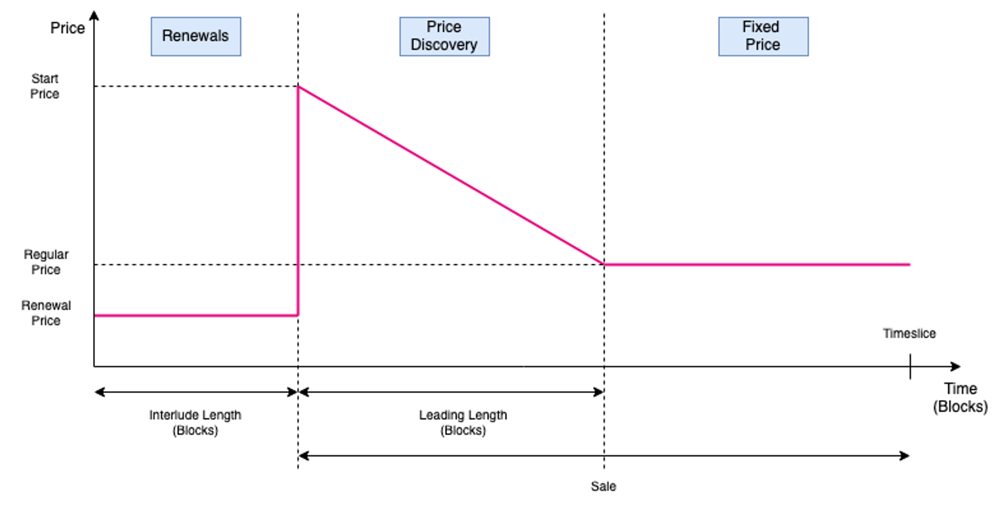

[Scheduling](https://en.wikipedia.org/wiki/Scheduling_(computing)) is the process of assigning
tasks or jobs to resources (like CPU cores) at specific times or under certain conditions. Effective
scheduling ensures that resources are used efficiently and that tasks are completed in a timely
manner.

Polkadot introduces scheduling with **Agile Coretime**, enabling efficient utilization of Polkadot
network resources and provides economic flexibility for builders, generalizing Polkadot beyond what
was initially proposed and envisioned in its
[whitepaper](https://polkadot.com/papers/). The introduction of coretime
enables multi-threading.

[Multi-threading](https://en.wikipedia.org/wiki/Multithreading_(computer_architecture))) is a
programming model where multiple threads (smaller sequences of programmed instructions) are created
within a single process to perform multiple tasks at once. Multi-threading is commonly used to
improve the performance of applications by executing different parts of a program concurrently.
[Concurrency](https://en.wikipedia.org/wiki/Concurrency_(computer_science)) does not imply
parallel execution; rather, it enables a system to manage multiple processes by quickly switching
among them.

Polkadot achieves multi-threading by [splitting and interlacing](#splitting-and-interlacing)
Coretime.

<!-- TODO: INDEX CARDS -->

## Introduction to Agile Coretime

In Polkadot 1.0, the only way for a parachain to be secured by Polkadot was to rent a lease through
an auction, which guaranteed parachain block validation for up-to two
years. This involved locking significant amount of DOT, leading to a high barrier of entry for small
and medium scale blockchain projects. The parachains produced blocks at a regular interval of 12
seconds, irrespective of the network activity. This led to inefficient resource allocation and
misplaced economic incentives while producing almost empty blocks under lighter traffic and being
unable to accommodate heavier traffic when it exceeded block limits. Agile Coretime resolves all of
these drawbacks.

The figure below shows the core usage for Polkadot 1.0, where the horizontal axis is time, and each
row represents a core. Colors show different parachains, each using one core (i.e., one parachain,
one core).

Agile Coretime allows for the purchase of [coretime](#coretime) in “bulk” with an allocation for one
month. Heavy duty parachains which need to author a block every 12 seconds (or every 6s through
[Asynchronous Backing](./learn-async-backing.md)), can seamlessly “renew” the [core](#core) each
month. Coretime renewal orders take precedence over new orders and provide protection against price
fluctuations, allowing parachains to plan their project budget and costs more effectively.

The purchased coretime can also be split up and sold in parts, down to a single block per month,
allowing for secondary markets to thrive and improve the allocation efficiency of coretime.
Furthermore, Agile Coretime offers [on-demand coretime](#on-demand-coretime) functionality that
enables the authoring of a parachain block on-demand.

## Agile Coretime Terminology

### Core

The term "Core" captures the virtual abstraction of computational resources provided by the relay
chain to secure the blocks of a parachain, which involves a randomized set of the relay chain
validators.

### Coretime

The time allocated for utilizing a core, measured in relay chain blocks.

### Bulk Coretime

A fixed duration of continuous coretime represented by an NFT that can be split, shared, or resold.
Currently, the duration of bulk coretime is set to 28 days.

### Region

The NFT representing a single unit of bulk coretime.

### On-demand Coretime

Previously known as instantaneous coretime, the on-demand coretime refers to coretime acquired
through bidding in near real-time for the validation of a single parachain block on one of the cores
reserved specifically for on-demand orders.

!!!info "Parathreads are renamed to on-demand parachains"
    On-demand parachains (previously called parathreads) are parachains that buy on-demand coretime and use it to access the relay chain through the on-demand coretime pool.

### On-demand Coretime Pool

Set of cores that are available on-demand. Cores reserved through bulk coretime could also be made
available in the on-demand coretime pool, in parts or in entirety.

### Coretime Chain

A system parachain that is responsible for the sale, manipulation of bulk coretime and eventually
the purchase of on-demand coretime credits. It is also responsible for scheduling the respective
cores on the relay chain to the parachains.

### Timeslice

A timeslice represents the granularity the Coretime Chain schedules cores on the relay chain. The
Coretime Chain announces a schedule for each core, comprising the next 80 relay chain blocks in
advance. 5,040 timeslices corresponds to the region length of 28 days (which is the initial
configuration set for bulk coretime).

### Task

The term "Task" captures the abstraction of utility of the core. Tasks on the cores are not just
limited to securing parachains.

## Agile Coretime Implementation

Coretime is managed through the
[broker pallet](https://github.com/paritytech/polkadot-sdk/blob/eefd5fe4499515da66d088505093f75b5aa22550/substrate/frame/broker/src/lib.rs)
which is deployed on the Coretime Chain. In theory, the Polkadot relay chain can support around a
hundred cores seamlessly and can support over a few hundred cores through optimizations. Preliminary
tests ran successfully with 80 cores with 12-second block times.
[**Coretime revenue sales are burned**](https://hub.regionx.tech/?network=polkadot).

### Coretime Sales

Sales on the Coretime Chain are of `timeslice` length. These sales are divided into two main
periods: the Renewal period and the Sale period.

- Renewal periods are of `interlude_length` blocks long, and it’s where bulk coretime can be
  renewed.
- Sale periods are as well divided into two periods: a Price Discovery period and a Fixed Price
  period. After the Renewal period, a new `start_price` will be set by the Coretime Chain and a
  dutch auction of `leadin_length` blocks will start, putting downward pressure on price to find
  the right equilibrium. This process will set the `regular_price` which will be the one offered at
  the Fixed Price period.

This discussion on initial coretime pricing can be viewed
[here](https://forum.polkadot.network/t/initial-coretime-pricing/5187)

### Splitting and Interlacing

Splitting and interlacing are actions that can be performed within a region. Performing either of
these actions makes you lose the right to a price-capped renewal.

- **Splitting**: the action of dividing a region into several regions with different start and end
  timeslices.
- **Interlacing:** the action of dividing a region into the execution of different tasks for each
  block of a timeslice. The result regions will have the same start and end timeslice as the parent
  region, but different tasks will be executed at different blocks.

### Elastic Scaling

With elastic scaling (still under development) projects can scale seamlessly and without being
limited to previously allocated resources. Elastic scaling is the process of getting multiple cores
for one task. This allows parachains to include more blocks per unit time (relay chain-side), and
produce more blocks per unit time (async backing on the parachain side). Elastic scaling can be
paired with on-demand coretime to increase your bandwidth seamlessly.

## Agile Coretime FAQ

### Roadmap

#### Where can we track Agile Coretime Progress

Agile Coretime project logistics can be tracked on the
[Parachains Team GitHub Dashboard](https://github.com/orgs/paritytech/projects/119/views/20)

#### Is all of RFC-1 coming at once or in parts?

No, with the initial Kusama launch, the following features mentioned in
[RFC-1](https://polkadot-fellows.github.io/RFCs/approved/0001-agile-coretime.html) are rolled out:

- The purchase of bulk coretime and placement of on-demand orders
- Renewing leases
- Splitting and interlacing regions

These features are still under development and will be rolled out in later releases:

- Getting rewards for adding your region to the on-demand pool
- Credits for on-demand coretime (currently you are able to buy with native tokens of relay chain)

#### What is currently being developed in the ecosystem to support Agile Coretime?

There are several ecosystem projects in the making, such as the secondary markets for coretime,
[Lastic](https://www.lastic.xyz/), and [RegionX](https://hub.regionx.tech/).

Always do your own research. If you feel your project should be listed on the Wiki, please follow
the [contributor's guide](../general/contributing.md).

#### Will all the current leaseholder parachains migrate and when?

They will migrate when the runtime upgrade with Agile Coretime is performed on the relay chain. Any
parachains with existing lease periods will be automatically credited bulk coretime for the
remainder of their lease period.

### Product

#### Where will coretime be maintained?

Coretime will be managed by the broker pallet which is deployed on the Coretime Chain.

#### Is the Broker Chain the same as the Coretime Chain?

Yes, the broker pallet runs on the Coretime Chain.

#### Can cores be shared at the same time?

Currently not. Cores can be shared, but only in time. For example, you get a core at block X,
another one gets it at block Y. This may change in future.

#### What limits are there to the number of cores?

Successful tests were made with around 80 cores and 12-second block times for parachains. A single
test validator set is able to validate 80 blockchains simultaneously. In theory a single relay chain
should be able to support a few hundred cores. Optimizations to get closer to this theoretical limit
will be developed and deployed continuously.

Once that theoretical limit is reached, ideas for further scaling are already on the table. The goal
is not to scale by [lowering security guarantees](https://www.youtube.com/watch?v=O9QZveTdW5I)
(similarly to optimistic rollups) but to optimize and improve allocation efficiency (by making
better use of the existing cores).

#### Is there a UI for the Coretime Chain?

Teams in the ecosystem are working on a UI. RegionX has released [RegionX Hub](https://hub.regionx.tech/). Without the UI, this would be automated from the parachains’
runtimes or manually with Coretime Chain extrinsics via Polkadot-JS.

### Coretime Pricing and Purchasing

#### How is the price for bulk coretime calculated?

The pricing for bulk coretime depends on factors from several sources:

1. The first source is the implementation directly in the pallet, which is not exposed as a
   configuration
2. The second source is configurable in the runtime of the Coretime Chain
3. Configurable parameters, such as the starting sales price, ideal bulk ration and the number of
   cores offered per sale, which are set through governance
4. Market forces, such as the demand and perceived true market price of a core - the impact of which
   can be increased or decreased through the configuration set by governance

A more detailed description of the elements that have an influence on the bulk coretime price can be
found [here](https://hackmd.io/@seadanda/Sk9pLYm3a).

After a
[thorough analysis](https://forum.polkadot.network/t/initial-coretime-pricing/5187/7?u=joyce) it was
decided to open a governance proposal for an initial price ~5 KSM. The price will be set with the
“start sales” call, which will go through governance after runtime upgrade. Keep an eye on the post
to be informed and decide with us upon the initial price for Agile Coretime on KSM. The price for
Polkadot is still under discussion.

#### How do sale periods work on the Coretime Chain?

Sales on the Coretime Chain are of region length. These sales are divided into two main periods: the
Renewal period and the Sale period.

- Renewal periods are of the length of the interlude, which is defined as a number of blocks in the
  broker pallet configuration, and it’s where bulk coretime can be renewed.
- Sale periods are as well divided into two periods: a Price Discovery period and a Fixed Price
  period. After the Renewal period, a new start price will be set by the Coretime Chain and a dutch
  auction of lead-in length blocks will start, putting downward pressure on price to find the right
  equilibrium. This process will set the base price which will be the one offered at the Fixed Price
  period.

#### How does the pricing mechanism for on-demand coretime work?

There will be a minimum price configured, the rest is based on demand via a price function: the
longer the queue, the higher the price.

#### Do I need to pay a deposit to register for coretime?

All newly registered parachains must
[place a deposit](https://github.com/paritytech/polkadot-sdk/pull/3020) equivalent to the cost of
registering the maximum size of runtime (business logic) code. After a successful registration,
parachains are allowed to be assigned to regions. The runtime of these parachains can then be
upgraded without any additional costs. The maximum size is pre-defined and equal to everyone on the
network. This way, every registration will cost the same independent of the size of the registered
runtime code (Wasm blob).

[RFC-44](https://github.com/polkadot-fellows/RFCs/pull/44) is proposing a new rent-based
registration price model, which will become an alternative (if it gets approved).

#### How does the price change over time?

On-demand coretime will always be subject to market conditions. The price of bulk coretime changes
based on the outcome of the previous sale. Factors such as the number of cores sold, the target
(from the ideal bulk ratio) and the number of cores offered in the sale are used in combination with
the price for which the last core was sold. Bulk renewals are capped within a percentage of the
previous purchase price. The algorithm that is used is implemented in each runtime and can differ
between chains.

The bulk price in Kusama might vary between a 50% decrease in case no cores were sold in the
previous sales and can increase by 5x depending on the number of cores sold and when they sell.
These numbers represent extreme cases though.

#### Can the renewal price be different per taskID (Parachain)? Or will each sale cycle have a fix renewal price?

It is in general different per task if they hit their caps.

With the current configuration on Kusama, if the price is going up, every renewal pays a maximum of
3% more than they paid for the sale before. That keeps going back to the sale cycle they first
bought their coretime (or the sale cycle they renewed their lease). And because people buy in
different sale cycles, or even at different times in each sale cycle, their prices can be wildly
different from one another. There’s a special case for leaseholders at the end of their lease. They
pay the base price in the sale in which they expire.

The story is different if the prices are decreasing, since the caps are irrelevant. If it drops far
enough it could mean that all parachains renew at the same price.

#### If purchased in bulk, do you then have “one core” or “one bucket of coretime” that you can use in your own time? Or is there a specific slot?

You have a specific core for the duration of four weeks, and have the ability to split the region
up. Splitting or interlacing the region makes you lose the right to a price-capped renewal.

#### What happens to purchased coretime if I don't use it?

Unused coretime can't be carried over. If the coretime within the time allocation (timeslice) is not
used, then it is lost. If previously purchased coretime is no longer needed, it be sold on secondary
markets.

#### Can I buy coretime in advance and start using it when I'm ready?

Coretime can be purchased up to 28 days in advance. Later, “futures” markets to hedge against price
fluctuations could be a possible solution to increase predictability further.

### Concepts

#### Is it “on-demand coretime” or “Instantaneous coretime”?

It was decided to stick with the term "on-demand".

#### What's the correct spelling and its usage?

Other than Agile Coretime and the Coretime Chain, do not capitalize coretime or blockspace.

#### What’s the connection between blockspace and coretime?

(Secure) blockspace is the resource Polkadot provides, which is measured in and allocated through
coretime.

### Value Proposition

#### What are the benefits of Agile Coretime, and how do the on-demand and bulk models suit different customers?

- On a high level, Agile Coretime brings a new era of scaling to Web3 with optimal resource
  allocation across the entire network.
- The on-demand model democratizes blockchain access by opening the door to everyone building a
  custom, sovereign Web3 application; the bulk model brings a new level of cost-predictability for
  teams and projects.

Specific benefits for decision makers and developers:

- Agile Coretime brings efficient utilization of resources, enabling scale and agility for better
  UX, without compromising security or decentralisation.
- More flexible economic models for every stage of growth enable builders to innovate without
  boundaries.
- Developers benefit from streamlined development through simplified resource management, as well as
  from a consistent development environment through flexible and predictable cost modelling over
  time.
- On-demand coretime removes barriers to entry: spin up your proof of concept quickly with full
  access to Polkadot’s entire ecosystem.
- Cost effectiveness: Remove inefficiencies by buying coretime on-demand only, or sell access to
  coretime on secondary marketplaces.
- With elastic scaling (not supported yet) projects can scale seamlessly and without being limited
  to previously allocated resources. Elastic scaling is the process of getting multiple cores for
  one task. This allows parachains to include more blocks per unit time (relay chain-side), and
  produce more blocks per unit time (async backing on the parachain side). With elastic scaling, add
  on-demand coretime to increase your bandwidth seamlessly.
- Bulk coretime enables strategic resource planning: secure bulk coretime at a fixed price to
  prevent spiking fees during high demand. This helps you future-proof your projects. Bulk coretime
  provides a solid foundation for your long-term business plans, allowing for sustainable growth.

#### What makes the coretime model on Polkadot competitive?

The on-demand option removes barriers to entry and enables builders to start and innovate quickly.
Combined with the bulk model, builders also mitigate risks of spiking fees during times of high
demand.

However, as compared to running on an L1 or a scaling solution, builders still have the benefits of
running on a purpose-made parachain, which is more efficient and thus cheaper than running a smart
contract on a generic L1. In addition, you are connected to and secured by the entire Polkadot
network.

Polkadot thus offers all the benefits of building high-performing, purpose-made, and composable
appchains, combined with the most flexible economics.

#### How close do we get to Web2 scale for Web3?

Agile Coretime mainly improves allocation efficiency. With
[elastic scaling](https://github.com/paritytech/polkadot-sdk/issues/1829), we take a big step
towards enabling Web2 scale in Web3 by reducing parachain block production below 6 seconds.
Theoretically, parachains will be able to produce blocks very fast and the limitations will lie on
the relay chain side’s cores and how many cores a parachain uses.

### Implementation

!!!caution "Unable to use multiple cores!"
    The coretime chain does not prohibit ordering multiple cores and assigning them to the same parachain. However, elastic scaling is still in the works **so don't do this, you will not be able to use those cores.**

#### What do I need to do for my parachain to continue working in the switch to coretime?

Current parachain slots will be converted to legacy leases automatically in the runtime upgrade
through a migration, with no intervention needed. The lease will grant your parachain a core until
the end of the region in which its slot would have expired.

#### When does the last auction take place?

Auctions took place until the launch of Agile Coretime with Polkadot runtime upgrade on the 19th of
September 2024. Ongoing auctions were canceled and existing active leases of previous auctions were
migrated to Agile Coretime. In case you had a lease secured, you automatically got corresponding
coretime, with renewal right.

_Note: if your team secured a lease with a new paraID, please
[read the question about swapping](#will-i-be-able-to-still-swap-my-lease-with-another-project)._

#### When and how can I renew my legacy lease?

The `slots.leases` are migrated to `leases` in the broker pallet with an expiry `timeslice` that
corresponds to your original expiry block. When the lease expires, the parachain has a core until
the end of the sales period that it expired in. After that, the `interlude` period starts. In that
sale period you can renew your bulk coretime by calling `renew` on the lease's core. The price will
be charged and will be equal to the market price of a bulk core in that sale.

For more details, check out our
[technical guide](https://polkadot-public.notion.site/Implementation-reference-Coretime-from-Trappist-c930796e8c884011adb1fa24ef22f77c?pvs=4).

#### Will all leases be migrated to Agile Coretime?

If your team has a lease secured by the time Agile Coretime launches, they will also have a lease on
Agile Coretime and the right for renewal when the lease expires. If the lease of your project would
only start _after_ Agile Coretime launch (not yet active at launch time), the lease will be
cancelled and your locked KSM refunded. You will need to purchase and assign coretime.

_Note: Your lease will also be canceled and refunded, in case it is not continuous, as leases with
“holes” are not supported by Agile Coretime._

#### Will I be able to still swap my lease with another project?

Unfortunately you won’t be able for the current Kusama release, and it’s advisable to avoid doing it
on Polkadot too, as swapping is not something that will exist with Agile Coretime. Yet to ensure a
smooth migration, we’re implementing a solution for Polkadot. Once we release Agile Coretime on
Polkadot, you should be able to call the
[swap extrinsic](https://github.com/paritytech/polkadot-sdk/issues/3552) to swap your lease with
another project and the change will be reflected on Agile Coretime as well.

#### My lease is about to end, what do I need to do?

If your lease is about to expire, your core is added to the allowed renewals and you are able to
renew your core for a fixed percentage increase before the rest of the market is able to bid on it.
Please, make sure to renew your lease within the period defined by the broker chain to avoid
downtime for your chain and potentially losing your fixed renewal cost.

#### Can any account renew coretime on behalf of a parachain or does this need to be from the parachain sovereign account?

Yes, any account with enough funds can renew it for any given parachain on a core which qualifies
for renewal.

#### How is the coretime price determined in practice?

The starting price is initially configured by a referendum. In subsequent sales, it depends on the
number of cores which were sold vs those which were for sale. If the ideal ratio was sold (the ratio
is configured by referendum, too) then the price remains the same. If fewer cores than the ideal
were sold, then the price decreases. If more cores are sold than ideal, then the price increases. In
this way the price is sensitive to market conditions, the initial configuration, and the number of
cores offered in the sales.

#### How is coretime measured and allocated technically?

The Coretime Chain is a proposed new system parachain within the Polkadot network that is
responsible for the management of coretime. It is designed to handle the allocation of bulk coretime
and track ownership of coretime as non-fungible assets (NFTs). The Coretime Chain provides
information to the relay chain regarding the number of cores available, the tasks running on each
core, and accounting information for on-demand coretime credit. Additionally, it processes renewals
and allows for various manipulations of bulk coretime, such as transfers, partitioning, interlacing,
assignment to tasks, and pooling for on-demand coretime.

#### Why are sales of on-demand coretime happening on the relay chain?

In the beginning, sales are executed on the relay chain, but they could move to the Coretime Chain.
Latency is the only drawback: at low demand, the buyer would receive the coretime instantly when via
the relay chain, but there’ll be a delay when executed on the Coretime Chain. At times of high
demand, there will be a queue anyway and this delay matters less.

#### What's the best way for on-demand tasks (previously known as on-demand parachains) to regularly send extrinsics to the relay chain for allowing a block to be validate?

A ready-to-use automated and decentralized method for ordering on-demand coretime is
currently [being implemented](https://github.com/paritytech/polkadot-sdk/issues/1487). Some teams
already implemented a simplified [variant](https://github.com/Magport/Magnet/issues/4). What works
in any case is ordering on-demand coretime "by hand", by sending the `placeOrderKeepAlive` extrinsic
of the `onDemandAssignmentProvider`, via polkadot js for example. You can find an easy step-by-step
guide
[here](https://forum.polkadot.network/t/parachain-consensus-updates-coretime-asynchronous-backing-scalability/4396/8?u=kianenigma).

#### How many cores will be configured for on-demand coretime?

We will certainly start with one core on Kusama and one on Polkadot, and then see if this is
sufficient initially.

#### What happens if my chain runs out of coretime?

Your chain won’t be able to validate further blocks and will halt.

#### What does splitting and interlacing mean?

Splitting and interlacing are actions anyone can make within its own region. Performing any of these
will result in a new region with new characteristics, and will make the owner of the original region
unable to renew it.

- **Splitting**: the action of dividing a region into several regions with different start and end
  timeslices.
- **Interlacing:** the action of dividing a region into the execution of different tasks for each
  block of a timeslice. The result regions will have the same start and end timeslice as the parent
  region, but different tasks will be executed at different blocks.
