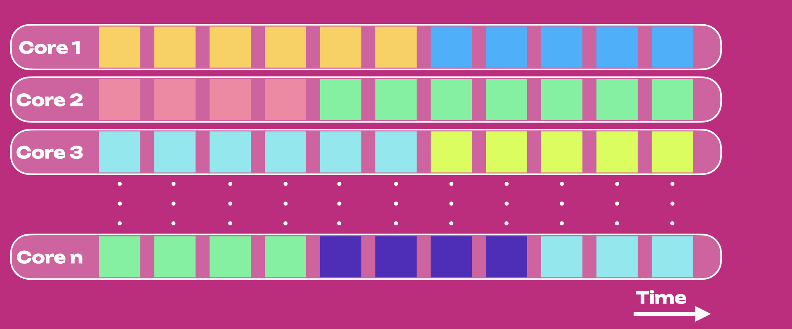

Agile Coretime enables efficient utilization of Polkadot network resources and provides 
economic flexibility for builders, generalizing Polkadot beyond what was initially proposed 
and envisioned in its [whitepaper](https://polkadot.network/whitepaper/). 

In Polkadot 1.0, the only way for a parachain to be secured by Polkadot was to rent a lease
through an auction, which guaranteed parachain block validation for up-to two years. This involved
locking significant amount of DOT, leading to a high barrier of entry for small and medium scale
blockchain projects. The parachains produced blocks at a regular interval of 12 seconds, 
irrespective of the network activity. This led to inefficient resource allocation and misplaced 
economic incentives while producing almost empty blocks under lighter traffic and being unable to 
accommodate heavier traffic when it exceeded block limits. Agile Coretime resolves all of these 
drawbacks. 

The figure below shows the core usage for Polkadot 1.0, where the horizontal axis is time, and each
row represents a core. Colors show different parachains, each using one core (i.e., one parachain,
one core).

Agile Coretime allows for the purchase of [coretime](#coretime) in “bulk” with an allocation for 
one month. Heavy duty parachains which need to author a block every 12 
seconds (or every 6s through [Async Backing](./learn-async-backing.md)), can seamlessly “renew” the [core](#core) each month. 
Coretime renewal orders take precedence over new orders and provide protection against price 
fluctuations, allowing parachains to plan their project budget and costs more effectively.

The purchased coretime can also be split up and sold in parts, down to a single 
block per month, allowing for secondary markets to thrive and improve the allocation efficiency
of coretime. Furthermore, Agile Coretime offers [on-demand coretime](#on-demand-coretime) 
functionality that enables the authoring of a parachain block on-demand.

:::info Agile Coretime is under active development

The progress of Agile Coretime development can be tracked [here.](https://github.com/orgs/paritytech/projects/119/views/20)

:::

## Agile Coretime Terminology

### Core

The term "Core" captures the virtual abstraction of computational resources provided by 
the relay chain to secure the blocks of a parachain, which involves a randomized set of the
relay chain validators.

### Coretime

The time allocated for utilizing a core, measured in relay chain blocks. 

### Bulk Coretime

A fixed duration of continuous coretime represented by an NFT that can be split, 
shared, or resold. Currently, the duration of bulk coretime is set to 28 days.

### Region

The NFT representing a single unit of bulk coretime.

### On-demand Coretime

Previously known as instantaneous coretime, the on-demand coretime refers to coretime acquired 
through bidding in near real-time for the validation of a single parachain block on one of the 
cores reserved specifically for on-demand orders.

### On-demand Coretime Pool

Set of cores that are available on-demand. Cores reserved through bulk coretime could also be
made available in the on-demand coretime pool, in parts or in entirety.

### Coretime Chain

A system parachain that is responsible for the sale, manipulation of bulk coretime and 
eventually the purchase of on-demand coretime credits. It is also responsible for 
scheduling the respective cores on the relay chain to the parachains.

### Timeslice

A timeslice represents the granularity the Coretime Chain schedules cores on the Relay Chain. 
The Coretime Chain announces a schedule for each core, comprising the next 80 relay 
chain blocks in advance. The region length of 28 days corresponds to 5,040 timeslices.

### Task

The term "Task" captures the abstraction of utility of the core. Tasks on the cores
are not just limited to securing parachains.

## Agile Coretime Implementation

Coretime is managed through the [broker pallet](https://github.com/paritytech/polkadot-sdk/blob/eefd5fe4499515da66d088505093f75b5aa22550/substrate/frame/broker/src/lib.rs) 
which is deployed on the Coretime Chain. In theory, the Polkadot Relay Chain can support around a 
hundred cores seamlessly and can support over a few hundred cores through optimizations. Preliminary tests ran successfully with 80 cores with 12-second block times.

### Coretime Sales

Sales on the Coretime Chain are of `timeslice` length. These sales are divided into two main periods: the Renewal period and the Sale period.

- Renewal periods are of `interlude_length` blocks long, and it’s where bulk coretime can be renewed.
- Sale periods are as well divided into two periods: a Price Discovery period and a Fixed Price period. After the Renewal period, a new `start_price` will be set by the Coretime Chain and a dutch auction of `leading_length` blocks will start, putting downward pressure on price to find the right equilibrium. This process will set the `regular_price` which will be the one offered at the Fixed Price period.

This discussion on initial coretime pricing can be viewed [here](https://forum.polkadot.network/t/initial-coretime-pricing/5187)

### Splitting and Interlacing

Splitting and interlacing are actions that can be performed within a region. Performing either of 
these actions makes you lose the right to a price-capped renewal.

- **Splitting**: the action of dividing a region into several regions with different start and end 
timeslices.
- **Interlacing:** the action of dividing a region into the execution of different tasks for each 
block of a timeslice. The result regions will have the same start and end timeslice as the parent 
region, but different tasks will be executed at different blocks.

### Elastic Scaling

With elastic scaling (still under development) projects can scale seamlessly and without being 
limited to previously allocated resources. Elastic scaling is the process of getting multiple cores 
for one task. This allows parachains to include more blocks per unit time (Relay Chain-side), and 
produce more blocks per unit time (async backing on the parachain side). Elastic scaling can be
paired with on-demand coretime to increase your bandwidth seamlessly.
