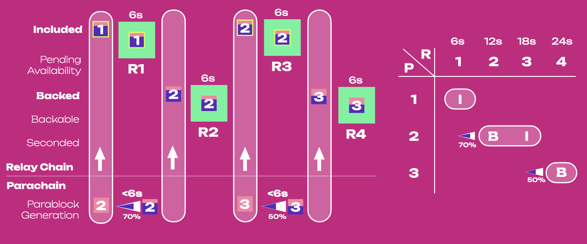
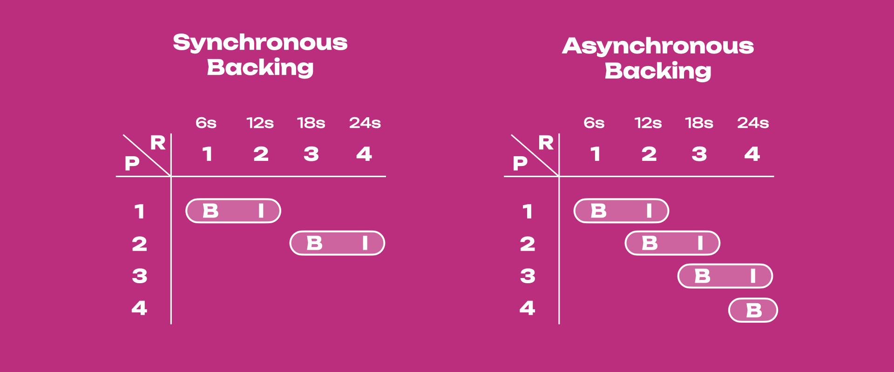
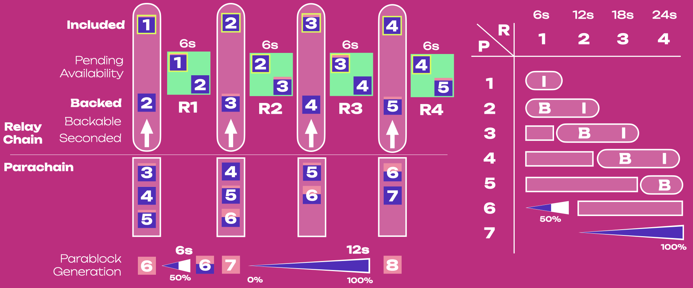

<!-- MessageBox -->

  

    To fully follow the material on this page, it is recommended to be familiar with the primary stages of the 
    <a href="./learn-parachains-protocol.md" target="_blank" rel="noopener noreferrer">
      Parachain Protocol.
    </a>
    For upgrading a parachain for Asynchronous Backing compatibility, follow the instructions on 
    <a href="../maintain/maintain-guides-async-backing" target="_blank" rel="noopener noreferrer">
      this Wiki document.
    </a> 
  

  <button class="close-messagebox" aria-label="Close message">✖</button>

[Pipelining](<https://en.wikipedia.org/wiki/Pipeline_(computing)>) is a technique for processing
multiple stages of a task simultaneously by breaking it into smaller steps. This allows the next
step to start before the previous one is completely finished. This is often used in processors and
computer architectures to increase throughput.

Polkadot introduces pipelining to the parachain block
[generation, backing, and inclusion](./learn-parachains-protocol.md) via **asynchronous backing**.
It is analogous to the logical pipelining of processor instruction in traditional architectures,
where some instructions may be executed before others are complete.

Bundles of state transitions represented as blocks may be processed similarly. In the context of
Polkadot, pipelining aims to increase the throughput of the entire network by completing the
**backing** and **inclusion** steps for different blocks simultaneously. Asynchronous backing does
not just allow for pipelining within a single pipe (or core). It lays the foundation for a large
number of pipes (or cores) to run for the same parachain at the same time.

In Polkadot, parablocks are generated by [collators](./learn-collator.md) on the parachain side and
sent to [validators](./learn-validator.md) on the relay chain side for backing.

!!!info "What is backing?"
    **Backing** refers to the process in which parablocks are verified by a subset of validators or backing groups. It is an important step in the validation process for parablocks, as it is the first line of defense in ensuring censorship resistance. Parablocks only need to be backed by one validator, and as a consequence, backing does not ensure parablock validity.

Backed parablocks are sent to other validators for inclusion into the relay chain. Parablocks are
included when validators have attested to having received
[erasure coded chunks](./learn-parachains-protocol.md#erasure-codes) of the parablock data. Note
[candidate receipts](#candidate-receipt) and not the parablocks themselves are included in relay
blocks (but for simplicity, we refer to parablocks as being included). When generated, parablocks
must be anchored to a relay chain block called **relay parent**. The relay parent is an input to
parablock candidate generation. It provides the necessary context to build the next parablock. Note
that the relay parent of a parablock and the relay block including that parablock are always
different.

## Synchronous Backing

Before diving into asynchronous backing, it is important to understand what synchronous backing is
and its main limitations. In synchronous backing, parablock generation is tightly coupled to the
relay chain's progression:

1. A new parablock can be produced after including the previous one (i.e., every 12 seconds).
2. Context to build the next parablock is drawn from the latest included parablock ancestor
3. The relay parent must be the latest relay chain block.

Because of (1) parablocks can be generated every other relay chain block (i.e., every 12 seconds).
Because of (2) generation of parablock `P` can only start when `P - 1` is included (there is no
pipelining). Because of (3) execution time can take maximum 0.5 seconds as parablock `P` is rushing
to be backed in the next 5.5 seconds (2 seconds needed for backing and the rest for gossiping).
Every parablock is backed in 6 seconds (one relay chain block) and included in the next 6 seconds
(next relay chain block). The time from generation to inclusion is 12 seconds. This limits the
amount of data a collator can add to each parablock.

Parablock generation will choose the most recently received relay block as a relay parent, although
with an imperfect network that may differ from the true most recent relay block. So, in general, if
relay block `R` is the relay parent of parablock `P`, then `P` could be backed in `R + 1` and
included in `R + 2`.

From left to right, parablock P1 is anchored to the relay parent R0 (showed with an `x`), backed
into the relay chain block R1, and included in R2. After including P1, collators can start
generating P2 that must be anchored to the relay parent R2. Note that R2 will be the relay parent of
P2 if R2 is included on the relay chain and gossiped to the collator producing P2.

!!!info "Every collator also runs an attached relay chain full node"
    The attached relay node receives relay blocks via gossip. Then, the relay node talks to the parachain node through the `CollationGeneration` subsystem. R2 is gossiped to the relay full node attached to the collator producing P2. Then, `CollationGeneration` passes information about R2 to the collator node. Finally, relay parent information from R2 informs the generation of candidate P2.

Because P2 is rushing to be backed in 6 seconds into R3, validators have only 0.5 seconds for
execution. Backing groups will take approximately 2 seconds to back it and some extra time for
gossiping it (the whole process from collation to backing lasts 6 seconds). P2 is included in R4,
which could be used as a relay parent for P3 (not shown). After 24 seconds P1 and P2 are included in
the relay chain. Note how collators can start new parablocks every 12 seconds but only have 0.5
seconds for execution.

## Asynchronous Backing

!!!warning "Disclaimer: Performance Measurements"
    Due to asynchronous backing not being fully implemented in a running production network, each performance metric is not thoroughly tested nor guaranteed until proper benchmarking has occurred.

In asynchronous backing, parablocks (P) are included every 6 seconds, and backing (B) and inclusion
(I) can happen within the same relay chain block (R).

### Synchronous vs. Asynchronous Backing

Below is a table showing the main differences between synchronous and asynchronous backing.

|                                            |                           Sync Backing                            |                                                                                  Async Backing                                                                                  |                   Async Backing Advantage                    |
| :----------------------------------------- | :---------------------------------------------------------------: | :-----------------------------------------------------------------------------------------------------------------------------------------------------------------------------: | :----------------------------------------------------------: |
| **Parablocks included every**              |                            12 seconds                             |                                                                                    6 seconds                                                                                    |            2x more throughput or 2x less latency             |
| **Parablock's maximum execution time**     |                            0.5 seconds                            |                                                                                    2 seconds                                                                                    |                 4x more data in a parablock                  |
| **Relay parent**                           |                  Is the latest relay chain block                  |                                                                 Is not necessarily the latest relay chain block                                                                 | Collators can submit parablocks to backing groups in advance |
| **Collators can build on**                 | The most recent ancestor included in the latest relay chain block | An ancestor included in a relay chain block (not necessarily the latest), with augmented information from the latest ancestor in the [unincluded segment](#unincluded-segments) |      Collators can start building parablocks in advance      |
| **Number of unincluded parablocks**        |                             Only one                              |                                                           One, or more than one (depends on configuration parameters)                                                           |               More efficiency and scalability                |
| **Unincluded parablocks**                  |                       Cannot be re-proposed                       |                                                      Can be re-proposed if not successfully included in the first attempt                                                       |            Decrease wastage of unused blockspace             |
| **Parablock's Backing-to-inclusion time**  |                            12 seconds                             |                                                                                   12 seconds                                                                                    |                          No change                           |
| **Parablock's Inclusion-to-finality time** |                            30 seconds                             |                                                                                   30 seconds                                                                                    |                          No change                           |

In synchronous backing, collators generate parablocks using context entirely pulled from the relay
chain. While in asynchronous backing, collators use additional context from the
[unincluded segment](#unincluded-segments). Parablocks are included every 6 seconds because backing
of parablock `N + 1` and inclusion of parablock `N` can happen on the same relay chain bock
(pipelining). However, as for synchronous backing, a parablock takes 12 seconds to get backed and
included, and from inclusion to finality there is an additional 30-second time window.

Because the throughput is increased by 2x and parachains have 4x more execution time, asynchronous
backing is expected to deliver 8x more blockspace to parachains.

### Sync Backing as a special case of Async Backing

Two parameters of asynchronous backing can be controlled by
[Governance](./learn-polkadot-opengov.md):

- [`max_candidate_depth`](https://github.com/paritytech/polkadot-sdk/blob/f204e3264f945c33b4cea18a49f7232c180b07c5/polkadot/primitives/src/vstaging/mod.rs#L49):
  the number of parachain blocks a collator can produce that are not yet included in the relay
  chain.

- [`allowed_ancestry_len`](https://github.com/paritytech/polkadot-sdk/blob/f204e3264f945c33b4cea18a49f7232c180b07c5/polkadot/primitives/src/vstaging/mod.rs#L54):
  the oldest relay chain parent a parachain block can be built on top of.

Values of zero for both correspond to synchronous backing: `max_candidate_depth = 0` means there can
be only one unincluded parablock at all times, and `allowed_ancestry_len = 0` means a parablock can
be built only on the latest relay parent for that parachain. Initial values will be set to 3 (4
unincluded parablocks at all times) and 2 (relay parent can be the third last).

### Async Backing Diagram

The diagram assumes:

- `max_candidate_depth = 2`, meaning that there can be a maximum of three unincluded parablocks at
  all times
- `allowed_ancestry_len = 1`, meaning parablocks can be anchored to the last or second-last relay
  parent (i.e., collators can start preparing parablocks 6 seconds in advance)

From left to right, parablock P1 is backed into the relay chain block R1 and included in R2. While
P1 undergoes backing, collators can already generate P2, which will have R0 as a relay parent
(showed with an `x`). Note how R0 can also be relay parent for P1 as long as in the unincluded
segment there is a maximum of three unincluded parablocks. Parablock P2 can be backed in R2 (the
same relay block where P1 is included) and included in R3. Collators can now use up to two seconds
for execution. And so on, P3 can be generated while backing groups check P2, and P4 can be built
while P3 undergoing backing. In 24 seconds, P1 to P3 are included in the relay chain.

Note how there are always three unincluded parablocks at all times, i.e. compared to synchronous
backing there can be multiple unincluded parablocks (i.e. pipelining). For example, when P1 is
undergoing inclusion, P2 and P3 are undergoing backing. Collators were able to generate multiple
unincluded parablocks because on their end they have the [unincluded segment](#unincluded-segments),
a local storage of not-included parablock ancestors that they can use to fetch information to build
new parablocks. On the relay chain side, [perspective parachains](#prospective-parachains) repeats
the work each unincluded segment does in tracking candidates (as validators cannot trust the record
kept on parachains).

The 6-second relay chain block delay includes a backing execution timeout (2 seconds) and some time
for network latency (the time it takes to gossip messages across the entire network). The limit
collators have to generate parablocks is how long it takes to back it (i.e., 2 seconds). Collation
generation conservatively always gives itself the same time limits. If there is extra time for
collation generation and backing (i.e., more than 2s + 6s), then all that extra time is allocated to
backing (see figure). This could result in backable blocks waiting their turn at the end of the
backing step for a few extra seconds until a core frees up to back that block as of the next relay
block or some later relay block. Note a core is occupied after backing and before inclusion.

The 2-second execution time is thus a limiter, not a system limitation. If parablock generation
takes >2 seconds, the unincluded segment will shrink (less unincluded parablocks), while if it takes
< 2 seconds, the segment will grow (more unincluded parablocks that will need to be backed and
included). Such flexibility from the parachain side will be possible when, on the relay chain side,
there will be elastic scaling (i.e.,
[agile core usage](../general/polkadot-direction.md#agile-core-usage) and
[coretime allocation](../general/polkadot-direction.md#agile-coretime-allocation)).

## Terminology

### Candidate Receipt

Saying that a parablock has been included in a relay chain parent does not mean the entire parablock
is in the relay chain block. Instead, **candidate receipt** consisting of the hash of the parablock,
state roots, and ID info is placed on the parent block on the relay chain. The relay chain does not
access the entire state of a parachain but only the values that changed during that block and the
merkelized hashes of the unchanged values.

### Unincluded Segments

Unincluded segments are chains of candidate parablocks that have yet to be included in the relay
chain, i.e. they can contain parablocks at any stage pre-inclusion. An unincluded segment may thus
include candidates that are seconded, backable, or backed. Every parablock candidate recorded in the
unincluded segment is immediately advertised to validators to begin the backing process.

The backing process occurs on the relay chain, whereas unincluded segments live in the runtimes of
parachain collators. The core functionality that asynchronous backing brings is the ability to build
on these unincluded segments of block ancestors rather than building only on ancestors included in
the relay chain state.

The purpose of each unincluded segment is twofold:

- Make each parachain aware of when and at what depth it can build blocks that won't be rejected by
  the relay chain
- Provide critical context necessary to build parablocks with parent blocks that have yet to be
  included. The unincluded segment is all about building parablocks.

### Prospective Parachains

The purpose of
[prospective parachains](https://paritytech.github.io/polkadot/book/node/backing/prospective-parachains.html)
is twofold:

- Keep track of parablocks that have been submitted to backers but have yet to be included. This
  includes tracking the full unincluded ancestry of each parablock, without which it wouldn't be
  possible to verify their legitimacy.

- Look up and provide candidates which are children of the most recently included parablock for each
  parachain. These are taken as inputs to the availability process. Prospective parachains is all
  about tracking, storing, and providing candidates to the availability/inclusion step.

Prospective parachains essentially repeats the work each [unincluded segment](#unincluded-segments)
does in tracking candidates. Validators cannot simply trust the availability or validity of records
kept on parachains. Prospective parachains is the relay chain's record of all parablock candidates
undergoing the backing and inclusion process. It is the authoritative gatekeeper for parablock
validity. Whereas the unincluded segment is a local record that allows parachains to produce blocks
that comply with the rules prospective parachains later enforces.

The unincluded segment lives in the parachain runtime, so it doesn't know or care about forks/other
parachains. Prospective parachains lives in the relay chain client. So it has to simultaneously keep
track of candidates from all forks of all parachains. It is as if you folded the unincluded segments
from every fork of every parachain into one giant data structure. When you fold unincluded segments
representing different chain forks together, they create a tree structure. Hence the term
[**fragment tree**](https://paritytech.github.io/polkadot/book/node/backing/prospective-parachains.html#fragment-trees).

A single unincluded segment tells a collator whether it can build on top of one fork of one
parachain. Prospective parachains tells a validator whether it should accept blocks built on top of
any fork from any parachain.

A parablock stops being a prospective parablock when it is included on chain. At that point
prospective parachains does not have to care about it anymore. Alternatively, a parablock's relay
parent can get too old before that parablock is included, in which case prospective parachains can
throw away the candidate.

## Learn More

The information provided here is subject to change; keep up to date using the following resources:

- [Polkadot Roadmap Roundup](https://polkadot.network/blog/polkadot-roadmap-roundup) - Article by
  Rob Habermeier, Polkadot founder, details the plans for Polkadot for 2023.
- [Asynchronous Backing Spec & Tracking Issue](https://github.com/paritytech/polkadot/issues/3779) -
  The implementation tracking issue for asynchronous backing
- [Prospective Parachains Subsystem - The Polkadot Parachain Host Implementers' Guide](https://paritytech.github.io/polkadot/book/node/backing/prospective-parachains.html)
- Chapter 6.11. from Polkadot Blockchain Academy (PBA) lecture material:
  [Asynchronous Backing (Shallow)](https://polkadot-blockchain-academy.github.io/pba-book/polkadot/async-backing-shallow/page.html)
- Chapter 6.15. from PBA lecture material:
  [Asynchronous Backing (Deep)](https://polkadot-blockchain-academy.github.io/pba-book/polkadot/async-backing-deep/page.html)
- Polkadot Blog Post -
  [Asynchronous Backing: Elevating Polkadot's Performance and Scale](https://www.polkadot.network/blog/elevating-polkadots-performance-and-scale-with-asynchronous-backing)
- Blog posts by Filippo Franchini on
  [Synchronous](https://grillapp.net/10124/polkadot-s-synchronous-backing-explained-40627?ref=10124)
  and
  [Asynchronous Backing](https://grillapp.net/10124/polkadot-s-asynchronous-backing-explained-40701?ref=10124)
