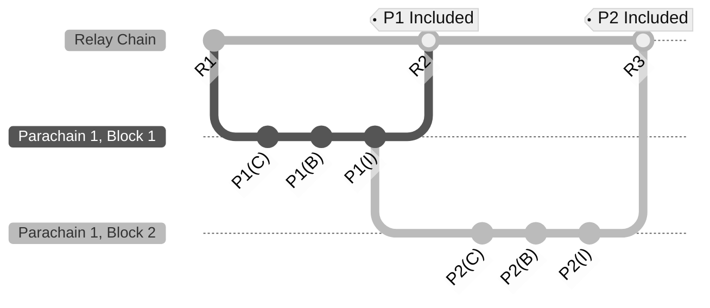
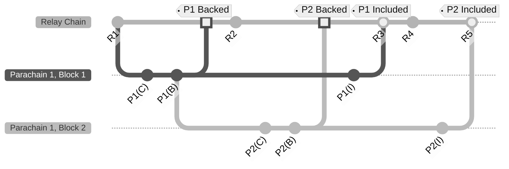

Asynchronous backing is a mechanism that introduces a _pipeline_ for parachain **<->** relay chain
communication. This pipeline will allow collators to include more data in parachain blocks while
reducing latency (from 12 to 6 seconds for parablock validation).

It has three overarching goals:

1. Decrease parablock validation time to **6 seconds** from **12 seconds**
2. Increase the amount of usable blockspace by a factor of 5-10, meaning more state changes are
   allowed per relay chain block.
3. Allow for parachain blocks (parablocks) to be re-proposed to the network if they should be
   included initially on the first attempt.

Asynchronous backing works by providing a form of **contextual execution**, which allows for more
time for parachain collators to fit more transactions and ready block candidates for backing and
inclusion. Because asynchronous relies on the current context of a relay chain block, **contextual
execution** refers to how a parablock can begin being built earlier through the context of the
previous block(s).

## What was wrong with the previous architecture?

A current limitation to scaling throughput regarding speed is that parablock validation is tightly
coupled to the relay chain's progression on a 1-1 basis, meaning every parablock must be built,
backed, and included within six seconds. Parablocks depend on being in sync with the relay chain,
reducing the amount of data in the block.

Essentially, it's rushing to be a part of the relay chain due to this synchrony.

By making this process of backing para blocks more asynchronous, they get the chance to not only
include more data, but also "retry" later to be included in the relay chain.

## Visuals: Before and After

Before comparing the two models, several terms are crucial to define:

- Candidate Parablock, "**C**" - A block created by the parachain collator.
- Backed Parablock, "**B**" - A block backed by paravalidators on the relay chain.
- Included Parablock, "**I**" - A block validated and included in the relay chain.
- Relay Chain Block, "**R**" - A block on the relay chain.

Within these diagrams, there will be one parachain for example, that displays two blocks, referred
to as the following: **Parachain 1 (P1)**.

### Before: _Synchronous Backing on Polkadot_

With synchronous backing, there was only about a single block, or 6-second window, to complete the
parablock inclusion process. This was tightly coupled to the relay chain's progress, where blocks
had to be completed within this window:

### After: _Asynchronous Backing on Polkadot_

With asynchronous backing, the window is more than the span of around two blocks, or a ~12-second
window. This enables more computational and storage time per block, as the context of the next relay
chain block can kickstart the process of the next parablock.

Notice that blocks can be prepared longer, meaning more transactions per block. Due to the
asynchrony, these blocks can be prepared in anticipation of being included later rather than keeping
in sync with the relay chain's progress 1-1:

:::info How does this compare to Ethereum's Danksharding?

Asynchronous backing is the Polkadot equivalent to Ethereum's Danksharding. Where Ethereum merely
increases the amount of space per block for rollup-related solutions, asynchronous backing provides
a way for collators to build blocks with the intent of publishing them asynchronously later on.

Where Ethereum is looking to increase the size of each block as a means for rollup solutions,
asynchronous backing builds on the existing parachains protocol to provide a way to further
parallelize the processing of parachain blocks, increasing scalability and throughput in a single
go.

:::

This combination of lower latency, higher storage per block, and a logical pipeline spanning
Polkadot's networking, runtime, and collation aspects will allow for higher, more robust throughput.

## Learn More

This topic is evolving and being implemented at the moment, keep up to date using the following
resources:

- [Polkadot Roadmap Roundup](https://polkadot.network/blog/polkadot-roadmap-roundup) - Article by
  Rob Habermeier, Polkadot founder, details the plans for Polkadot for 2023.
- [Asynchronous Backing Spec & Tracking Issue](https://github.com/paritytech/polkadot/issues/3779) -
  The implementation tracking issue for asynchronous backing
