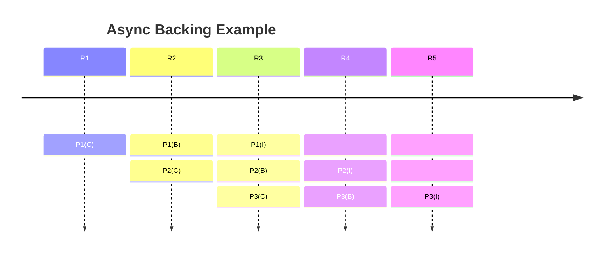

Asynchronous backing is a mechanism that introduces a _pipeline_ for parachain **<->** relay chain
communication. This pipeline will allow collators to include more data in parachain blocks while
reducing latency (from 12 to 6 seconds for parablock validation).

It has three overarching goals:

1. Decrease parablock validation time to **6 seconds** from **12 seconds**
2. Increase the amount of usable blockspace by a factor of 5-10, meaning more state changes allowed
   per block.
3. Allow for parachain blocks (parablocks) to be re-proposed to the network in the event that they
   aren't included initially on the first attempt.

Asynchronous backing works by providing a form of **contextual execution**, which allows for more
time for parachain collators to fit more transactions and ready block candidates for backing and
inclusion.

_Notice that blocks can be prepared for longer, meaning more transactions per block. Due to the
asynchrony, these blocks can be prepared in anticipation of being included later, rather than
keeping in sync with the relay chain's progress 1-1_

:::info How does this compare to Ethereum's Danksharding?

One can think of asynchronous backing as the Polkadot equivalent to Ethereum's Danksharding. Where
Ethereum merely increases the amount of space per block for rollup related solutions, asynchronous
backing provides a way for collators to build blocks with the intent of publishing asynchronously
them later on.

Where Ethereum is looking to increase the size of each block as a means for rollup solutions,
asynchronous backing builds on the existing parachains protocol to provide a way to further
parallelize the processing of parachain blocks, increasing scalability and throughput in a single
go.

:::

This combination of lower latency, higher storage per block, and logical pipeline spanning
Polkadot's networking, runtime, and collator aspects will allow for higher, more robust throughput.
The speed is doubled while block storage is significantly increased, allowing the network to become
increasingly more scalable and robust.

## What was wrong with the previous architecture?

A current limitation to scaling throughput in terms of speed is that parablock validation is tightly
coupled to the relay chain's progression on a 1-1 basis. Parablocks are very much dependent on being
in sync with the relay chain, which reduces the amount of data that can be put into the block.
Essentially, it's rushing to be a part of the relay chain due to this synchrony.

By making this process of backing para blocks more asynchronous, they get the chance to not only
include more data, but also "retry" at a later time to be included in the relay chain.

## Learn More

This topic is evolving and being implemented at the moment, keep up to date using the following
resources:

- [Polkadot Roadmap Roundup](https://polkadot.network/blog/polkadot-roadmap-roundup) - Article by
  Rob Habermeier, Polkadot founder that details the plans for Polkadot for 2023.
- [Asynchronous Backing Spec & Tracking Issue](https://github.com/paritytech/polkadot/issues/3779) -
  Implementation tracking issue for asynchronous backing
