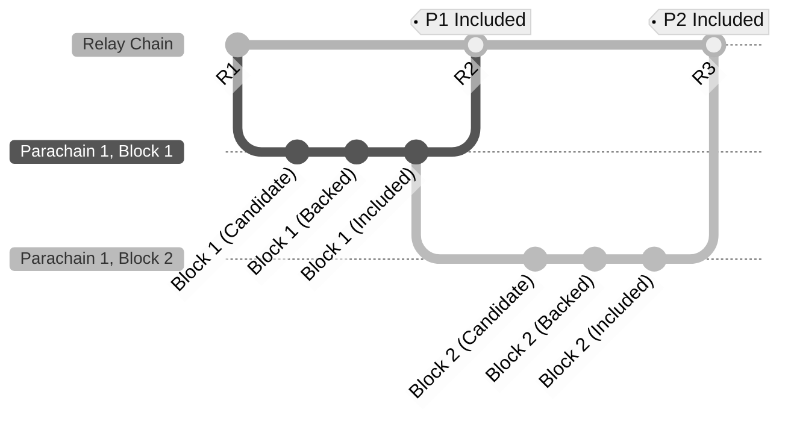
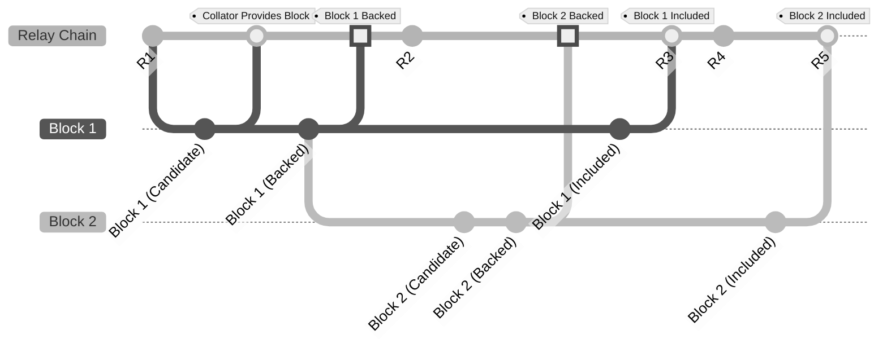

Asynchronous backing is a mechanism that introduces an enhancement to the block validation pipeline
for parachain **<->** relay chain communication. This pipeline will allow collators to include more
transactions/data in parablocks while speeding up parachain block times from 12 to 6
seconds. In short, asynchronous backing will speed up the parachain performance multifold.

It has three overarching goals:

1. Decrease parachain blocks (parablock) validation time to **6 seconds** from **12 seconds**
2. Increase the amount of usable blockspace by a factor of 5-10, meaning more state changes are
   allowed per relay chain block.
3. Allow for parablocks to be re-proposed to the network if they are not included initially on the
   first attempt.

Asynchronous backing works by providing a form of **contextual execution**, which allows for more
time for parachain collators to fit more transactions and ready block candidates for backing and
inclusion. **Contextual execution** refers to how a parablock can begin being built earlier using the context provided by an unincluded segment of recent parablock ancestors. 
the context of future relay chain block(s).

Currently, parablocks rely on the most recent relay chain block (often referred to as the **parent**
block, as the parablock anchors itself to it). This means that each parablock is limited to the
window of the relay chain's block time.

:::info

It is important to note two following clarifications:

1. The parablock is itself within the relay chain, but rather the **paraheader**
2. The relay chain does not validate the entire state of a parachain, but only the state transitions
   within that block.

:::

For more information on the validity and availability process, be sure to visit the
[parachain protocol](../learn/learn-parachains-protocol.md) page.

## Synchronous Backing on Polkadot

With synchronous backing, there was only about a single relay chain block, or 6-second window, to
complete the parablock inclusion process. This was tightly coupled to the relay chain's progress,
where blocks had to be created within this window:

where **P1** and **P2** are two parablocks, and **R1** and **R2** are two relay-chain blocks. The
letters within the parentheses represent the state of a parachain block. Hence **C** (candidate,
created by collators), **B** (backed, by para-validators), and **I** (included, by block authors in
the relay-chain). For more information about parablock validation see the
[parachain protocol page](./learn-parachains-protocol.md).

In the diagram there are three relay-chain blocks being finalized (**R1-2**) and a parachain
(**Parachain 1**) proposing two parablocks (**P1** and **P2**). Each parablock's lifecycle, from
being candidate (**P(C)**) to being backed and included (**P(B)** and **P(I)**, respectively), must
fit within the relay-chain block lifetime.

Thus, the main limitation of synchronous backing is that parablock validation is tightly coupled to
the relay chain's progression on a 1-1 basis, meaning every parablock must be built, backed, and
included within six seconds. Parablocks depend on being in sync with the relay chain, reducing the
amount of data in the block.

Essentially, a parablock is rushing to being validated by the relay-chain due to this synchrony.

By making this process of backing parablocks more asynchronous, parachains get the chance to not
only include more data within each parablock, but also retry to include parablocks that failed
inclusion.

## Asynchronous Backing on Polkadot

With asynchronous backing, the window is more than the span of around two blocks, or a ~12-second
window. This enables more computational and storage time per block, as the context of the next relay
chain block can kickstart the process of validating next parablock.

Notice that blocks can contain more state transitions compared to synchronous backing, meaning more
transactions per block. These blocks can be prepared in anticipation of being included later rather
than keeping in sync with the relay chain's progress 1-1:

This combination of lower latency, higher storage per block, and a logical pipeline spanning
Polkadot's networking, runtime, and collation aspects will allow for higher, more robust throughput.

## Learn More

This topic is evolving and being implemented at the moment, keep up to date using the following
resources:

- [Polkadot Roadmap Roundup](https://polkadot.network/blog/polkadot-roadmap-roundup) - Article by
  Rob Habermeier, Polkadot founder, details the plans for Polkadot for 2023.
- [Asynchronous Backing Spec & Tracking Issue](https://github.com/paritytech/polkadot/issues/3779) -
  The implementation tracking issue for asynchronous backing
