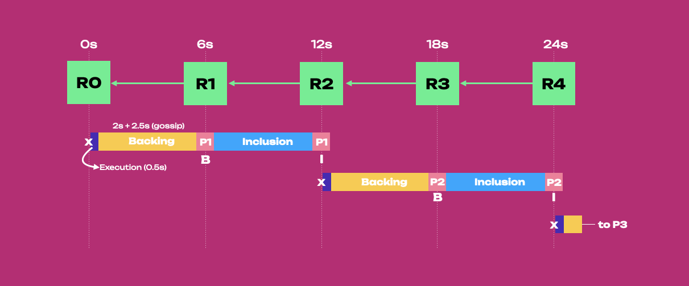
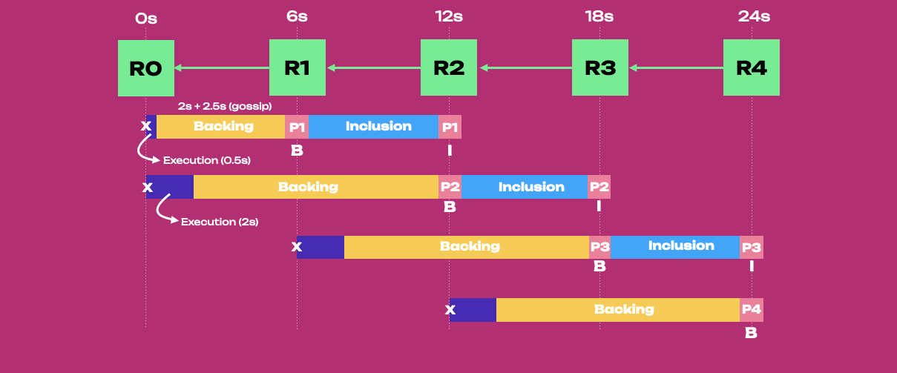

import RPC from "./../../components/RPC-Connection";

:::info Learn about Parachain Consensus

To fully follow the material on this page, it is recommended to be familiar with the primary stages
of the [Parachain Protocol](./learn-parachains-protocol.md).

:::

## Synchronous Backing

Before diving into asynchronous backing, it is important to understand what synchronous backing is
and what its main limitations are.

:::info What is backing?

**Backing** refers to the process in which a parablock is verified by a subset of validators who
determine the block’s validity. It is an important step in the validation process for parablocks, as
it is the first line of defense in ensuring valid state transitions. Validators who back the
parablock put their stake at risk, and if the block is later found invalid, those validators are
slashed.

:::

In synchronous backing, parablock generation is tightly coupled to the relay chain's progression on
a one-to-one basis. Every parablock must be generated and backed within a relay-chain block
(six-second window), and (if successfully backed) it will be included in a relay-chain block (often
referred to as the **relay parent**, or latest block on the relay chain, as the parablock anchors itself to it) after an additional six
seconds. Thus, a parablock can be produced every 12 seconds because a new parablock can be produced
after including the previous one.

The **contextual execution** of new parablocks are parablock ancestors included in the relay chain
after 12 seconds, where contextual execution refers to the context built by included parablock
ancestors used by the parachains to generate new parablocks.

:::info Candidate Recepts

- Not the entire parablock, but the **candidate receipt** consisting of the hash of the parablock,
  state roots and ID info is placed on the parent block on the relay chain.
- The relay chain does not access the entire state of a parachain but only the values that changed
  during that block and the merkelized hashes of the unchanged values.

:::

### Synchronous Backing Mechanics

In synchronous backing we can imagine parablocks on a conveyor belt with the following properties:

- The belt is in sync with the relay chain - every parablock is generated and backed every 6 seconds,
  and included every 12 seconds
- The belt can carry only one parablock at a time (no [pipelining](#pipelining)) and it has to wait for it to be fully processed before another can be put on the belt.

The diagram below shows parablocks on their way from being generated to being backed and included
into the relay chain in the context of synchronous backing.

Parablock 1 (P1) is included (I) in the relay chain block 1 (R1) after 6 seconds. Once P1 is
included, Parablock 2 (P2) can be filled using the included P1 as execution context. But because P2
is rushing to be backed into R2 in 6 seconds, there are less than 6 seconds (~ 0.5 - 1 seconds) to
fill it. In this scenario, P2 is filled up to 70%. After the inclusion of P2 into R3, Parablock 3
(P3) will be generated, filled to 50%, and backed into R4 in 6 seconds. After 24 seconds, two
parablocks, P1 and P2, have been included in the relay chain, and P3 has been backed.

The parablock generation and backing are bound together within a six-second window that limits the
amount of data a collator can add to each parablock. Essentially, a parablock is limited to the
requirement of being backed in six seconds, leaving little time for its generation and its
blockspace to be properly filled.

## Asynchronous Backing

:::warning Disclaimer: Performance Measurements

Due to asynchronous backing not being fully implemented in a running production network, each
performance metric is not thoroughly tested nor guaranteed until proper benchmarking has occurred.

:::

### Pipelining

Asynchronous backing is a feature that introduces
[pipelining](https://www.techtarget.com/whatis/definition/pipelining) to the parachain block
[generation, backing and inclusion](./learn-parachains-protocol.md). It is analogous to the logical
pipelining of processor instruction in "traditional" architectures, where some instructions may be
executed before others are complete. Instructions may also be executed in parallel, enabling
multiple processor parts to work on potentially different instructions simultaneously.

Bundles of state transitions represented as blocks may be processed similarly. In the context of
{{ polkadot: Polkadot :polkadot }}{{ kusama: Kusama :kusama }}, pipelining aims to increase the
throughput of the entire network.

### Synchronous vs. Asynchronous Backing

Asynchronous Backing has three overarching goals:

1. Decrease parachain block (parablock) validation time to **6 seconds** from **12 seconds**
2. **Increase the usable blockspace**, allowing more state changes per relay chain block.
3. **Allow parablocks to be re-proposed** to the network if they are not included successfully on
   the first attempt.

In synchronous backing, parablock generation relies on the most recent relay-chain block. Each
parablock must be generated and go through the entire backing process in a single relay block. It
then proceeds to the inclusion process while generating the next relay-chain block.

Asynchronous backing brings the following changes to the parachain protocol:

- Parablock generation is now decoupled from the backing process, avoiding the previous 6-second
  deadline through the backing process. This enables for more involved scaling approaches, such as
  giving more time for collators to properly use blockspace or increasing block velocity based on
  demand.

- Parachains can generate blocks and have them placed into **unincluded segments** of parablock
  ancestors (i.e. parablocks that are seconded but not yet backed by paravalidators and included in
  the relay chain) rather than ancestors included in the relay chain state.

### Unincluded Segments

Unincluded segments are chains of candidate parablocks that still need to be backed
and included in the relay chain. Parablocks can be added to this unincluded segment without waiting
for the latest included parent block of the relay chain. The core functionality that asynchronous
backing brings is the ability to build on these unincluded segments of block ancestors rather than
ancestors included in the relay chain state.

:::info Unincluded segments happen on the collator portion

**Unincluded** segments are generated blocks that still need to be backed. The backing
process occurs on the relay chain, whereas unincluded segments are moreso held in the collator.

:::

Compared to synchronous backing, contextual execution shifts from being the parablock ancestors
included in the relay chain to being the latest ancestor parablock pushed into the unincluded
segment. This allows collators to build parablocks earlier, giving them plenty of time to fit more
transactions and prepare block candidates for backing and inclusion.

### Asynchronous Backing Mechanics

In asynchronous backing, parablock generation is decoupled from backing and inclusion. Compared to
[synchronous backing](#synchronous-backing-mechanics):

- Parablocks are not rushing to being backed, they are not placed on the conveyor belt when they are
  generated
- Filled blocks are placed in the unincluded segment, and from there, they are injected onto the
  conveyor belt
- The conveyor belt can carry multiple parablocks ([pipelining](#pipelining)), and a parablock can
  be in a different stage from another one being built if it abides by the parameters set forth by
  the asynchronous backing configuration.
- Backing and inclusion events can happen within the same relay chain block (i.e. in 6 seconds)
- The last parablock in the unincluded segment is used as execution context to generate a new
  parablock and, because the unincluded segment can carry multiple parablocks, parachains can take
  more time to fill new blocks while the segment is emptied.

The diagram below shows parablocks on their way from being generated to being backed and included
into the relay chain in the context of asynchronous backing.

Parablock 1 (P1) is included, and P2 is backed within R1. In the meantime, the unincluded segment is
full and contains P3-5. Because P6 is not rushing to be backed, it can be filled in 6s while P2 is
included and P3 is backed in R2. This is possible because the context execution shifted from being
the latest included parablock to being the latest ancestor in the unincluded segment (i.e. P5).

In this scenario, blockspace demand decreases and as a consequence P6 is filled only 50% using 6
seconds. Next block P7 can be filled in 12 seconds while the unincluded segment is emptied. While
filling up P7, P3 and P4 are included in R3 and R4, respectively. In 24 seconds, four parablocks, P1
to P4, have been included in the relay chain, P5 has been backed, and two more blocks have been
filled and pushed to the unincluded segment, ready to be backed. The unincluded segment is now 2/3
filled.

Collators were able to make better use of blockspace, including 2x more data, by doubling block
generation time from 6 to 12 seconds in a period of lower demand. This was possible due to the
asynchrony between block generation and backing. With an unincluded segment carrying a maximum of
three parablocks, the collators could wait an additional 6 seconds if needed (i.e. make sure in the
unincluded segment there is at least one parablock to build a new one).

In case blockspace demand increases after the generation of P7, collators can generate P8 and P9 is
6 seconds (i.e. 3 seconds per block) due to the unincluded segment being 2/3 filled (see below).
However, if demand stays high after P9, collators will only be able to generate parablocks every 6
seconds as the unincluded segment is emptied every 6 seconds and its maximum capacity of 3/3
parablocks has been reached.

In general, asynchronous backing will allow [collators](./learn-parachains-protocol.md#collators) to
include an estimated ~3-5x more data into parablocks while speeding up parachain block times from 12
to 6 seconds. Due to the 2x decrease in block time to inclusion and the possibility of building
blocks in advance to fit more data, Polkadot with asynchronous backing can deliver an estimated
~6-10x more blockspace to its parachains.

This combination of lower latency, higher storage per block, and a logical pipeline spanning
Polkadot's networking, runtime, and collation aspects will allow for higher, more robust throughput.

### Prospective Parachains

Prospective parachains manage and represent all unincluded segments from all parachains.

The
[Prospective Parachains subsystem](https://paritytech.github.io/polkadot/book/node/backing/prospective-parachains.html),
is responsible for coordinating the state of various prospective parachain fragments. A fragment is
a prospective/potential parablock. More than one of these make up a
[**fragment tree**](https://paritytech.github.io/polkadot/book/node/backing/prospective-parachains.html#fragment-trees),
and represent the potential states of a parachain. Each of these fragments is anchored to a past
relay chain parent. This does not have to be the latest parent, as was before, but it can be one in
the past.

This subsystem also communicates with other subsystems in the validation process, such as the
Backing subsystem, once a candidate block has been seconded.

### Further Benefits of Async Backing

Asynchronous backing also introduces a parameter to define the maximum number of ancestor blocks
within the unincluded segment. This allows for a parablock to be backed later, enabling more
computational and storage time per block. Decoupling collation (candidate generation) and backing
also allows for more execution time while citing a lower validation time.

Two parameters can be controlled by governance:

- [`allowed_ancestry_len`](https://github.com/paritytech/polkadot-sdk/blob/f204e3264f945c33b4cea18a49f7232c180b07c5/polkadot/primitives/src/vstaging/mod.rs#L54) -
  How many ancestors of a relay parent are allowed to build candidates on top of. When building a
  new parablock for the unincluded segment, this is how the parablock decides which relay parent to
  derive context from.
- [`max_candidate_depth`](https://github.com/paritytech/polkadot-sdk/blob/f204e3264f945c33b4cea18a49f7232c180b07c5/polkadot/primitives/src/vstaging/mod.rs#L49) -
  The maximum amount of candidates between the latest parablock and relay parent ancestor. Any
  blocks that exceed this limit will be ignored by the validators.

## Learn More

This topic is evolving and being implemented at the moment, keep up to date using the following
resources:

- [Polkadot Roadmap Roundup](https://polkadot.network/blog/polkadot-roadmap-roundup) - Article by
  Rob Habermeier, Polkadot founder, details the plans for Polkadot for 2023.
- [Asynchronous Backing Spec & Tracking Issue](https://github.com/paritytech/polkadot/issues/3779) -
  The implementation tracking issue for asynchronous backing
- [Prospective Parachains Subsystem - The Polkadot Parachain Host Implementers' Guide](https://paritytech.github.io/polkadot/book/node/backing/prospective-parachains.html)
