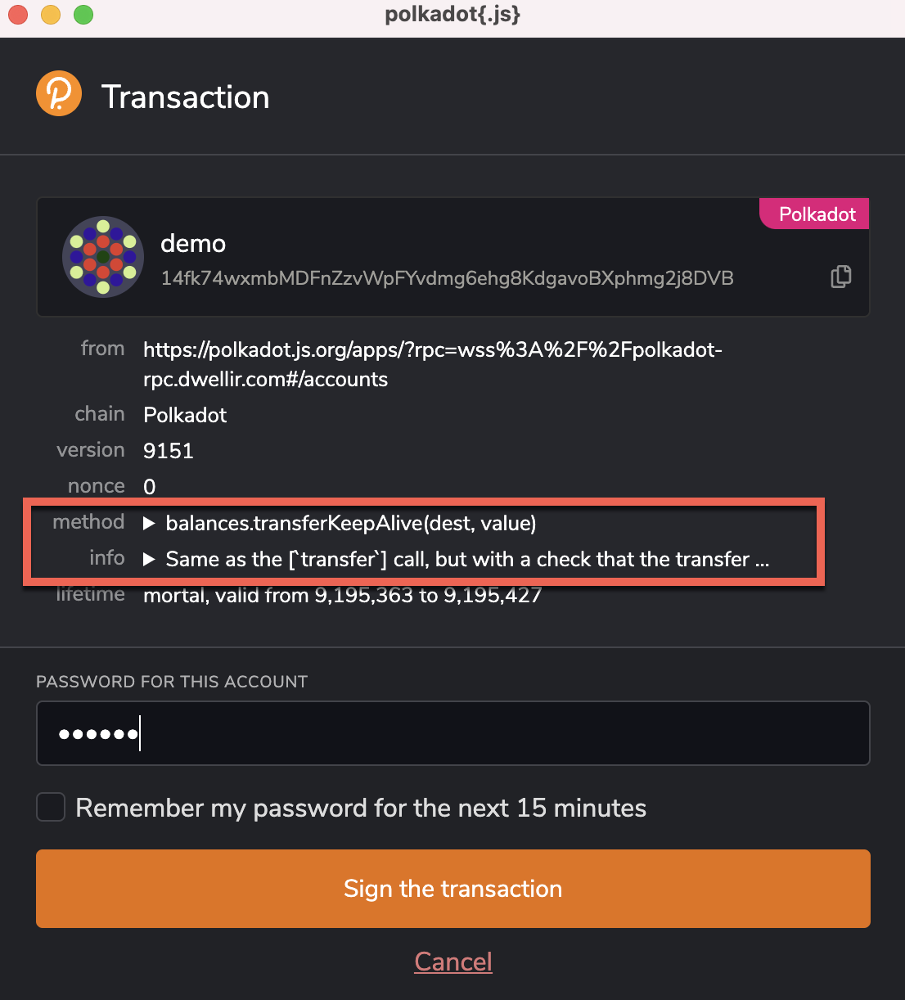

Balance transfers are used to send a balance from one account to another account. To start
transferring a balance, we will begin by using [Polkadot-JS Apps][]. This guide assumes that you've
already [created an account](learn-account-generation.md) and have some funds that are ready to be
transferred. This guide also contains instructions on how to sign the balance transfer transactions
for accounts created on Polkadot JS Extension, Ledger devices and Parity Signer App.

## Polkadot-JS Apps UI

Let's begin by opening [Polkadot-JS Apps][]. There are two ways to conduct a balance transfer:

1. By using the "Transfer" tab in the "Accounts" dropdown (located on the top navigational menu).
2. Clicking the "Send" button while in the "Accounts" page.

### Using the Transfer Tab

Click on the "Transfer" tab in the "Accounts" dropdown.

Now a modal window will appear on the page. The modal asks you to enter three inputs:

- "send from account": Your account with funds that you will send from.
- "send to address": The address of the account that will receive the funds.
- "amount": The amount of tokens you will transfer.

The "existential deposit" box shows you the **minimum amount of funds you must keep in the account
for it to remain active.** See the [existential deposit][] section for more information.

After setting your inputs correctly, click the "Make Transfer" button and confirm. Once the transfer
is included in a block you will see a green notification in the top-right corner of your screen.

### Signing on Polkadot Extension

If you inject your account in Polkadot-JS Apps through the Polkadot-JS Extension, you need to sign the balance transfer transaction
on the pop-up window. You can examine the method and info dropdowns (highlighted in the screenshot below) and ensure they match with the original transaction submission. Then, sign the transaction by entering the account password.

### Signing on Ledger device

Assuming that you have imported your Ledger account to the Polkadot-JS Extension, you will see a pop-up window for signing the balance transfer transaction. Review the transaction details on the Ledger device and approve it to sign the transaction.

:::note Connect Ledger to Polkadot-JS Apps

If you are looking for instructions in a video, watch the tutorial on how to connect [Ledger to Polkadot-JS Apps](https://youtu.be/7VlTncHCGPc).

:::

### Signing Transactions with Parity Signer

If you directly import your Parity Signer account to Polkadot-JS Apps, you will see a pop-up window with a QR code and a camera window, as shown below.
Open the QR scanner on Parity Signer and scan the QR code. You may be prompted to enter your PIN to sign the transaction.
The signed extrinsic will then be available as a QR code that needs to be shown in front of your computer's camera (as shown in the red square window shown to the right in the screenshot below).

If your account was setup on [Parity Signer Companion](https://parity.link/signer-companion) instead of Polkadot-JS Apps, you will see a pop-up window with a QR code, as shown below for this transaction.

Scan the QR code using Parity Signer. You will see a QR code consisting of the signed extrinsic for this transaction. Click on the **next to signing** button in the pop-up window, as shown above. You can then show the QR code on your phone within the red square window.

### Keep-Alive Checks

At an [extrinsic](../general/glossary.md#extrinsic) level, there are two main ways to transfer funds
from one account to another. These are `transfer` and `transfer_keep_alive`. `transfer` will allow you
to send {{ polkadot: DOT :polkadot }}{{ kusama: KSM :kusama }} regardless of the consequence;
`transfer_keep_alive` will not allow you to send an amount
that would allow the sending account to be removed due to it going below the existential deposit.

By default, Polkadot-JS Apps will use `transfer_keep_alive`, ensuring that the account you send from
cannot drop below the existential deposit of
{{ polkadot: 1 DOT :polkadot }}{{ kusama: 0.001666 KSM :kusama }}.

However, it may be that you do not want to keep this account alive (for example, because you are moving
all of your funds to a different address). In this case, click on the "keep-alive" toggle at the bottom
of the modal window. The label should switch from "Transfer with account keep-alive
checks" - `transfer_keep_alive` will be used, to "Normal transfer without keep-alive checks" -
`transfer` extrinsic will be used. As a common use case for using normal transfers is to entirely clear
out the account, a second toggle will appear if you have the keep-alive check turned off that will send all
the tokens in the account, minus a transaction fee, to the destination address.

Attempting to send less than the existential deposit to an account with
{{ polkadot: 0 DOT :polkadot }}{{ kusama: 0 KSM :kusama }} will always fail, no matter if the keep-alive
check is on or not.

{{ polkadot: For instance, attempting to transfer 0.1 DOT to an account you just generated
(and thus has no DOT) will fail, since 0.1 is less than the existential deposit of 1 DOT and the account
cannot be initialized with such a low balance. :polkadot }}{{ kusama: For instance, attempting to transfer
0.0001 KSM to an account you just generated (and thus has no KSM) will fail, since 0.1 is less than the
existential deposit of 0.001666 KSM and the account cannot be initialized with such a low balance. :kusama }}

:::note

Even if the transfer fails due to a keep-alive check, the transaction fee will be deducted
from the sending account if you attempt to transfer.

:::

### Existing Reference Error

If you are trying to reap an account and you receive an error similar to "There is an existing
reference count on the sender account. As such the account cannot be reaped from the state", then
you have existing references to this account that must first be removed before it can be reaped.
References may still exist from:

- Bonded tokens (most likely)
- Unpurged session keys (if you were previously a validator)
- Token locks
- Existing recovery info
- Existing assets

#### Bonded Tokens

If you have tokens that are bonded, you will need to unbond them before you can reap your account.
Follow the instructions at [Unbonding and Rebonding](../maintain/maintain-guides-how-to-unbond.md) to check if
you have bonded tokens, stop nominating (if necessary) and unbond your tokens.

#### Purging Session Keys

If you used this account to set up a validator and you did not purge your keys before unbonding your
tokens, you need to purge your keys. You can do this by seeing the
[How to Stop Validating](../maintain/maintain-guides-how-to-stop-validating.md) page. This can also be
checked by checking `session.nextKeys` in the chain state for an existing key.

#### Checking for Locks

You can check for locks by querying `system.account(AccountId)` under `Developer > Chain state`.
Select your account, then click the "+" button next to the dropdowns, and check the relative `data`
JSON object. If you see a non-zero value for anything other than `free`, you have locks on your
account that need to get resolved.

You can also check for locks by navigating to `Accounts > Accounts` in
[PolkadotJS Apps](https://polkadot.js.org/apps/#/). Then, click the dropdown arrow of the relevant
account under the 'balances' column. If it shows that some tokens are in a 'locked' state, you can
see why by hovering over the information icon next to it.

#### Existing Recovery Info

Currently, {{ polkadot: Polkadot :polkadot }}{{ kusama: Kusama :kusama }} does not use the
[Recovery Pallet](https://github.com/paritytech/substrate/blob/master/frame/recovery/), so this is
probably not the reason for your tokens having existing references.

{{ kusama: On Kusama, you can check if recovery has been set up by checking the `recovery.recoverable(AccountId)`
chain state. This can be found under `Developer > Chain state` in [PolkadotJS Apps][polkadot-js apps]. :kusama }}

#### Existing {{ polkadot: Non-DOT :polkadot }}{{ kusama: Non-KSM :kusama }} Assets

Currently, {{ polkadot: Polkadot :polkadot }}{{ kusama: Kusama :kusama }} does not use the
[Assets Pallet](https://github.com/paritytech/substrate/tree/master/frame/assets), so this is
probably not the reason for your tokens having existing references.

### From the Accounts Page

Navigate to the "Accounts" page by selecting the "Accounts" tab from the "Accounts" dropdown located
on the top navigational menu of Polkadot-JS Apps.

You will see a list of accounts you have loaded. Click the "Send" button in the row for the account
you will like to send funds from.

Now you will see the same modal window as if using the "Transfer" tab. Fill in the inputs correctly
and hit "Make Transfer" then confirm the balance transfer. You will see a green notification in the
top-right corner of the screen when the transfer is included in a block.

[polkadot-js apps]: https://polkadot.js.org/apps
[existential deposit]: ../build/build-protocol-info.md#existential-deposit
