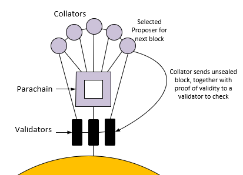

## Collators' Function

Collators maintain parachains by collecting parachain transactions from users and producing state
transition proofs for Relay Chain validators. In other words, collators maintain parachains by
aggregating parachain transactions into parachain block candidates and producing state transition
proofs (Proof-of-Validity, PoV) for validators based on those blocks.

Collators maintain a full node for the Relay Chain and a full node for their particular parachain;
meaning they retain all necessary information to be able to author new blocks and execute
transactions in much the same way as miners do on current PoW blockchains. Under normal
circumstances, they will collate and execute transactions to create an unsealed block and provide
it, together with a PoV, to one or more validators responsible for proposing a parachain block.

Unlike validators, collator nodes do not secure the network. If a parachain block is invalid, it
will get rejected by validators. The validators are required to check the validity of submitted
candidates, followed by issuing and collecting statements about the validity of candidates to other
validators. This process is known as **candidate backing**. Validators receive an arbitrary number
of parachain candidates with associated PoV from untrusted collators. A candidate is considered
_backable_ when at least 2/3 of all assigned validators have issued a valid statement about that
candidate.

The validator must successfully verify the following conditions in the following order:

1. The candidate does not exceed any parameters in the persisted validation data.

2. The signature of the collator is valid.

3. Validate the candidate by executing the parachain Runtime.

Once a candidate meets a specified criteria for inclusion, the selected relay chain block author
then choses any of the backable candidates for each parachain and includes those into the relay
chain block. We say the candidate blocks are _backed_.

The assumption that having more collators is better or more secure is not correct. On the contrary,
too many collators may slow down the network. The only nefarious power collators have is transaction
censorship. To prevent censorship, a parachain only needs to ensure that there are some neutral
collators - but not necessarily a majority. Theoretically, the censorship problem is solved with
having just one honest collator.

## XCM

Collators are a key element of the [XCM (Cross-Consensus Message Passing Format)](learn-xcm.md). By
being full nodes of the Relay Chain, they are all aware of each other as peers. This makes it
possible for them to send messages from parachain A to parachain B.

## Taking the Case for One Parachain

A start of a new block candidate is initiated with a block creation time. The collator aggregates
all new transactions at the end of the process. When doing so, the collator signs the _parachain
block candidate_ and produces state transition proofs (Proof-of-Validity, PoV), which are a summary
of the final account balances caused by the transactions in the candidate block. The collator sends
the candidate block and PoV to the parachain validators, so-called para-validators. The
para-validators verify the transactions within the parachain block candidate. Upon verification, and
if all is well, the candidate becomes _backable_ and a para-validator shares the candidate block
with the relay chain.

The validators on the relay chain will try to reach a consensus on the block candidate. Upon
reaching consensus, the now validated block candidate is shared with the validators and collators,
and the process repeats for new transactions. A collator cannot continue building blocks on a
parachain until the block candidate they proposed to the Relay Chain validators have been validated.
A block is produced every 6 seconds.

## Collators in the Wild

Blockchains that are built using Substrate are unable to hook onto the Relay Chain on their own. The
Parity team built the [Cumulus library](https://github.com/paritytech/cumulus/) to address this.
Collators are being used on the
[Rococo](../build/build-parachains.md##testing-a-parachains:-rococo-testnet) testnet, and you can
learn more about how they are used with Cumulus via the
[Cumulus](https://github.com/paritytech/cumulus/) repository. More information can be found under
the [Cumulus section](../build/build-parachains.md###cumulus) on the build parachain page.

## Guides and Tools

- [Tutorial covering Cumulus and Collators](https://docs.substrate.io/tutorials/connect-other-chains/)
- [Rococo testnet guide](../build/build-parachains.md##testing-a-parachains:-rococo-testnet)
- [polkadot-launch](https://github.com/shawntabrizi/polkadot-launch) - a tool to quickly spin up a
  local Polkadot testnet based on some parameters like number of parachains, collator setup, etc.
