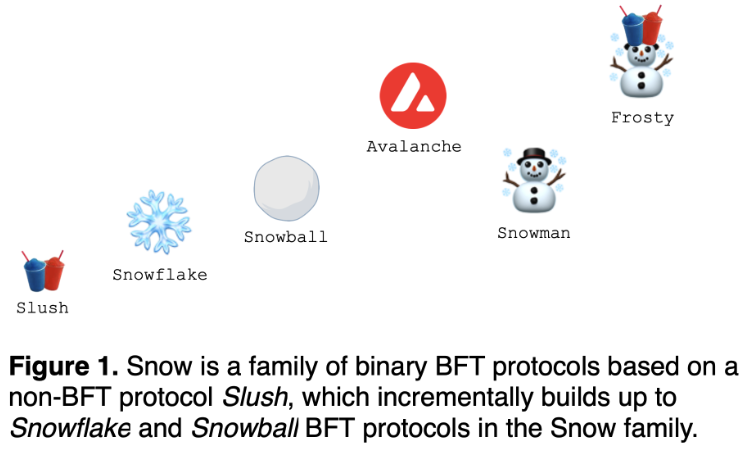

<!-- Add more infographics to this page -->

Polkadot and Avalanche both have an architecture which allows for application specific blockchains to be designed and connected via a "main" chain. In Polkadot, this is the Relay-chain and Avalanche does this with 3 primary chains - the P-chain, X-chain, and C-chain. Similar to how Polkadot has its Parachains that connect to the Relay-chain, Avalanche has what're called subnets. Subnets are application specific chains that can be deployed along side the primary chains. Similar to Polkadot, Avalanche also uses a PoS mechanism for in its consensus algorithm to elect its validators who stake their AVAX tokens in order to become validators and secure the network.

## Model

Avalanche's architecture seperates the responsibility of a layer-1 smart contract platform into three manageable chains. This allows for a seperation of concern over consensus, transactions and smart contract execution runtime. Polkadot is not a smart contract platform and does not have plans to be. The Relay-chain manages the consensus layer as well as the transactions.

## Architecture

As formentioned, the Avalanche architecture is comprised of three different chains. With this model, the seperations of concerns targets the main platform, exchange, and contracts. It also has what're called Subnets, which allow a subsection of the validators to validate blockchains that are built on top of Avalanche. Additionally, the chain in Avalanche is not linear, rather it's a DAG(Directed Acyclic Graph).

#### P-chain (Platform)

The P-chain is responsible for the validator set and securing the network. AVAX token holders can spin up their own nodes and become validators by staking their tokens. Similar to the NPoS system that Polkadot uses, Avalanche uses a Delegated PoS which allows token holders who do not want to spin up their own node to become validators to delegate their token stake to existing validators. When a new subnet is spun up, it will also be connected to the p-chain. 

<!-- TODO: do subnet validators also have to validate the p-chain? In Polkadot collators do not have to do this, but they do have to sync with the relay chain effectively running a relay chain node on their machine. -->

#### X-chain (Exchange)

The X-chain is responsible for the transaction layer of the Avalanche blockchain. It uses a UTXO model like Bitcoin whereas Polkadot uses an account model like Ethereum.

#### C-chain (Contracts)

The C-chain is where most activity will happen on the Avalanche network. It allows for different virtual machines to execute smart contract code. Out of the box, it has support for EVM and AVM (Avalanche VM). 

As Polkadot does not have a smart contract layer ouot of the box, the EVM and WASM smart contract abilities lie in the Parachain layers. This is a major difference between Polkadot and Avalanche. The smart-contract abilities of Avalanche are baked into the main chain. 

#### Subnets or sub-networks

Subnets can be public or private and allow for developers to design and launch a blockchain on Avalanche. There are one or many validators that are subsets from the overall validator set of the network. Any validator in the Avalanche network has to validate all three chains making them a part of the primary network subnet. Subnets can validate any blockchains, however each blockchain is validated by exactly one subnet. Subnets are a way to create application specific chains with their own logic and consensus, but also be a part of the Primary Network.

## Consensus 

Avalanche consensus uses a family of protocols to achieve security, liveness and finality. These are known as the Snow* protocols. This group of protocols composed together use both classical and Nakamoto consensus as well as a Delegated Proof-of-Stake system for its block creators.

The Snow family is a hierarchical collection of systems used to reach finality on Avalanche:

- Slush
- Snowflake
- Snowball
- Avalanche
- Snowman
- Slushie

Compared to Polkadot, Avalanche uses a asynchronous hybrid system that is based on a clasical and Nakomoto approach. Polkadot uses a synchronous hybrid model that combines BABE and GRADNPA, where BABE is the algorithm used to build blocks in a probabilistic way, and GRANDPA is a finality mechanism that uses a deterministic approach to adding blocks to the longest chain. In the end, validators agree to whole chains, rather than single new blocks.

### Snowball 

The snowball protocol is an algorithm that nodes use to come to consensus. Each node continuously queries x number of validators and takes the majority consensus and adopts it as its own. This method, in normal circumstances will lead to the network reaching a consensus. The scalability of Snowball is promising, as the number of participants in the network grows, the number of consensus messages being passed around remains the same. Nodes will query no more than 20 nodes at a given time.

### DAG(Directed Acyclic Graph)

[DAGs](https://en.wikipedia.org/wiki/Directed_acyclic_graph) are graphs consisting of vertices and edges. In Avalanche they are used for **partial ordering** of decisions, such as transactions. Vertices point to each other using edges, and when ordered topologically vertices and edges create a sequence. Edges in the case of Avalanche can be conflicting, and nodes will use the snowball algorithm to make decisions about which edges to keep and which to not. 

## Staking Mechanics

<!-- TODO: Add Polkadot comparison to become a validator and nominator -->

Avalanche uses a Delegated Proof-of-Stake mechanism without any slashing. The barrier to entry for staking as a full node validator is 2500 AVAX, and 25 AVAX to become a delegator. 

## Shards

<!-- TODO: Add sharding comparison... this will mainly be subnets vs parachains -->

## Message Passing

Avalanche does not have a native trustless message passing mechanism. Instead, it relies on bridges. Though, because it is an EVM compatible protocol, it's able to interoperate at a token level. However, subnets do not have a messaging layer out of the box. Polkadot, with its XCM and XCMP messaging protocols allows for a native and trustless messaging scheme, thus supporting composability of chains and enabling the development of powerful cross-chain applications.

## Governance
<!-- 
TODO: Add definitions to each key parameter that is subject to change via governance -->

According to its whitepaper, Avalanche plans to have an on-chain governance mechanism. It currently does not have an on-chain or off-chain system in production. Its governance system will limited to updating only a few key protocol parameters which include:

- Staking amount
- Minimum staking time for a node
- Maximum staking time for a node
- Minting rate
- Transaction fee amount

Limiting the governance functionality is a design choice to increase predictibility and safety.

Polkadot's governance mechanism has been in production from the very begining, and was used to slowly release functionality and decentralize the initial network. It is also not limited to a few parameters and in fact, the whole runtime is subject to change via protocol making Polkadot a meta-protocol.

## Upgrades

The upgrades to Avalanche are administered by the protocol developers at Avax Labs. On Polkadot, the forkless upgrades are administered and deployed through the on-chain governance.

## In the physical realm

Ava Labs, founded by Emin Gün Sirer is based in Brooklyn, NY and is currently the main organization behind the development of Avalanche consensus and the Avalanche Primary Network. Emin, a professor at Cornell and known for his work in the Bitcoin ecosystem, namely around the "selfish mining" attack together with Maofan Ted Yin produced the research and ideas for Avalanche at Cornell. 

## Conclusion

Avalanche has made some design decisions which allow for an improved smart-contract development environment in which protocol engineers can have the freedom to create their own blockchains and include them into the Avalanche ecosystem via subnets. The trade-offs are that the autonomy of design is limited and blockchains have to buy into the design decisions of Avalanche's main chains. Subnets are not able to share the security of the main chains. However, they are able to utilize the low-transaction fee to create working applications quick. We have even seen some Ethereum projects move to Avalanche to take advantage of the lower fees. Whereas Polkadot provides a heterogeneous model, in which blockchains have ultimate autonomy in the way they design their consensus systems, and on top of that are able to share the security of the Relay-chain, and use XCM to pass native trustless messages, instead of having to rely on bridges.

## References

1. [The Avalanche Platform Whitepaper](https://assets.website-files.com/5d80307810123f5ffbb34d6e/6008d7bbf8b10d1eb01e7e16_Avalanche%20Platform%20Whitepaper.pdf)
2. [The Avalanche Consensus Whitepaper](https://assets.website-files.com/5d80307810123f5ffbb34d6e/6009805681b416f34dcae012_Avalanche%20Consensus%20Whitepaper.pdf)
1. [The AVAX Token Dynamics Paper](https://assets.website-files.com/5d80307810123f5ffbb34d6e/6008d7bc56430d6b8792b8d1_Avalanche%20Native%20Token%20Dynamics.pdf)
1. [Nakomoto vs Snow consensus](https://gyuho.dev/nakamoto-bitcoin-vs-snow-avalanche-consensus.html#what-is-snow-consensus)

