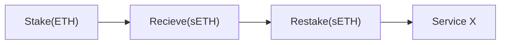

This comparison aims to compare the notion of **restaking**, an up-and-coming way to secure
decentralized layers built on top of Ethereum, to Polkadot's native economic security. EigenLayer
will be the primary subject of comparison to Polkadot, as its goals are similar.

## A Quick Summary: Restaking

Restaking's primary focus access to provide **pooled security**, where something like EigenLayer
will provide cryptoeconomic security for whoever builds on them. Through a series of derived assets,
backed by pools of staked ETH, different layers and dApps built using EigenLayer will have the
advantage of economic security without having to create and manage their own token. Effectively,
this solves the **bootstrap problem** that most new protocols face in the blockchain space.

:::info What is the bootstrap problem?

The bootstrap problem refers to the initial challenge most new protocols face: economic security.
When a new decentralized protocol is created, it often requires some unit of exchange (usually in
the form of a token) to deter adversaries from attempting to attack, as the cost of attacking the
protocol outweighs any potential gain.

Creating and managing a new token comes with a set of challenges - both technical and legal, which
is why having an available pool of economic security is appealing to new protocols.

:::

Where staking ETH secures Ethereum, restaking using a protocol like EigenLayer will allow a user to
allocate some amount of economic security to some Service X, which could be a bridge, layer two
system, or other (decentralized) layer that requires economic security.

### Restaking vs. Liquid Staking

Liquid Staking preserve liquidity through an LP token (liquidity provider). This LP token is
exchangeable one-to-one to the native token, but is usable for DeFi purposes (usually in a
decentralized exchange, or DEX).

The conversion for liquid staking can only occur once. For example,a user may stake 10 DOT natively,
and the liquid staking protocol returns 10 lpDOT in return. The 10 lpDOT can be used while my 10 DOT
is staked.

Restaking can occur twice - firstly with staked ETH, for example, then secondly to whichever service
it chooses to secure.

## A Quick Summary: Polkadot Economic Security (NPoS)

Polkadot's economic security is native to its protocol. Through NPoS, a series of nominators and
validators ensure the honest allocation of staked tokens and smooth propagation of any network state
transitions. This includes the security and availability of any parachains that have a registered
slot on Polkadot.

Polkadot also has a series of secondary availability and validity checks on candidate blocks before
going through the finality process with [GRANDPA](../general/glossary.md#grandpa-finality-gadget).
These checks contribute in ensuring that validators are behaving, and are slashed accordingly.
