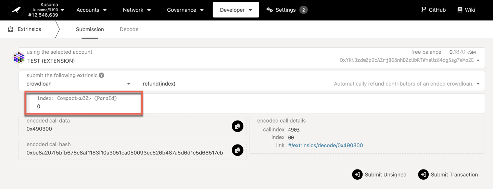
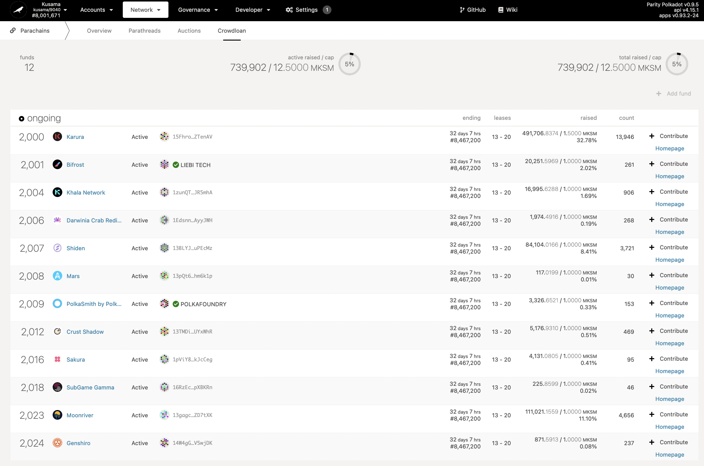

import RPC from "./../../components/RPC-Connection"

{{ polkadot: Polkadot :polkadot }}{{ kusama: Kusama :kusama }} allows parachains to source tokens
for their parachain bids in a decentralised crowdloan.

:::note Contributing to a crowdloan

If you are here for guidance on how to contribute for a crowdloan, watch the video below or read
this
[support article on crowdloans](https://support.polkadot.network/support/solutions/articles/65000177341-how-to-participate-in-crowdloans-on-polkadot-or-kusama).

:::

:::note Testing on Rococo

For information on how to participate in the crowdloan and parachain auction testing on Rococo,
please see the
{{ polkadot: [Rococo content](../build/build-parachains.md##testing-a-parachains:-rococo-testnet) :polkadot }}{{ kusama: [Rococo content](../build/build-parachains.md##testing-a-parachains:-rococo-testnet) :kusama }}.

:::

## Starting a Crowdloan Campaign

Anyone who has registered a parachain can create a new crowdloan campaign for a slot by depositing a
specified number of tokens. A campaign is configured as a range of slots (i.e. the duration of the
{{ polkadot: [parachain](learn-parachains.md) :polkadot }}
{{ kusama: [parachain](learn-parachains.md) :kusama }} will bid for), a cap, and a duration. The
duration can last over several auctions, meaning that the team will not need to restart the campaign
just because they do not secure a slot on their first attempt.

:::info Crowdloan Submission Deposit Required

In order to create a new crowdloan campaign, your account must have
{{ polkadot: 500 DOT :polkadot }}{{ kusama: 10 KSM :kusama }} transferrable which will be reserved
for the duration of the crowdloan

:::

When setting the parameters of a crowdloan campaign, consider the following:

- A crowdloan campaign can start well before the auction slot is opened.
- The campaign creation form requires setting a crowdloan cap &mdash; the maximum amount a campaign
  can collect. A team can still win an [auction](learn-auction.md) if the cap is not reached.
- Set the desired end of the crowdloan in the "Ending block" field. This helps to ensure that the
  crowdloan is live during the entire duration of the auction. For example, if an auction starts in
  three days and will last for five days, you may want to set your crowdloan to end in 10 days, or a
  similar timescale.
- One way of calculating the ending block number is adding: `(10 * 60 * 24 * 7) * (x * 6) + y`

  - `x` is the number of auction periods you want the crowdloan to continue for
  - `y` is the current block number

  - `(Blocks/Min * Min/Hour * Hour/Day * Day/Week) * (x[Period] * Week/Period) + y[BlockNumber]`

  - "First period" field refers to the first period you want to bid for. If the current auction
    encompasses periods `(3, 4, 5, 6)`, your first period can be at least `3`. The last slot must
    also be within that range.
  - You can only cancel an ongoing crowdloan if no contributions have been made. Your deposit will
    be returned to you.

Prior to the start of the crowdloan campaign, the owner will upload the parachain data. Once the
crowdloan is live, **the parachain configuration will be locked** and will be deployed as the
parachain's runtime. Of course, once the parachain is running it can always change via runtime
upgrades (as determined through its own local governance).

## Supporting a Crowdloan Campaign

### Contributing to Crowdloans

:::info Minimum Crowdloan Contribution

The minimum balance for contributions for a crowdloan campaign is currently set to
{{ polkadot: <RPC network="polkadot" path="consts.crowdloan.minContribution" defaultValue={50000000000} filter="humanReadable"/>. :polkadot }}
{{ kusama: <RPC network="kusama" path="consts.crowdloan.minContribution" defaultValue={100000000000} filter="humanReadable"/>. :kusama }}
This is in an attempt to make crowdloans as accessible as possible while maintaining a balance to
justify the use of the network's resources.

:::

Each created campaign will have an index. Once a crowdloan campaign is open, anyone can participate
by sending a special transaction that references the campaign's index. Tokens used to participate
must be transferable &mdash; that is, not locked for any reason, including staking, vesting, and
governance &mdash; because they will be moved into a module-controlled account that was generated
uniquely for this campaign.

:::caution Do not send Crowdloan contributions directly to the Parachain address

All crowdloan contributions are handled by the Crowdloan module’s logic where a campaign is
identified by an index, not by address. \*\*Never transfer tokens to an address in support of a
campaign.

:::

It is up to individual parachain teams to decide if and how they want to reward participants who
forgo staking and choose to lock their tokens in support of the parachain’s campaign. As one can
imagine, rewards will take many forms and may vary widely among projects.

If a crowdloan campaign is successful, that parachain will be on-boarded to the Relay Chain. The
collective tokens will be locked in that parachain's account for the entire duration that it is
active.

### Withdraw Crowdloaned Tokens

Participants will be able to reclaim their tokens in one of two ways:

- If the campaign was successful, then the parachain will enter a retirement phase at the end of its
  lease. During this phase, participants can withdraw the tokens with which they participated.
- If the campaign was unsuccessful, then this retirement phase will begin at the campaign's
  configured end, and participants can likewise withdraw their tokens.

:::tip `crowdloan.contribute` extrinsic is trustless

Contributing to a crowdloan through Polkadot JS Apps (which uses `crowdloan.contribute` extrinsic)
guarantees that you receive your tokens after the campaign ends. If you intend to make contributions
through other websites and custodial service providers like central exchanges, review their terms
and conditions thoroughly and assess the risks associated.

:::

Note: When the lease periods won by the crowdloan have finished, or the crowdloan has ended without
winning a slot, anyone can trigger the refund of crowdloan contributions back to their original
owners. This can be done through the permissionless `crowdloan.refund` extrinsic available on
Polkadot JS Apps > Developer > Extrinsics page, by specifying the parachain ID. This extrinsic may
need to be issued multiple times, if the list of contributors is too long. All contributions must be
returned before the crowdloan is entirely deleted from the system.

Many projects will have dashboards available that allow users to participate in their crowdloans.
PolkadotJS apps also offers a breakdown of ongoing crowdloans on the
[Apps page](https://polkadot.js.org/apps/?rpc=wss%3A%2F%2Fkusama-rpc.polkadot.io#/parachains/crowdloan).

Here is an example of the crowdloans in play during the very first Kusama auction.

Furthermore, check out this video on
[How to Participate in Crowdloans](https://www.youtube.com/watch?v=YrTxDufrcQM) for steps on how to
access available crowdloans on PolkadotJS apps.
