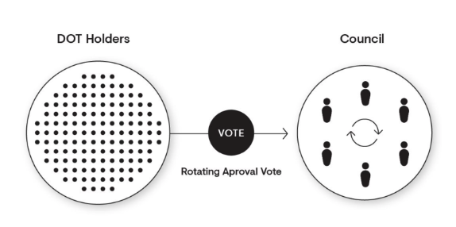

import RPC from "./../../components/RPC-Connection";

import VLTable from "./../../components/Voluntary-Locking";

{{ polkadot: Polkadot :polkadot }}{{ kusama: Kusama :kusama }} uses a sophisticated governance
mechanism that allows it to evolve gracefully overtime at the ultimate behest of its assembled
stakeholders. The stated goal is to ensure that the majority of the stake can always command the
network.

:::caution Active Development The governance protocol has already undergone a couple iterations (v1
and v2) with more changes in the pipeline (v2.5). See the comments below for additional details and
for distinct differences between the various versions. :::

{{ polkadot: Polkadot :polkadot }}{{ kusama: Kusama :kusama }}'s first decentralised governance
system (v1) was comprised of three main components.

1. A technocratic committee to manage upgrade timelines.
2. An approval-voted, elected executive "government" to manage parameters, admin and spending
   proposals.
3. A general voting system for everything else which rewarded long-term stakeholders with increased
   influence.

This system has functioned well over the first few years of operation, helping ensure appropriate
usage of treasury funds and enabling timely upgrades and fixes. Like most early technologies, the
systems and protocols must evolve as they mature to improve upon their shortcomings and keep up with
modern advancements. For example, in Governance v1 all referenda carry the same weight as only one
referenda can be voted on at a time and the voting period can last multiple weeks. This results in
the system favoring careful consideration of very few proposals, as opposed to broad consideration
of many. With that being said, Governance v2 is here!

Governance v2 or Gov2 changes how the practical means of day-to-day decisions are made, making the
repercussions of referenda better scoped and agile in order to dramatically increase the number of
collective decisions the system is able to make.

**Gov2 is set to launch on Kusama following the final professional audit of its code. Once tested on
Kusama, a proposal will be made for it to be deployed on Polkadot.**

The following content will begin by walking through many of the core principles of governance on the
{{ polkadot: Polkadot :polkadot }}{{ kusama: Kusama :kusama }} network. It is important to
understand the roots of governance v1 to better understand the direction of the second iteration.
These deltas and distinctions will be highlighted throughout the various sub-topics.

This being said, it is important to remember that governance is a constantly evolving protocol at
this stage in its lifecycle. As updates for Governance v2 are making their way to the networks,
plans for Governance v2.5 are already in development.

## Premise

At a high level, the network brings together various novel mechanisms, including an amorphous
state-transition function stored on-chain and defined in a platform-neutral intermediate language
(i.e. [WebAssembly](learn-wasm.md)) and several on-chain voting mechanisms such as referenda with
adaptive super-majority thresholds and batch approval voting.

All changes to the protocol must be agreed upon by stake-weighted referenda.

## Mechanism

In Governance v1, active token holders and the council together administrate a network upgrade
decision. No matter whether the proposal is proposed by the public (token holders) or the council,
it will eventually have to go through a referendum to let all holders, weighted by stake and
conviction , make the decision.

To better understand how the council is formed, please read [this section](#council).

There are several changes here with Governance v2. The way the new governance model reflects its
decentralised character is by:

1. Migrating all responsibilities of Council to token holders via democracy votes
2. Dissolving the current Council collective
3. Allowing users to delegate voting power in more ways to community members

The Council in Gov1 has fulfilled its role as the representative of passive token holders, guardian
of the treasury and initiator of legislation, but is often seen as a centralized entity. To further
decentralize Polkadot and Kusama networks, Gov2 proposes to return the responsibilities of the
council back to the community.

## Referenda

Referenda are simple, inclusive, stake-based voting schemes. Each referendum has a specific
_proposal_ associated with it that takes the form of a privileged function call in the runtime (that
includes the most powerful call: `set_code`, which can switch out the entire code of the runtime,
achieving what would otherwise require a "[hard fork](./../general/glossary#hard-fork)").

Referenda are discrete events that have a fixed voting period. When the voting period ends and the
votes are tallied, the function call (`set_code`) is made if the vote is approved. Referenda are
always binary; your only options in voting are "aye", "nay", or abstaining entirely.

In Governance v1, referenda can be started in one of several ways:

1. Publicly submitted proposals;
2. Proposals submitted by the council, either through a majority or unanimously;
3. Proposals submitted as part of the enactment of a prior referendum;
4. Emergency proposals submitted by the Technical Committee and approved by the Council.

All referenda have an _enactment delay_ associated with them. This is the period between the
referendum ending and, assuming the proposal was approved, the changes being enacted.

Referenda is considered _baked_ if it is closed and tallied. Again, assuming the proposal was
approved, it would be scheduled for enactment. Referenda is considered _unbaked_ if it is pending an
outcome, i.e. being voted on.

If a proposal is submitted by the public or council there is a fixed enactment delay period of
{{ polkadot: <RPC network="polkadot" path="consts.democracy.enactmentPeriod" defaultValue={403200} filter="blocksToDays" /> :polkadot }}
{{ kusama: <RPC network="kusama" path="consts.democracy.maxProposals" defaultValue={115,200} filter="blocksToDays" /> :kusama }}
days. Proposals submitted as part of the enactment of a prior referendum can set the enactment delay
period as desired. Emergency proposals deal with major problems with the network that need to be
"fast-tracked", which leads to shorter enactment times.

In Gov2, anyone is able to start a referendum at anytime and they can do so as many times as they
wish. Several new features, known as **Origins and Tracks**, are introduced to help aid in the flow
and processing of the referenda protocol.

An Origin can be thought of as a rich descriptor for a given privilege level. The proposer of the
referenda now selects an appropriate Origin for their request based on the requirements of the
proposal.

Each Origin is associated with a single referendum class and each class is associated with a Track.
The Track outlines the lifecycle for the proposal and is independent from other class's tracks.
Having independent tracks allows the network to tailor the dynamics of referenda based upon their
implied privilege level.

So for example, a runtime upgrade (`set_code` call) does not have the same implications for the
ecosystem as the approval of a treasury tip (`reportAwesome` call), and therefore different Origins
are needed in which different turnouts, approvals, deposits and a minimum enactment periods will be
predetermined on the pallet.

### Proposing a Referendum

#### Public Referenda

Anyone can propose a referendum by depositing the minimum amount of tokens for a certain period
(number of blocks). If someone agrees with the proposal, they may deposit the same amount of tokens
to show support

- this action is called _endorsing_. The proposal with the highest amount of bonded support will be
  selected to be a referendum in the next voting cycle.

Note that this may be different from the absolute number of endorsements; for instance, three
accounts bonding {{ polkadot: 20 DOT each would "outweigh" ten accounts bonding a
single DOT each :polkadot }}{{ kusama: 3 KSM each would "outweigh" six accounts bonding 0.5 KSM each }}.

The bonded tokens will be released once the proposal is tabled (that is, brought to a vote).

For Governance v1, there can be a maximum of
{{ polkadot: <RPC network="polkadot" path="consts.democracy.maxProposals" defaultValue={100} /> :polkadot }}
{{ kusama: <RPC network="kusama" path="consts.democracy.maxProposals" defaultValue={100} /> :kusama }}
public proposals in the proposal queue.

In Gov2, when a referendum is initially created, it can be immediately voted on by the community.
However, it is not in a state where it can end, or otherwise have its votes counted, be approved and
summarily enacted. Instead, referenda must fulfil a number of criteria before they are moved into a
state known as **Deciding**. Until they are in this state, they remain undecided.

The criteria for entering the Decided state is a follows:

1. A **lead-in period** that outlines the amount of time that must elapse before deciding can begin.
   This helps mitigate against the possibility of "decision snapping" where an attacker controlling
   a substantial amount of voting power might seek to have a proposal passed immediately after
   proposing, not allowing the overall voting population adequate time to consider and participate.
2. There must be room for the decision. All Tracks specify their own limit on the number of
   referenda which can be decided simultaneously. Tracks that have more potent abilities will have
   lower limits. For example, the Root level Origin has a limit of one, implying that only a single
   über-dangerous proposal may be decided on at once.
3. A **Decision Deposit** must be paid. Creating a referendum is cheap as the deposit value consists
   of only the value required for the on-chain storage needed to track it. But, having a referendum
   reviewed and decided upon carries the risk of using up the limited spots available in the
   referenda queue. It makes sense to have a larger, but refundable deposit requirement to help
   mitigate spam.

#### Council Referenda (v1)

Unanimous Council - When all members of the council agree on a proposal, it can be moved to a
referendum. This referendum will have a negative turnout bias (that is, the smaller the amount of
stake voting, the smaller the amount necessary for it to pass - see
[Adaptive Quorum Biasing](#adaptive-quorum-biasing)).

Majority Council - When agreement from only a simple majority of council members occurs, the
referendum can also be voted upon, but it will be majority-carries (51% wins).

There can only be one active referendum at any given time, except when there is also an emergency
referendum in progress.

#### Voting Timetable

In Governance v1, every
{{ polkadot: <RPC network="polkadot" path="consts.democracy.votingPeriod" defaultValue={403200} filter="blocksToDays" /> :polkadot }}
{{ kusama: <RPC network="kusama" path="consts.democracy.votingPeriod" defaultValue={100800} filter="blocksToDays" /> :kusama }}
days, a new referendum will be up for a vote, assuming there is at least one proposal in one of the
queues. There is a queue for Council-approved proposals and a queue for publicly submitted
proposals. The referendum to be voted upon alternates between the top proposal in the two queues.

The "top" proposal is determined by the amount of stake bonded behind it. If the the current queue
selection attempts to create a referendum with no proposals (it is empty) and proposals are waiting
in the other queue, the top proposal in the other queue will become a referendum.

Multiple referenda cannot be voted upon in the same period, excluding emergency referenda. An
emergency referendum occurring at the same time as a regular referendum (either public or
council-proposed) is the only time that multiple referenda will be able to be voted on
simultaneously.

Governance v2 shares the same
{{ polkadot: <RPC network="polkadot" path="consts.democracy.votingPeriod" defaultValue={403200} filter="blocksToDays" /> :polkadot }}
{{ kusama: <RPC network="kusama" path="consts.democracy.votingPeriod" defaultValue={100800} filter="blocksToDays" /> :kusama }}
day eligibility period when the proposal can get approved. If not approved by then end of this
period, the proposal is automatically rejected.

#### Voting on a referendum (governance v1)

To vote, a voter generally must lock-up their tokens for at least the enactment delay period plus
some additional time beyond the end of the referendum. The additional time at the end of the cycle
helps ensure the voter has some minimal economic buy-in to the result and to dissuade vote selling.

It is possible to vote without locking at all, but your vote is worth a small fraction of a normal
vote, given your stake. At the same time, holding only a small amount of tokens does not mean that
the holder cannot influence the referendum result, thanks to time-locking. You can read more about
this at [Voluntary Locking](#voluntary-locking).

:::note Referenda explainer video

To learn more about voting on referenda, please check out our
[technical explainer video](https://www.youtube.com/watch?v=BkbhhlsezGA&list=PLOyWqupZ-WGuAuS00rK-pebTMAOxW41W8&index=31&ab_channel=Polkadot).

:::

Example:

Peter: Votes `No` with {{ polkadot: 10 DOT :polkadot }}{{ kusama: 1 KSM :kusama }} for a 128 week
lock period => {{ polkadot: 10 x 6 = 60 Votes :polkadot }}{{ kusama: 1 x 6 = 6 Votes :kusama }}

Logan: Votes `Yes` with {{ polkadot: 20 DOT :polkadot }}{{ kusama: 2 KSM :kusama }} for a 4 week
lock period => {{ polkadot: 20 x 1 = 20 Votes :polkadot }}{{ kusama: 2 x 1 = 2 Votes :kusama }}

Kevin: Votes `Yes` with {{ polkadot: 15 DOT :polkadot }}{{ kusama: 1.5 KSM :kusama }} for a 8 week
lock period => {{ polkadot: 15 x 2 = 30 Votes :polkadot }}{{ kusama: 1.5 x 2 = 3 Votes :kusama }}

Even though combined both Logan and Kevin vote with more
{{ polkadot: DOT :polkadot }}{{ kusama: KSM :kusama }} than Peter, the lock period for both of them
is less than Peter, leading to their voting power counting as less.

#### Tallying

In Governance v1, there are three resulting scenarios that can occur, depending on which entity
initiated the proposal and whether council unanimously voted yes in support. These resulting
scenarios are visualized in the following table:

|          **Entity**          |                   **Metric**                   |
| :--------------------------: | :--------------------------------------------: |
|            Public            | Positive Turnout Bias (Super-Majority Approve) |
| Council (Complete agreement) | Negative Turnout Bias (Super-Majority Against) |
| Council (Majority agreement) |                Simple Majority                 |

To calculate the result the following variable values are required:

- approve - the number of aye votes
- against - the number of nay votes
- turnout - the total number of voting tokens (does not include conviction)
- electorate - the total number of tokens issued in the network

These values are applied to the formulas outlined below to get the voting results.

For example, in a public proposal the `Super-Majority Approve` formula is applied. There is no
strict quorum, but the super-majority required increases with lower turnout.

##### Super-Majority Approve

A `positive turnout bias`, whereby a heavy super-majority of aye votes is required to carry at low
turnouts, but as turnout increases towards 100%, it becomes a simple majority-carries as below.


##### Super-Majority Against

A `negative turnout bias`, whereby a heavy super-majority of nay (no) votes is required to reject at
low turnouts, but as turnout increases towards 100%, it becomes a simple majority-carries as below.


##### Simple-Majority

Majority-carries, a simple comparison of votes; if there are more aye votes than nay, then the
proposal is carried, no matter how much stake votes on the proposal.


_To know more about where these above formulas come from, please read the
[democracy pallet](https://github.com/paritytech/substrate/blob/master/frame/democracy/src/vote_threshold.rs)._

Example:

Assume we only have {{ polkadot: 1,500 DOT :polkadot }}{{ kusama: 150 :kusama }} tokens in total and
that this is a public proposal.

- John: {{ polkadot: 500 DOT :polkadot }}{{ kusama: 50 KSM :kusama }}
- Peter: {{ polkadot: 100 DOT :polkadot }}{{ kusama: 10 KSM :kusama }}
- Lilly: {{ polkadot: 150 DOT :polkadot }}{{ kusama: 15 KSM :kusama }}
- JJ: {{ polkadot: 150 DOT :polkadot }}{{ kusama: 15 KSM :kusama }}
- Ken: {{ polkadot: 600 DOT :polkadot }}{{ kusama: 60 KSM :kusama }}

John: Votes `Yes` for a 4 week lock period =>
{{ polkadot: 500 x 1 = 500 Votes :polkadot }}{{ kusama: 50 x 1 = 50 Votes :kusama }}

Peter: Votes `Yes` for a 4 week lock period =>
{{ polkadot: 100 x 1 = 100 Votes :polkadot }}{{ kusama: 10 x 1 = 10 Votes :kusama }}

JJ: Votes `No` for a 16 week lock period =>
{{ polkadot: 150 x 3 = 450 Votes :polkadot }}{{ kusama: 150 x 3 = 450 Votes :kusama }}

- approve = {{ polkadot: 600 :polkadot }}{{ kusama: 60 :kusama }}
- against = {{ polkadot: 450 :polkadot }}{{ kusama: 45 :kusama }}
- turnout = {{ polkadot: 750 :polkadot }}{{ kusama: 75 :kusama }}
- electorate = {{ polkadot: 1500 :polkadot }}{{ kusama: 150 :kusama }}


Since the above example is a public referendum, `Super-Majority Approve` would be used to calculate
the result. `Super-Majority Approve` requires more `aye` votes to pass the referendum when turnout
is low, therefore, based on the above result, the referendum will be rejected. In addition, only the
winning voter's tokens are locked. If the voters on the losing side of the referendum believe that
the outcome will have negative effects, their tokens are transferrable so they will not be locked
into the decision. Moreover, winning proposals are autonomously enacted only after the enactment
delay period.

#### Voting on a referendum (governance v2)

In Governance v2, a proposal is approved if it meets the requirements for **approval** and
**support**, removing the adaptive quorum biasing system.

**Approval** is defined as the share of approval vote-weight (after adjustment for conviction)
against the total vote-weight (for both approval and rejection).

**Support** is the total number of votes in the approval (ignoring any adjustment for conviction)
compared to the total possible votes that could be made in the system.

It must fulfill this criteria for the minimum of the **Confirmation Period**. Different tracks have
different Confirmation Periods and requirements for approval and support. It is now possible to
configure the amount of support and overall approval required for it to pass. With proposals that
use less privileged origins, it is far more reasonable to drop the required turnout to a more
realistic amount earlier than those which use highly privileged classes such as `Root`. Classes with
more political significance can be made to require a higher approval early on, to avoid controversy.

In Gov2, proposals that are not approved after
{{ polkadot: <RPC network="polkadot" path="consts.democracy.votingPeriod" defaultValue={403200} filter="blocksToDays" /> :polkadot }}
{{ kusama: <RPC network="kusama" path="consts.democracy.votingPeriod" defaultValue={100800} filter="blocksToDays" /> :kusama }}
days are considered rejected by default and the Decision Deposit is refunded. If the proposal
manages to stay passing until the end of the Confirmation Period, it is considered approved and is
scheduled to execute from the proposed origin but after the Enactment Period . The Enactment Period
is specified when the referendum is proposed but is also subject to a minimum value based on the
Track. More powerful Tracks enforce a larger Enactment Period to ensure the network has ample time
to prepare for any changes the proposal may bring.

#### Voluntary Locking

{{ polkadot: Polkadot :polkadot }}{{ kusama: Kusama :kusama }} utilizes an concept called
`Voluntary Locking` which allows token holders to increase their voting power by declaring how long
they are willing to lock up their tokens, hence, the number of votes for each token holder will be
calculated using the following formula:

```
votes = tokens * conviction_multiplier
```

The `conviction multiplier` increases the vote multiplier by one every time the number of lock
periods double.

<VLTable network="polkadot"/>

The maximum number of "doublings" of the lock period is set to 6 (and thus 32 lock periods in
total), and one lock period equals
{{ polkadot: <RPC network="polkadot" path="consts.democracy.voteLockingPeriod" defaultValue={403200} filter="blocksToDays"/> :polkadot }}
{{ kusama: <RPC network="kusama" path="consts.democracy.voteLockingPeriod" defaultValue={115200} filter="blocksToDays"/> :kusama }}
days. Only doublings are allowed; you cannot lock for, say, 24 periods and increase your conviction
by 5.5. For additional information regarding the timeline of governance events, check out the
governance section on the
{{ polkadot: [Polkadot Parameters page](../docs/maintain-polkadot-parameters/#governance) :polkadot }}{{ kusama: [Kusama Parameters page](../docs/kusama-parameters/#governance) :kusama }}.

While a token is locked, you can still use it for voting and staking; you are only prohibited from
transferring these tokens to another account.

Votes are always "counted" at the same time, which is at the end of the voting period. This is not
impacted by the locking period of the tokens.

#### Adaptive Quorum Biasing

In governance v1, {{ polkadot: Polkadot :polkadot }}{{ kusama: Kusama :kusama }} introduces the
concept of "Adaptive Quorum Biasing", which functions as a lever that the council can use to alter
the effective super-majority required to make it easier or more difficult for a proposal to pass in
the case that there is no clear majority of voting power backing or against the proposal.


Let's use the above image as an example.

If a publicly submitted referendum only has a 25% turnout, the tally of "aye" votes has to reach 66%
for it to pass since we applied `Positive Turnout Bias`.

In contrast, when it has a 75% turnout, the tally of "aye" votes has to reach 54%, which means that
the super-majority required decreases as the turnout increases.

When the council initiates a new proposal through unanimous consent, the referendum is put to a vote
using "Negative Turnout Bias". In this case, it is easier to pass the proposal with low turnout and
requires a super-majority to reject. As more token holders participate in voting, the bias
approaches a plain majority carries.

Referring to the above image, when a referendum only has 25% turnout, the tally of "aye" votes has
to reach 34% for it to pass.

When the turnout rate is low, a super-majority is required to reject the proposal . This means a
lower threshold of "aye" votes have to be reached, but as turnout increases towards 100%, it becomes
a simple majority.

All three tallying mechanisms - majority carries, super-majority approve, and super-majority
against - equate to a simple majority-carries system at 100% turnout.

Adaptive quorum biasing is longer used in Governance v2 and is replaced by the Approval/Support
system.

## Council

In Governance v1, passive stakeholders are represented on
{{ polkadot: Polkadot :polkadot }}{{ kusama: Kusama :kusama }} via a governing body known as the
"council". The council is an on-chain entity comprising several actors, each represented as an
on-chain account. On {{ polkadot: Polkadot :polkadot }}{{ kusama: Kusama :kusama }}, the council
currently consists of
{{ polkadot: <RPC network="polkadot" path="query.council.members" defaultValue={Array(13)} filter="arrayLength" /> :polkadot }}
{{ kusama: <RPC network="kusama" path="query.council.members" defaultValue={Array(19)} filter="arrayLength" /> :kusama }}
members.

Along with [controlling the treasury](learn-treasury.md), the council is called upon primarily for
three tasks of governance:

1. Proposing sensible referenda
2. Cancelling dangerous or malicious referenda
3. Electing the Technical Committee

For a referendum to be proposed by the council, a strict majority of members must be in favor, with
no member exercising a veto. Vetoes may be exercised only once by a member for any single proposal;
if, after a cool-down period, the proposal is resubmitted, they may not veto it a second time.

Council motions which pass with a 3/5 (60%) super-majority - but without reaching unanimous
support - will move to a public referendum under a neutral, majority-carries voting scheme. In the
case that all members of the council vote in favor of a motion, the vote is considered unanimous and
becomes a referendum with negative adaptive quorum biasing.

:::note Explainer video on the Council

For more information, check out our
[video explainer on Council](https://www.youtube.com/watch?v=837Vv3gdRzI)

:::

In Governance v2, an alternate strategy was required to replace the Council in its previous duties
as a body delegated by voters to compensate for the fact that many choose to not take part in
day-to-day of governance. Gov2 builds on the **Vote Delegation** feature from v1 where a voter can
choose to delegate their voting power to another voter in the system. It does so by improving a
feature known as **Multirole Delegation**, where voters can specify a different delegate for every
class of referendum in the system. So for example, a voter could delegate one entity for managing a
less potent referenda class, choose a different delegate for a different class with more powerful
consequences and still retain full voting power over any remaining classes.

### Canceling

In Governance v1, a proposal can be canceled if the [Technical Committee](#technical-committee)
unanimously agrees to do so, or if Root origin (e.g. sudo) triggers this functionality. A canceled
proposal's deposit is burned.

Additionally, a two-thirds majority of the council can cancel a referendum. This may function as a
last-resort if there is an issue found late in a referendum's proposal such as a bug in the code of
the runtime that the proposal would institute.

If the cancellation is controversial enough that the council cannot get a two-thirds majority, then
it will be left to the stakeholders _en masse_ to determine the fate of the proposal.

In Governance v2, there is a special operation called **Cancelation** for intervening with a
proposal that is already being voted on. The operation will immediately reject an ongoing referendum
regardless of its status. There is also a provision to ensure the deposit of the proposer is
slashed, if the proposal is malicious or spam.

Cancelation itself is a governance operation which must be voted upon by the network in order to be
executed. Cancelation comes with its own Origin and Track which has a low lead-time and
Approval/Support curves with slightly sharper reductions in their thresholds for passing, given that
it is invoked with a sense of urgency.

### How to be a council member?



All stakeholders are free to signal their approval of any of the registered candidates.

Council elections are handled by the same [Phragmén election](../docs/learn-phragmen) process that
selects validators from the available pool based on nominations. However, token holders' votes for
councillors are isolated from any of the nominations they may have on validators. Council terms last
for
{{ polkadot:  <RPC network="polkadot" path="consts.phragmenElection.termDuration" defaultValue={100800} filter="blocksToDays" /> :polkadot }}
{{ kusama: <RPC network="kusama" path="consts.phragmenElection.termDuration" defaultValue={14400} filter="blocksToDays" />  :kusama }}
day(s).

At the end of each term, [Phragmén election algorithm](../docs/learn-phragmen#algorithm) runs and
the result will choose the new councillors based on the vote configurations of all voters. The
election also chooses a set number of runners up which is currently
{{ polkadot:  <RPC network="polkadot" path="consts.phragmenElection.desiredRunnersUp" defaultValue={20} /> :polkadot }}
{{ kusama: <RPC network="kusama" path="consts.phragmenElection.desiredRunnersUp" defaultValue={19} />  :kusama }}
that will remain in the queue with their votes intact.

As opposed to a "first-past-the-post" electoral system, where voters can only vote for a single
candidate from a list, a Phragmén election is a more expressive way to include each voters' views.
Token holders can treat it as a way to support as many candidates as they want. The election
algorithm will find a fair subset of the candidates that most closely matches the expressed
indications of the electorate as a whole.

Let's take a look at the example below.

|      Round 1      |     |                |     |     |     |
| :---------------: | :-: | :------------: | :-: | :-: | :-: |
| **Token Holders** |     | **Candidates** |     |     |     |
|                   |  A  |       B        |  C  |  D  |  E  |
|       Peter       |  X  |                |  X  |  X  |  X  |
|       Alice       |     |       X        |     |     |     |
|        Bob        |     |                |  X  |  X  |  X  |
|      Kelvin       |  X  |                |  X  |     |     |
|     **Total**     |  2  |       1        |  3  |  2  |  2  |

The above example shows that candidate C wins the election in round 1, while candidates A, B, D & E
keep remaining on the candidates' list for the next round.

|      Round 2      |     |                |     |     |
| :---------------: | :-: | :------------: | :-: | :-: |
| **Token Holders** |     | **Candidates** |     |     |
|                   |  A  |       B        |  D  |  E  |
|       Peter       |  X  |       X        |     |     |
|       Alice       |  X  |       X        |     |     |
|        Bob        |  X  |       X        |  X  |  X  |
|      Kelvin       |  X  |       X        |     |     |
|     **Total**     |  4  |       4        |  1  |  1  |

For the top-N (say 4 in this example) runners-up, they can remain and their votes persist until the
next election. After round 2, candidate A and B have the same number of votes. Candidate A gets
elected because they have more old, unused approvals.

### Prime Members

The council, being an instantiation of
[Substrate's Collective pallet](https://github.com/paritytech/substrate/tree/master/frame/collective),
implements what's called a _prime member_ whose vote acts as the default for other members that fail
to vote before the timeout.

The prime member is chosen based on a [Borda count](https://en.wikipedia.org/wiki/Borda_count).

The purpose of having a prime member on the council is to ensure a quorum, even when several members
abstain from a vote. Council members might be tempted to vote a "soft rejection" or a "soft
approval" by not voting and letting the others vote. With the existence of a prime member, it forces
councillors to be explicit in their votes or leave their voting privilege up to the prime member.

## Technical Committee

In Governance v1, the Technical Committee (TC) was introduced in the
[Kusama rollout and governance post](https://polkadot.network/kusama-rollout-and-governance/) as one
of the three chambers of Kusama governance (along with the Council and the Referendum chamber). The
TC is composed of the teams that have successfully implemented or specified either a
{{ polkadot: Polkadot :polkadot }}{{ kusama: Kusama :kusama }} runtime or Polkadot Host. Teams are
added or removed from the TC via a simple majority vote of the [Council](#council).

The purpose of the TC is to safeguard against malicious referenda, implement bug fixes, reverse
faulty runtime updates, or add new but battle-tested features. The TC has the power to fast-track
proposals by using the Democracy pallet, and is the only origin that is able to trigger the
fast-tracking functionality. We can think of the TC as a "unique origin" that cannot generate
proposals, but are able to fast track existing proposals.

Fast-tracked referenda are the only type of referenda that can be active alongside another active
referendum. Thus, with fast-tracked referenda it is possible to have two active referendums at the
same time. Voting on one does not prevent a user from voting on the other.

In Governance v2, a new successor committee was introduced, known as the "Polkadot Fellowship", to
replace the Technical Committee. It will serve both the Polkadot and Kusama networks. See additional
details below.

## Polkadot Fellowship

The Fellowship is a mostly self-governing expert body with a primary goal of representing humans who
embody and contain the technical knowledge base of the Polkadot network and protocol. This is
accomplished by associating a rank with members to categorize the degree to which the system expects
their opinion to be well-informed, of a sound technical basis and in line with the interests of
Polkadot.

Unlike the current Technical Collective, it is designed to be far broader in membership (i.e. to
work well with even tens of thousands of members) and with far lower barrier to entry (both in terms
of administrative process flow and expectations of expertise). Becoming a candidate member in the
Fellowship is as easy as placing a small deposit.

Members of the Fellowship can vote on any given Fellowship proposal and the aggregate opinion of the
members (weighted by their rank) constitutes the Fellowship's considered opinion.

The mechanism by which the Fellowship votes is the same as what is used for Polkadot stakeholder
voting for a proposed referendum.

### Ranking System

So how exactly does this ranking system work?

To prevent a small group of participants from gaining effective control over the network, this
system will adhere to three main principles:

1. The Fellowship must never have hard power over the network: it cannot change the parameters,
   conduct rescues or move assets. Their only power in governance resides in the the ability to
   reduce the effective timeline on which a referendum takes place.
2. The Fellowship weights those with a higher rank more in the aggregate opinion, however the weight
   should not be so high as to make a small number of higher members’ opinions be insurmountable
   when compared to a coherent opinion coming from lower-ranked membership.
3. The Fellowship should be designed to grow and develop its membership and their aggregate levels
   of expertise and in doing so ensure that its overall decision-making capacity gets stronger over
   time.

To support these conditions, the Fellowship will have a constitution which outlines the requirements
and expectations for individuals to attain and retain any given rank. Higher ranks are able to vote
and promote lower ranks based on this constitution.

**Demotion** occurs automatically after a given period has elapsed and the member is unable to
defend their position to their peers.

**Suspension** can happen only through general referendum, which ensures that the Fellowship's bias
alone does not necessarily result in expulsion.

To prevent the Fellowship from becoming a cabal (popularity with Fellowship peers alone should not
be enough to gain access to a top rank), gaining access to top tiers of the ranks will require a
referendum.

### Whitelisting

The Whitelist pallet does one thing: it allows one Origin to escalate the privilege level of another
Origin for a certain operation.

In Gov2, it allows the Fellowship to authorise a new origin (known as Whitelisted-Root) to be
executed with Root-level privileges and will only work with certain specified commands that have
been authorised by the Fellowship. The Whitelist pallet verifies two things:

1. The origin really is the Whitelisted-Root (i.e. that the referendum passed on this track)
2. The proposal has indeed been whitelisted by the Fellowship.

If both conditions are true, the operation executes with Root-level privileges.

This system enables the ability to have a new parallel Track (Whitelisted-Root Origin), whose
parameters allow for a shorter voting turnaround. Through an open and transparent process, a body of
global experts on the Polkadot protocol have determined that the action is both safe and
time-critical.

### Blacklisting

A proposal can be blacklisted by Root origin (e.g. sudo). A blacklisted proposal and its related
referendum (if any) are immediately [canceled](#canceling). Additionally, a blacklisted proposal's
hash cannot re-appear in the proposal queue. Blacklisting is useful when removing erroneous
proposals that could be submitted with the same hash, i.e.
[proposal #2](https://polkascan.io/polkadot/democracy/proposal/2) in which the submitter used plain
text to make a suggestion.

Upon seeing their proposal removed, a submitter who is not properly introduced to the democracy
system of {{ polkadot: Polkadot :polkadot }}{{ kusama: Kusama :kusama }} might be tempted to
re-submit the same proposal. That said, this is far from a fool-proof method of preventing invalid
proposals from being submitted - a single changed character in a proposal's text will also change
the hash of the proposal, rendering the per-hash blacklist invalid.

## Frequently Asked Questions

### How can I appeal to the council to enact a change on my behalf?

In some circumstances, you may want to appeal to the on-chain council to enact a change on your
behalf. One example of this circumstance is the case of lost or locked funds when the funds were
lost due to a human interface error (such as inputting an address for another network). Another
example is if you participated in the 2017 Polkadot ICO with a multi-sig address which now does not
let you sign a message easily. When these circumstances can be proven beyond a reasonable doubt to
be an error, the council _may_ consider a governance motion to correct it.

The first step to appeal to the council is to get in contact with the councillors. There is no
singular place where you are guaranteed to have the ear of every councillor with your message.
However, there are a handful of good places to start where you can get the attention of some of
them. The {{ polkadot: [Polkadot Direction][] :polkadot }}{{ kusama: [Kusama Direction][] :kusama }}
matrix room is one such place. After creating an account and joining this room, you can post a
well-thought-through message here stating your case and providing justification as to why the
council should consider enacting a change to the protocol on your behalf.

At some point you will likely need a place for a longer-form discussion. For this, making a post on
[Polkassembly][] is the recommended place to do so. When you write a post on Polkassembly make sure
you present all the evidence for your circumstances and state clearly what kind of change you would
suggest to the councillors to enact.

:::info

Remember, the councillors do not need to make the change, it is your responsibility to make a strong
case for why the change should be made.

:::

## Resources

- [Initial Governance Description](https://github.com/paritytech/polkadot/wiki/Governance)
- [Democracy Pallet](https://github.com/paritytech/substrate/tree/master/frame/democracy/src)
- [Governance Demo](https://www.youtube.com/watch?v=VsZuDJMmVPY&feature=youtu.be&t=24734) - Dr.
  Gavin Wood presents the initial governance structure for Polkadot. (Video)
- [Governance on Polkadot](https://www.crowdcast.io/e/governance-on-polkadot--) - A webinar
  explaining how governance works in Polkadot and Kusama.
- [Governance v2](https://medium.com/polkadot-network/gov2-polkadots-next-generation-of-decentralised-governance-4d9ef657d11b)
- [Polkadot Direction](https://matrix.to/#/#polkadot-direction:matrix.parity.io)
- [Kusama Direction](https://matrix.to/#/#kusama:matrix.parity.io)
- [PolkAssembly](https://polkadot.polkassembly.io/)
