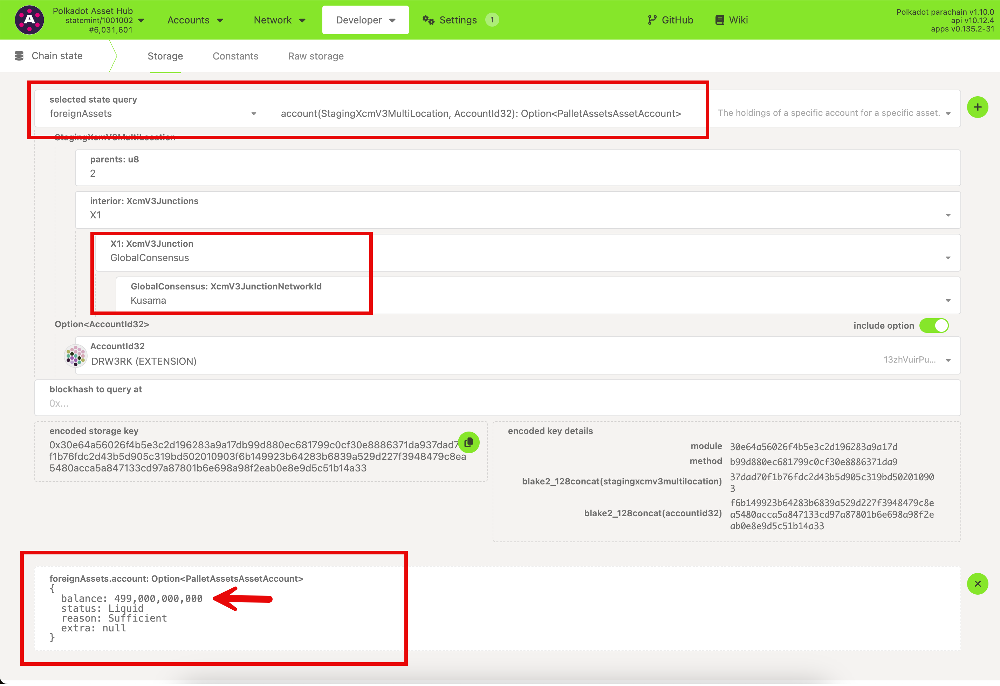

<!-- MessageBox -->
<div id="messageBox" class="floating-message-box">
  <p>
    Polkadot-JS is for developers and power users only. If you need help using the Polkadot-JS UI, you can contact the
    <a href="https://support.polkadot.network/support/home" target="_blank" rel="noopener noreferrer">
      Polkadot Support Team.
    </a>
  </p>
  <button class="close-messagebox" aria-label="Close message">✖</button>
</div>

The fully functional Polkadot < > Kusama bridge facilitates secure asset transfers between the
chains in both the ecosystems. The progress of Polkadot < > Kusama bridge implementation can be
tracked [here](https://forum.polkadot.network/t/polkadot-kusama-bridge/2971/1).

## Transfer DOT to Kusama Asset Hub

This tutorial shows how to transfer DOT on Polkadot Asset Hub to Kusama Asset Hub. The first step is
to ensure that your account on Polkadot Asset Hub has enough DOT to cover the XCM transfer fee and
the bridge fee (which is around 2 DOT). The next step is to craft an XCM message to be sent from
Polkadot Asset Hub.

[BagPipes (formerly called xcmsend)](https://xcmsend.com/#/builder) is an opensource application
that lets you create workflows in a drag and drop style interface in order to build execution flows
of cross chain assets transfers using XCM. Check [Bagpipes docs](https://docs.bagpipes.io/) for more
information on how to create workflows for crafting XCM transfers. The snapshot below shows a
workflow on BagPipes that is designed to send 3 DOT from an account Polkadot Asset Hub to Kusama
Asset Hub.


This workflow crafts an XCM transfer as shown below.

```
{
  "isSigned": false,
  "method": {
    "args": {
      "dest": {
        "V3": {
          "parents": "2",
          "interior": {
            "X2": [
              {
                "GlobalConsensus": "Kusama"
              },
              {
                "Parachain": "1,000"
              }
            ]
          }
        }
      },
      "beneficiary": {
        "V3": {
          "parents": "0",
          "interior": {
            "X1": {
              "AccountId32": {
                "network": null,
                "id": "this has to be the intended address"
              }
            }
          }
        }
      },
      "assets": {
        "V3": [
          {
            "id": {
              "Concrete": {
                "parents": "1",
                "interior": "Here"
              }
            },
            "fun": {
              "Fungible": "30,000,000,000"
            }
          }
        ]
      },
      "fee_asset_item": "0",
      "weight_limit": "Unlimited"
    },
    "method": "limitedReserveTransferAssets",
    "section": "polkadotXcm"
  }
}
```

Once this [extrinsic](https://assethub-polkadot.subscan.io/extrinsic/6028374-2) is signed and
submitted, it is broadcast to Polkadot Asset Hub nodes. As this is a reserve asset transfer, the DOT
is transferred to the destination's sovereign account on Polkadot Asset Hub and
[DOT is issued](https://assethub-kusama.subscan.io/extrinsic/6758392-0?event=6758392-1) as a foreign
asset and deposited onto the destination account on Kusama Asset Hub. The foreign asset balances of
any account on Kusama Asset Hub can be queried on-chain through the `foreignAssets`pallet as shown
below.


## Transfer DOT from Kusama Asset Hub to Polkadot Asset Hub

This tutorial shows how to transfer DOT on Kusama Asset Hub to Polkadot Asset Hub. The first step is
to ensure that your account on Kusama Asset Hub has enough KSM to cover the XCM transfer fee and the
bridge fee (which is around 0.4 KSM). The next step is to craft an XCM message to be sent from
Kusama Asset Hub.

DOT which is registered as a foreign asset on Kusama Asset Hub can be transferred to Polkadot Asset
Hub through an extrinsic like the one below, whose call data is
[`0x1f0b040202090200a10f04000101009e4e7009937c56d267338762a60ed004293afd40e7c2081847c12cb63c76a818040402010902000700e40b54020000000000`](https://polkadot.js.org/apps/?rpc=wss%3A%2F%2Fkusama-asset-hub-rpc.polkadot.io#/extrinsics/decode/0x1f0b040202090200a10f04000101009e4e7009937c56d267338762a60ed004293afd40e7c2081847c12cb63c76a818040402010902000700e40b54020000000000).

**_If you plan on reusing this extrinsic, ensure that you change the Account ID and the transfer
amount below._**


For reference, this [extrinsic](https://assethub-kusama.subscan.io/extrinsic/7015118-2) is signed
and submitted successfully, and the destination account on Polkadot Asset Hub received DOT.

## Transfer KSM to Polkadot Asset Hub

This tutorial shows how to transfer KSM on Kusama Asset Hub to Polkadot Asset Hub. The first step is
to ensure that your account on Kusama Asset Hub has enough KSM to cover the XCM transfer fee and the
bridge fee (which is around 0.4 KSM). The next step is to craft an XCM message to be sent from
Kusama Asset Hub.

The XCM transfer extrinsic shown below can be accessed
[here.](https://polkadot.js.org/apps/?rpc=wss%3A%2F%2Fkusama-asset-hub-rpc.polkadot.io#/extrinsics/decode/0x1f08030202090200a10f03000101008479c8ea5480acca5a847133cd97a87801b6e698a98f2eab0e8e9d5c51b14a33030400010000070088526a740000000000)

**_If you plan on reusing this extrinsic, ensure that you change the Account ID and the transfer
amount highlighted in the snapshot below._**


Once this [extrinsic](https://assethub-kusama.subscan.io/extrinsic/6761480-2) is signed and
submitted, it is broadcast to Kusama Asset Hub nodes. As this is a reserve asset transfer, the KSM
is transferred to the sovereign account on Kusama Asset Hub and
[KSM is issued](https://assethub-polkadot.subscan.io/extrinsic/6031467-0?event=6031467-6) as a
foreign asset and deposited onto the destination account on Kusama Asset Hub. The foreign asset
balances of any account on Kusama Asset Hub can be queried on-chain through the
`foreignAssets`pallet as shown below.



## Transfer KSM from Polkadot Asset Hub to Kusama Asset Hub

This tutorial shows how to transfer KSM on Polkadot Asset Hub to Kusama Asset Hub. The first step is
to ensure that your account on Polkadot Asset Hub has enough DOT to cover the XCM transfer fee and
the bridge fee (which is around 2 DOT). The next step is to craft an XCM message to be sent from
Polkadot Asset Hub.

KSM which is registered as a foreign asset on Polkadot Asset Hub can be transferred to Kusama Asset
Hub through an extrinsic like the one below, whose call data is
[`0x1f0b040202090300a10f04000101008479c8ea5480acca5a847133cd97a87801b6e698a98f2eab0e8e9d5c51b14a33040402010903000700a0db215d0000000000`](https://polkadot.js.org/apps/?rpc=wss%3A%2F%2Fpolkadot-asset-hub-rpc.polkadot.io#/extrinsics/decode/0x1f0b040202090300a10f04000101008479c8ea5480acca5a847133cd97a87801b6e698a98f2eab0e8e9d5c51b14a33040402010903000700a0db215d0000000000)


For reference, this [extrinsic](https://assethub-polkadot.subscan.io/extrinsic/6303823-2) was signed
and submitted successfully, and the destination account on Kusama Asset Hub received KSM.

## Transfer of arbitrary assets between Polkadot Asset Hub and Kusama Asset Hub

Transfer functionality of assets other than DOT and KSM between Asset Hubs is yet to be enabled.
Once this functionality is enabled, assets which are sufficient or non-sufficient on the Asset Hubs
can be bridged.

!!!caution "Avoid Asset Traps"
    To avoid issues on the receiving side for non-sufficient assets, make sure to call [pallet_assets::touch()](https://github.com/paritytech/polkadot-sdk/blob/0ef37c75401b78b61ed35ce27af8b964da27bb3c/substrate/frame/assets/src/lib.rs#L1531) or [pallet_assets::touch_other()](https://github.com/paritytech/polkadot-sdk/blob/0ef37c75401b78b61ed35ce27af8b964da27bb3c/substrate/frame/assets/src/lib.rs#L1616) effectively guaranteeing the ability to successfully receive and accept the bridged assets in your account on the destination chain. This eliminates issues like your account on destination not existing or not having enough ED or having reached the maximum limit of different assets it can hold. Without this sanity step, you risk that the bridged assets will make their way to the destination chain but will not be accepted by your account, and instead get trapped in the Asset Trap on the destination chain.

Once arbitrary asset transfers are enabled by the Asset Hubs, a guide will be posted to this Wiki
page.
